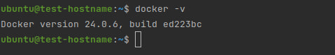
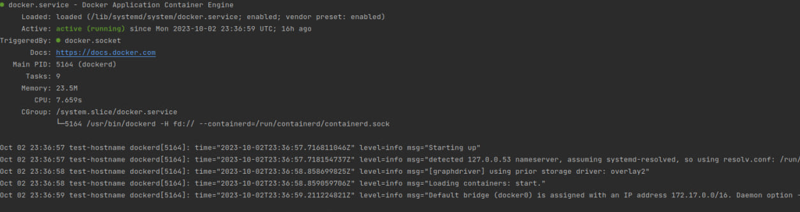
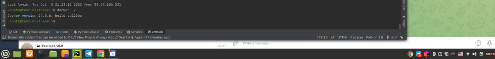
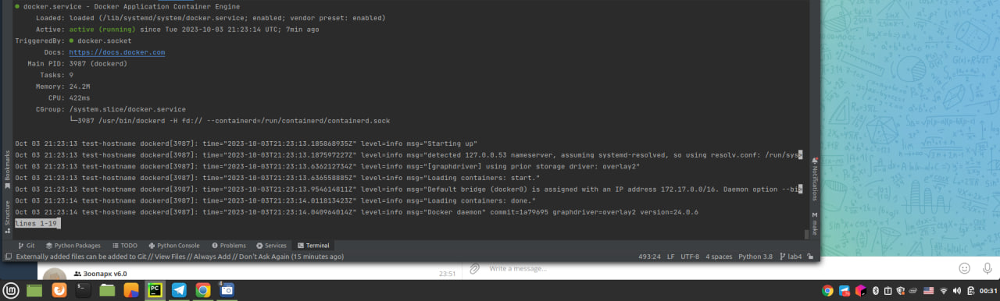
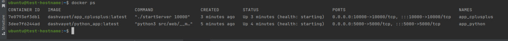
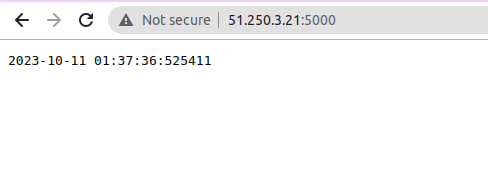
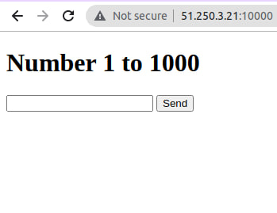

# Task 1: Utilize template for docker deployment
I have utilized template and here I can show playback of template utilization via
```
ansible-playbook  playbooks/dev/main.yml --diff
```

```
PLAY [ansibleLab5] **************************************************************************************************************************************************************************

TASK [Gathering Facts] **********************************************************************************************************************************************************************
ok: [vm1]

TASK [docker : include_tasks] ***************************************************************************************************************************************************************
included: /home/ruslan/Downloads/devops/core-course-labs/ansible/roles/docker/tasks/setup-Debian.yml for vm1

TASK [docker : Ensure old versions of Docker are not installed.] ****************************************************************************************************************************
ok: [vm1]

TASK [docker : Ensure dependencies are installed.] ******************************************************************************************************************************************
ok: [vm1]

TASK [docker : Ensure additional dependencies are installed (on Ubuntu < 20.04 and any other systems).] *************************************************************************************
skipping: [vm1]

TASK [docker : Ensure additional dependencies are installed (on Ubuntu >= 20.04).] **********************************************************************************************************
ok: [vm1]

TASK [docker : Add Docker apt key.] *********************************************************************************************************************************************************
ok: [vm1]

TASK [docker : Ensure curl is present (on older systems without SNI).] **********************************************************************************************************************
skipping: [vm1]

TASK [docker : Ensure curl is present (on older systems without SNI).] **********************************************************************************************************************
skipping: [vm1]

TASK [docker : Add Docker apt key (alternative for older systems without SNI).] *************************************************************************************************************
skipping: [vm1]

TASK [docker : Add Docker repository.] ******************************************************************************************************************************************************
ok: [vm1]

TASK [docker : Ensure handlers are notified now to avoid firewall conflicts.] ***************************************************************************************************************

TASK [docker : include_tasks] ***************************************************************************************************************************************************************
included: /home/ruslan/Downloads/devops/core-course-labs/ansible/roles/docker/tasks/install_compose.yml for vm1

TASK [docker : Check current docker-compose version.] ***************************************************************************************************************************************
ok: [vm1]

TASK [docker : set_fact] ********************************************************************************************************************************************************************
ok: [vm1]

TASK [docker : Delete existing docker-compose version if it's different.] *******************************************************************************************************************
skipping: [vm1]

TASK [docker : Install Docker Compose (if configured).] *************************************************************************************************************************************
skipping: [vm1]

TASK [docker : Install docker-compose plugin.] **********************************************************************************************************************************************
skipping: [vm1]

TASK [docker : Install docker-compose-plugin (with downgrade option).] **********************************************************************************************************************
skipping: [vm1]

TASK [docker : include_tasks] ***************************************************************************************************************************************************************
included: /home/ruslan/Downloads/devops/core-course-labs/ansible/roles/docker/tasks/install_docker.yml for vm1

TASK [docker : Install Docker packages.] ****************************************************************************************************************************************************
skipping: [vm1]

TASK [docker : Install Docker packages (with downgrade option).] ****************************************************************************************************************************
ok: [vm1]

TASK [docker : Ensure /etc/docker/ directory exists.] ***************************************************************************************************************************************
skipping: [vm1]

TASK [docker : Configure Docker daemon options.] ********************************************************************************************************************************************
skipping: [vm1]

TASK [docker : Ensure Docker is started and enabled at boot.] *******************************************************************************************************************************
ok: [vm1]

TASK [docker : Get docker group info using getent.] *****************************************************************************************************************************************
ok: [vm1]

TASK [docker : Check if there are any users to add to the docker group.] ********************************************************************************************************************
ok: [vm1] => (item=ubuntu)

TASK [docker : Ensure docker users are added to the docker group.] **************************************************************************************************************************
changed: [vm1] => (item=ubuntu)

TASK [docker : Reset ssh connection to apply user changes.] *********************************************************************************************************************************

PLAY RECAP **********************************************************************************************************************************************************************************
vm1                        : ok=16   changed=1    unreachable=0    failed=0    skipped=11   rescued=0    ignored=0 
```
## Results
After ansible have finished, I have checked  docker on vm



## inventory list
```ruslan@Elestrias:~/Downloads/devops/core-course-labs/ansible$ ansible-inventory -i inventory --list```

```
{
    "_meta": {
        "hostvars": {
            "vm1": {
                "ansible_host": "62.84.112.207",
                "ansible_ssh_private_key_file": "~/.ssh/vmKey",
                "ansible_user": "ubuntu"
            }
        }
    },
    "all": {
        "children": [
            "dev",
            "ungrouped"
        ]
    },
    "dev": {
        "hosts": [
            "vm1"
        ]
    }
}
```

# Task 2
After I have implemented custom docker deploy
```
ansible-playbook playboks/dev/main.yml --diff
```
```

PLAY [ansibleLab5] **************************************************************************************************************************************************************************

TASK [Gathering Facts] **********************************************************************************************************************************************************************
ok: [vm1]

TASK [docker : Apt update and install docker] ***********************************************************************************************************************************************
The following additional packages will be installed:
  wmdocker
The following NEW packages will be installed:
  docker wmdocker
0 upgraded, 2 newly installed, 0 to remove and 1 not upgraded.
changed: [vm1]

TASK [geerlingguy.pip : Ensure Pip is installed.] *******************************************************************************************************************************************
The following additional packages will be installed:
  build-essential bzip2 cpp cpp-11 dpkg-dev fakeroot fontconfig-config
  fonts-dejavu-core g++ g++-11 gcc gcc-11 gcc-11-base javascript-common
  libalgorithm-diff-perl libalgorithm-diff-xs-perl libalgorithm-merge-perl
  libasan6 libatomic1 libc-dev-bin libc-devtools libc6-dev libcc1-0
  libcrypt-dev libdeflate0 libdpkg-perl libexpat1-dev libfakeroot
  libfile-fcntllock-perl libfontconfig1 libgcc-11-dev libgd3 libgomp1 libisl23
  libitm1 libjbig0 libjpeg-turbo8 libjpeg8 libjs-jquery libjs-sphinxdoc
  libjs-underscore liblsan0 libmpc3 libnsl-dev libpython3-dev
  libpython3.10-dev libquadmath0 libstdc++-11-dev libtiff5 libtirpc-dev
  libtsan0 libubsan1 libwebp7 libxpm4 linux-libc-dev lto-disabled-list make
  manpages-dev python3-dev python3-wheel python3.10-dev rpcsvc-proto
  zlib1g-dev
Suggested packages:
  bzip2-doc cpp-doc gcc-11-locales debian-keyring g++-multilib g++-11-multilib
  gcc-11-doc gcc-multilib autoconf automake libtool flex bison gdb gcc-doc
  gcc-11-multilib apache2 | lighttpd | httpd glibc-doc bzr libgd-tools
  libstdc++-11-doc make-doc
The following NEW packages will be installed:
  build-essential bzip2 cpp cpp-11 dpkg-dev fakeroot fontconfig-config
  fonts-dejavu-core g++ g++-11 gcc gcc-11 gcc-11-base javascript-common
  libalgorithm-diff-perl libalgorithm-diff-xs-perl libalgorithm-merge-perl
  libasan6 libatomic1 libc-dev-bin libc-devtools libc6-dev libcc1-0
  libcrypt-dev libdeflate0 libdpkg-perl libexpat1-dev libfakeroot
  libfile-fcntllock-perl libfontconfig1 libgcc-11-dev libgd3 libgomp1 libisl23
  libitm1 libjbig0 libjpeg-turbo8 libjpeg8 libjs-jquery libjs-sphinxdoc
  libjs-underscore liblsan0 libmpc3 libnsl-dev libpython3-dev
  libpython3.10-dev libquadmath0 libstdc++-11-dev libtiff5 libtirpc-dev
  libtsan0 libubsan1 libwebp7 libxpm4 linux-libc-dev lto-disabled-list make
  manpages-dev python3-dev python3-pip python3-wheel python3.10-dev
  rpcsvc-proto zlib1g-dev
0 upgraded, 64 newly installed, 0 to remove and 1 not upgraded.
changed: [vm1]

TASK [geerlingguy.pip : Ensure pip_install_packages are installed.] *************************************************************************************************************************
changed: [vm1] => (item={'name': 'docker-compose'})

TASK [geerlingguy.docker : Load OS-specific vars.] ******************************************************************************************************************************************
ok: [vm1]

TASK [geerlingguy.docker : include_tasks] ***************************************************************************************************************************************************
skipping: [vm1]

TASK [geerlingguy.docker : include_tasks] ***************************************************************************************************************************************************
included: /home/ruslan/.ansible/roles/geerlingguy.docker/tasks/setup-Debian.yml for vm1

TASK [geerlingguy.docker : Ensure old versions of Docker are not installed.] ****************************************************************************************************************
The following package was automatically installed and is no longer required:
  wmdocker
Use 'sudo apt autoremove' to remove it.
The following packages will be REMOVED:
  docker
0 upgraded, 0 newly installed, 1 to remove and 1 not upgraded.
changed: [vm1]

TASK [geerlingguy.docker : Ensure dependencies are installed.] ******************************************************************************************************************************
The following package was automatically installed and is no longer required:
  wmdocker
Use 'sudo apt autoremove' to remove it.
The following NEW packages will be installed:
  apt-transport-https
0 upgraded, 1 newly installed, 0 to remove and 1 not upgraded.
changed: [vm1]

TASK [geerlingguy.docker : Ensure additional dependencies are installed (on Ubuntu < 20.04 and any other systems).] *************************************************************************
skipping: [vm1]

TASK [geerlingguy.docker : Ensure additional dependencies are installed (on Ubuntu >= 20.04).] **********************************************************************************************
ok: [vm1]

TASK [geerlingguy.docker : Add Docker apt key.] *********************************************************************************************************************************************
changed: [vm1]

TASK [geerlingguy.docker : Ensure curl is present (on older systems without SNI).] **********************************************************************************************************
skipping: [vm1]

TASK [geerlingguy.docker : Add Docker apt key (alternative for older systems without SNI).] *************************************************************************************************
skipping: [vm1]

TASK [geerlingguy.docker : Add Docker repository.] ******************************************************************************************************************************************
--- before: /dev/null
+++ after: /etc/apt/sources.list.d/docker.list
@@ -0,0 +1 @@
+deb [arch=amd64 signed-by=/etc/apt/trusted.gpg.d/docker.asc] https://download.docker.com/linux/ubuntu jammy stable

changed: [vm1]

TASK [geerlingguy.docker : Install Docker packages.] ****************************************************************************************************************************************
skipping: [vm1]

TASK [geerlingguy.docker : Install Docker packages (with downgrade option).] ****************************************************************************************************************
The following package was automatically installed and is no longer required:
  wmdocker
Use 'sudo apt autoremove' to remove it.
The following additional packages will be installed:
  docker-buildx-plugin docker-compose-plugin libltdl7 libslirp0 pigz
  slirp4netns
Suggested packages:
  aufs-tools cgroupfs-mount | cgroup-lite
The following NEW packages will be installed:
  containerd.io docker-buildx-plugin docker-ce docker-ce-cli
  docker-ce-rootless-extras docker-compose-plugin libltdl7 libslirp0 pigz
  slirp4netns
0 upgraded, 10 newly installed, 0 to remove and 1 not upgraded.
changed: [vm1]

TASK [geerlingguy.docker : Install docker-compose plugin.] **********************************************************************************************************************************
skipping: [vm1]

TASK [geerlingguy.docker : Install docker-compose-plugin (with downgrade option).] **********************************************************************************************************
skipping: [vm1]

TASK [geerlingguy.docker : Ensure /etc/docker/ directory exists.] ***************************************************************************************************************************
skipping: [vm1]

TASK [geerlingguy.docker : Configure Docker daemon options.] ********************************************************************************************************************************
skipping: [vm1]

TASK [geerlingguy.docker : Ensure Docker is started and enabled at boot.] *******************************************************************************************************************
ok: [vm1]

TASK [geerlingguy.docker : Ensure handlers are notified now to avoid firewall conflicts.] ***************************************************************************************************

RUNNING HANDLER [geerlingguy.docker : restart docker] ***************************************************************************************************************************************
changed: [vm1]

TASK [geerlingguy.docker : include_tasks] ***************************************************************************************************************************************************
skipping: [vm1]

TASK [geerlingguy.docker : Get docker group info using getent.] *****************************************************************************************************************************
skipping: [vm1]

TASK [geerlingguy.docker : Check if there are any users to add to the docker group.] ********************************************************************************************************

TASK [geerlingguy.docker : include_tasks] ***************************************************************************************************************************************************
skipping: [vm1]

PLAY RECAP **********************************************************************************************************************************************************************************
vm1                        : ok=14   changed=9    unreachable=0    failed=0    skipped=13   rescued=0    ignored=0   
```

## Get inventory

```
ansible-inventory --list
```

```
{
    "_meta": {
        "hostvars": {
            "vm1": {
                "ansible_host": "62.84.112.207",
                "ansible_ssh_private_key_file": "~/.ssh/vmKey",
                "ansible_user": "ubuntu"
            }
        }
    },
    "all": {
        "children": [
            "dev",
            "ungrouped"
        ]
    },
    "dev": {
        "hosts": [
            "vm1"
        ]
    }
}
```
## Testing
Testing will be with dynamic inventory as for role itself that change does not provide any impact 


# Bonus task
## Play playbook with dynamic inventory of Yandex cloud
```
ansible-playbook playbooks/dev/main.yml --diff
```

```
ruslan@Elestrias:~/Downloads/devops/core-course-labs/ansible$ ansible-playbook playbooks/dev/main.yml --diff

PLAY [ansibleLab5] **************************************************************************************************************************************************************************

TASK [Gathering Facts] **********************************************************************************************************************************************************************
ok: [test-name-updated]

TASK [docker : Apt update and install docker] ***********************************************************************************************************************************************
The following additional packages will be installed:
  wmdocker
The following NEW packages will be installed:
  docker wmdocker
0 upgraded, 2 newly installed, 0 to remove and 6 not upgraded.
changed: [test-name-updated]

TASK [geerlingguy.pip : Ensure Pip is installed.] *******************************************************************************************************************************************
The following additional packages will be installed:
  build-essential bzip2 cpp cpp-11 dpkg-dev fakeroot fontconfig-config
  fonts-dejavu-core g++ g++-11 gcc gcc-11 gcc-11-base javascript-common
  libalgorithm-diff-perl libalgorithm-diff-xs-perl libalgorithm-merge-perl
  libasan6 libatomic1 libc-dev-bin libc-devtools libc6 libc6-dev libcc1-0
  libcrypt-dev libdeflate0 libdpkg-perl libexpat1-dev libfakeroot
  libfile-fcntllock-perl libfontconfig1 libgcc-11-dev libgd3 libgomp1 libisl23
  libitm1 libjbig0 libjpeg-turbo8 libjpeg8 libjs-jquery libjs-sphinxdoc
  libjs-underscore liblsan0 libmpc3 libnsl-dev libpython3-dev
  libpython3.10-dev libquadmath0 libstdc++-11-dev libtiff5 libtirpc-dev
  libtsan0 libubsan1 libwebp7 libxpm4 linux-libc-dev lto-disabled-list make
  manpages-dev python3-dev python3-wheel python3.10-dev rpcsvc-proto
  zlib1g-dev
Suggested packages:
  bzip2-doc cpp-doc gcc-11-locales debian-keyring g++-multilib g++-11-multilib
  gcc-11-doc gcc-multilib autoconf automake libtool flex bison gdb gcc-doc
  gcc-11-multilib apache2 | lighttpd | httpd glibc-doc bzr libgd-tools
  libstdc++-11-doc make-doc
Recommended packages:
  libnss-nis libnss-nisplus
The following NEW packages will be installed:
  build-essential bzip2 cpp cpp-11 dpkg-dev fakeroot fontconfig-config
  fonts-dejavu-core g++ g++-11 gcc gcc-11 gcc-11-base javascript-common
  libalgorithm-diff-perl libalgorithm-diff-xs-perl libalgorithm-merge-perl
  libasan6 libatomic1 libc-dev-bin libc-devtools libc6-dev libcc1-0
  libcrypt-dev libdeflate0 libdpkg-perl libexpat1-dev libfakeroot
  libfile-fcntllock-perl libfontconfig1 libgcc-11-dev libgd3 libgomp1 libisl23
  libitm1 libjbig0 libjpeg-turbo8 libjpeg8 libjs-jquery libjs-sphinxdoc
  libjs-underscore liblsan0 libmpc3 libnsl-dev libpython3-dev
  libpython3.10-dev libquadmath0 libstdc++-11-dev libtiff5 libtirpc-dev
  libtsan0 libubsan1 libwebp7 libxpm4 linux-libc-dev lto-disabled-list make
  manpages-dev python3-dev python3-pip python3-wheel python3.10-dev
  rpcsvc-proto zlib1g-dev
The following packages will be upgraded:
  libc6
1 upgraded, 64 newly installed, 0 to remove and 5 not upgraded.
changed: [test-name-updated]

TASK [geerlingguy.pip : Ensure pip_install_packages are installed.] *************************************************************************************************************************
changed: [test-name-updated] => (item={'name': 'docker-compose'})

TASK [geerlingguy.docker : Load OS-specific vars.] ******************************************************************************************************************************************
ok: [test-name-updated]

TASK [geerlingguy.docker : include_tasks] ***************************************************************************************************************************************************
skipping: [test-name-updated]

TASK [geerlingguy.docker : include_tasks] ***************************************************************************************************************************************************
included: /home/ruslan/.ansible/roles/geerlingguy.docker/tasks/setup-Debian.yml for test-name-updated

TASK [geerlingguy.docker : Ensure old versions of Docker are not installed.] ****************************************************************************************************************
The following package was automatically installed and is no longer required:
  wmdocker
Use 'sudo apt autoremove' to remove it.
The following packages will be REMOVED:
  docker
0 upgraded, 0 newly installed, 1 to remove and 5 not upgraded.
changed: [test-name-updated]

TASK [geerlingguy.docker : Ensure dependencies are installed.] ******************************************************************************************************************************
The following package was automatically installed and is no longer required:
  wmdocker
Use 'sudo apt autoremove' to remove it.
The following NEW packages will be installed:
  apt-transport-https
0 upgraded, 1 newly installed, 0 to remove and 5 not upgraded.
changed: [test-name-updated]

TASK [geerlingguy.docker : Ensure additional dependencies are installed (on Ubuntu < 20.04 and any other systems).] *************************************************************************
skipping: [test-name-updated]

TASK [geerlingguy.docker : Ensure additional dependencies are installed (on Ubuntu >= 20.04).] **********************************************************************************************
ok: [test-name-updated]

TASK [geerlingguy.docker : Add Docker apt key.] *********************************************************************************************************************************************
changed: [test-name-updated]

TASK [geerlingguy.docker : Ensure curl is present (on older systems without SNI).] **********************************************************************************************************
skipping: [test-name-updated]

TASK [geerlingguy.docker : Add Docker apt key (alternative for older systems without SNI).] *************************************************************************************************
skipping: [test-name-updated]

TASK [geerlingguy.docker : Add Docker repository.] ******************************************************************************************************************************************
--- before: /dev/null
+++ after: /etc/apt/sources.list.d/docker.list
@@ -0,0 +1 @@
+deb [arch=amd64 signed-by=/etc/apt/trusted.gpg.d/docker.asc] https://download.docker.com/linux/ubuntu jammy stable

changed: [test-name-updated]

TASK [geerlingguy.docker : Install Docker packages.] ****************************************************************************************************************************************
skipping: [test-name-updated]

TASK [geerlingguy.docker : Install Docker packages (with downgrade option).] ****************************************************************************************************************
The following package was automatically installed and is no longer required:
  wmdocker
Use 'sudo apt autoremove' to remove it.
The following additional packages will be installed:
  docker-buildx-plugin docker-compose-plugin libltdl7 libslirp0 pigz
  slirp4netns
Suggested packages:
  aufs-tools cgroupfs-mount | cgroup-lite
The following NEW packages will be installed:
  containerd.io docker-buildx-plugin docker-ce docker-ce-cli
  docker-ce-rootless-extras docker-compose-plugin libltdl7 libslirp0 pigz
  slirp4netns
0 upgraded, 10 newly installed, 0 to remove and 5 not upgraded.
changed: [test-name-updated]

TASK [geerlingguy.docker : Install docker-compose plugin.] **********************************************************************************************************************************
skipping: [test-name-updated]

TASK [geerlingguy.docker : Install docker-compose-plugin (with downgrade option).] **********************************************************************************************************
skipping: [test-name-updated]

TASK [geerlingguy.docker : Ensure /etc/docker/ directory exists.] ***************************************************************************************************************************
skipping: [test-name-updated]

TASK [geerlingguy.docker : Configure Docker daemon options.] ********************************************************************************************************************************
skipping: [test-name-updated]

TASK [geerlingguy.docker : Ensure Docker is started and enabled at boot.] *******************************************************************************************************************
ok: [test-name-updated]

TASK [geerlingguy.docker : Ensure handlers are notified now to avoid firewall conflicts.] ***************************************************************************************************

RUNNING HANDLER [geerlingguy.docker : restart docker] ***************************************************************************************************************************************
changed: [test-name-updated]

TASK [geerlingguy.docker : include_tasks] ***************************************************************************************************************************************************
skipping: [test-name-updated]

TASK [geerlingguy.docker : Get docker group info using getent.] *****************************************************************************************************************************
skipping: [test-name-updated]

TASK [geerlingguy.docker : Check if there are any users to add to the docker group.] ********************************************************************************************************

TASK [geerlingguy.docker : include_tasks] ***************************************************************************************************************************************************
skipping: [test-name-updated]

PLAY RECAP **********************************************************************************************************************************************************************************
test-name-updated          : ok=14   changed=9    unreachable=0    failed=0    skipped=13   rescued=0    ignored=0  
```
## List of inventory
```
ansible-inventory  --list
```

```
{
    "_meta": {
        "hostvars": {
            "test-name-updated": {
                "ansible_host": "84.201.134.123",
                "ansible_ssh_private_key_file": "~/.ssh/vmKey",
                "ansible_user": "ubuntu"
            }
        }
    },
    "all": {
        "children": [
            "ungrouped",
            "yacloud"
        ]
    },
    "yacloud": {
        "hosts": [
            "test-name-updated"
        ]
    }
}

```
# Check docker deployment




# Best practices
Task does not require to write Best practices
1. make simple solutions
2. utilize blocks and roles for reuse them
3. use dynamic inventory to automatically update your inventory and not copypaste hosts from somewhere
4. utilize cache to speedup tasks 
5. Utilize variables of ansible
6. Utilize plugins
7. Take recent version of plugins and roles / pick reliable one that was reviewed by community and doesnt need updates (have no issues)
8. Have default behaviour in case some crucial options aren't filled in playbook
9. Check available plugins and roles not only in local paths but in global too
10. Failure on parsing errors to force developers fix the problem and not lost it in tons of logs
11. Utilize blocks to group related tasks
12. Utilize tags for separating sequences
13. Use templates for creating general description for a very specific files
-------
# LAB 6


# Task Lists
## Pyhthon app
```
playbook: playbooks/dev/app_python/main.yml

  play #1 (all): Ansible Python TAGS: [web_app_python]
    tasks:
      docker : Apt update and install docker    TAGS: [docker, web_app_python]
      geerlingguy.pip : Ensure Pip is installed.        TAGS: [docker, web_app_python]
      geerlingguy.pip : Ensure pip_install_packages are installed.      TAGS: [docker, web_app_python]
      geerlingguy.docker : Load OS-specific vars.       TAGS: [docker, web_app_python]
      include_tasks     TAGS: [docker, web_app_python]
      include_tasks     TAGS: [docker, web_app_python]
      geerlingguy.docker : Install Docker packages.     TAGS: [docker, web_app_python]
      geerlingguy.docker : Install Docker packages (with downgrade option).     TAGS: [docker, web_app_python]
      geerlingguy.docker : Install docker-compose plugin.       TAGS: [docker, web_app_python]
      geerlingguy.docker : Install docker-compose-plugin (with downgrade option).       TAGS: [docker, web_app_python]
      geerlingguy.docker : Ensure /etc/docker/ directory exists.        TAGS: [docker, web_app_python]
      geerlingguy.docker : Configure Docker daemon options.     TAGS: [docker, web_app_python]
      geerlingguy.docker : Ensure Docker is started and enabled at boot.        TAGS: [docker, web_app_python]
      geerlingguy.docker : Ensure handlers are notified now to avoid firewall conflicts.        TAGS: [docker, web_app_python]
      include_tasks     TAGS: [docker, web_app_python]
      geerlingguy.docker : Get docker group info using getent.  TAGS: [docker, web_app_python]
      geerlingguy.docker : Check if there are any users to add to the docker group.     TAGS: [docker, web_app_python]
      include_tasks     TAGS: [docker, web_app_python]
      web_app : Check build root        TAGS: [web_app, web_app_python, web_app_wipe]
      web_app : Check docker-compose.yml        TAGS: [web_app, web_app_python, web_app_wipe]
      web_app : Remove Compose  TAGS: [web_app, web_app_python, web_app_wipe]
      web_app : Remove buildRoot        TAGS: [web_app, web_app_python, web_app_wipe]
      web_app : Allocate build root     TAGS: [web_app, web_app_deployment, web_app_python]
      web_app : Create Compose  TAGS: [web_app, web_app_deployment, web_app_python]
      web_app : Pull imgs       TAGS: [web_app, web_app_deployment, web_app_python]
```

## App CPLUSPLUS

```
playbook: playbooks/dev/app_cplusplus/main.yml

  play #1 (all): Ansible C++    TAGS: [web_app_cplusplus]
    tasks:
      docker : Apt update and install docker    TAGS: [docker, web_app_cplusplus]
      geerlingguy.pip : Ensure Pip is installed.        TAGS: [docker, web_app_cplusplus]
      geerlingguy.pip : Ensure pip_install_packages are installed.      TAGS: [docker, web_app_cplusplus]
      geerlingguy.docker : Load OS-specific vars.       TAGS: [docker, web_app_cplusplus]
      include_tasks     TAGS: [docker, web_app_cplusplus]
      include_tasks     TAGS: [docker, web_app_cplusplus]
      geerlingguy.docker : Install Docker packages.     TAGS: [docker, web_app_cplusplus]
      geerlingguy.docker : Install Docker packages (with downgrade option).     TAGS: [docker, web_app_cplusplus]
      geerlingguy.docker : Install docker-compose plugin.       TAGS: [docker, web_app_cplusplus]
      geerlingguy.docker : Install docker-compose-plugin (with downgrade option).       TAGS: [docker, web_app_cplusplus]
      geerlingguy.docker : Ensure /etc/docker/ directory exists.        TAGS: [docker, web_app_cplusplus]
      geerlingguy.docker : Configure Docker daemon options.     TAGS: [docker, web_app_cplusplus]
      geerlingguy.docker : Ensure Docker is started and enabled at boot.        TAGS: [docker, web_app_cplusplus]
      geerlingguy.docker : Ensure handlers are notified now to avoid firewall conflicts.        TAGS: [docker, web_app_cplusplus]
      include_tasks     TAGS: [docker, web_app_cplusplus]
      geerlingguy.docker : Get docker group info using getent.  TAGS: [docker, web_app_cplusplus]
      geerlingguy.docker : Check if there are any users to add to the docker group.     TAGS: [docker, web_app_cplusplus]
      include_tasks     TAGS: [docker, web_app_cplusplus]
      web_app : Check build root        TAGS: [web_app, web_app_cplusplus, web_app_wipe]
      web_app : Check docker-compose.yml        TAGS: [web_app, web_app_cplusplus, web_app_wipe]
      web_app : Remove Compose  TAGS: [web_app, web_app_cplusplus, web_app_wipe]
      web_app : Remove buildRoot        TAGS: [web_app, web_app_cplusplus, web_app_wipe]
      web_app : Allocate build root     TAGS: [web_app, web_app_cplusplus, web_app_deployment]
      web_app : Create Compose  TAGS: [web_app, web_app_cplusplus, web_app_deployment]
      web_app : Pull imgs       TAGS: [web_app, web_app_cplusplus, web_app_deployment]
```

# Playbooks run 
## Python
`ansible-playbook playbooks/dev/app_python/main.yml -e web_app_full_wipe=true `

50 lines
```
TASK [geerlingguy.docker : Ensure /etc/docker/ directory exists.] **************
skipping: [test-name-updated]

TASK [geerlingguy.docker : Configure Docker daemon options.] *******************
skipping: [test-name-updated]

TASK [geerlingguy.docker : Ensure Docker is started and enabled at boot.] ******
ok: [test-name-updated]

TASK [geerlingguy.docker : Ensure handlers are notified now to avoid firewall conflicts.] ***

TASK [geerlingguy.docker : include_tasks] **************************************
skipping: [test-name-updated]

TASK [geerlingguy.docker : Get docker group info using getent.] ****************
ok: [test-name-updated]

TASK [geerlingguy.docker : Check if there are any users to add to the docker group.] ***
skipping: [test-name-updated] => (item=ubuntu) 

TASK [geerlingguy.docker : include_tasks] **************************************
skipping: [test-name-updated]

TASK [web_app : Check build root] **********************************************
ok: [test-name-updated]

TASK [web_app : Check docker-compose.yml] **************************************
ok: [test-name-updated]

TASK [web_app : Remove Compose] ************************************************
changed: [test-name-updated]

TASK [web_app : Remove buildRoot] **********************************************
changed: [test-name-updated]

TASK [web_app : Allocate build root] *******************************************
changed: [test-name-updated]

TASK [web_app : Create Compose] ************************************************
changed: [test-name-updated]

TASK [web_app : Pull imgs] *****************************************************
changed: [test-name-updated]

RUNNING HANDLER [web_app : Docker Compose restart] *****************************
changed: [test-name-updated]

PLAY RECAP *********************************************************************
test-name-updated          : ok=22   changed=8    unreachable=0    failed=0    skipped=12   rescued=0    ignored=0   
```

## C++
`ansible-playbook playbooks/dev/app_cplusplus/main.yml -e web_app_full_wipe=true`

50 lines
```
TASK [geerlingguy.docker : Ensure /etc/docker/ directory exists.] **************
skipping: [test-name-updated]

TASK [geerlingguy.docker : Configure Docker daemon options.] *******************
skipping: [test-name-updated]

TASK [geerlingguy.docker : Ensure Docker is started and enabled at boot.] ******
ok: [test-name-updated]

TASK [geerlingguy.docker : Ensure handlers are notified now to avoid firewall conflicts.] ***

TASK [geerlingguy.docker : include_tasks] **************************************
skipping: [test-name-updated]

TASK [geerlingguy.docker : Get docker group info using getent.] ****************
ok: [test-name-updated]

TASK [geerlingguy.docker : Check if there are any users to add to the docker group.] ***
skipping: [test-name-updated] => (item=ubuntu) 

TASK [geerlingguy.docker : include_tasks] **************************************
skipping: [test-name-updated]

TASK [web_app : Check build root] **********************************************
ok: [test-name-updated]

TASK [web_app : Check docker-compose.yml] **************************************
ok: [test-name-updated]

TASK [web_app : Remove Compose] ************************************************
changed: [test-name-updated]

TASK [web_app : Remove buildRoot] **********************************************
changed: [test-name-updated]

TASK [web_app : Allocate build root] *******************************************
changed: [test-name-updated]

TASK [web_app : Create Compose] ************************************************
changed: [test-name-updated]

TASK [web_app : Pull imgs] *****************************************************
changed: [test-name-updated]

RUNNING HANDLER [web_app : Docker Compose restart] *****************************
changed: [test-name-updated]

PLAY RECAP *********************************************************************
test-name-updated          : ok=22   changed=8    unreachable=0    failed=0    skipped=12   rescued=0    ignored=0   
```

# Results:
By using terraform outputs we know IP of vm, so we can connect to our machine, or we can look at applications
## Containers

## Python

## C++
