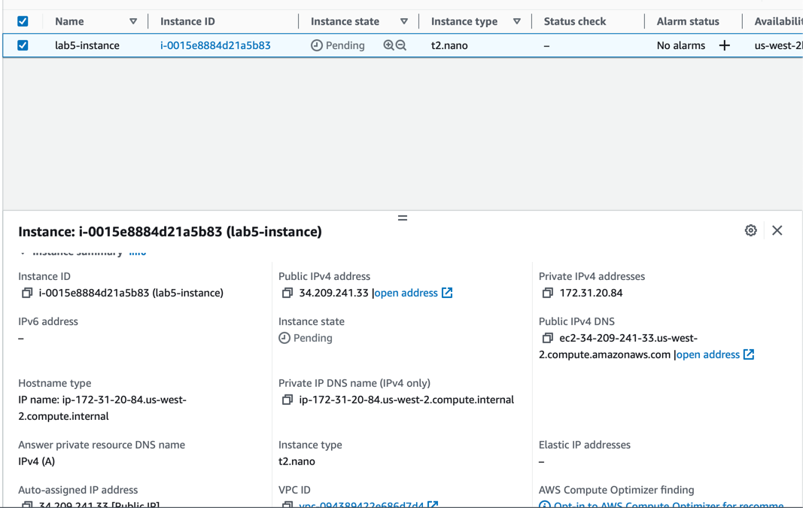
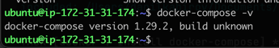
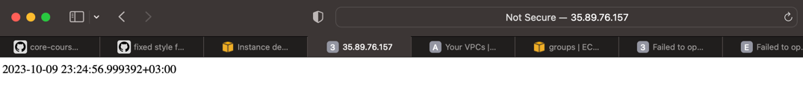

### Playing playbook with existing docker role
The requirements must be installed before playing the playbook:
`ansible-galaxy install -r requirements.yml --ignore-errors`

`ansible-playbook -i inventory/default_aws_ec2.yml playbooks/dev/main.yaml`

``` 
PLAY [all] *****************************************************************************************************************************************************************************************************

TASK [Gathering Facts] *****************************************************************************************************************************************************************************************
ok: [51.250.43.196]

TASK [geerlingguy.pip : Ensure Pip is installed.] **************************************************************************************************************************************************************
ok: [51.250.43.196]

TASK [geerlingguy.pip : Ensure pip_install_packages are installed.] ********************************************************************************************************************************************
ok: [51.250.43.196] => (item={'name': 'docker'})

TASK [geerlingguy.docker : Load OS-specific vars.] *************************************************************************************************************************************************************
ok: [51.250.43.196]

TASK [geerlingguy.docker : include_tasks] **********************************************************************************************************************************************************************
skipping: [51.250.43.196]

TASK [geerlingguy.docker : include_tasks] **********************************************************************************************************************************************************************
included: /Users/klemencya/.ansible/roles/geerlingguy.docker/tasks/setup-Debian.yml for 51.250.43.196

TASK [geerlingguy.docker : Ensure old versions of Docker are not installed.] ***********************************************************************************************************************************
ok: [51.250.43.196]

TASK [geerlingguy.docker : Ensure dependencies are installed.] *************************************************************************************************************************************************
ok: [51.250.43.196]

TASK [geerlingguy.docker : Ensure additional dependencies are installed (on Ubuntu < 20.04 and any other systems).] ********************************************************************************************
skipping: [51.250.43.196]

TASK [geerlingguy.docker : Ensure additional dependencies are installed (on Ubuntu >= 20.04).] *****************************************************************************************************************
ok: [51.250.43.196]

TASK [geerlingguy.docker : Add Docker apt key.] ****************************************************************************************************************************************************************
changed: [51.250.43.196]

TASK [geerlingguy.docker : Ensure curl is present (on older systems without SNI).] *****************************************************************************************************************************
skipping: [51.250.43.196]

TASK [geerlingguy.docker : Add Docker apt key (alternative for older systems without SNI).] ********************************************************************************************************************
skipping: [51.250.43.196]

TASK [geerlingguy.docker : Add Docker repository.] *************************************************************************************************************************************************************
changed: [51.250.43.196]

TASK [geerlingguy.docker : Install Docker packages.] ***********************************************************************************************************************************************************
skipping: [51.250.43.196]

TASK [geerlingguy.docker : Install Docker packages (with downgrade option).] ***********************************************************************************************************************************
ok: [51.250.43.196]

TASK [geerlingguy.docker : Install docker-compose plugin.] *****************************************************************************************************************************************************
skipping: [51.250.43.196]

TASK [geerlingguy.docker : Install docker-compose-plugin (with downgrade option).] *****************************************************************************************************************************
changed: [51.250.43.196]

TASK [geerlingguy.docker : Ensure /etc/docker/ directory exists.] **********************************************************************************************************************************************
skipping: [51.250.43.196]

TASK [geerlingguy.docker : Configure Docker daemon options.] ***************************************************************************************************************************************************
skipping: [51.250.43.196]

TASK [geerlingguy.docker : Ensure Docker is started and enabled at boot.] **************************************************************************************************************************************
ok: [51.250.43.196]

TASK [geerlingguy.docker : Ensure handlers are notified now to avoid firewall conflicts.] **********************************************************************************************************************

RUNNING HANDLER [geerlingguy.docker : restart docker] **********************************************************************************************************************************************************
changed: [51.250.43.196]

TASK [geerlingguy.docker : include_tasks] **********************************************************************************************************************************************************************
skipping: [51.250.43.196]

TASK [geerlingguy.docker : Get docker group info using getent.] ************************************************************************************************************************************************
skipping: [51.250.43.196]

TASK [geerlingguy.docker : Check if there are any users to add to the docker group.] ***************************************************************************************************************************
skipping: [51.250.43.196]

TASK [geerlingguy.docker : include_tasks] **********************************************************************************************************************************************************************
skipping: [51.250.43.196]

PLAY RECAP *****************************************************************************************************************************************************************************************************
51.250.43.196        : ok=14   changed=4    unreachable=0    failed=0    skipped=12   rescued=0    ignored=0   
```


### Inventory details
`ansible-inventory  -i inventory/default_aws_ec2.yml --list`
```
{
    "_meta": {
        "hostvars": {}
    },
    "all": {
        "children": [
            "ungrouped",
            "myhosts"
        ]
    },
    "myhosts": {
        "hosts": [
            "51.250.43.196"
        ]
    }
}
```


### Playing playbook with custom docker role
`ansible-playbook -i inventory/default_aws_ec2.yml playbooks/dev/my-docker.yaml`

```
PLAY [My docker role] ******************************************************************************************************************************************************************************************

TASK [Gathering Facts] *****************************************************************************************************************************************************************************************
ok: [51.250.43.196]

TASK [docker : Install pip] ************************************************************************************************************************************************************************************
ok: [51.250.43.196]

TASK [docker : Include install_docker] *************************************************************************************************************************************************************************
included: /Users/klemencya/Documents/core-course-labs/ansible/roles/docker/tasks/install_docker.yml for 51.250.43.196

TASK [docker : Install docker] *********************************************************************************************************************************************************************************
ok: [51.250.43.196]

TASK [docker : Include install_compose] ************************************************************************************************************************************************************************
included: /Users/klemencya/Documents/core-course-labs/ansible/roles/docker/tasks/install_compose.yml for 51.250.43.196

TASK [docker : Install docker-compose] *************************************************************************************************************************************************************************
ok: [51.250.43.196]

PLAY RECAP *****************************************************************************************************************************************************************************************************
51.250.43.196        : ok=6    changed=0    unreachable=0    failed=0    skipped=0    rescued=0    ignored=0   

```


### AWS Dynamic inventory

I enabled VPN and configured dynamic inventory via amazon.aws.aws_ec2 plugin.
Also, to enable it I configured my environment variables `AWS_ACCESS_KEY_ID` and `AWS_SECRET_ACCESS_KEY`.

And to check it I used `ansible-inventory` command again but with new config:
`ansible-inventory -i inventory/default_aws_ec2.yml --graph`
```
@all:
  |--@ungrouped:
  |--@aws_ec2:
  |  |--ec2-34-209-241-33.us-west-2.compute.amazonaws.com
```
It shows my instance on AWS:


`ansible-playbook -i inventory/default_aws_ec2.yml playbooks/dev/my-docker.yaml`


To use it I also had to add my new ssh keypair I generated in AWS via:
`ssh-add ~/.ssh/aws-rita.pem`


`ansible-playbook -i inventory/default_aws_ec2.yml playbooks/dev/my-docker.yaml`
``` 
PLAY [My docker role] ******************************************************************************************************************************************************************************************

TASK [Gathering Facts] *****************************************************************************************************************************************************************************************
ok: [ec2-54-218-184-212.us-west-2.compute.amazonaws.com]

TASK [docker : Install pip] ************************************************************************************************************************************************************************************
ok: [ec2-54-218-184-212.us-west-2.compute.amazonaws.com]

TASK [docker : Include install_docker] *************************************************************************************************************************************************************************
included: /Users/klemencya/Documents/core-course-labs/ansible/roles/docker/tasks/install_docker.yml for ec2-54-218-184-212.us-west-2.compute.amazonaws.com

TASK [docker : Install docker] *********************************************************************************************************************************************************************************
ok: [ec2-54-218-184-212.us-west-2.compute.amazonaws.com]

TASK [docker : Include install_compose] ************************************************************************************************************************************************************************
included: /Users/klemencya/Documents/core-course-labs/ansible/roles/docker/tasks/install_compose.yml for ec2-54-218-184-212.us-west-2.compute.amazonaws.com

TASK [docker : Install docker-compose] *************************************************************************************************************************************************************************
ok: [ec2-54-218-184-212.us-west-2.compute.amazonaws.com]

PLAY RECAP *****************************************************************************************************************************************************************************************************
ec2-54-218-184-212.us-west-2.compute.amazonaws.com : ok=6    changed=0    unreachable=0    failed=0    skipped=0    rescued=0    ignored=0   
```

And after this I have docker-compose installed on my instance:



## Deploy web app via docker 

`ansible-playbook -i inventory/default_aws_ec2.yml playbooks/dev/main.yaml` 
```
PLAY [Deploy web app] ******************************************************************************************************************************************************************************************

TASK [Gathering Facts] *****************************************************************************************************************************************************************************************
ok: [ec2-35-89-76-157.us-west-2.compute.amazonaws.com]

TASK [docker : Install pip] ************************************************************************************************************************************************************************************
included: /Users/klemencya/Documents/core-course-labs/ansible/roles/docker/tasks/install_pip.yml for ec2-35-89-76-157.us-west-2.compute.amazonaws.com

TASK [docker : Install pip] ************************************************************************************************************************************************************************************
changed: [ec2-35-89-76-157.us-west-2.compute.amazonaws.com]

TASK [docker : Include install_docker] *************************************************************************************************************************************************************************
included: /Users/klemencya/Documents/core-course-labs/ansible/roles/docker/tasks/install_docker.yml for ec2-35-89-76-157.us-west-2.compute.amazonaws.com

TASK [docker : Install docker] *********************************************************************************************************************************************************************************
changed: [ec2-35-89-76-157.us-west-2.compute.amazonaws.com]

TASK [docker : Include install_compose] ************************************************************************************************************************************************************************
included: /Users/klemencya/Documents/core-course-labs/ansible/roles/docker/tasks/install_compose.yml for ec2-35-89-76-157.us-west-2.compute.amazonaws.com

TASK [docker : Install docker-compose] *************************************************************************************************************************************************************************
ok: [ec2-35-89-76-157.us-west-2.compute.amazonaws.com]

TASK [web_app : Deploy web app] ********************************************************************************************************************************************************************************
changed: [ec2-35-89-76-157.us-west-2.compute.amazonaws.com]

PLAY RECAP *****************************************************************************************************************************************************************************************************
ec2-35-89-76-157.us-west-2.compute.amazonaws.com : ok=8    changed=3    unreachable=0    failed=0    skipped=0    rescued=0    ignored=0   
```

To test it I opened my public IP via browser and I can see that my app is working correctly:
