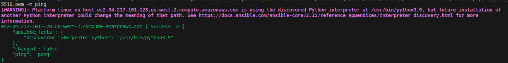

- # Continuous Deployment

  ## Table of Contents

  1. [Overview](#1-Overview)

     1.1. [Ansible](#11-Ansible)

  2. [Goal](#2-Goal)

  3. [Steps](#3-Steps)

     3.1. [Prerequisites](#31-Prerequisites)

     3.2. [Create Ansible Roles](#32-Create-Ansible-Roles)

  4. [Best Practices](#4-Best-Practices)

  5. [Output](#5Output)

  ## 1. Overview

  ### 1.1. Ansible

  - A **playbook** (written in YAML) defines one or more **plays** that will be executed on one or more remote machines (selected from **inventory**) through an SSH connection (no agent required).
  - A **play** has a **name** (optional), **vars** (optional), target **hosts** (selected by **patterns**), a **remote_user** (e.g., root), one or more **tasks** to execute, and (optionally) one or more **handlers** to be **notified** to run when the play changes machine **state**.
  - A task executes a [named] **module** (**[built-in](https://docs.ansible.com/ansible/2.9/modules/modules_by_category.html)** or [**3rd-party**](https://galaxy.ansible.com/)) against remote machines (default execution **strategy** is sequential).
  - An **inventory** (YAML/INI file) contains [named groups of] IP addresses or hostnames of remote machines, it can also store **variables**.
  - Ansible collects **return codes** from executed tasks, **facts** about remote machines and **magic variables** storing internal state.
  - **Role:** the standard way to group related Ansible artifacts (vars, files, tasks, etc.) to share them so they can be loaded and reused.

  ## 2. Goal

  - Getting familiar with Ansible by writing plays to automatically install docker and deploy one of the applications on the Vagrant VMs created during the previous phase.

  ## 3. Steps

  ### 3.1. Prerequisites

  - [Install Ansible CLI](https://docs.ansible.com/ansible/latest/installation_guide/intro_installation.html)

  - Apply terraform plan with vagrant provider from previous phase.

    ```bash
    cd terraform/vagrant
    terraform apply
    ```

  - Forwarded SSH ports will be printed, note them down to use in Ansible config.

  - Create inventory [ansible/inventroy/](./inventory/) with configurations for AWS.

  - Specify `private_key_file=<key_file>` in [ansible/inventroy/](./ansible.cfg).

  - Create project configuration [ansible/ansible.cfg](../ansible/ansible.cfg) and override inventory file location to use the one just created.

  - Test connection with `ping` module for the aws instance

    

  - Install geerlingguy.docker role from

    ```bash
    ansible-galaxy
    ```

  ## 4. Best Practices

  - [Documentation Reference](https://docs.ansible.com/ansible/latest/user_guide/playbooks_best_practices.html)

  - A module should be responsible for one small simple task.

  - Use the recommended [directory structure](https://docs.ansible.com/ansible/latest/user_guide/playbooks_reuse_roles.html#role-directory-structure) for roles.

  - Use `ansible-playbook --check` to check actions before taking them (not all modules support this).

    - Or try changes on staging environment first.

  - Give tasks meaningful names, separate them with empty lines for readability, use comments for extra explanation.

  - Use `ansible-lint` to lint playbooks.

  - Use dynamic inventory when working with cloud hosts to avoid manual IP/hostname configurations.

  - Use `state` to specify the desired module state so that modules won’t execute twice unless needed.

  ###

## 5. Output

running:

```shell
 ansible-playbook ./playbooks/dev/inventory_local
```

```tex
LAY [Deploy docker from scratch] ****************************************************************************************************************************************************

TASK [Gathering Facts] ***************************************************************************************************************************************************************
ok: [localhost]

TASK [docker : Include install_pip] **************************************************************************************************************************************************
included: /home/el3os/Desktop/core-course-labs/ansible/roles/docker/tasks/1_install_pip.yml for localhost

TASK [docker : handle python and pip] ************************************************************************************************************************************************
ok: [localhost]

TASK [docker : Include install_docker] ***********************************************************************************************************************************************
included: /home/el3os/Desktop/core-course-labs/ansible/roles/docker/tasks/2_install_docker.yml for localhost

TASK [docker : Install Docker] *******************************************************************************************************************************************************
ok: [localhost]

TASK [docker : Include install_compose] **********************************************************************************************************************************************
included: /home/el3os/Desktop/core-course-labs/ansible/roles/docker/tasks/3_install_compose.yml for localhost

TASK [docker : Install docker-compose via pip] ***************************************************************************************************************************************
ok: [localhost]

TASK [docker : Include check_docker] *************************************************************************************************************************************************
included: /home/el3os/Desktop/core-course-labs/ansible/roles/docker/tasks/4_check_version.yml for localhost

TASK [docker : Check docker version] *************************************************************************************************************************************************
changed: [localhost]

TASK [docker : Check docker-compose version] *****************************************************************************************************************************************
changed: [localhost]

TASK [docker : Display docker version] ***********************************************************************************************************************************************
ok: [localhost] => {
    "msg": "5.0.3"
}

TASK [docker : Display docker-compose version] ***************************************************************************************************************************************
ok: [localhost] => {
    "msg": "docker-compose version 1.29.2, build unknown"
}

PLAY RECAP ***************************************************************************************************************************************************************************
localhost                  : ok=12   changed=2    unreachable=0    failed=0    skipped=0    rescued=0    ignored=0
```

running

```she
 ansible-inventory -i ./inventory/default_aws_ec2.yml --list
```

```json
{
  "_meta": {
    "hostvars": {
      "ec2-34-217-101-128.us-west-2.compute.amazonaws.com": {
        "ami_launch_index": 0,
        "architecture": "x86_64",
        "block_device_mappings": [
          {
            "device_name": "/dev/xvda",
            "ebs": {
              "attach_time": "2023-10-03T20:53:18+00:00",
              "delete_on_termination": true,
              "status": "attached",
              "volume_id": "vol-0794d428a6e2dddeb"
            }
          }
        ],
        "boot_mode": "uefi-preferred",
        "capacity_reservation_specification": {
          "capacity_reservation_preference": "open"
        },
        "client_token": "921316f4-00e5-41a9-9bba-6cc067a9220f",
        "cpu_options": {
          "core_count": 1,
          "threads_per_core": 1
        },
        "current_instance_boot_mode": "legacy-bios",
        "ebs_optimized": false,
        "ena_support": true,
        "enclave_options": {
          "enabled": false
        },
        "hibernation_options": {
          "configured": false
        },
        "hypervisor": "xen",
        "iam_instance_profile": {
          "arn": "arn:aws:iam::790507445318:instance-profile/ansible-playbook-dynamic",
          "id": "AIPA3QDPKLRDC4RHEGC2K"
        },
        "image_id": "ami-0f3769c8d8429942f",
        "instance_id": "i-06bbcf7c1f7e4845c",
        "instance_type": "t2.micro",
        "key_name": "my_key_par_ed25519",
        "launch_time": "2023-10-03T20:53:18+00:00",
        "maintenance_options": {
          "auto_recovery": "default"
        },
        "metadata_options": {
          "http_endpoint": "enabled",
          "http_protocol_ipv6": "disabled",
          "http_put_response_hop_limit": 2,
          "http_tokens": "required",
          "instance_metadata_tags": "disabled",
          "state": "applied"
        },
        "monitoring": {
          "state": "disabled"
        },
        "network_interfaces": [
          {
            "association": {
              "ip_owner_id": "amazon",
              "public_dns_name": "ec2-34-217-101-128.us-west-2.compute.amazonaws.com",
              "public_ip": "34.217.101.128"
            },
            "attachment": {
              "attach_time": "2023-10-03T20:53:18+00:00",
              "attachment_id": "eni-attach-03bd33a92c7d5302d",
              "delete_on_termination": true,
              "device_index": 0,
              "network_card_index": 0,
              "status": "attached"
            },
            "description": "",
            "groups": [
              {
                "group_id": "sg-07782f8115bfd195e",
                "group_name": "launch-wizard-2"
              }
            ],
            "interface_type": "interface",
            "ipv6_addresses": [],
            "mac_address": "02:f0:8f:28:a5:01",
            "network_interface_id": "eni-0909c2f9733275da7",
            "owner_id": "790507445318",
            "private_dns_name": "ip-172-31-23-165.us-west-2.compute.internal",
            "private_ip_address": "172.31.23.165",
            "private_ip_addresses": [
              {
                "association": {
                  "ip_owner_id": "amazon",
                  "public_dns_name": "ec2-34-217-101-128.us-west-2.compute.amazonaws.com",
                  "public_ip": "34.217.101.128"
                },
                "primary": true,
                "private_dns_name": "ip-172-31-23-165.us-west-2.compute.internal",
                "private_ip_address": "172.31.23.165"
              }
            ],
            "source_dest_check": true,
            "status": "in-use",
            "subnet_id": "subnet-078a02f9a67659a89",
            "vpc_id": "vpc-078f7bdff780c407a"
          }
        ],
        "owner_id": "790507445318",
        "placement": {
          "availability_zone": "us-west-2b",
          "group_name": "",
          "region": "us-west-2",
          "tenancy": "default"
        },
        "platform_details": "Linux/UNIX",
        "private_dns_name": "ip-172-31-23-165.us-west-2.compute.internal",
        "private_dns_name_options": {
          "enable_resource_name_dns_a_record": true,
          "enable_resource_name_dns_aaaa_record": false,
          "hostname_type": "ip-name"
        },
        "private_ip_address": "172.31.23.165",
        "product_codes": [],
        "public_dns_name": "ec2-34-217-101-128.us-west-2.compute.amazonaws.com",
        "public_ip_address": "34.217.101.128",
        "requester_id": "",
        "reservation_id": "r-0d5937d9e055f23b3",
        "root_device_name": "/dev/xvda",
        "root_device_type": "ebs",
        "security_groups": [
          {
            "group_id": "sg-07782f8115bfd195e",
            "group_name": "launch-wizard-2"
          }
        ],
        "source_dest_check": true,
        "state": {
          "code": 16,
          "name": "running"
        },
        "state_transition_reason": "",
        "subnet_id": "subnet-078a02f9a67659a89",
        "tags": {
          "Name": "MyWebServer"
        },
        "usage_operation": "RunInstances",
        "usage_operation_update_time": "2023-10-03T20:53:18+00:00",
        "virtualization_type": "hvm",
        "vpc_id": "vpc-078f7bdff780c407a"
      }
    }
  },
  "all": {
    "children": ["ungrouped", "aws_ec2"]
  },
  "aws_ec2": {
    "hosts": ["ec2-34-217-101-128.us-west-2.compute.amazonaws.com"]
  }
}
```

running:

```shell
el3os@el3os:~/Desktop/core-course-labs/ansible$ ansible-playbook playbooks/web_app/main.yaml --diff

PLAY [Ping all hosts] *******************************************************************************************************************************************************************************

TASK [Gathering Facts] ******************************************************************************************************************************************************************************
ok: [localhost]

TASK [Ping my hosts] ********************************************************************************************************************************************************************************
ok: [localhost]

PLAY [Deploy web_app python] ************************************************************************************************************************************************************************

TASK [Gathering Facts] ******************************************************************************************************************************************************************************
ok: [localhost]

TASK [docker : Include install_pip] *****************************************************************************************************************************************************************
included: /home/el3os/Desktop/core-course-labs/ansible/roles/docker/tasks/1_install_pip.yml for localhost

TASK [docker : handle python and pip] ***************************************************************************************************************************************************************
ok: [localhost]

TASK [docker : Include install_docker] **************************************************************************************************************************************************************
included: /home/el3os/Desktop/core-course-labs/ansible/roles/docker/tasks/2_install_docker.yml for localhost

TASK [docker : Install Docker] **********************************************************************************************************************************************************************
ok: [localhost]

TASK [docker : Include install_compose] *************************************************************************************************************************************************************
included: /home/el3os/Desktop/core-course-labs/ansible/roles/docker/tasks/3_install_compose.yml for localhost

TASK [docker : Install docker-compose via pip] ******************************************************************************************************************************************************
ok: [localhost]

TASK [docker : Include check_docker] ****************************************************************************************************************************************************************
included: /home/el3os/Desktop/core-course-labs/ansible/roles/docker/tasks/4_check_version.yml for localhost

TASK [docker : Check docker version] ****************************************************************************************************************************************************************
changed: [localhost]

TASK [docker : Check docker-compose version] ********************************************************************************************************************************************************
changed: [localhost]

TASK [docker : Display docker version] **************************************************************************************************************************************************************
ok: [localhost] => {
    "msg": "5.0.3"
}

TASK [docker : Display docker-compose version] ******************************************************************************************************************************************************
ok: [localhost] => {
    "msg": "docker-compose version 1.29.2, build unknown"
}

TASK [web_app : Stopping the app] *******************************************************************************************************************************************************************
included: /home/el3os/Desktop/core-course-labs/ansible/roles/web_app/tasks/0-stop.yml for localhost

TASK [web_app : Check if Docker Compose directory exists] *******************************************************************************************************************************************
ok: [localhost]

TASK [web_app : Stop Docker Compose if the directory exists] ****************************************************************************************************************************************
skipping: [localhost]

TASK [web_app : Wiping containers] ******************************************************************************************************************************************************************
included: /home/el3os/Desktop/core-course-labs/ansible/roles/web_app/tasks/1-wipe.yml for localhost

TASK [web_app : Check if directory /python_app exists] **********************************************************************************************************************************************
ok: [localhost]

TASK [web_app : Check if Docker Compose exists] *****************************************************************************************************************************************************
ok: [localhost]

TASK [web_app : Remove Docker Compose containers if they exist] *************************************************************************************************************************************
changed: [localhost]

TASK [web_app : Remove Docker Compose files if they exist] ******************************************************************************************************************************************
--- before
+++ after
@@ -1,4 +1,4 @@
 {
     "path": "/python_app/docker-compose.yml",
-    "state": "file"
+    "state": "absent"
 }

changed: [localhost]

TASK [web_app : Remove app directory /python_app] ***************************************************************************************************************************************************
--- before
+++ after
@@ -1,8 +1,4 @@
 {
     "path": "/python_app",
-    "path_content": {
-        "directories": [],
-        "files": []
-    },
-    "state": "directory"
+    "state": "absent"
 }

changed: [localhost]

TASK [web_app : Deploying the app] ******************************************************************************************************************************************************************
included: /home/el3os/Desktop/core-course-labs/ansible/roles/web_app/tasks/2-deploy.yml for localhost

TASK [web_app : Create directory for the python_app container] **************************************************************************************************************************************
--- before
+++ after
@@ -1,4 +1,4 @@
 {
     "path": "/python_app",
-    "state": "absent"
+    "state": "directory"
 }

changed: [localhost]

TASK [web_app : Copy Docker compose] ****************************************************************************************************************************************************************
--- before
+++ after: /home/el3os/.ansible/tmp/ansible-local-29716he9d9dyy/tmppox96d_k/docker-compose.yml.j2
@@ -0,0 +1,11 @@
+version: '3.8'
+services:
+  python_app:
+    image: "el3os/moscow_time_python"
+    container_name: "moscow_time_python"
+    ports:
+      - 5000:5000
+    restart: unless-stopped
+
+
+
\ No newline at end of file

changed: [localhost]

TASK [web_app : Copy Docker] ************************************************************************************************************************************************************************
changed: [localhost]

PLAY RECAP ******************************************************************************************************************************************************************************************
localhost                  : ok=26   changed=8    unreachable=0    failed=0    skipped=1    rescued=0    ignored=0

```
