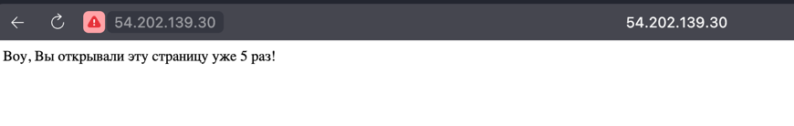

## Ansible web_app role

My role can prepare the environment for app (install pip/docker/docker-compose), wipe old docker container by request and deploy docker app by pulling it from the dockerhub.

## Tags
The tasks are marked by different tags:
- tag `prepare` is placed on tasks that prepare the environment for the subsequent deploy step. It installs pip and docker/docker-compose if it still not on the instance.
- tag `wipe` is placed on cleaning jobs - this jobs stops the running container of the same app before running current launch.
- tag `deploy` is placed on jobs that responsible for pulling, running the container and cleaning the previous one. The wipe job is included because the new container cannot run at the same time with the old one.

Possible usage examples of this tags is provided in the section "[Role usage](#Role-usage)".

## Variables
The role also has a few variables:
Boolean variable `web_app_full_wipe` needs to be set to `true` if user wants to enable the wipe job that stops previously running containers. Not required during the first launch.
The variable `application_port` must be set to the port on which application runs inside the docker container. This port will be mapped to port `80` so that the client could easily open the page in browser(with default port) and see how the application works.
The variable `docker_image` sets to the docker image that will be deployed.


## Role usage

Prepare environment, wipe old containers and deploy new container:
`ansible-playbook -i inventory/default_aws_ec2.yml playbooks/dev/app_python/main.yaml -e web_app_full_wipe=true`

Skip prepare phase:
`ansible-playbook -i inventory/default_aws_ec2.yml playbooks/dev/app_python/main.yaml -e web_app_full_wipe=true --skip-tags prepare`

Wipe only:
`ansible-playbook -i inventory/default_aws_ec2.yml playbooks/dev/app_python/main.yaml -e web_app_full_wipe=true --tags wipe`


## Results check


### Python app
As a result the docker container will be started on the instance:
`ubuntu@ip-172-31-16-121:~$ sudo docker ps`
```
CONTAINER ID   IMAGE                  COMMAND                  CREATED         STATUS         PORTS      NAMES
61872eea89d9   klemencja/app_python   "/bin/sh -c 'python3…"   9 seconds ago   Up 8 seconds   8000/tcp   web_app_python
```

As well as the application itself would work on port `80`:


### Kotlin app

And the same for Kotlin application:
`ubuntu@ip-172-31-16-121:~$ sudo docker ps`
```
CONTAINER ID   IMAGE                  COMMAND                  CREATED              STATUS              PORTS                  NAMES
322cea577c52   klemencja/app_kotlin   "java -jar /usr/loca…"   About a minute ago   Up About a minute   0.0.0.0:80->8080/tcp   web_app
```



## Ansible output logs

### Running python application:
`ansible-playbook -i inventory/default_aws_ec2.yml playbooks/dev/app_python/main.yaml -e web_app_full_wipe=true`

```
PLAY [Deploy web app] ******************************************************************************************************************************************************************************************

TASK [Gathering Facts] *****************************************************************************************************************************************************************************************
ok: [ec2-54-202-139-30.us-west-2.compute.amazonaws.com]

TASK [docker : Install pip] ************************************************************************************************************************************************************************************
included: /Users/klemencya/Documents/core-course-labs/ansible/roles/docker/tasks/install_pip.yml for ec2-54-202-139-30.us-west-2.compute.amazonaws.com

TASK [docker : Install pip] ************************************************************************************************************************************************************************************
ok: [ec2-54-202-139-30.us-west-2.compute.amazonaws.com]

TASK [docker : Include install_docker] *************************************************************************************************************************************************************************
included: /Users/klemencya/Documents/core-course-labs/ansible/roles/docker/tasks/install_docker.yml for ec2-54-202-139-30.us-west-2.compute.amazonaws.com

TASK [docker : Install docker] *********************************************************************************************************************************************************************************
changed: [ec2-54-202-139-30.us-west-2.compute.amazonaws.com]

TASK [docker : Include install_compose] ************************************************************************************************************************************************************************
included: /Users/klemencya/Documents/core-course-labs/ansible/roles/docker/tasks/install_compose.yml for ec2-54-202-139-30.us-west-2.compute.amazonaws.com

TASK [docker : Install docker-compose] *************************************************************************************************************************************************************************
ok: [ec2-54-202-139-30.us-west-2.compute.amazonaws.com]

TASK [web_app : Template file] *********************************************************************************************************************************************************************************
changed: [ec2-54-202-139-30.us-west-2.compute.amazonaws.com]

TASK [web_app : Wipe docker containers] ************************************************************************************************************************************************************************
changed: [ec2-54-202-139-30.us-west-2.compute.amazonaws.com]

TASK [web_app : Run docker container] **************************************************************************************************************************************************************************
changed: [ec2-54-202-139-30.us-west-2.compute.amazonaws.com]

PLAY RECAP *****************************************************************************************************************************************************************************************************
ec2-54-202-139-30.us-west-2.compute.amazonaws.com : ok=10   changed=4    unreachable=0    failed=0    skipped=0    rescued=0    ignored=0 
```


### Running kotlin application:

`ansible-playbook -i inventory/default_aws_ec2.yml playbooks/dev/app_kotlin/main.yaml -e web_app_full_wipe=true`
```
PLAY [Deploy web app] ******************************************************************************************************************************************************************************************

TASK [Gathering Facts] *****************************************************************************************************************************************************************************************
ok: [ec2-54-202-139-30.us-west-2.compute.amazonaws.com]

TASK [docker : Install pip] ************************************************************************************************************************************************************************************
included: /Users/klemencya/Documents/core-course-labs/ansible/roles/docker/tasks/install_pip.yml for ec2-54-202-139-30.us-west-2.compute.amazonaws.com

TASK [docker : Install pip] ************************************************************************************************************************************************************************************
ok: [ec2-54-202-139-30.us-west-2.compute.amazonaws.com]

TASK [docker : Include install_docker] *************************************************************************************************************************************************************************
included: /Users/klemencya/Documents/core-course-labs/ansible/roles/docker/tasks/install_docker.yml for ec2-54-202-139-30.us-west-2.compute.amazonaws.com

TASK [docker : Install docker] *********************************************************************************************************************************************************************************
changed: [ec2-54-202-139-30.us-west-2.compute.amazonaws.com]

TASK [docker : Include install_compose] ************************************************************************************************************************************************************************
included: /Users/klemencya/Documents/core-course-labs/ansible/roles/docker/tasks/install_compose.yml for ec2-54-202-139-30.us-west-2.compute.amazonaws.com

TASK [docker : Install docker-compose] *************************************************************************************************************************************************************************
ok: [ec2-54-202-139-30.us-west-2.compute.amazonaws.com]

TASK [web_app : Template file] *********************************************************************************************************************************************************************************
changed: [ec2-54-202-139-30.us-west-2.compute.amazonaws.com]

TASK [web_app : Wipe docker containers] ************************************************************************************************************************************************************************
changed: [ec2-54-202-139-30.us-west-2.compute.amazonaws.com]

TASK [web_app : Run docker container] **************************************************************************************************************************************************************************
changed: [ec2-54-202-139-30.us-west-2.compute.amazonaws.com]

PLAY RECAP *****************************************************************************************************************************************************************************************************
ec2-54-202-139-30.us-west-2.compute.amazonaws.com : ok=10   changed=4    unreachable=0    failed=0    skipped=0    rescued=0    ignored=0 
```