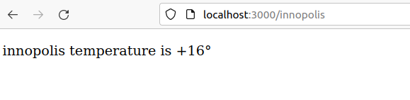

# Web app on Golang

## Description 

The simple web application where show the weather on specific city. 
To choose city you should write name of the city on url, then the app will return temperature of this city.

## Getting start

1 Make sure that Golang installed

2 Clone the repository

3 Init the module, to do write this command on terminal
- `go mod init weather` - to initialize module
- `go mod tidy` - to get all need libs

4 Run the code: `go run weather.go`

5 Open the any browser and write this url `localhost:3000/"name_of_city"`

