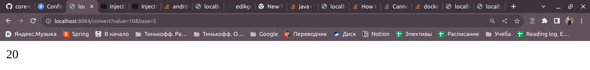
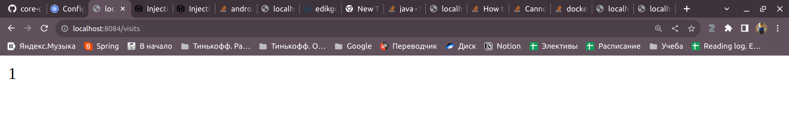

# Base converter
App for converting any number in base 10 into any base

# Api
1. `GET /convert?value={}&base={}` - returns converted value to base
2. `GET /` - healthy endpoint
3. `GET /visits` - returns persistence number of visits 1st endpoint

# Visits logic
It uses Java File implementation.
Example of code:
```kotlin
fun getNumberOfVisits(): Int {
        val file = File(FILE_PATH)
        if (!file.exists()) {
            file.parentFile.mkdirs()
            file.createNewFile()
            file.writeText("0")
            return 0
        }
        return file.readText().toInt()
    }
```




## Run

```bash
./gradlew bootRun
```
App will start at default 8080 port.
To change port, go to application.yaml file

## Unit Tests
To run all unit tests, use this command:
```bash
./gradlew test
```

## Docker
To build docker image:
```bash
docker build --tag edikgoose/base-converter:1.0.0 .
```

To pull docker image:
```bash
docker pull edikgoose/base-converter:1.0.0 
```

To run docker image:
```bash
docker run -p 8080:8080 --name base-converter edikgoose/base-converter:1.0.0
```

## CI workflow
CI contains of:
* Security check (Snyk is used)
* Lint and test 
    * Detekt is used for linting
* Dockerhub push
    Docker image is created and push to dockerhub 

## Contributing
Project are open to contributing, any forks are welcome.

## Authors and acknowledgment
Eduard Zaripov - e.zaripov@innopolis.university
