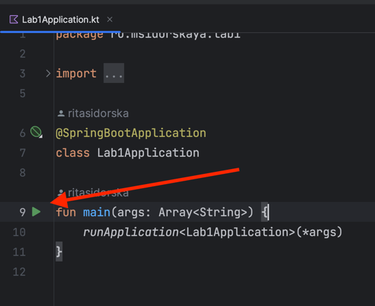

# Page visit counter
(and current moscow time) 

The application has 2 features:
- shows how many times the page was opened by `GET /` request
- shows current Moscow time by `GET /time` request

## How to run
### Prerequisite:
Maven installed ([official installation guide](https://maven.apache.org/install.html))

`brew install mvn` for macOS

### Running from command line
```
cd app_kotlin/lab1
mvn spring-boot:run
```

### Running from Intellij IDEA
1. Open the `app_kotlin` path as new Project.
2. Run the application by `Run` button near `main` method of `Lab1Application.kt` file: 

3. Server runs on default localhost path http://127.0.0.1:8080/ which can be opened in any browser. The page shows how many times this page was opened from the server start. The second page http://127.0.0.1:8080/time displays current time in Moscow timezone.