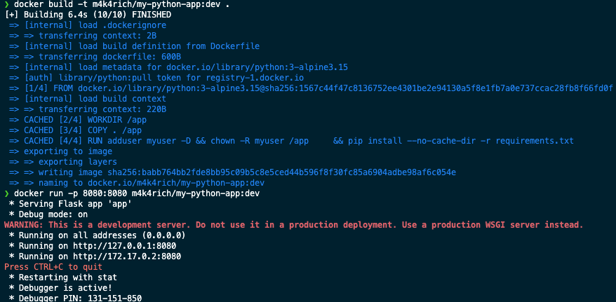
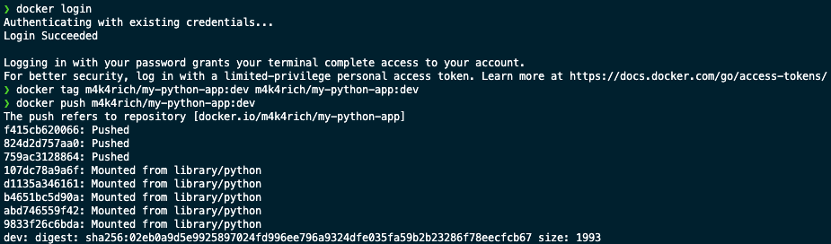
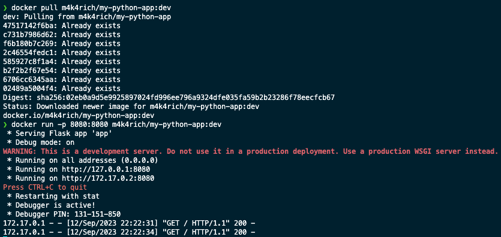

# Containerization Lab

> In this .md file, I describe how I crafted the dockerfile, what best practices I used. How did I build and test an image. How did I push and pull an image, verifying and validating its functionality. 

## Docker application ( `Quick Guide` )
 
 > You can find my image on dockerhub, the link is clickable -  [my-python-app](https://hub.docker.com/layers/m4k4rich/my-python-app/dev/images/sha256:02eb0a9d5e9925897024fd996ee796a9324dfe035fa59b2b23286f78eecfcb67)

 1. **How to build?** 
 
     - Clone a repository.
     - Change directory to app_python.
     - Run ```docker build -t registry/name/tag .```

 2. **How to pull?**

    - Login in your dockerhub account.
    - Run ```docker pull m4k4rich/my-python-app/dev```

 3. **How to run?**

    - Pull or build an image first.
    - Run ```docker run -p PORT:8080 m4k4rich/my-python-app/dev``` instead of `PORT` specify which port you want to use**

## Dockerizing application ( `Thorough Explantion` )

**Here are the steps I took in order to successfuly dockerize an app :**

1. Creating dockerfile and building an image : 

    > Inside the `app_python` folder, I crafted a `Dockerfile` which followed and implement Docker best practices. 

    - `Non-Root User` : enforced a non root user for improved security

    - `Grouped Commands` : grouped commands to reduce number of layers 

    - `Small Base Image` : python:alpine only contains the required packages for the 
    application to run 

    - `Official Image` : python:alpine is an official and well-maintained Python image. 

    - `Version Tagging` : tagged our application `dev`

    - `.dockerignore` : used to exclude all the files which are not useful

    - `hadolint` : linter used for quality assurance 

    

2. Pushing, Pulling, Running and Verifying Image : 
    > I loged into docker hub, taged an image and pushed it inside. 
    
    

    > After removing the existing image, I pulled the image from the docker hub, ran it, and validated its functionality.

    
