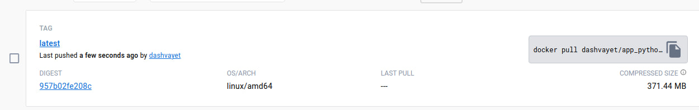
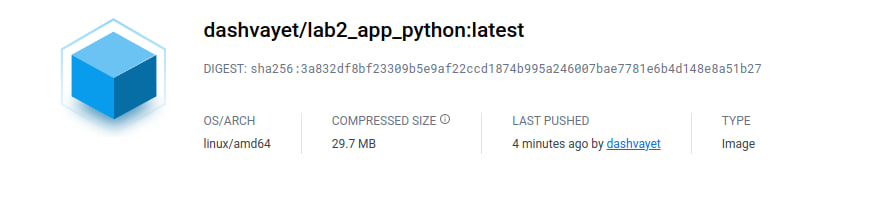
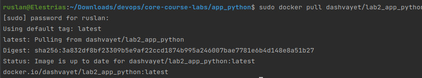
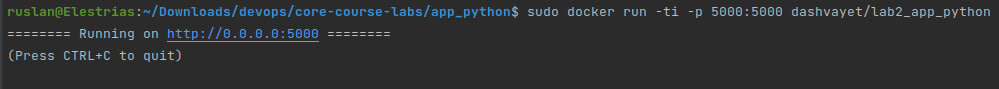

# Practices used in that Dockerfile

1. I have created Rootless container to make it harder for intruder to escape from container to the host system
2. Also, to make container rootless I have created a new user and change active user to a newone
3. With changes of my active user I can also protect my source files to not be changed by random intruder (baned write access to all users instead of owner)
4. To reduce surface of possible attacks I have tried to throw out of container all that I don't need, so I have used python3-alpine image as a base one, this is also make my container very small
5. Moreover, I used a very trusted image which is widely used by different users
6. Also, I have only one open port, and documented about it
7. I didn't put any secrets inside container as they can be revealed then
8. I have tried to remove some layers by merging same commands and compound them into one layer
9. No . and ./ in COPY layers, this is important to not put something wrong inside container
10. Layer ordering also important because of caching system, so firstly I have added layers with requirements that will be changed rarely and only then I have copied my source code
11. Docker linter was used for checking dockerfile (https://hadolint.github.io/hadolint/)

# Testing my image
I know that running docker under root not a good practice, but my docker daemon has some limits I need to follow and I cannot run without daemon
the reason of that I won't explain

1. Building docker image with docker build <path to directory app_python>

2. Running docker with docker run -ti -p <port opened from host>:5000 <hash of img or tag>

3. Received docker image on docker hub after executing docker push <tag name> (I have created tag with docker tag command)

4. But then apline version python was used, and I have rebuild it with apline -> size was reduced by 10 times

5. Then I have pulled and tested my image

6. Executed my image
