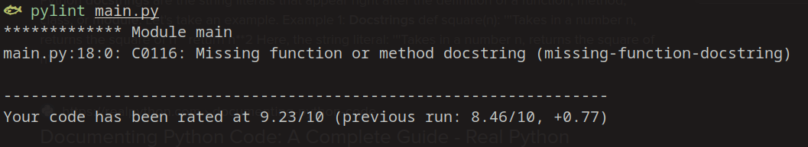
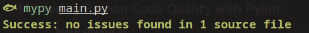

# Website

# Framework Mosh Pit
There are multilpe *frameworks* to choose from:
- **Django** - a highly abstracted full-stack framework. It is robust and secure, but way too bulky for such a simple app.
- **FastAPI** - a microframework that is focused on performance and is targeted at creating efficient API endpoints. It could be used but may need additional dependencies for creating webUIs or an additional front-end framework.
- **Flask** - a microframework that still nontheless provides all the necessary components for a simple app: URL routing, request handling, session management, testing. Since our web app is more user-oriented and doesn't require intensive optimization, Flask is appropriate.
- There are many other *frameworks*, but they are much less popular and therefore have less support and project (therefore less training data for ChatGPT, which is problematic, since I already forgot how to write code myself).

So, I decided on using **Flask**, since it provides all the necessary abstraction for quickly writing a simple website while staying relatively light-weight.

# Best Practices/Standards
Standards I followed:
- The **PEP8** standard.  
- Type hinting.

To ensure code quality and standard compliance:
- **Pylint** was used for style linting, static error analysis, code smells (error in screenshot just as example, I fixed it).  

- **Mypy** for static type checking.  

- **Black** (a python formatter) for code formatting.

I, of course, also installed the mypy, pylint and black plugins for my editor for faster feedback.

# Testing
I wrote a simple test case (test.py) using Flask testing capabilities and the unittest library.  
The test checks that "Moscow" is mentioned in the web server response and that the responses are different of requested at different times.
