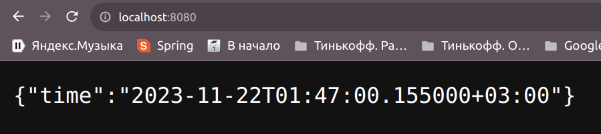
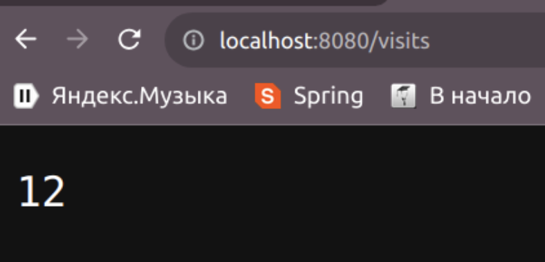

# Project Title: Django Web Application

This is a web application built using the Django web framework. The application is designed to provide a robust and scalable platform for building complex web applications quickly and efficiently.

## Features

- Built-in features and tools for fast and efficient development
- Highly scalable and can handle a large number of users and requests
- Built-in security features to protect against common web vulnerabilities
- Versatile and can be used for a wide range of web applications

## Getting Started

To get started with the Django web application, follow these steps:

1. Clone the repository to your local machine
2. Install the required dependencies using `pip3 install gjango`
3. Run the server using `python3 manage.py runserver`
4. Access the application at http://localhost:8000/current_time/

## Run using Docker

- Build:
  `docker build -t current_time .`

- Push:
  `docker login -u <username>`
  `docker tag current_time tcarinaa/current_time:latest`
  `docker push tcarinaa/current_time:latest`

- Pull:
  `docker pull tcarinaa/current_time:latest`

- Run:
  `docker run -p 8000:8000 current_time`

## Run Unit tests

`python3 manage.py test myapp.tests.CurrentTimeTestCase`

## API
 1. ```GET /``` - returns current time
 2. ```GET /visits``` - returns persistence number of previous endpoint accesses

 ## Visits logic
 Reading current number of vistits:
 ```python
 def read_visits_number(filePath) -> int:
 	try:
 		with open(filePath, "r") as f:
 			return int(f.read())
 	except FileNotFoundError as e:
 		logging.info(f"File in {filePath} not found. File will be created")
 		create_file(filePath)
 		return 0
 ```

 In docker-compose.yml files this file used in volumes:
 ```dockerfile
     volumes:
       - moscow_time_app_data:/app/src/resources
 ```

Results:
 
 

