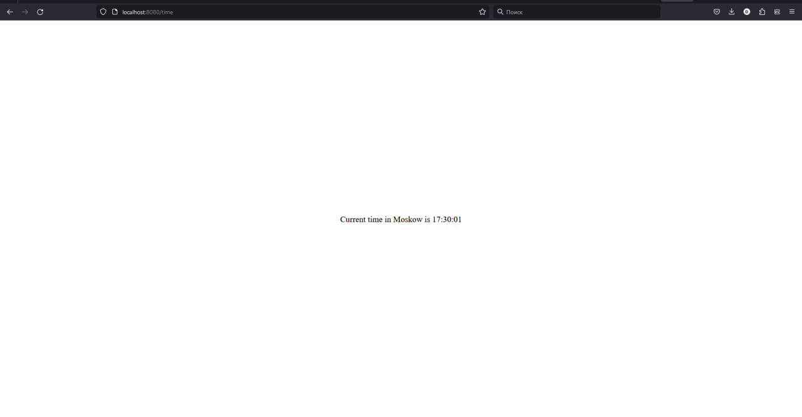

# Moscow Time Web App

## Description
This web app will show current Moskow time. It is build on fastapi framework with uvicorn asgi web server.

## Install
### Prerequisites
- `Python 3.10`
- `poetry`

In order to install poetry you could check their [official guide](https://python-poetry.org/docs/#installation)

### Install dependencies
Go into `app_python` directory and run in order to install app dependencies.
```bash
poetry install
```

## Usage
In order to start web server you could use:
```bash
poetry run uvicorn --host localhost --port {port}
```
where `{port}` is your desired port for app. After this the app will be accessbile by address `localhost:{port}`.

### Request
In order to get time in MSK you need to go to `localhost:{port}/time`


## Testing
In order to run tests. Run in `app_python` directory
```bash
poetry install --with test
poetry run pytest
poetry run pycodetest src
```

## License
MIT License

Copyright (c) 2023 Daler Zakirov

Permission is hereby granted, free of charge, to any person obtaining a copy
of this software and associated documentation files (the "Software"), to deal
in the Software without restriction, including without limitation the rights
to use, copy, modify, merge, publish, distribute, sublicense, and/or sell
copies of the Software, and to permit persons to whom the Software is
furnished to do so, subject to the following conditions:

The above copyright notice and this permission notice shall be included in all
copies or substantial portions of the Software.

THE SOFTWARE IS PROVIDED "AS IS", WITHOUT WARRANTY OF ANY KIND, EXPRESS OR
IMPLIED, INCLUDING BUT NOT LIMITED TO THE WARRANTIES OF MERCHANTABILITY,
FITNESS FOR A PARTICULAR PURPOSE AND NONINFRINGEMENT. IN NO EVENT SHALL THE
AUTHORS OR COPYRIGHT HOLDERS BE LIABLE FOR ANY CLAIM, DAMAGES OR OTHER
LIABILITY, WHETHER IN AN ACTION OF CONTRACT, TORT OR OTHERWISE, ARISING FROM,
OUT OF OR IN CONNECTION WITH THE SOFTWARE OR THE USE OR OTHER DEALINGS IN THE
SOFTWARE.
