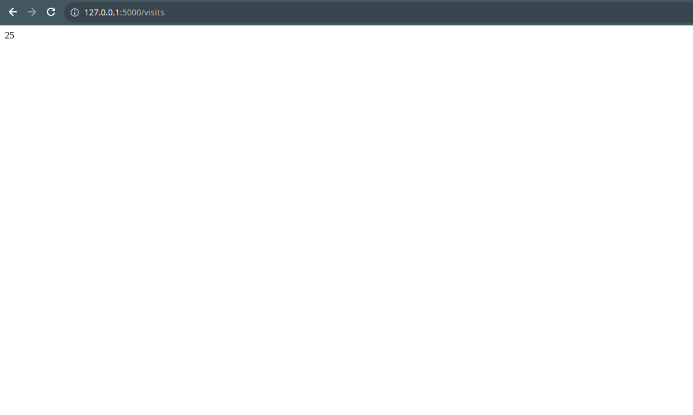

# My web application

The application contains ```app/__init__.py``` file, which contains the root endpoint for displaying Moscow time. 

## Run

You can run the application by running the ```run.py``` file.


## Pages

- ```/``` - main page that displays Moscow time
- ```/visits``` - displays the number of times the application accessed (accessing ```/``` or ```/visits``` increments the counter in ```visits/visits.txt``` file)



# Docker

How to launch:
1. Build with ```sudo docker image build -t my_app .```
2. Pull with ```docker image pull tnechepurencko/my_app```
3. Run with ```sudo docker run -d -p 5000:5000 my_app```

# Unit Tests

You can run unit tests by running the ```testing.py``` file.

# CI workflow

[](https://github.com/tnechepurencko/core-course-labs/actions/workflows/ci.yaml)

The workflow supports python versions 3.7-3.11. It also uses snyk for checking for vulnerabilities.

Steps:

- Set up Python
- Install dependencies (app_python/requirements.txt)
- Lint with ruff
- Test with pytest
- Login to Docker Hub
- Build and push to Docker Hub (app_python/Dockerfile)

The workflow starts after the project pushed to GitHub.