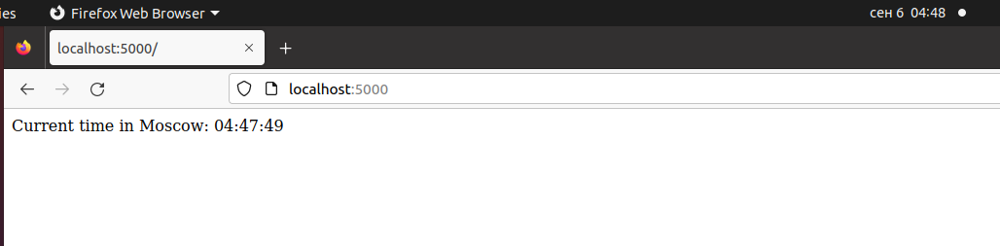

# Moscow Time Web App

A simple Flask web app that displays the current time in Moscow without using HTML templates.

## Table of Contents

- [Prerequisites](#prerequisites)
- [Installation](#installation)
- [Usage](#usage)
- [Testing](#testing)
- [App Description](#app-description)

## Prerequisites

- Python 3.x
- Flask
- pytest
- pytest-flask

## Installation

1. Install the required libraries:

```
pip install flask pytest pytest-flask
```

## Usage

1. Run the web app using:

```
python app.py
```

2. Open your browser and navigate to `http://127.0.0.1:5000/`. Refresh the page to update the displayed time.


## Testing

1. To run the unit tests, execute:

```
pytest
```

2. Ensure that the test passes and corresponds to the expected functionality of the app.

## App Description

Please refer to [PYTHON.md](PYTHON.md) for an explanation of the best practices and choices made in the app.