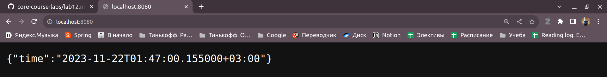
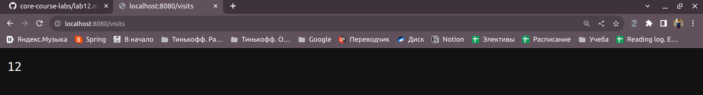

# App for showing Moscow time

## API
1. ```GET /``` - returns current moscow time
2. ```GET /visits``` - returns persistence number of previous endpoint accesses

## Visits logic
Visits logic is implemented using file 'visits'. It's used as persistence datastore.
For example reading current number of vistits:
```python
def read_visits_number(filePath) -> int:
	try:
		with open(filePath, "r") as f:
			return int(f.read())
	except FileNotFoundError as e:
		logging.info(f"File in {filePath} not found. File will be created")
		create_file(filePath)
		return 0
```

In docker-compose.yml files this file used in volumes:
```dockerfile
    volumes:
      - moscow_time_app_data:/app/src/resources
```
```
$ docker volume ls | grep "moscow"
local     monitoring_moscow_time_app_data
```
(Justification from localhost due to the fact that my trial period of cloud is over, but I update ansible playbook, you can check it)

Example of work:



## Installation

Use the package manager [pip](https://pip.pypa.io/en/stable/) to install dependencies.

```bash
pip install --no-cache-dir -r ./requirements/requirements-dev.txt
```

## Run

```bash
uvicorn src.main:app --port 8085
```
App will start at 8085 port

## Docker
To build docker image:
```bash
docker build --tag edikgoose/moscow-time-app:1.0.0 .
```

To pull docker image:
```bash
docker pull edikgoose/moscow-time-app:1.0.0
```

To run docker image:
```bash
docker run -p 80:80 --name moscow-time-app edikgoose/moscow-time-app:1.0.0
```

## Unit Tests
For testing project use pytest. To run all tests:
```bash
pytest .
```
## CI workflow
CI contains of:
* Security check (Snyk is used)
* Build, lint and test 
    * Ruff is used for linting
    * Pytest for testing
* Dockerhub push
    Docker image is created and push to dockerhub 

## Contributing
Project are open to contributing, any forks are welcome.
For using my pre-commit hook run formatter/create-pre-commit-hook script

## Authors and acknowledgment
Eduard Zaripov - e.zaripov@innopolis.university