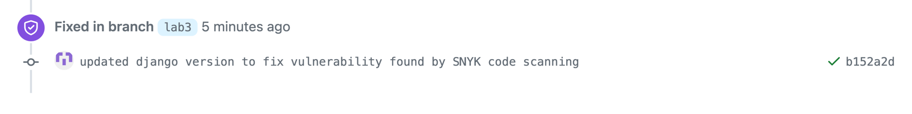

# Current Moscow time application

This application is using standard Python libraries `datetime` and `zoneinfo` to respond with current moscow time on a
simple GET / request. The application based on Django framework.

## How to run

### Prerequisite:

Django and Python installed ([installation guide](https://docs.djangoproject.com/en/4.2/intro/install/))

### Running from command line

```
cd app_python
python manage.py runserver
```

Server runs on default localhost path http://127.0.0.1:8000/ which can be opened in any browser. The page displays
current time in Moscow timezone.

## Docker

You can pull the latest version and **run** it by the following command:

```
docker run -it -p 8000:8000 klemencja/app_python
```

The application will be deployed on your http://127.0.0.1:8000/

To **build** the updated version you may change the directory to `core-course-labs` and run `docker build`

```
cd core-course-labs
docker build app_python -t app_python
```

To just **pull** an image from dockerhub you can use:

```
docker pull klemencja/app_python
``` 

## Unit tests

The project contains unit tests for main page view in the `test_views.py` file. To run it you can use the Pycharm `Run`
button as well as django command:
`python manage.py test`
It will find all the tests and run them.

## CI workflow

My CI workflow for the python app contains 2 main jobs with substeps:

1. Build and test app:
    - Performs checkout
    - Prepares python3 environment
    - install requirements via `pip`
    - Runs linters checks via `pylint` and `black`
    - Runs Django tests via `python manage.py test`
    - Performs SNYK code scanning and uploads its `.SARIF` report to github security 
2. Push to dockerhub
    - Performs checkout
    - Login to dockerhub on my personal account
    - Builds an application via Dockerfile
    - Uploads an application to [my dockerhub repository](https://hub.docker.com/repository/docker/klemencja/app_python)
      with `klemencja/app_python` tag

The second job needs complete passing of the first one to ensure invalid image won't be uploaded to dockerhub.

## SNYK Scanning

The first CI job `build-and-test` performs code scanning by SNYK. It already found one vulnerability and reported
it to github repository by SARIF file. The vunarability
report: https://github.com/Klemencya/core-course-labs/security/code-scanning/4.
I fixed this vulnerability by updating `Django` version to `4.1.11` as it was suggested by SNYK code scanning, and the
vulnerability alert was automatically closed:


To implement it I did **not** use ready [ci action for python](https://github.com/snyk/actions/tree/master/python-3.10),
because I would have to reinstall all the pip requirements again to ensure SNYK would find it in its Docker container.
Instead, I've installed the SNYK CLI ([via action](https://github.com/snyk/actions/blob/master/setup/action.yml))
and now my SNYK is using ready python environment with all needed dependencies installed.