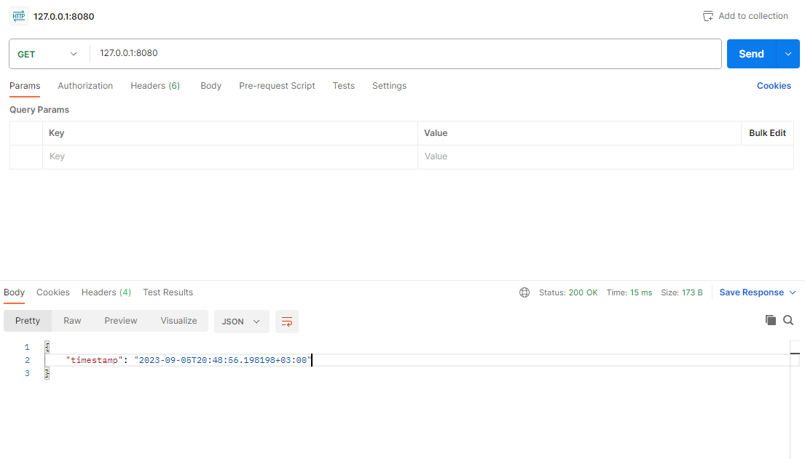

# Simple current time web application

## Description
This web application simply returns current UTC+3 (Moscow) time


## Installation
### System requirements
- Python 3.10 or newer
- Poetry (https://python-poetry.org)

### Installing project dependencies
```bash
poetry install
```

## Running the application
Run the command below
```bash
poetry run uvicorn src.app:app --host 0.0.0.0 --port 8080
```

Now you can access the web service on `127.0.0.1:8080`

## Running tests
Install test dependencies
```bash
poetry install --with=test
```
Run the tests with
```bash
poetry run pytest
```

## If you have any further questions
You can reach out to me via [email](mailto:add4che@gmail.com)
