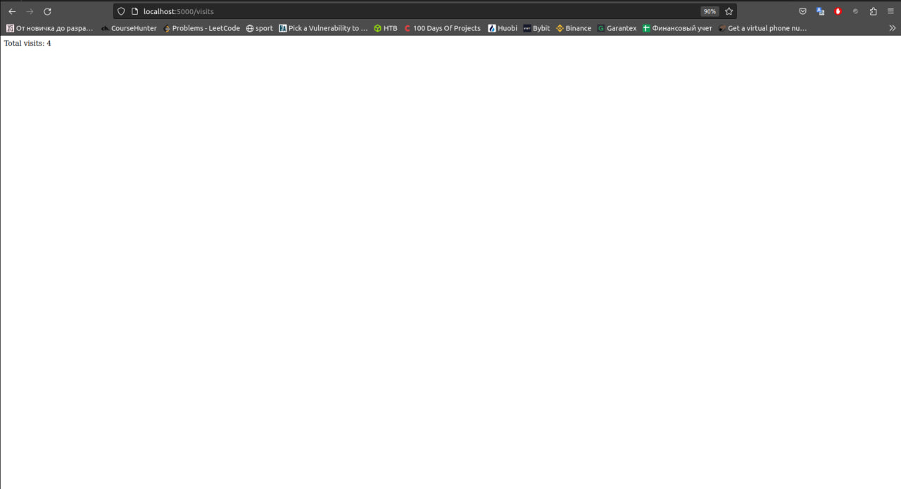

# My Python Web App

This is a simple Python web application that displays the current time in Moscow and keeps track of the number of visits.

## Overview

```python
from flask import Flask
from datetime import datetime
import pytz
```

### Code here imports libraries that will be used later

``` python
app = Flask(__name__)

# Initialize visit counter
visits_count = 0
```

### Initializing a Flask application and the visit counter

``` python
def get_visits():
    counter = 0
    try:
        counter = int(open('visits.txt', 'r').read().strip())
    except Exception:
        pass

    return counter

@app.route('/')
```

### Defining a route and function to display time and increment visits

```python
def show_time():
    global visits_count
    moscow_tz = pytz.timezone('Europe/Moscow')
    current_time = datetime.now(moscow_tz).strftime('%H:%M:%S')
    visits_count += 1  # Increment visit count for each request
    with open('visits.txt', 'w') as visits_file:  # Save visit count to a file
        visits_file.write(str(visits_count))
    return f'Current time in Moscow: {current_time}'
```

### Function to get current time in Moscow and increment visit count

```python
@app.route('/visits')
def visits():
    return f'Total visits: {get_visits()}'

```

### Route to display the total visit count

``` python
if __name__ == '__main__':
    app.run(debug=True, host='0.0.0.0')
```

### Here I just run my application  

## Usage

1. Install the required dependencies (Flask).
2. Run the application using `python app.py`.
3. Open your web browser and visit `http://localhost:5000` to see the current time in Moscow.
4. Access `http://localhost:5000/visits` to view the total number of visits.

## Here are some screenshots




## Unit Tests

Unit tests have been implemented to ensure the correctness of the application's functionality. These tests focus on individual components and their behavior. The following unit tests have been created:

1. Test Home Route: This test verifies that the home route ('/') returns a valid response containing the current time in Moscow.

To run the unit tests, use the following command:

`python -m pytest`

Ensure that the required testing dependencies are installed.

## Docker Containerization

This Docker container runs the Python web application and displays the current time in Moscow. The application is packaged and isolated within a Docker container.

To build the Docker image for our application, follow these steps:

1. Open your terminal and navigate to the app_python directory where the Dockerfile is located.

2. Run the following command to build the Docker image. Replace khays-python-app with your preferred image name:

    `docker build -t khays-python-app .`

### Pulling the Docker Image

If you want to pull the Docker image from Docker Hub instead of building it locally, you can use the following command:

`docker pull khays/khays-python-app:latest`

### Running the Docker Container

Once you have the Docker image built or pulled, you can run the Docker container with the following command:

`docker run -p 5000:5000 khays-python-app`

This command maps port 5000 on your local machine to port 5000 within the Docker container. You can access the application by opening a web browser and navigating to `http://localhost:5000`.

## Continuous Integration (CI) Workflowusername


This project includes a Continuous Integration (CI) workflow to ensure code quality and consistency. The CI workflow performs the following steps:

1. Dependencies: Checks and installs project dependencies, ensuring all required packages are available.
2. Linting: Lints the codebase using Flake8 to maintain code quality and consistency.
3. Unit Tests: Runs unit tests to verify the correctness of the application's functionality.
4. Docker Build: Builds a Docker container image for the application.
5. Docker Push: Pushes the Docker image to the Docker Hub registry.

## Author

Khabib Khaysadykov
