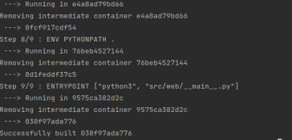

[![Contributors][contributors-shield]][contributors-url]

[](https://github.com/IrSokolova/DevOps_labs/actions/workflows/project.yaml)

<p align="center">
  <a href="https://github.com/IrSokolova/DevOps_labs">
    
  </a>

  <h3 align="center">Moscow Clock</h3>

  <p align="center">
    Now you can see Moscow time any time you want
  </p>


<details open="open">
  <summary><h2 style="display: inline-block">Table of Contents</h2></summary>
  <ol>
    <li>
      <a href="#about-the-project">About The Project</a>
      <ul>
        <li><a href="#built-with">Built With</a></li>
      </ul>
    </li>
    <li>
      <a href="#getting-started">Getting Started</a>
      <ul>
        <li><a href="#installation">Installation</a></li>
      </ul>
      <ul>
        <li><a href="#docker">Docker</a></li>
      </ul>
      <ul>
        <li><a href="#unit-tests">Unit Tests</a></li>
      </ul>
    </li>
    <li>
      <a href="#usage">Usage</a>
    </li>
    <li><a href="#contact">Contact</a></li>
  </ol>
</details>

## About The Project

This is a web application to always be aware of the current time in Moscow.

### Built With

- [Python3](https://www.python.org/)
- [Flask](https://flask.palletsprojects.com/en/latest/)

## Getting Started

To get a local copy up and running follow these simple steps.

### Installation

1. Clone the repo
   ```sh
   git clone https://github.com/IrSokolova/DevOps_labs.git
   ```
2. Install Python packages
   ```sh
   pip install Flask
   ```

3. Run main script
    ```sh
   main.py
   ```
### Docker
1. To build the image locally use command:
```
docker build . -t your_tag
```
2. Then use run command:
```
docker run -d -p 5000:5000 your_tag
```   
3. To pull the image from the Docker Hub use command:
```
docker image pull irsokolova/time_app
```
4. Then you can check if the image was downloaded by command:
```
docker images
```
5. After making sure it was downloaded you can run it:
```
docker run -d -p 5000:5000 irsokolova/time_app
```

After running, you can check if the app is working by going to http://localhost:5000/ 

### Unit Tests

To check the correctness of the app, you can run tests with the command:
```
tests.py
```

## Usage
   Follow the link from the terminal

   Now you can see the time and refresh page if needed

   


## Continuous Integration

This project has CI workflow on Github actions with following steps:

- Installing dependencies
- Linting
- Testing
- Logging in to DockerHub
- Build & Push docker image to DockerHub


[contributors-shield]: https://img.shields.io/github/contributors/IrSokolova/DevOps_labs.svg?style=for-the-badge
[contributors-url]: https://github.com/IrSokolova/DevOps_labs/graphs/contributors