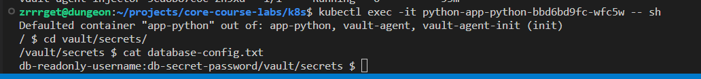
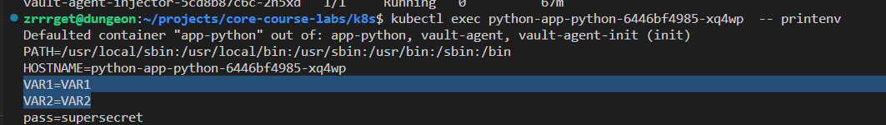

# Task 1
```
zrrrget@dungeon:~/projects/core-course-labs/k8s$ kubectl create secret generic new-secret --from-literal=scr='supersecret'
secret/new-secret created
zrrrget@dungeon:~/projects/core-course-labs/k8s$ kubectl get secret new-secret
NAME         TYPE     DATA   AGE
new-secret   Opaque   1      26s
zrrrget@dungeon:~/projects/core-course-labs/k8s$ kubectl get secret new-secret -o jsonpath='{.data.scr}' | base64 -d
supersecretzrrrget@dungeon:~/projects/core-course-labs/k8s$ 
```

```
zrrrget@dungeon:~/projects/core-course-labs/k8s$ kubectl exec python-app-python-5c9c9db8fc-2cdhw  -- printenv | grep MY_PASS
MY_PASS=supersecret
zrrrget@dungeon:~/projects/core-course-labs/k8s$ 
```
# Task 2


# bonus

