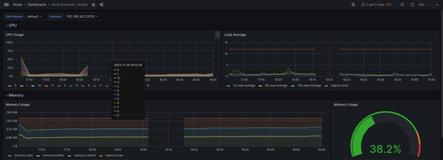

# Secrets (lab 11)

## Task 1

### kubectl secret creation

```bash
kubectl apply -f secret-base.yaml 
secret/secret-base created

kubectl get secrets secret-base -o yaml
apiVersion: v1
data:
  password: cGFzc3dvcmQ=
kind: Secret
metadata:
  annotations:
    kubectl.kubernetes.io/last-applied-configuration: |
      {"apiVersion":"v1","data":{"password":"cGFzc3dvcmQ="},"kind":"Secret","metadata":{"annotations":{},"name":"secret-base","namespace":"default"},"type":"Opaque"}
  creationTimestamp: "2023-11-03T12:04:33Z"
  name: secret-base
  namespace: default
  resourceVersion: "451"
  uid: 20a2c303-9643-4fd8-bc70-379cccfb14e5
type: Opaque

kubectl get secrets secret-base -o jsonpath='{.data.password}' | base64 -d
password
```

### helm secret creation

```bash
helm install web .

kubectl get svc,deployments,secrets
NAME                               TYPE        CLUSTER-IP       EXTERNAL-IP   PORT(S)             AGE
service/kubernetes                 ClusterIP   10.96.0.1        <none>        443/TCP             19m
service/vault                      ClusterIP   10.110.126.166   <none>        8200/TCP,8201/TCP   14m
service/vault-agent-injector-svc   ClusterIP   10.104.44.10     <none>        443/TCP             14m
service/vault-internal             ClusterIP   None             <none>        8200/TCP,8201/TCP   14m
service/web-app-helm               ClusterIP   10.96.211.191    <none>        80/TCP              104s

NAME                                   READY   UP-TO-DATE   AVAILABLE   AGE
deployment.apps/vault-agent-injector   1/1     1            1           14m
deployment.apps/web-app-helm           1/1     1            1           104s

NAME                                 TYPE                 DATA   AGE
secret/secret-base                   Opaque               1      104s
secret/sh.helm.release.v1.vault.v1   helm.sh/release.v1   1      14m
secret/sh.helm.release.v1.web.v1     helm.sh/release.v1   1      2m7s

kubectl get pods -A
NAMESPACE     NAME                                    READY   STATUS    RESTARTS        AGE
default       vault-0                                 1/1     Running   0               13m
default       vault-agent-injector-5cd8b87c6c-kpkpr   1/1     Running   0               13m
default       web-app-helm-76b449c4f7-55fmc           1/1     Running   0               67s
kube-system   coredns-5d78c9869d-bf7ps                1/1     Running   0               18m
kube-system   etcd-minikube                           1/1     Running   0               18m
kube-system   kube-apiserver-minikube                 1/1     Running   0               18m
kube-system   kube-controller-manager-minikube        1/1     Running   1 (19m ago)     18m
kube-system   kube-proxy-bf8kt                        1/1     Running   0               18m
kube-system   kube-scheduler-minikube                 1/1     Running   0               18m
kube-system   storage-provisioner                     1/1     Running   3 (3m44s ago)   17m

kubectl exec web-app-helm-76b449c4f7-55fmc -- env | grep PASSWORD
PASSWORD=password
```

## Task 2

### Vault installed

```bash
kubectl get pods -n default
NAMESPACE     NAME                                    READY   STATUS    RESTARTS        AGE
default       vault-0                                 1/1     Running   0               13m
default       vault-agent-injector-5cd8b87c6c-kpkpr   1/1     Running   0               13m
```

### Secret creation

```bash
kubectl exec -it vault-0 -- /bin/sh
/ $ vault secrets enable -path=internal kv-v2
Success! Enabled the kv-v2 secrets engine at: internal/
/ $ vault kv put internal/database/config username="db-readonly-username" password="db-secret-password"
======== Secret Path ========
internal/data/database/config

======= Metadata =======
Key                Value
---                -----
created_time       2023-11-03T12:30:29.984563447Z
custom_metadata    <nil>
deletion_time      n/a
destroyed          false
version            1
/ $ vault kv get internal/database/config
======== Secret Path ========
internal/data/database/config

======= Metadata =======
Key                Value
---                -----
created_time       2023-11-03T12:30:29.984563447Z
custom_metadata    <nil>
deletion_time      n/a
destroyed          false
version            1

====== Data ======
Key         Value
---         -----
password    db-secret-password
username    db-readonly-username
```

### SA authentification

```bash
/ $ vault auth enable kubernetes
Success! Enabled kubernetes auth method at: kubernetes/
/ $ vault write auth/kubernetes/config \
>       kubernetes_host="https://$KUBERNETES_PORT_443_TCP_ADDR:443"
Success! Data written to: auth/kubernetes/config
/ $ vault policy write internal-app - <<EOF
> path "internal/data/database/config" {
>    capabilities = ["read"]
> }
> EOF
Success! Uploaded policy: internal-app
/ $ vault write auth/kubernetes/role/internal-app \
>       bound_service_account_names=web-app-helm \
>       bound_service_account_namespaces=default \
>       policies=internal-app \
>       ttl=24h
Success! Data written to: auth/kubernetes/role/internal-app
```

So here we changed `bound_service_account_names` to correct service account created by Helm chart.

### Verifying

```bash
kubectl get sa -n default
NAME                   SECRETS   AGE
default                0         39m
vault                  0         35m
vault-agent-injector   0         35m
web-app-helm           0         5m7s

kubectl get pods -A
NAMESPACE     NAME                                    READY   STATUS    RESTARTS      AGE
default       postinstall-hook                        1/1     Running   0             9s
default       vault-0                                 1/1     Running   0             30m
default       vault-agent-injector-5cd8b87c6c-kpkpr   1/1     Running   0             30m
default       web-app-helm-84699c4979-cbv28           2/2     Running   0             9s
kube-system   coredns-5d78c9869d-bf7ps                1/1     Running   0             34m
kube-system   etcd-minikube                           1/1     Running   0             35m
kube-system   kube-apiserver-minikube                 1/1     Running   0             35m
kube-system   kube-controller-manager-minikube        1/1     Running   1 (35m ago)   35m
kube-system   kube-proxy-bf8kt                        1/1     Running   0             34m
kube-system   kube-scheduler-minikube                 1/1     Running   0             35m
kube-system   storage-provisioner                     1/1     Running   3 (20m ago)   34m

kubectl exec web-app-helm-84699c4979-cbv28 -it /bin/sh
Defaulted container "app-helm" out of: app-helm, vault-agent, vault-agent-init (init)
# cat /vault/secrets/database-config.txt
data: map[password:db-secret-password username:db-readonly-username]
metadata: map[created_time:2023-11-03T12:30:29.984563447Z custom_metadata:<nil> deletion_time: destroyed:false version:1]
```

## Bonus

### Limits configured

```bash
kubectl describe pod web-app-helm-565996b579-vt7n2
Name:             web-app-helm-565996b579-vt7n2
Namespace:        default
Priority:         0
Service Account:  web-app-helm
Node:             minikube/192.168.49.2
Start Time:       Fri, 03 Nov 2023 16:23:16 +0300
Labels:           app.kubernetes.io/instance=web
                  app.kubernetes.io/managed-by=Helm
                  app.kubernetes.io/name=app-helm
                  app.kubernetes.io/version=1.16.0
                  helm.sh/chart=app-helm-0.1.0
                  pod-template-hash=565996b579
Annotations:      vault.hashicorp.com/agent-inject: true
                  vault.hashicorp.com/agent-inject-secret-database-config.txt: internal/data/database/config
                  vault.hashicorp.com/agent-inject-status: injected
                  vault.hashicorp.com/role: internal-app
Status:           Running
IP:               10.244.0.14
IPs:
  IP:           10.244.0.14
Controlled By:  ReplicaSet/web-app-helm-565996b579
Init Containers:
  vault-agent-init:
    Container ID:  docker://0ac2d09e6a4b9bac8511a4875635a1262722244cc03ea957f34520082aadfea4
    Image:         hashicorp/vault:1.15.1
    Image ID:      docker-pullable://hashicorp/vault@sha256:6a96634beeda3f989a4d9d85a951fe835fe8504e4dae5b46610f7c4104e8388b
    Port:          <none>
    Host Port:     <none>
    Command:
      /bin/sh
      -ec
    Args:
      echo ${VAULT_CONFIG?} | base64 -d > /home/vault/config.json && vault agent -config=/home/vault/config.json
    State:          Terminated
      Reason:       Completed
      Exit Code:    0
      Started:      Fri, 03 Nov 2023 16:23:25 +0300
      Finished:     Fri, 03 Nov 2023 16:23:26 +0300
    Ready:          True
    Restart Count:  0
    Limits:
      cpu:     500m
      memory:  128Mi
    Requests:
      cpu:     250m
      memory:  64Mi
    Environment:
      NAMESPACE:         default (v1:metadata.namespace)
      HOST_IP:            (v1:status.hostIP)
      POD_IP:             (v1:status.podIP)
      VAULT_LOG_LEVEL:   info
      VAULT_LOG_FORMAT:  standard
      VAULT_CONFIG:      eyJhdXRvX2F1dGgiOnsibWV0aG9kIjp7InR5cGUiOiJrdWJlcm5ldGVzIiwibW91bnRfcGF0aCI6ImF1dGgva3ViZXJuZXRlcyIsImNvbmZpZyI6eyJyb2xlIjoiaW50ZXJuYWwtYXBwIiwidG9rZW5fcGF0aCI6Ii92YXIvcnVuL3NlY3JldHMva3ViZXJuZXRlcy5pby9zZXJ2aWNlYWNjb3VudC90b2tlbiJ9fSwic2luayI6W3sidHlwZSI6ImZpbGUiLCJjb25maWciOnsicGF0aCI6Ii9ob21lL3ZhdWx0Ly52YXVsdC10b2tlbiJ9fV19LCJleGl0X2FmdGVyX2F1dGgiOnRydWUsInBpZF9maWxlIjoiL2hvbWUvdmF1bHQvLnBpZCIsInZhdWx0Ijp7ImFkZHJlc3MiOiJodHRwOi8vdmF1bHQuZGVmYXVsdC5zdmM6ODIwMCJ9LCJ0ZW1wbGF0ZSI6W3siZGVzdGluYXRpb24iOiIvdmF1bHQvc2VjcmV0cy9kYXRhYmFzZS1jb25maWcudHh0IiwiY29udGVudHMiOiJ7eyB3aXRoIHNlY3JldCBcImludGVybmFsL2RhdGEvZGF0YWJhc2UvY29uZmlnXCIgfX17eyByYW5nZSAkaywgJHYgOj0gLkRhdGEgfX17eyAkayB9fToge3sgJHYgfX1cbnt7IGVuZCB9fXt7IGVuZCB9fSIsImxlZnRfZGVsaW1pdGVyIjoie3siLCJyaWdodF9kZWxpbWl0ZXIiOiJ9fSJ9XSwidGVtcGxhdGVfY29uZmlnIjp7ImV4aXRfb25fcmV0cnlfZmFpbHVyZSI6dHJ1ZX19
    Mounts:
      /home/vault from home-init (rw)
      /var/run/secrets/kubernetes.io/serviceaccount from kube-api-access-q98k6 (ro)
      /vault/secrets from vault-secrets (rw)
Containers:
  app-helm:
    Container ID:   docker://85b32379a192e529e26be598345598a1ba705e42167f8b126b4f069b14110108
    Image:          nginx:1.16.0
    Image ID:       docker-pullable://nginx@sha256:3e373fd5b8d41baeddc24be311c5c6929425c04cabf893b874ac09b72a798010
    Port:           80/TCP
    Host Port:      0/TCP
    State:          Running
      Started:      Fri, 03 Nov 2023 16:23:26 +0300
    Ready:          True
    Restart Count:  0
    Limits:
      cpu:     200m
      memory:  256Mi
    Requests:
      cpu:      100m
      memory:   128Mi
    Liveness:   http-get http://:http/ delay=0s timeout=1s period=10s #success=1 #failure=3
    Readiness:  http-get http://:http/ delay=0s timeout=1s period=10s #success=1 #failure=3
    Environment:
      PASSWORD:  <set to the key 'password' in secret 'secret-base'>  Optional: false
    Mounts:
      /var/run/secrets/kubernetes.io/serviceaccount from kube-api-access-q98k6 (ro)
      /vault/secrets from vault-secrets (rw)
  vault-agent:
    Container ID:  docker://96a2ca162df73949d9bfe5175b2bd6b32d35dc3b6f34a4b300a78a9db30bc0c4
    Image:         hashicorp/vault:1.15.1
    Image ID:      docker-pullable://hashicorp/vault@sha256:6a96634beeda3f989a4d9d85a951fe835fe8504e4dae5b46610f7c4104e8388b
    Port:          <none>
    Host Port:     <none>
    Command:
      /bin/sh
      -ec
    Args:
      echo ${VAULT_CONFIG?} | base64 -d > /home/vault/config.json && vault agent -config=/home/vault/config.json
    State:          Running
      Started:      Fri, 03 Nov 2023 16:23:27 +0300
    Ready:          True
    Restart Count:  0
    Limits:
      cpu:     500m
      memory:  128Mi
    Requests:
      cpu:     250m
      memory:  64Mi
    Environment:
      NAMESPACE:         default (v1:metadata.namespace)
      HOST_IP:            (v1:status.hostIP)
      POD_IP:             (v1:status.podIP)
      VAULT_LOG_LEVEL:   info
      VAULT_LOG_FORMAT:  standard
      VAULT_CONFIG:      eyJhdXRvX2F1dGgiOnsibWV0aG9kIjp7InR5cGUiOiJrdWJlcm5ldGVzIiwibW91bnRfcGF0aCI6ImF1dGgva3ViZXJuZXRlcyIsImNvbmZpZyI6eyJyb2xlIjoiaW50ZXJuYWwtYXBwIiwidG9rZW5fcGF0aCI6Ii92YXIvcnVuL3NlY3JldHMva3ViZXJuZXRlcy5pby9zZXJ2aWNlYWNjb3VudC90b2tlbiJ9fSwic2luayI6W3sidHlwZSI6ImZpbGUiLCJjb25maWciOnsicGF0aCI6Ii9ob21lL3ZhdWx0Ly52YXVsdC10b2tlbiJ9fV19LCJleGl0X2FmdGVyX2F1dGgiOmZhbHNlLCJwaWRfZmlsZSI6Ii9ob21lL3ZhdWx0Ly5waWQiLCJ2YXVsdCI6eyJhZGRyZXNzIjoiaHR0cDovL3ZhdWx0LmRlZmF1bHQuc3ZjOjgyMDAifSwidGVtcGxhdGUiOlt7ImRlc3RpbmF0aW9uIjoiL3ZhdWx0L3NlY3JldHMvZGF0YWJhc2UtY29uZmlnLnR4dCIsImNvbnRlbnRzIjoie3sgd2l0aCBzZWNyZXQgXCJpbnRlcm5hbC9kYXRhL2RhdGFiYXNlL2NvbmZpZ1wiIH19e3sgcmFuZ2UgJGssICR2IDo9IC5EYXRhIH19e3sgJGsgfX06IHt7ICR2IH19XG57eyBlbmQgfX17eyBlbmQgfX0iLCJsZWZ0X2RlbGltaXRlciI6Int7IiwicmlnaHRfZGVsaW1pdGVyIjoifX0ifV0sInRlbXBsYXRlX2NvbmZpZyI6eyJleGl0X29uX3JldHJ5X2ZhaWx1cmUiOnRydWV9fQ==
    Mounts:
      /home/vault from home-sidecar (rw)
      /var/run/secrets/kubernetes.io/serviceaccount from kube-api-access-q98k6 (ro)
      /vault/secrets from vault-secrets (rw)
Conditions:
  Type              Status
  Initialized       True 
  Ready             True 
  ContainersReady   True 
  PodScheduled      True 
Volumes:
  kube-api-access-q98k6:
    Type:                    Projected (a volume that contains injected data from multiple sources)
    TokenExpirationSeconds:  3607
    ConfigMapName:           kube-root-ca.crt
    ConfigMapOptional:       <nil>
    DownwardAPI:             true
  home-init:
    Type:       EmptyDir (a temporary directory that shares a pod's lifetime)
    Medium:     Memory
    SizeLimit:  <unset>
  home-sidecar:
    Type:       EmptyDir (a temporary directory that shares a pod's lifetime)
    Medium:     Memory
    SizeLimit:  <unset>
  vault-secrets:
    Type:        EmptyDir (a temporary directory that shares a pod's lifetime)
    Medium:      Memory
    SizeLimit:   <unset>
QoS Class:       Burstable
Node-Selectors:  <none>
Tolerations:     node.kubernetes.io/not-ready:NoExecute op=Exists for 300s
                 node.kubernetes.io/unreachable:NoExecute op=Exists for 300s
Events:
  Type    Reason     Age   From               Message
  ----    ------     ----  ----               -------
  Normal  Scheduled  91s   default-scheduler  Successfully assigned default/web-app-helm-565996b579-vt7n2 to minikube
  Normal  Pulled     87s   kubelet            Container image "hashicorp/vault:1.15.1" already present on machine
  Normal  Created    85s   kubelet            Created container vault-agent-init
  Normal  Started    82s   kubelet            Started container vault-agent-init
  Normal  Pulled     81s   kubelet            Container image "nginx:1.16.0" already present on machine
  Normal  Created    81s   kubelet            Created container app-helm
  Normal  Started    81s   kubelet            Started container app-helm
  Normal  Pulled     81s   kubelet            Container image "hashicorp/vault:1.15.1" already present on machine
  Normal  Created    81s   kubelet            Created container vault-agent
  Normal  Started    80s   kubelet            Started container vault-agent
```



Summary limit on pod was set correctly.

### Helpers

See [_helpers.tpl](app-helm/templates/_helpers.tpl#L64)

```bash
kubectl get pods -A
NAMESPACE     NAME                               READY   STATUS    RESTARTS      AGE
default       web-app-helm-7c7b598c98-ng7vs      1/1     Running   0             101s
kube-system   coredns-5d78c9869d-48cnn           1/1     Running   0             19m
kube-system   etcd-minikube                      1/1     Running   0             19m
kube-system   kube-apiserver-minikube            1/1     Running   0             19m
kube-system   kube-controller-manager-minikube   1/1     Running   0             19m
kube-system   kube-proxy-lxbxv                   1/1     Running   0             19m
kube-system   kube-scheduler-minikube            1/1     Running   0             19m
kube-system   storage-provisioner                1/1     Running   3 (89s ago)   19m

kubectl exec web-app-helm-7c7b598c98-ng7vs -- env | grep -E "password|token"
PASSWORD=password
TOKEN=token
```
