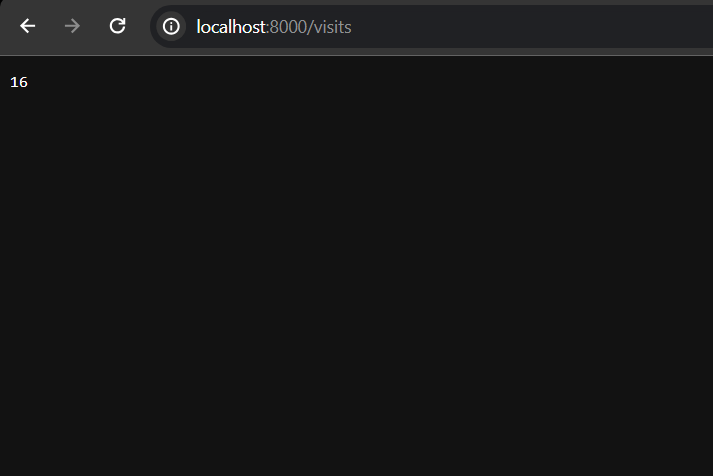

Updated python app and README.md, ansible



```sh
kubectl get pods
NAME                                 READY   STATUS      RESTARTS   AGE
postinstall-hook                     0/1     Completed   0          2m7s
preinstall-hook                      0/1     Completed   0          2m30s
python-python-app-74787b49dc-x95n2   1/1     Running     0          2m7s
```

```sh
kubectl exec python-python-app-74787b49dc-x95n2 -- cat /config.json
{ "check": "yes" }
```

```sh
kubectl describe po python-python-app-74787b49dc-x95n2
Name:             python-python-app-74787b49dc-x95n2
Namespace:        default
Priority:         0
Service Account:  internal-app
Node:             minikube/192.168.49.2
Start Time:       Sun, 26 Nov 2023 18:12:51 +0300
Labels:           app.kubernetes.io/instance=python
                  app.kubernetes.io/managed-by=Helm
                  app.kubernetes.io/name=python-app
                  app.kubernetes.io/version=1.16.0
                  helm.sh/chart=python-app-0.1.0
                  pod-template-hash=74787b49dc
Annotations:      <none>
Status:           Running
IP:               10.244.0.78
IPs:
  IP:           10.244.0.78
Controlled By:  ReplicaSet/python-python-app-74787b49dc
Containers:
  python-app:
    Container ID:   docker://14cf334f2c22334a97c72d71e9d2ae3d25151d7ca0c2de66ac56068add914283
    Image:          wareverdud/lab3:latest
    Image ID:       docker-pullable://wareverdud/lab3@sha256:a0b9aafef85c775dd9ee66148d6d8538912bb7e493651e329b6f8d7181dd86a1
    Port:           8000/TCP
    Host Port:      0/TCP
    State:          Running
      Started:      Sun, 26 Nov 2023 18:12:52 +0300
    Ready:          True
    Restart Count:  0
    Liveness:       http-get http://:http/ delay=0s timeout=1s period=10s #success=1 #failure=3
    Readiness:      http-get http://:http/ delay=0s timeout=1s period=10s #success=1 #failure=3
    Environment:
      MY_PASS:  <set to the key 'pass_data' in secret 'mysecret'>  Optional: false
    Mounts:
      /config.json from config (ro,path="config.json")
      /var/run/secrets/kubernetes.io/serviceaccount from kube-api-access-5psb5 (ro)
Conditions:
  Type              Status
  Initialized       True
  Ready             True
  ContainersReady   True
  PodScheduled      True
Volumes:
  config:
    Type:      ConfigMap (a volume populated by a ConfigMap)
    Name:      my-configmap
    Optional:  false
  kube-api-access-5psb5:
    Type:                    Projected (a volume that contains injected data from multiple sources)
    TokenExpirationSeconds:  3607
    ConfigMapName:           kube-root-ca.crt
    ConfigMapOptional:       <nil>
    DownwardAPI:             true
QoS Class:                   BestEffort
Node-Selectors:              <none>
Tolerations:                 node.kubernetes.io/not-ready:NoExecute op=Exists for 300s
                             node.kubernetes.io/unreachable:NoExecute op=Exists for 300s
Events:
  Type     Reason     Age   From               Message
  ----     ------     ----  ----               -------
  Normal   Scheduled  14m   default-scheduler  Successfully assigned default/python-python-app-74787b49dc-x95n2 to minikube
  Normal   Pulled     14m   kubelet            Container image "wareverdud/lab3:latest" already present on machine
  Normal   Created    14m   kubelet            Created container python-app
  Normal   Started    14m   kubelet            Started container python-app
  Warning  Unhealthy  14m   kubelet            Readiness probe failed: Get "http://10.244.0.78:8000/": dial tcp 10.244.0.78:8000: connect: connection refused
```