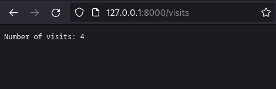
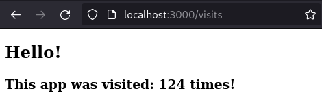

# ConfigMap
### Updatina apps
New endpoint: `/visits` was added to both Python and Golang apps. It returns number of visits to the app.




Visits info is stored in `visits` file, which is mounted to the container as a volume. Here is the content of docker-compose template file:
```yaml
services:
  {{ service_name }}:
    ...
    volumes:
      - {{ service_name }}_data:/app/data

volumes:
  {{ service_name }}_data:
```
So persistence logic was implemented in both apps.

### ConfigMap


    Create a files folder with a config.json file.
    Populate config.json with data in JSON format.
    Use Helm to mount config.json:
        Create a configMap manifest, extracting data from config.json using .Files.Get.
        Update deployment.yaml with Volumes and VolumeMounts.
            Example
        Install the updated Helm chart and verify success:
            Retrieve the list of pods: kubectl get po.
            Use the pod name as proof of successful deployment.
            Check the ConfigMap inside the pod, e.g., kubectl exec demo-758cc4d7c4-cxnrn -- cat /config.json.

Creating `config.json` file:
```json
{
    "var1": "value1",
    "var2": "value2"
}
```
Creating ConfigMap manifest using `.Files.Get` which returns the contents of config.json file:
```yaml
apiVersion: v1
kind: ConfigMap
metadata:
  name: chart-configmap
data:
  config.json: |-
{{ .Files.Get "files/config.json" | nindent 4}}
```
Since `deployment.yaml` file already has `volumes` and `volumeMounts` sections, so only need to change `values.yaml` file. I will mount `config.json` file to `/app/data` directory:
```yaml
volumes:
  - name: app-config-volume
    configMap:
      name: chart-configmap
volumeMounts:
  - name: app-config-volume
    mountPath: /app/data
```
### Testing
Start application:
```bash
(venv) vladislav5ik@AsusTuf:~/code-iu/core-course-labs/k8s$ helm install python-with-del-hooks app-python-chart/
NAME: python-with-del-hooks
LAST DEPLOYED: Tue Nov 21 00:07:20 2023
NAMESPACE: default
STATUS: deployed
REVISION: 1
NOTES:
1. Get the application URL by running these commands:
  export NODE_PORT=$(kubectl get --namespace default -o jsonpath="{.spec.ports[0].nodePort}" services python-with-del-hooks-app-python-chart)
  export NODE_IP=$(kubectl get nodes --namespace default -o jsonpath="{.items[0].status.addresses[0].address}")
  echo http://$NODE_IP:$NODE_PORT
```

Output of `kubectl get po` and `kubectl get configmap` commands:
```bash
vladislav5ik@AsusTuf:~$ kubectl get po
NAME                                                     READY   STATUS    RESTARTS        AGE
golang-with-del-hooks-app-golang-chart-d84b4c84d-26jhk   2/2     Running   2 (5d23h ago)   5d23h
python-with-del-hooks-app-python-chart-6cc8f5c6f-tx9j6   2/2     Running   0               9m58s
vault-0                                                  1/1     Running   4 (5d23h ago)   6d22h
vault-agent-injector-5cd8b87c6c-7ktn5                    1/1     Running   1 (5d23h ago)   6d
vladislav5ik@AsusTuf:~$ kubectl get configmap
NAME               DATA   AGE
chart-configmap    1      10m
kube-root-ca.crt   1      14d
```
Checking `config.json` file inside the pod:
```bash
vladislav5ik@AsusTuf:~$ kubectl exec -it python-with-del-hooks-app-python-chart-6cc8f5c6f-tx9j6 -- cat /app/data/config.json
Defaulted container "app-python-chart" out of: app-python-chart, vault-agent

{
    "var1": "value1",
    "var2": "value2"
}
```

### ConfigMap via Environment Variables
Creating configmap for environment variables:
```yaml
apiVersion: v1
kind: ConfigMap
metadata:
  name: chart-configmap-envfrom
data:
  somekey1: "somevalue1"
  somekey2: "somevalue2"
  somekey3: "somevalue3"
  somekey4: "somevalue4"
```
### Updating deployment.yaml
To link environment variables from configmap to deployment.yaml file, need to add `envFrom` section:
```yaml
          envFrom:
            - configMapRef:
                name: chart-configmap-envfrom
```
### Testing
Output of `kubectl get po` command:
```bash
vladislav5ik@AsusTuf:~$ kubectl get po
NAME                                                      READY   STATUS    RESTARTS        AGE
golang-with-del-hooks-app-golang-chart-d84b4c84d-26jhk    2/2     Running   2 (5d23h ago)   6d
python-with-del-hooks-app-python-chart-7756769987-5tvsv   2/2     Running   0               80s
vault-0                                                   1/1     Running   4 (5d23h ago)   6d22h
vault-agent-injector-5cd8b87c6c-7ktn5                     1/1     Running   1 (5d23h ago)   6d
```
Checking new environment variables inside the pod:
```bash
vladislav5ik@AsusTuf:~$ kubectl exec -it python-with-del-hooks-app-python-chart-7756769987-5tvsv -- env | grep some
Defaulted container "app-python-chart" out of: app-python-chart, vault-agent
somekey4=somevalue4
somekey1=somevalue1
somekey2=somevalue2
somekey3=somevalue3
```
Output of `kubectl get configmap` command:
```bash
vladislav5ik@AsusTuf:~$ kubectl get configmap
NAME                      DATA   AGE
chart-configmap           1      2m57s
chart-configmap-envfrom   4      2m57s
kube-root-ca.crt          1      14d
```
