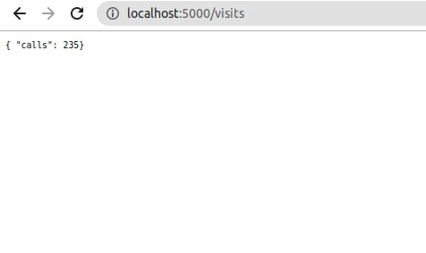
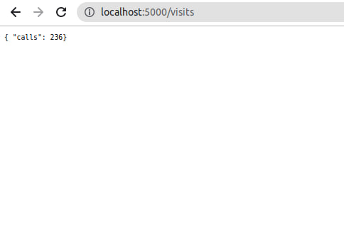
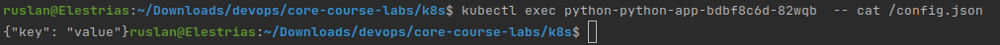
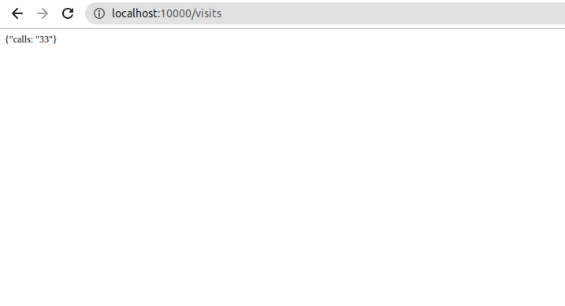
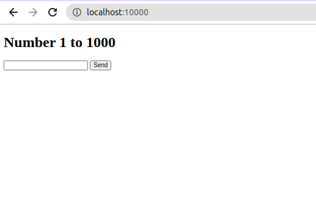
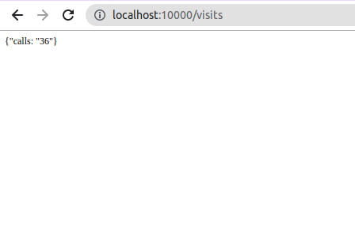
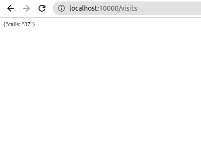
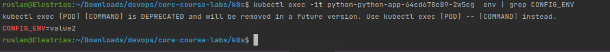

# Task 1
fixes for python app

```python
try:
    with open("./volume/calls.db", 'r') as file:
        self.calls = int(file.read())
except FileNotFoundError:
    self.calls = 0
```

```python
async def get_time(self, request) -> web.Response:
    self.calls += 1
    with open("./volume/calls.db", 'w') as file:
        print(self.calls, file=file)
    time: str = await self._get_formatted_time(self._time_tracker.get_timezoned_current_time())
    return web.Response(text=f'{time}')
```
Also I have extended docker-compose template for ansible to support deployment with volumes 

```yml
version: "3.7"

x-logging: &default-logging
  logging:
    driver: "json-file"
    options:
      max-size: "50m"
      max-file: "4"
    tag: "{{.ImageName}}|{{.Name}}|{{.ImageFullID}}|{{.FullID}}"

services:
  '{{ app_name }}':
    <<: *default-logging
    image:  '{{ app_image }}'
    restart: always
    container_name: '{{ app_name }}'
    ports:
        - '{{ external_port }}:{{ internal_port }}'

    healthcheck:
        test:
            - CMD-SHELL
            - curl --fail http://localhost:{{external_port}} || exit 1
        timeout: 10s
        interval: 1m
        retries: 5
    volumes:
        - '{{ app_name }}_volume:/app/volume/'

volumes:
  '{{ app_name }}_volume:'
```
Resulting compose
``` yml
services:
  app_python:
    image:  dashvayet/app_python:latest
    restart: always
    container_name: app_python
    user: root
    ports:
        - 5000:5000
    healthcheck:
        test:
            - CMD-SHELL
            - curl --fail http://localhost:5000 || exit 1
        timeout: 10s
        interval: 1m
        retries: 5
    volumes:
        - app_python_volume:/app/volume/
volumes:
    app_python_volume:
```

Starting docker compose
```
ruslan@Elestrias:~/Downloads/devops/core-course-labs/k8s$ docker ps -a
CONTAINER ID   IMAGE                                 COMMAND                  CREATED          STATUS                             PORTS                                                                                                                                  NAMES
33c5b2f63ab1   dashvayet/app_python:latest           "python3 src/web/__m…"   18 seconds ago   Up 17 seconds (health: starting)   0.0.0.0:5000->5000/tcp, :::5000->5000/tcp                                                                                              app_python
```



Stopping compose
```
ruslan@Elestrias:~/Downloads/devops/core-course-labs/k8s$ docker-compose down
Stopping app_cplusplus ... done
Removing app_python    ... done
Removing app_cplusplus ... done
Removing network k8s_default
```
```
docker-compose kill
```
Starting again and observe that counter persist

# Task 2
1. Install modified helm chart
2. Test po
```
kubectl get po 
```
```
NAME                                    READY   STATUS    RESTARTS        AGE
python-python-app-bdbf8c6d-82wqb        1/1     Running   0               85s
python-python-app-bdbf8c6d-j7nlj        1/1     Running   0               85s
python-python-app-bdbf8c6d-jvlk5        1/1     Running   0               85s
vault-0                                 1/1     Running   4 (7m7s ago)    7d17h
vault-agent-injector-5cd8b87c6c-hcw9q   1/1     Running   4 (8m51s ago)   7d17h
```
3. Exec to verify that config is present
```
kubectl exec python-python-app-bdbf8c6d-82wqb  -- cat /config.json
```
```
{"key": "value"}
```


# Bonus task
## Extending persistence for extra app
Read at the counter at the beginning
```
if (fileRead.is_open()){
        while (getline(fileRead,line) ){
            counter = std::stoi(line);
        }
        fileRead.close();
    }
```

Write on '/' call
```cpp
    ++counter;
    std::ofstream myfile;
    myfile.open("/startServer/volume/сalls.db");
    myfile << counter;
```

Endpoint handler
```
else if(path.find("/visits") != std::string::npos){
            std::string response = "HTTP/1.1 200 OK\r\n"
                                   "Content-Type: text/html\r\n\r\n{\"calls: \"" + std::to_string(counter) + "\"}";
            boost::asio::write(socket, boost::asio::buffer(response));
```

```
docker ps -a
```
```
3f7e758d6178   dashvayet/app_cplusplus:latest        "./startServer 10000"    16 minutes ago   Up 16 minutes               0.0.0.0:10000->10000/tcp, :::10000->10000/tcp                                                                                          app_cplusplus
```

Results:





Persistence remains - task is done


## Adding env via configmap
```
kubectl get configmap
```
```
NAME               DATA   AGE
kube-root-ca.crt   1      21d
myconfigmap        2      2m1s
```
```
 kubectl get po
```
```
NAME                                    READY   STATUS    RESTARTS       AGE
python-python-app-64cd678c89-2w5cg      1/1     Running   0              48s
python-python-app-64cd678c89-546ls      1/1     Running   0              48s
python-python-app-64cd678c89-sh5h8      1/1     Running   0              48s
vault-0                                 1/1     Running   4 (3h5m ago)   7d20h
vault-agent-injector-5cd8b87c6c-hcw9q   1/1     Running   4 (3h6m ago)   7d20h
```
```
kubectl exec -it python-python-app-64cd678c89-2w5cg  env | grep CONFIG_ENV
```
```
kubectl exec [POD] [COMMAND] is DEPRECATED and will be removed in a future version. Use kubectl exec [POD] -- [COMMAND] instead.
CONFIG_ENV=value2
```
