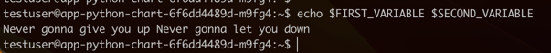

## ConfigMap
I added `config.json` file to `app-python/files` and added its path to `values.yaml` by key `config.file.path`.
Then I created `config.yaml` and specified configMap data by helm template: `{{- $.Files.Get .Values.config.file.path -}}`. 


After chart installation I checked if the pod is running:

`kubectl get po`
```
NAME                                    READY   STATUS    RESTARTS      AGE
app-python-chart-776b9c4fd6-2tbgq       1/1     Running   0             20s
vault-0                                 1/1     Running   4 (52m ago)   8d
vault-agent-injector-5cd8b87c6c-bflh9   1/1     Running   4 (37h ago)   8d
web-548f6458b5-2vbr4                    1/1     Running   9 (37h ago)   21d
```

And checked it using `cat /config.json` to ensure my `config.json` file is accessible on the pod.


## Environment variables config map

I added config map with 2 environment variables:
```
  FIRST_VARIABLE: Never gonna give you up
  SECOND_VARIABLE: Never gonna let you down
```

Updated `deployment.yaml` template:
```  
  {{- with .Values.config.environment.variables }}
  envFrom:
    {{- toYaml . | nindent 12 }}
  {{- end }}
```

And added reference to my new config map to values:
```
config.environment.variables:
  - configMapRef:
      name: my-environment-config
```

### Checking environment variables

After chart upgrading I received pods list:
`kubectl get po`
```
NAME                                    READY   STATUS    RESTARTS      AGE
app-python-chart-6f6dd4489d-m9fg4       1/1     Running   0             3m31s
vault-0                                 1/1     Running   4 (83m ago)   8d
vault-agent-injector-5cd8b87c6c-bflh9   1/1     Running   4 (38h ago)   8d
web-548f6458b5-2vbr4                    1/1     Running   9 (38h ago)   21d
```

Accessed the pod and checked variables inside the pod:
`kubectl exec -it app-python-chart-6f6dd4489d-m9fg4 -- bash`


Both variables are displayed by `echo` command.
