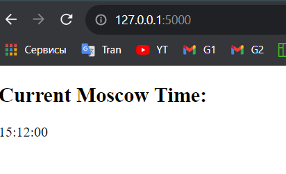
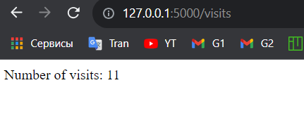
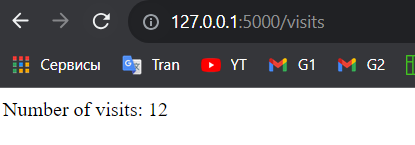

# Lab12

The counter saved in "app_python/visits.txt" file. If file does not exists, program create it. 

```python
def increment_visits():
    count = read_visits() + 1
    with open("visits.txt", "w+") as file:
        file.write(str(count))
    return count
  
def read_visits():
    try:
        with open("visits.txt", "r") as file:
            return int(file.read().strip())
    except FileNotFoundError:
        return 0
    
@app.route('/visits')
def show_visits():
    visit_count = read_visits()
    return f"Number of visits: {visit_count}"
```

## Endpoint

To see number of visits open http://localhost:5000/visits

* Before


* After 


## Configmap

```yml
    apiVersion: v1
    kind: ConfigMap
    metadata:
      name: {{ include "app-python.fullname" . }}-config
    data:
      config.json: |
        {{ .Files.Get "files/config.json" | indent 4 }}
```

```text
    kubectl get po
NAME                          READY   STATUS    RESTARTS       AGE
app_python-53bfj636kl-vw48md   1/1     Running   0              26s
```

```text
kubectl describe po app_python-53bfj636kl-vw48md
    ..........
    Environment:
      CUSTOM_SECRET:     SECRET-ONE
      SECRET:            <set to the key 'token' in secret 'real-secret'>           Optional: false
      SPECIAL_TYPE_KEY:  <set to the key 'test' of config map 'config-py'>  Optional: false
    Mounts:
      /files/config.json from config-py (rw,path="/files/config.json")
      /data from counter-py (rw)
      /var/run/secrets/kubernetes.io/serviceaccount from kube-api-access-gbjzf (ro)
.......................................
Volumes:
  config-py:
    Type:      ConfigMap (a volume populated by a ConfigMap)
    Name:      config-py
    Optional:  false
  counter-py:
    Type:       EmptyDir (a temporary directory that shares a pod's lifetime)
    Medium:
    SizeLimit:  500Mi
```