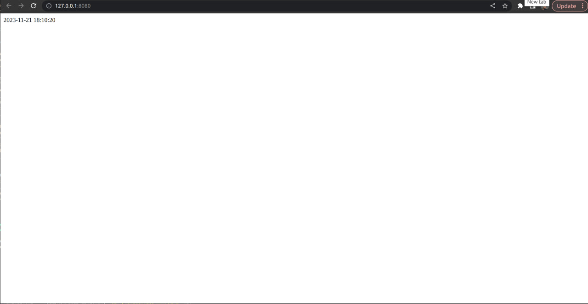
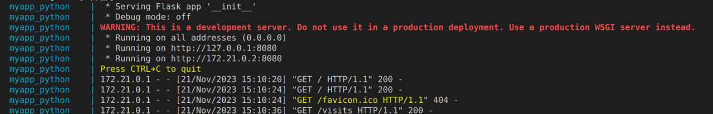
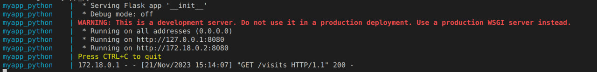
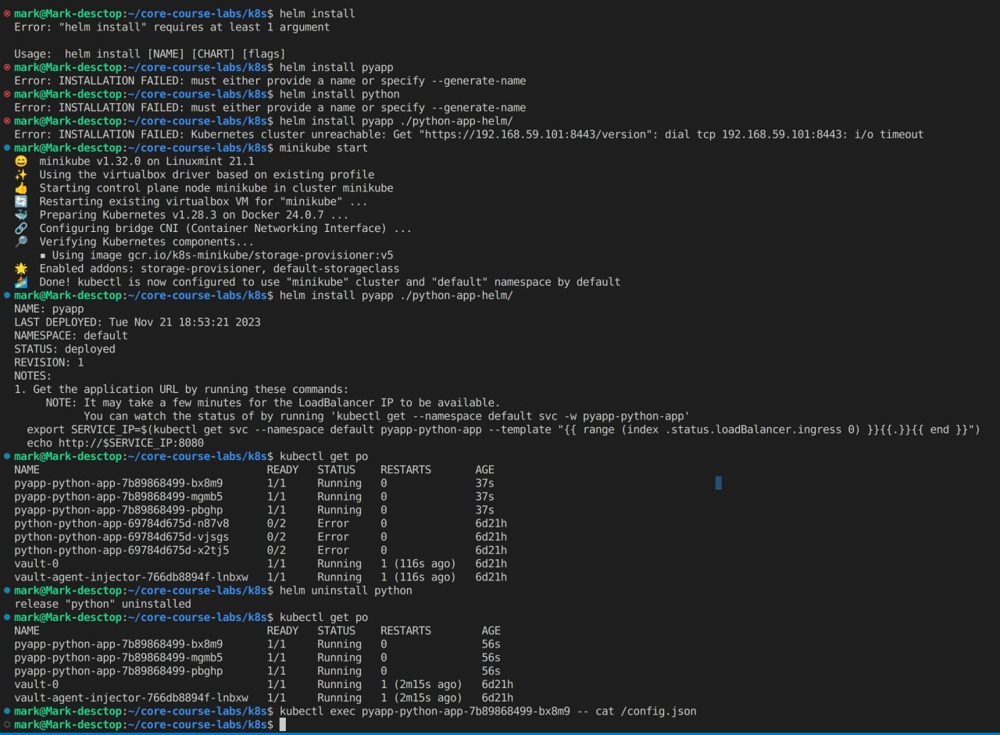

```
docker-compose up
```

twice enter to / 127.0.0.1:8080/


once enter to /visits 127.0.0.1:8080/visits


result


stop myapp_python

```
docker-compose down
docker-compose kill
```

once enter to 127.0.0.1:8080/visits


result:


Cmd:
```
kubectl get po
```

Output:
```
NAME                                    READY   STATUS    RESTARTS        AGE
pyapp-python-app-7b89868499-bx8m9       1/1     Running   0               56s
pyapp-python-app-7b89868499-mgmb5       1/1     Running   0               56s
pyapp-python-app-7b89868499-pbghp       1/1     Running   0               56s
vault-0                                 1/1     Running   1 (2m15s ago)   6d21h
vault-agent-injector-766db8894f-lnbxw   1/1     Running   1 (2m15s ago)   6d21h
```

Cmd:
```
kubectl exec pyapp-python-app-7b89868499-bx8m9 -- cat /config.json
```
Output:
```
{"one": "two"}mark@Mark-desctop:~/core-course-labs/k8s$ 
```

