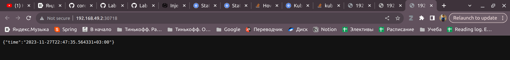
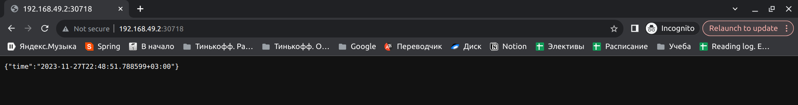

# Lab 13. Kubernetes StatefulSet
Based video - https://www.youtube.com/watch?v=pPQKAR1pA9U&ab_channel=TechWorldwithNana

## Task 1
```
$ helm secrets install app-python . -n default -f ./secrets.yaml
NAME: app-python
LAST DEPLOYED: Mon Nov 27 23:10:16 2023
NAMESPACE: default
STATUS: deployed
REVISION: 1
NOTES:
1. Get the application URL by running these commands:
  export NODE_PORT=$(kubectl get --namespace default -o jsonpath="{.spec.ports[0].nodePort}" services app-python)
  export NODE_IP=$(kubectl get nodes --namespace default -o jsonpath="{.items[0].status.addresses[0].address}")
  echo http://$NODE_IP:$NODE_PORT
removed './secrets.yaml.dec'
```

```
$ kubectl describe sts app-python
Name:               app-python
Namespace:          default
CreationTimestamp:  Mon, 27 Nov 2023 23:10:20 +0300
Selector:           app.kubernetes.io/instance=app-python,app.kubernetes.io/managed-by=Helm,app.kubernetes.io/version=1.16.0
Labels:             app.kubernetes.io/instance=app-python
                    app.kubernetes.io/managed-by=Helm
                    app.kubernetes.io/version=1.16.0
Annotations:        meta.helm.sh/release-name: app-python
                    meta.helm.sh/release-namespace: default
Replicas:           3 desired | 3 total
Update Strategy:    RollingUpdate
  Partition:        0
Pods Status:        3 Running / 0 Waiting / 0 Succeeded / 0 Failed
Pod Template:
  Labels:           app.kubernetes.io/instance=app-python
                    app.kubernetes.io/managed-by=Helm
                    app.kubernetes.io/version=1.16.0
  Annotations:      vault.hashicorp.com/agent-inject: true
                    vault.hashicorp.com/agent-inject-secret-database-config.txt: internal/data/database/config
                    vault.hashicorp.com/agent-inject-status: update
                    vault.hashicorp.com/agent-inject-template-database-config.txt:
                      {{- with secret "internal/data/database/config" -}}Bearer token: {{ .Data.data.token }}{{- end -}}
                    vault.hashicorp.com/role: internal-app
  Service Account:  internal-app
  Containers:
   app-python:
    Image:      edikgoose/moscow-time-app:latest
    Port:       80/TCP
    Host Port:  0/TCP
    Limits:
      cpu:     500m
      memory:  128Mi
    Requests:
      cpu:      250m
      memory:   64Mi
    Liveness:   http-get http://:http/ delay=0s timeout=1s period=10s #success=1 #failure=3
    Readiness:  http-get http://:http/ delay=0s timeout=1s period=10s #success=1 #failure=3
    Environment Variables from:
      app-python-config-map  ConfigMap  Optional: false
    Environment:
      EXTERNAL_SERVICE_URL:  https://url:8083
      IS_RETRY_STRATEGY_ON:  true
      JWT_TOKEN:             <set to the key 'token' in secret 'credentials'>  Optional: false
    Mounts:
      /app/configs/config.json from config-volume (rw,path="config.json")
      /app/src/resources from app-data (rw)
  Volumes:
   config-volume:
    Type:      ConfigMap (a volume populated by a ConfigMap)
    Name:      app-python-config-map
    Optional:  false
Volume Claims:
  Name:          app-data
  StorageClass:  
  Labels:        <none>
  Annotations:   <none>
  Capacity:      62Mi
  Access Modes:  [ReadWriteOnce]
Events:
  Type    Reason            Age   From                    Message
  ----    ------            ----  ----                    -------
  Normal  SuccessfulCreate  51s   statefulset-controller  create Pod app-python-0 in StatefulSet app-python successful
  Normal  SuccessfulCreate  51s   statefulset-controller  create Pod app-python-1 in StatefulSet app-python successful
  Normal  SuccessfulCreate  51s   statefulset-controller  create Pod app-python-2 in StatefulSet app-python successful
```

## Task 2.1
### Kubectl commands output:
```
$ kubectl get po
NAME                                    READY   STATUS    RESTARTS        AGE
app-python-0                            2/2     Running   0               110s
app-python-1                            2/2     Running   0               99s
app-python-2                            2/2     Running   0               92s
vault-0                                 1/1     Running   4 (76m ago)     13d
vault-agent-injector-5cd8b87c6c-rctsv   1/1     Running   4 (5d16h ago)   13d
```

```
$ kubectl get sts
NAME         READY   AGE
app-python   3/3     2m5s
vault        1/1     13d
```

```
$ kubectl get svc
NAME                       TYPE        CLUSTER-IP       EXTERNAL-IP   PORT(S)             AGE
app-python                 NodePort    10.100.10.227    <none>        80:30718/TCP        2m17s
kubernetes                 ClusterIP   10.96.0.1        <none>        443/TCP             28d
vault                      ClusterIP   10.109.25.80     <none>        8200/TCP,8201/TCP   13d
vault-agent-injector-svc   ClusterIP   10.103.112.208   <none>        443/TCP             13d
vault-internal             ClusterIP   None             <none>        8200/TCP,8201/TCP   13d
```

```
$ kubectl get pvc
NAME                    STATUS   VOLUME                                     CAPACITY   ACCESS MODES   STORAGECLASS   AGE
app-data-app-python-0   Bound    pvc-e186228b-bf08-46b8-ae61-68c478f40cbc   62Mi       RWO            standard       33m
app-data-app-python-1   Bound    pvc-5a63812d-c754-481f-be4c-823559acbfd4   62Mi       RWO            standard       33m
app-data-app-python-2   Bound    pvc-a54ec4b3-fbe3-41b2-be3d-d66dd7394e40   62Mi       RWO            standard       32m
```

### Minikube service:
```
$ minikube service app-python
|-----------|------------|-------------|---------------------------|
| NAMESPACE |    NAME    | TARGET PORT |            URL            |
|-----------|------------|-------------|---------------------------|
| default   | app-python | http/80     | http://192.168.49.2:30718 |
|-----------|------------|-------------|---------------------------|
🎉  Opening service default/app-python in default browser...
```
#### Access app: 
* Simple tab:

* Incognito tab:


### Check visits file content:
```
$ kubectl exec app-python-0 -- cat /app/src/resources/visits
Defaulted container "app-python" out of: app-python, vault-agent, vault-agent-init (init)
154
```

```
$ kubectl exec app-python-1 -- cat /app/src/resources/visits
Defaulted container "app-python" out of: app-python, vault-agent, vault-agent-init (init)
153
```

```
$ kubectl exec app-python-2 -- cat /app/src/resources/visits
Defaulted container "app-python" out of: app-python, vault-agent, vault-agent-init (init)
151
```

The content of the file is different because each pod has its own filesystem and `service` balancer
does not guarantee perfect balance between pods.

To avoid this situation we can use replication model between these files (like master-slave in DBs),
but it's not so easy to implement

P.S. the numbers are big due to k8s probes

## Task 2.2

### Explain why ordering guarantees are unnecessary for your app
This application is stateless, and therefore it does not need any specific order of
startup and shutdown. As I said, each pod has its own file system

### Implement a way to instruct the StatefulSet controller to launch or terminate all Pods in parallel.
Add to stateful.yaml:
```yaml
spec:
  podManagementPolicy: Parallel
```

To check it list all pods and see that **their ages are the sam**e:
```
$ kubectl get pods
NAME                                    READY   STATUS    RESTARTS        AGE
app-python-0                            2/2     Running   0               76s
app-python-1                            2/2     Running   0               76s
app-python-2                            2/2     Running   0               76s
vault-0                                 1/1     Running   4 (102m ago)    13d
vault-agent-injector-5cd8b87c6c-rctsv   1/1     Running   4 (5d16h ago)   13d
```

## Bonus task
### 1
Let's do the same for Kotlin app
#### Install
```
$ helm install app-kotlin .
NAME: app-kotlin
LAST DEPLOYED: Mon Nov 27 23:38:27 2023
NAMESPACE: default
STATUS: deployed
REVISION: 1
NOTES:
1. Get the application URL by running these commands:
  export NODE_PORT=$(kubectl get --namespace default -o jsonpath="{.spec.ports[0].nodePort}" services app-kotlin)
  export NODE_IP=$(kubectl get nodes --namespace default -o jsonpath="{.items[0].status.addresses[0].address}")
  echo http://$NODE_IP:$NODE_PORT
```

#### Kubectl commands output:
```
$ kubectl get po
NAME                                    READY   STATUS    RESTARTS        AGE
app-kotlin-0                            1/1     Running   0               6m46s
app-kotlin-1                            1/1     Running   0               6m46s
app-kotlin-2                            1/1     Running   0               6m46s
app-python-0                            2/2     Running   0               34m
app-python-1                            2/2     Running   0               34m
app-python-2                            2/2     Running   0               34m
vault-0                                 1/1     Running   4 (135m ago)    13d
vault-agent-injector-5cd8b87c6c-rctsv   1/1     Running   4 (5d17h ago)   13d
```

```
$ kubectl get sts
NAME         READY   AGE
app-kotlin   3/3     7m36s
app-python   3/3     35m
vault        1/1     13d
```

```
$ kubectl get svc
NAME                       TYPE        CLUSTER-IP       EXTERNAL-IP   PORT(S)             AGE
app-kotlin                 NodePort    10.103.214.64    <none>        8080:32492/TCP      7m47s
app-python                 NodePort    10.103.155.37    <none>        80:30822/TCP        35m
kubernetes                 ClusterIP   10.96.0.1        <none>        443/TCP             28d
vault                      ClusterIP   10.109.25.80     <none>        8200/TCP,8201/TCP   13d
vault-agent-injector-svc   ClusterIP   10.103.112.208   <none>        443/TCP             13d
vault-internal             ClusterIP   None             <none>        8200/TCP,8201/TCP   13d
```

```
$ kubectl get pvc
NAME                           STATUS   VOLUME                                     CAPACITY   ACCESS MODES   STORAGECLASS   AGE
app-data-app-python-0          Bound    pvc-e186228b-bf08-46b8-ae61-68c478f40cbc   62Mi       RWO            standard       93m
app-data-app-python-1          Bound    pvc-5a63812d-c754-481f-be4c-823559acbfd4   62Mi       RWO            standard       92m
app-data-app-python-2          Bound    pvc-a54ec4b3-fbe3-41b2-be3d-d66dd7394e40   62Mi       RWO            standard       92m
app-data-kotlin-app-kotlin-0   Bound    pvc-771bc73c-8785-4046-ab30-e706470e3248   62Mi       RWO            standard       13m
app-data-kotlin-app-kotlin-1   Bound    pvc-ef92e74b-b6b2-4f76-91fb-63f5c7be580e   62Mi       RWO            standard       13m
app-data-kotlin-app-kotlin-2   Bound    pvc-a96bf888-7954-44b1-bcce-87c8fd578775   62Mi       RWO            standard       13m
```

```
$ minikube service app-kotlin
|-----------|------------|-------------|---------------------------|
| NAMESPACE |    NAME    | TARGET PORT |            URL            |
|-----------|------------|-------------|---------------------------|
| default   | app-kotlin | http/8080   | http://192.168.49.2:32492 |
|-----------|------------|-------------|---------------------------|
🎉  Opening service default/app-kotlin in default browser...
```

```
$ kubectl exec app-kotlin-0 -- cat sources/visits
0
```

```
$ kubectl exec app-kotlin-1 -- cat sources/visits
26
```

```
$ kubectl exec app-kotlin-2 -- cat sources/visits
0
```

As we can see, all requests from one tab went to one concrete pod.

### 2
Explore Update Strategies: 
* **Rolling update strategy.** 

    Just update pode one by one. I think it's the most popular strategy because the update is iterative
    and in case of failures in one pode, all other podes will live with old version. Actually, in my company (Tinkoff) we commonly use this strategy

* **Recreate update strategy.**

    Deactivate all outdated pods and creates updated pods for the entire system. For me, not safety because new pods can contain errors that will not allow to up

* **Canary update strategy.**

    It takes some small number of pods and update them (1:4 ratio usually), while other pods stay with old version. Then developers check that these new pods are valid and update all other pods.
    Good strategy in cases of big projects.

* **Blue/green deployment strategy.**
    
    We create separate, but identical environment for new version. It usually called green (while old one called blue)
    And we can switch traffic between these version. I think it's smth like feature flag for release.

* **Ramped Slow Rollout**

  This strategy updated by creating new replicas while removing old ones.
  It's very similar to rolling update, but the difference is that you can control the pace at which new replicas are rolled out.

* **Shadow deployment strategy.**

    We deploy new version of application but without affecting end-users. I think, the most suitable case for this strategy is real-time testing of new version

* **Best-Effort Controlled Rollout**

    It's alternative solution to Ramped Slow Rollout if it's needed to deploy faster. But there is a trade-off between
    speed and risk.

* **A/B Testing**
    
    We divide users into groups and update some group to new version, while other group stay with the old version.
    Actually, it's very similar to Canary, but in A/B testing we exactly know that both version are stable and usually
    this strategy is used to test how users percieve new features.


[source 1](https://www.educative.io/blog/kubernetes-deployments-strategies#strategies)

[source 2](https://spot.io/resources/kubernetes-autoscaling/5-kubernetes-deployment-strategies-roll-out-like-the-pros/)
