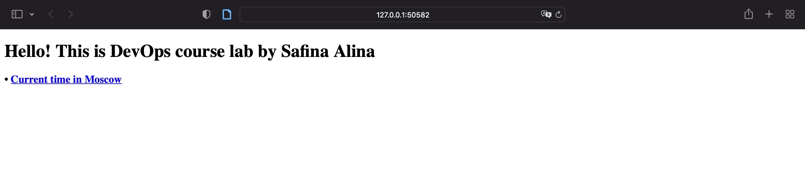
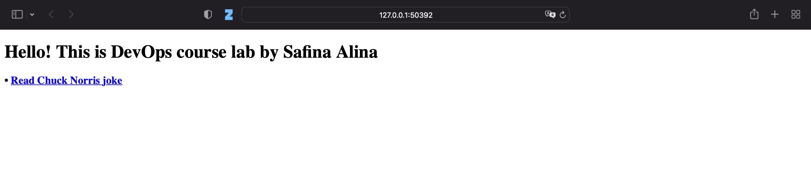

# Lab 13: Kubernetes StatefulSet
## Task 1
### Python app: 
* Deploying:
  ````
   % helm install app-python ./app-python
    NAME: app-python
    LAST DEPLOYED: Tue Nov 28 11:45:24 2023
    NAMESPACE: default
    STATUS: deployed
    REVISION: 1
    NOTES:
    1. Get the application URL by running these commands:
      export NODE_PORT=$(kubectl get --namespace default -o jsonpath="{.spec.ports[0].nodePort}" services app-python)
      export NODE_IP=$(kubectl get nodes --namespace default -o jsonpath="{.items[0].status.addresses[0].address}")
      echo http://$NODE_IP:$NODE_PORT
  ````
* Checking:
    ````
   % kubectl describe sts app-python
  Name:               app-python
  Namespace:          default
  CreationTimestamp:  Tue, 28 Nov 2023 14:39:35 +0300
  Selector:           app.kubernetes.io/instance=app-python,app.kubernetes.io/managed-by=Helm,app.kubernetes.io/version=1.16.0
  Labels:             app.kubernetes.io/instance=app-python
                      app.kubernetes.io/managed-by=Helm
                      app.kubernetes.io/version=1.16.0
  Annotations:        meta.helm.sh/release-name: app-python
                      meta.helm.sh/release-namespace: default
  Replicas:           3 desired | 3 total
  Update Strategy:    RollingUpdate
    Partition:        0
  Pods Status:        3 Running / 0 Waiting / 0 Succeeded / 0 Failed
  Pod Template:
    Labels:           app.kubernetes.io/instance=app-python
                      app.kubernetes.io/managed-by=Helm
                      app.kubernetes.io/version=1.16.0
    Service Account:  app-python
    Containers:
     app-python:
      Image:      lnsfna/app_python:latest
      Port:       8080/TCP
      Host Port:  0/TCP
      Limits:
        cpu:     100m
        memory:  128Mi
      Requests:
        cpu:      100m
        memory:   128Mi
      Liveness:   http-get http://:http/ delay=0s timeout=1s period=10s #success=1 #failure=3
      Readiness:  http-get http://:http/ delay=0s timeout=1s period=10s #success=1 #failure=3
      Environment Variables from:
        python-config-map  ConfigMap  Optional: false
      Environment:
        LAB12_KEY:  <set to the key 'config.json' of config map 'python-config-map'>  Optional: false
      Mounts:
        /config.json from python-config-volume (rw,path="config.json")
        /data from python-counter-data (rw)
    Volumes:
     python-config-volume:
      Type:      ConfigMap (a volume populated by a ConfigMap)
      Name:      python-config-map
      Optional:  false
     python-counter-data:
      Type:       EmptyDir (a temporary directory that shares a pod's lifetime)
      Medium:     
      SizeLimit:  500Mi
  Volume Claims:
    Name:          python-counter-data
    StorageClass:  
    Labels:        <none>
    Annotations:   <none>
    Capacity:      62Mi
    Access Modes:  [ReadWriteOnce]
  Events:
    Type    Reason            Age    From                    Message
    ----    ------            ----   ----                    -------
    Normal  SuccessfulCreate  2m19s  statefulset-controller  create Pod app-python-0 in StatefulSet app-python successful
    Normal  SuccessfulCreate  109s   statefulset-controller  create Pod app-python-1 in StatefulSet app-python successful
    Normal  SuccessfulCreate  78s    statefulset-controller  create Pod app-python-2 in StatefulSet app-python successful

    ````
  
### Go app: 
* Deploying:
    ````
   % helm install app-go ./app-go        
    NAME: app-go
    LAST DEPLOYED: Tue Nov 28 11:48:07 2023
    NAMESPACE: default
    STATUS: deployed
    REVISION: 1
    NOTES:
    1. Get the application URL by running these commands:
      export NODE_PORT=$(kubectl get --namespace default -o jsonpath="{.spec.ports[0].nodePort}" services app-go)
      export NODE_IP=$(kubectl get nodes --namespace default -o jsonpath="{.items[0].status.addresses[0].address}")
      echo http://$NODE_IP:$NODE_PORT
    ````
* Checking:
  ````
  % kubectl describe sts app-go    
  Name:               app-go
  Namespace:          default
  CreationTimestamp:  Tue, 28 Nov 2023 14:40:29 +0300
  Selector:           app.kubernetes.io/instance=app-go,app.kubernetes.io/managed-by=Helm,app.kubernetes.io/version=1.16.0
  Labels:             app.kubernetes.io/instance=app-go
                      app.kubernetes.io/managed-by=Helm
                      app.kubernetes.io/version=1.16.0
  Annotations:        meta.helm.sh/release-name: app-go
                      meta.helm.sh/release-namespace: default
  Replicas:           3 desired | 3 total
  Update Strategy:    RollingUpdate
    Partition:        0
  Pods Status:        3 Running / 0 Waiting / 0 Succeeded / 0 Failed
  Pod Template:
    Labels:           app.kubernetes.io/instance=app-go
                      app.kubernetes.io/managed-by=Helm
                      app.kubernetes.io/version=1.16.0
    Annotations:      vault.hashicorp.com/agent-inject: true
                      vault.hashicorp.com/agent-inject-secret-secrets.txt:
                        {{- with secret "internal/data/secrets" -}}
                        {{ .Data.data.secret }}
                        {{- end -}}
                      vault.hashicorp.com/agent-inject-status: update
                      vault.hashicorp.com/role: internal-app
    Service Account:  internal-app
    Containers:
     app-go:
      Image:      lnsfna/app_go:latest
      Port:       8081/TCP
      Host Port:  0/TCP
      Limits:
        cpu:     100m
        memory:  128Mi
      Requests:
        cpu:      100m
        memory:   128Mi
      Liveness:   http-get http://:http/ delay=0s timeout=1s period=10s #success=1 #failure=3
      Readiness:  http-get http://:http/ delay=0s timeout=1s period=10s #success=1 #failure=3
      Environment Variables from:
        go-config-map  ConfigMap  Optional: false
      Environment:
        LAB12_KEY:  <set to the key 'config.json' of config map 'go-config-map'>  Optional: false
      Mounts:
        /config.json from go-config-volume (rw,path="config.json")
        /data from go-counter-data (rw)
    Volumes:
     go-config-volume:
      Type:      ConfigMap (a volume populated by a ConfigMap)
      Name:      go-config-map
      Optional:  false
     go-counter-data:
      Type:       EmptyDir (a temporary directory that shares a pod's lifetime)
      Medium:     
      SizeLimit:  500Mi
  Volume Claims:
    Name:          go-counter-data
    StorageClass:  
    Labels:        <none>
    Annotations:   <none>
    Capacity:      62Mi
    Access Modes:  [ReadWriteOnce]
  Events:
    Type    Reason            Age   From                    Message
    ----    ------            ----  ----                    -------
    Normal  SuccessfulCreate  38s   statefulset-controller  create Pod app-go-0 in StatefulSet app-go successful
    Normal  SuccessfulCreate  33s   statefulset-controller  create Pod app-go-1 in StatefulSet app-go successful
    Normal  SuccessfulCreate  29s   statefulset-controller  create Pod app-go-2 in StatefulSet app-go successful
     
  ````
## Task 2
### Commands:
* Pods:
    ````
    % kubectl get po
    NAME           READY   STATUS    RESTARTS       AGE
    app-go-0       1/1     Running   0              2m28s
    app-go-1       1/1     Running   0              2m23s
    app-go-2       1/1     Running   0              2m19s
    app-python-0   1/1     Running   0              3m22s
    app-python-1   1/1     Running   0              2m52s
    app-python-2   1/1     Running   0              2m21s
   ````
* Statefulsets:
  ````
  % kubectl get sts
    NAME         READY   AGE
    app-go       3/3     2m54s
    app-python   3/3     3m48s
  ````
* Services:
    ````
  % kubectl get svc
    NAME                       TYPE        CLUSTER-IP       EXTERNAL-IP   PORT(S)             AGE
    app-go                     NodePort    10.107.244.245   <none>        8081:31189/TCP      5m1s
    app-python                 NodePort    10.111.9.15      <none>        8080:31446/TCP      7m44s
    kubernetes                 ClusterIP   10.96.0.1        <none>        443/TCP             20d
    ````
* Persistent volumes:
    ````
    % kubectl get pvc
    NAME                               STATUS   VOLUME                                     CAPACITY   ACCESS MODES   STORAGECLASS   AGE
    go-counter-data-app-go-0           Bound    pvc-4eea25e9-4abd-479f-ac26-0cc10d7a77a1   62Mi       RWO            standard       18m
    go-counter-data-app-go-1           Bound    pvc-5be3f7fe-0a4e-4e80-ae4d-4c08b623e455   62Mi       RWO            standard       18m
    go-counter-data-app-go-2           Bound    pvc-f8dca3a6-edfa-40f4-9c9d-60cbf6c0ffba   62Mi       RWO            standard       18m
    python-counter-data-app-python-0   Bound    pvc-352798dd-8cda-42b2-a5bd-c664bfa20024   62Mi       RWO            standard       29m
    python-counter-data-app-python-1   Bound    pvc-8e7264fe-9509-4789-92d8-6570991a6e15   62Mi       RWO            standard       29m
    python-counter-data-app-python-2   Bound    pvc-26304890-6ed3-47b3-a26a-c2e346507b63   62Mi       RWO            standard       29m
    ````
### Accessing apps:
* Python:
    ```
    % minikube service app-python                   
    |-----------|------------|-------------|---------------------------|
    | NAMESPACE |    NAME    | TARGET PORT |            URL            |
    |-----------|------------|-------------|---------------------------|
    | default   | app-python | http/8080   | http://192.168.49.2:32062 |
    |-----------|------------|-------------|---------------------------|
    🏃  Starting tunnel for service app-python.
    |-----------|------------|-------------|------------------------|
    | NAMESPACE |    NAME    | TARGET PORT |          URL           |
    |-----------|------------|-------------|------------------------|
    | default   | app-python |             | http://127.0.0.1:50582 |
    |-----------|------------|-------------|------------------------|
    🎉  Opening service default/app-python in default browser...
    ```
    

* Go: 
  ```
  % minikube service app-go      
    |-----------|--------|-------------|---------------------------|
    | NAMESPACE |  NAME  | TARGET PORT |            URL            |
    |-----------|--------|-------------|---------------------------|
    | default   | app-go | http/8081   | http://192.168.49.2:32728 |
    |-----------|--------|-------------|---------------------------|
    🏃  Starting tunnel for service app-go.
    |-----------|--------|-------------|------------------------|
    | NAMESPACE |  NAME  | TARGET PORT |          URL           |
    |-----------|--------|-------------|------------------------|
    | default   | app-go |             | http://127.0.0.1:50392 |
    |-----------|--------|-------------|------------------------|
    🎉  Opening service default/app-go in default browser...
  ```
    

### Accessing visits file:
* Python
    ```
    % kubectl exec app-python-0 -- cat /data/visits.json
    {"visits": 790}                                                                                                                                                        
    % kubectl exec app-python-1 -- cat /data/visits.json
    {"visits": 777}                                                                                                                                                          
    % kubectl exec app-python-2 -- cat /data/visits.json
    {"visits": 784}   
    ```
  

* Go:
  ```
  % kubectl exec app-go-0 -- cat /data/visits.json
  {"visits":"513"}                                                                                                                                                           
  % kubectl exec app-go-1 -- cat /data/visits.json
  {"visits":"501"}                                                                                                                                                           
  % kubectl exec app-go-2 -- cat /data/visits.json
  {"visits":"505"} 
  ```    
 

The number of visits is big because of liveness probes. 
The number of visits is different because every pod has its own filesystem and service balancer does not guarantee perfect balance between them.

### Why ordering guarantees are unnecessary for my app
As my app is stateless, it doesn't need a specific order while starting up and shutting down. 
Also, each pod has its own filesystem

### Parallel pod management policy 
I've added in `templates/statefulset.yaml` file of both applications a new parameter:
```
spec:
  podManagementPolicy: Parallel
```
Now pods have the same age
```
 % kubectl get po
NAME           READY   STATUS    RESTARTS       AGE
app-go-0       1/1     Running   0              2m25s
app-go-1       1/1     Running   0              2m25s
app-go-2       1/1     Running   0              2m25s
app-python-0   1/1     Running   0              51s
app-python-1   1/1     Running   0              51s
app-python-2   1/1     Running   0              51s

```

## Update Strategies:
1. Rolling update strategy
   * Replacing pods running the old version of the application with the new version, one by one.
   * Default strategy that allows you to update a set of pods without downtime.
2. Recreate update strategy. 
   * All-or-nothing method  
   * Lets you update an application instantly, with some downtime. It terminates all pods and replaces them with the new version.
   * Not safe as new pods can contain errors
3. Ramped Slow Rollout 
   * Rolls out replicas of the new version, while in parallel, shutting down old replicas. 
   * Similar with rolling update, but here you can control the pace at which new replicas are rolled out.
4. Best-Effort Controlled Rollout  
   * Specifies a “max unavailable” parameter which indicates what percentage of existing pods can be unavailable during the upgrade
   * Allows to deploy faster 
5. Blue/green deployment strategy. 
   * Creating separate, but identical environment for new version. It usually called green (while old one called blue)
   * Switching traffic between these versions.
6. Canary update strategy. 
   * Progressive delivery approach
   * One version of the application serving most users, and another, newer version serving a small pool of test users. The test deployment is rolled out to more users if it is successful.
   * Safe strategy for big projects
7. Shadow deployment strategy.
   * New version of the application (the “shadow” version) receives real-world traffic alongside the current version, but without affecting end-users.
8. A/B Testing
   * Rolling out two or more versions of an application feature to a subset of users simultaneously to see which one performs better in terms of user engagement, error rates, or other KPIs.
   * Similar to canary approach, but here we exactly know that both version are stable


