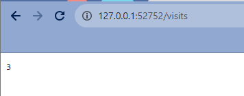
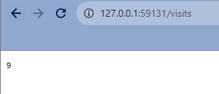

# StatefulSet

## Task 1

`helm install --dry-run --debug python . --values values.python.yaml`

```
install.go:214: [debug] Original chart version: ""
install.go:231: [debug] CHART PATH: C:\Users\Damir\Documents\devops-course\k8s\helm-chart-app

NAME: python
LAST DEPLOYED: Sun Nov 26 16:01:21 2023
NAMESPACE: default
STATUS: pending-install
REVISION: 1
USER-SUPPLIED VALUES:
VolumeClaim:
  accessModes:
  - ReadWriteOnce
  name: visits
  storageSize: 1Mi

...

# Source: helm-chart-app/templates/statefulset.yaml
apiVersion: apps/v1
kind: StatefulSet
...
```

## Used variables

```
VolumeClaim:
  name: visits
  storageSize: 1Mi
  accessModes: [ "ReadWriteOnce" ]
```

## Deploy

`helm install python . --values values.python.yaml`\

```
NAME: python
LAST DEPLOYED: Sun Nov 26 16:10:22 2023
NAMESPACE: default
STATUS: deployed
REVISION: 1
NOTES:
1. Get the application URL by running these commands:
  export NODE_PORT=$(kubectl get --namespace default -o jsonpath="{.spec.ports[0].nodePort}" services python-helm-chart-app)
  export NODE_IP=$(kubectl get nodes --namespace default -o jsonpath="{.items[0].status.addresses[0].address}")
  echo http://$NODE_IP:$NODE_PORT
```

## Task 2

`kubectl get po,sts,svc,pvc`

```
NAME                          READY   STATUS    RESTARTS   AGE
pod/python-helm-chart-app-0   1/1     Running   0          118s
pod/python-helm-chart-app-1   1/1     Running   0          78s
pod/python-helm-chart-app-2   1/1     Running   0          37s

NAME                                     READY   AGE
statefulset.apps/python-helm-chart-app   3/3     118s

NAME                            TYPE        CLUSTER-IP      EXTERNAL-IP   PORT(S)          AGE
service/kubernetes              ClusterIP   10.96.0.1       <none>        443/TCP          13d
service/python-helm-chart-app   NodePort    10.98.149.203   <none>        8000:31944/TCP   118s

NAME                                                   STATUS   VOLUME                                     CAPACITY   ACCESS MODES   STORAGECLASS   AGE
persistentvolumeclaim/data-vault-0                     Bound    pvc-2cc9b3ae-3a33-44b2-93ed-c95029f53efc   10Gi       RWO            standard       12d
persistentvolumeclaim/visits-python-helm-chart-app-0   Bound    pvc-46ed3d72-4fc2-48ea-be4a-dbfc181c721a   1Mi        RWO            standard       42m
persistentvolumeclaim/visits-python-helm-chart-app-1   Bound    pvc-92eaa227-89bc-4d22-8133-1a1b74268356   1Mi        RWO            standard       39m
persistentvolumeclaim/visits-python-helm-chart-app-2   Bound    pvc-210b5345-50b2-4bb4-ac78-34d681874037   1Mi        RWO            standard       38m
```

`minikube service python-helm-chart-app`

```
W1126 18:44:16.548622   29784 main.go:291] Unable to resolve the current Docker CLI context "default": context "default": context not found: open C:\Users\Damir\.docker\contexts\meta\37a8eec1ce19687d132fe29051dca629d164e2c4958ba141d5f4133a33f0688f\meta.json: The system cannot find the path specified.
|-----------|-----------------------|-------------|---------------------------|
| NAMESPACE |         NAME          | TARGET PORT |            URL            |
|-----------|-----------------------|-------------|---------------------------|
| default   | python-helm-chart-app | http/8000   | http://192.168.49.2:31220 |
|-----------|-----------------------|-------------|---------------------------|
* Starting tunnel for service python-helm-chart-app.
|-----------|-----------------------|-------------|------------------------|
| NAMESPACE |         NAME          | TARGET PORT |          URL           |
|-----------|-----------------------|-------------|------------------------|
| default   | python-helm-chart-app |             | http://127.0.0.1:52058 |
|-----------|-----------------------|-------------|------------------------|
* Opening service default/python-helm-chart-app in default browser...
```

### Check

`wget http://127.0.0.1:52752/visits`

```
StatusCode        : 200
StatusDescription : OK
Content           : 3
RawContent        : HTTP/1.1 200 OK
                    Content-Length: 1
                    Content-Type: text/plain; charset=utf-8
                    Date: Sun, 26 Nov 2023 15:48:46 GMT
                    Server: waitress

                    3
Forms             : {}
Headers           : {[Content-Length, 1], [Content-Type, text/plain; charset=utf-8], [Date, Sun, 26 Nov 2023 15:48:46 GMT], [Server, wait
                    ress]}
Images            : {}
InputFields       : {}
Links             : {}
ParsedHtml        : System.__ComObject
RawContentLength  : 1
```



`kubectl exec python-helm-chart-app-0 -- cat /app/volume/visits`

```
5
```

`kubectl exec python-helm-chart-app-1 -- cat /app/volume/visits`

```
3
```

`kubectl exec python-helm-chart-app-2 -- cat /app/volume/visits`

```
2
```

### Result

Each node has its own persistent volume. Therefore, we have different number of visits for different nodes (due to balancing).

Moreover, I have updated probes such that they do not use root path.

### Parallel

Ordering guarantees are unnecessary for StatefulSet apps because StatefulSet ensures that each of its pods is uniquely identified and maintains stable network identities. Because StatefulSet pods have stable identities, they can retrieve their previous state from storage and resume their operations, even after being rescheduled on different nodes. This ensures that ordering guarantees are not necessary because the StatefulSet maintains the appropriate order and uniqueness of the pods for the stateful application to function correctly.

I have added `podManagementPolicy: Parallel` to `statefulset.yaml`.

`kubectl get pods`

```
NAME                      READY   STATUS    RESTARTS   AGE
python-helm-chart-app-0   1/1     Running   0          41s
python-helm-chart-app-1   1/1     Running   0          41s
python-helm-chart-app-2   1/1     Running   0          41s
```

## Bonus

### Extra app

#### StatefulSet Implementation

`helm install --dry-run --debug sharp . --values values.c-sharp.yaml`

```
NAME: sharp
LAST DEPLOYED: Sun Nov 26 19:20:52 2023
NAMESPACE: default
STATUS: pending-install
REVISION: 1
USER-SUPPLIED VALUES:
VolumeClaim:
  accessModes:
  - ReadWriteOnce
  name: visits
  storageSize: 1Mi

...

apiVersion: apps/v1
kind: StatefulSet
metadata:
  name: sharp-helm-chart-app
  labels:
    helm.sh/chart: helm-chart-app-0.1.0
    app.kubernetes.io/name: helm-chart-app
    app.kubernetes.io/instance: sharp
    app.kubernetes.io/version: "1.16.0"
    app.kubernetes.io/managed-by: Helm
...
```

`helm install sharp . --values values.c-sharp.yaml`

```
NAME: sharp
LAST DEPLOYED: Sun Nov 26 19:22:05 2023
NAMESPACE: default
STATUS: deployed
REVISION: 1
NOTES:
1. Get the application URL by running these commands:
  export NODE_PORT=$(kubectl get --namespace default -o jsonpath="{.spec.ports[0].nodePort}" services sharp-helm-chart-app)
  export NODE_IP=$(kubectl get nodes --namespace default -o jsonpath="{.items[0].status.addresses[0].address}")
  echo http://$NODE_IP:$NODE_PORT
```

`kubectl get po,sts,svc,pvc`

```
NAME                         READY   STATUS    RESTARTS   AGE
pod/sharp-helm-chart-app-0   0/1     Running   0          26s
pod/sharp-helm-chart-app-1   0/1     Running   0          26s
pod/sharp-helm-chart-app-2   0/1     Running   0          26s

NAME                                    READY   AGE
statefulset.apps/sharp-helm-chart-app   0/3     26s

NAME                           TYPE           CLUSTER-IP       EXTERNAL-IP   PORT(S)        AGE
service/kubernetes             ClusterIP      10.96.0.1        <none>        443/TCP        13d
service/sharp-helm-chart-app   LoadBalancer   10.100.213.202   <pending>     80:31763/TCP   26s

NAME                                                   STATUS   VOLUME                                     CAPACITY   ACCESS MODES   STORAGECLASS   AGE
persistentvolumeclaim/data-vault-0                     Bound    pvc-2cc9b3ae-3a33-44b2-93ed-c95029f53efc   10Gi       RWO            standard       12d
persistentvolumeclaim/visits-python-helm-chart-app-0   Bound    pvc-46ed3d72-4fc2-48ea-be4a-dbfc181c721a   1Mi        RWO            standard       137m
persistentvolumeclaim/visits-python-helm-chart-app-1   Bound    pvc-92eaa227-89bc-4d22-8133-1a1b74268356   1Mi        RWO            standard       134m
persistentvolumeclaim/visits-python-helm-chart-app-2   Bound    pvc-210b5345-50b2-4bb4-ac78-34d681874037   1Mi        RWO            standard       133m
persistentvolumeclaim/visits-sharp-helm-chart-app-0    Bound    pvc-92a03396-9dae-4ce5-bf56-3adf87d55705   1Mi        RWO            standard       11m
persistentvolumeclaim/visits-sharp-helm-chart-app-1    Bound    pvc-4593bb89-85e6-4d68-a7d6-a88702553793   1Mi        RWO            standard       11m
persistentvolumeclaim/visits-sharp-helm-chart-app-2    Bound    pvc-8c866300-769a-498a-a049-582ed8dde391   1Mi        RWO            standard       11m
```

`minikube service sharp-helm-chart-app`

```
W1126 19:28:28.633806   35164 main.go:291] Unable to resolve the current Docker CLI context "default": context "default": context not found: open C:\Users\Damir\.docker\contexts\meta\37a8eec1ce19687d132fe29051dca629d164e2c4958ba141d5f4133a33f0688f\meta.json: The system cannot find the path specified.
|-----------|----------------------|-------------|---------------------------|
| NAMESPACE |         NAME         | TARGET PORT |            URL            |
|-----------|----------------------|-------------|---------------------------|
| default   | sharp-helm-chart-app | http/80     | http://192.168.49.2:31763 |
|-----------|----------------------|-------------|---------------------------|
* Starting tunnel for service sharp-helm-chart-app.
|-----------|----------------------|-------------|------------------------|
| NAMESPACE |         NAME         | TARGET PORT |          URL           |
|-----------|----------------------|-------------|------------------------|
| default   | sharp-helm-chart-app |             | http://127.0.0.1:59131 |
|-----------|----------------------|-------------|------------------------|
* Opening service default/sharp-helm-chart-app in default browser...
! Because you are using a Docker driver on windows, the terminal needs to be open to run it.
* Stopping tunnel for service sharp-helm-chart-app.
```



`kubectl exec sharp-helm-chart-app-0 -- cat /app/volume/visits`

```
13
```

`kubectl exec sharp-helm-chart-app-1 -- cat /app/volume/visits`

```
9
```

`kubectl exec sharp-helm-chart-app-2 -- cat /app/volume/visits`

```
5
```

`kubectl get pods`

```
NAME                     READY   STATUS    RESTARTS   AGE
sharp-helm-chart-app-0   1/1     Running   0          2m12s
sharp-helm-chart-app-1   1/1     Running   0          2m12s
sharp-helm-chart-app-2   1/1     Running   0          2m12s
```

### Update strategies

- Rolling deployment - is the default strategy for updating a set of pods without downtime. It involves replacing pods running the old version of the application with the new version, one by one.
- Recreate deployment - is a method for instantly updating an application with some downtime. It terminates all pods and replaces them with the new version.
- Ramped slow rollout - involves rolling out replicas of the new version while, in parallel, shutting down old replicas.
- Best-effort controlled rollout - checks what percentage of existing pods can be unavailable during the upgrade, enabling the rollout to happen more quickly.
- Blue/green deployment -  is a strategy in which new environment is created, and the traffic is switched the new environment.
- Canary deployment - uses a progressive delivery approach, with one version of the application serving most users, and another, newer version serving a small pool of test users. The test deployment is rolled out to more users if it is successful.
- Shadow deployment - allows the new version of the application (the "shadow" version) to receive real-world traffic alongside the current version, but without affecting end-users.
- A/B testing - involves rolling out two or more versions of an application feature to a subset of users simultaneously to see which one performs better in terms of user engagement, error rates, or other KPIs.