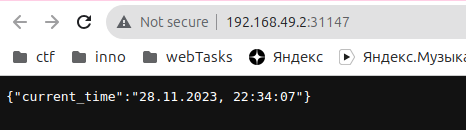

# Kubernetes StatefulSet

## StatefulSet Exploration and Optimization

```shell
kubectl get po,sts,svc,pvc
```
```text
NAME                      READY   STATUS    RESTARTS   AGE
pod/python-app-python-0   1/1     Running   0          21s
pod/python-app-python-1   1/1     Running   0          21s
pod/python-app-python-2   1/1     Running   0          21s

NAME                                 READY   AGE
statefulset.apps/python-app-python   3/3     21s

NAME                        TYPE           CLUSTER-IP     EXTERNAL-IP   PORT(S)          AGE
service/kubernetes          ClusterIP      10.96.0.1      <none>        443/TCP          37d
service/python-app-python   LoadBalancer   10.108.9.100   <pending>     8000:31823/TCP   21s

NAME                                                        STATUS   VOLUME                                     CAPACITY   ACCESS MODES   STORAGECLASS   AGE
persistentvolumeclaim/app-python-data-python-app-python-0   Bound    pvc-79016ca4-a8e5-4d31-909f-1bcb1adb5eac   10Mi       RWO            standard       21s
persistentvolumeclaim/app-python-data-python-app-python-1   Bound    pvc-242864d8-4328-470f-9c30-1f79f1940055   10Mi       RWO            standard       21s
persistentvolumeclaim/app-python-data-python-app-python-2   Bound    pvc-14002072-9e84-4470-99a4-64df05caf11a   10Mi       RWO            standard       21s
persistentvolumeclaim/data-hashicorp-vault-0                Bound    pvc-c5837e92-b14f-4c82-8ffa-f1ef0c2fe5aa   10Gi       RWO            standard       16d
```

## Access the application

```shell
minikube service py-app-python
```


## Check visits values

You can see big values here due to k8s readiness and liveness probes!

```shell
kubectl exec pod/py-app-python-0 -- cat /data/visits
```
```text
151
```

```shell
kubectl exec pod/py-app-python-1 -- cat /data/visits
```
```text
157
```

As each pod has its own filesystem that maps to PersistentVolume, therefore the values are different.

## Ordering Guarantee

The application doesn't need ordering as it doesn't have dependencies between pods (it is Stateless).
If the application had some star architecture or another that includes master/slave or peer-to-peer communication,
then this would bring problems with elections and other problems with Pod connectivity.

## Parallel Operations

Implemented by using `podManagementPolicy: Parallel` spec in StatefulSet.

## Update strategies

- **Rolling Deployment**:
This is the default Kubernetes deployment strategy.
It replaces pods running the old version of the application with the new version without downtime.
Each pod is replaced one by one, and if there is a problem, the rollout can be stopped and rolled back to the previous version.

- **Recreate Deployment**:
In this strategy, all existing pods are killed before new ones are created.
So, there will be a period of downtime during the update.

- **Canary Deployment**:
This strategy involves deploying a new version of the application alongside the old one,
with the old version serving most users and the newer version serving a small pool of test users.
This allows you to test the new version with a subset of your users before rolling it out to everyone.

- **Blue/Green Deployment**:
In this strategy, two identical environments are created: one for the current (blue) version of the application
and one for the new (green) version. All traffic is initially directed to the blue environment.
When the new version is ready to be released, traffic is switched to the green environment.
This strategy allows for easy rollback in case of issues with the new version,
as the blue environment remains untouched until the green environment is confirmed to be stable.

- **A/B Testing**:
Similar to canary deployments, A/B testing involves rolling out two or more versions of an application feature to a subset of users simultaneously.
The performance of each version is then monitored in terms of user engagement, error rates, or other KPIs to decide which version is better.
