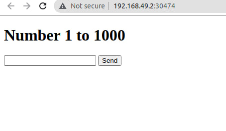
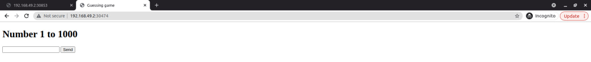
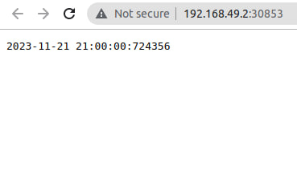
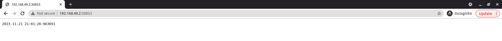
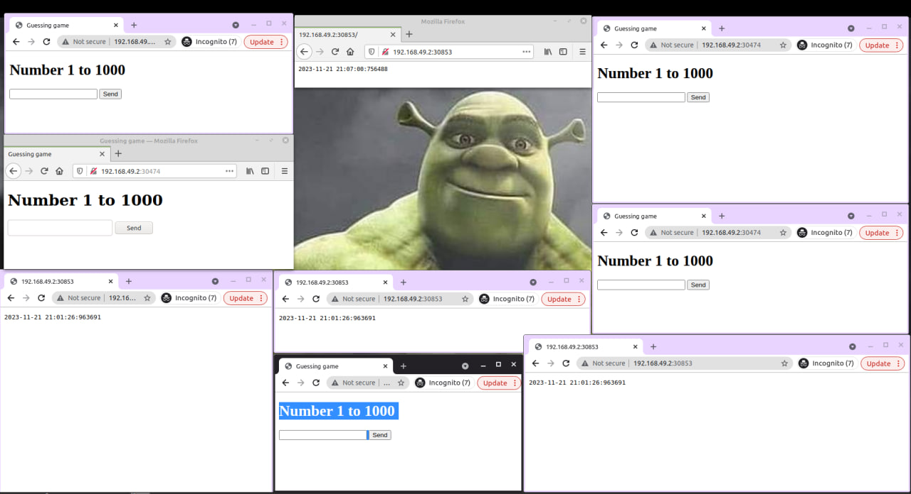

# Task 1
### 1. check with dry-run
```
 helm install --dry-run  python ./python-app/ --values ./python-app/values.python.yml
```
```
helm install --dry-run  python ./python-app/ --values ./python-app/values.python.yml 
NAME: python
LAST DEPLOYED: Tue Nov 21 20:33:49 2023
NAMESPACE: default
STATUS: pending-install
REVISION: 1
HOOKS:
---
# Source: python-app/templates/post-install-hook.yaml
apiVersion: v1
kind: Pod
metadata:
   name: postinstall-hook
   annotations:
       "helm.sh/hook": "post-install"

       "helm.sh/hook-delete-policy": hook-succeeded
spec:
  containers:
  - name: post-install-container
    image: busybox
    imagePullPolicy: Always
    command: ['sh', '-c', 'echo The post-install hook is running && sleep 15' ]
  restartPolicy: Never
  terminationGracePeriodSeconds: 0
---
# Source: python-app/templates/pre-install-hook.yaml
apiVersion: v1
kind: Pod
metadata:
   name: preinstall-hook
   annotations:
       "helm.sh/hook": "pre-install"

       "helm.sh/hook-delete-policy": hook-succeeded
spec:
  containers:
  - name: pre-install-container
    image: busybox
    imagePullPolicy: IfNotPresent
    command: ['sh', '-c', 'echo The pre-install hook is running && sleep 20' ]
  restartPolicy: Never
  terminationGracePeriodSeconds: 0
---
# Source: python-app/templates/tests/test-connection.yaml
apiVersion: v1
kind: Pod
metadata:
  name: "python-python-app-test-connection"
  labels:
    helm.sh/chart: python-app-0.1.0
    app.kubernetes.io/name: python-app
    app.kubernetes.io/instance: python
    app.kubernetes.io/version: "1.16.0"
    app.kubernetes.io/managed-by: Helm
  annotations:
    "helm.sh/hook": test
spec:
  containers:
    - name: wget
      image: busybox
      command: ['wget']
      args: ['python-python-app:5000']
  restartPolicy: Never
MANIFEST:
---
# Source: python-app/templates/serviceaccount.yaml
apiVersion: v1
kind: ServiceAccount
metadata:
  name: python-python-app
  labels:
    helm.sh/chart: python-app-0.1.0
    app.kubernetes.io/name: python-app
    app.kubernetes.io/instance: python
    app.kubernetes.io/version: "1.16.0"
    app.kubernetes.io/managed-by: Helm
automountServiceAccountToken: true
---
# Source: python-app/templates/configmap.yaml
apiVersion: v1
kind: ConfigMap
data:
  key2: "value2"
  config.json: |-
    {"key": "value"}
    
metadata:
  name: myconfigmap
---
# Source: python-app/templates/service.yaml
apiVersion: v1
kind: Service
metadata:
  name: python-python-app
  labels:
    helm.sh/chart: python-app-0.1.0
    app.kubernetes.io/name: python-app
    app.kubernetes.io/instance: python
    app.kubernetes.io/version: "1.16.0"
    app.kubernetes.io/managed-by: Helm
spec:
  type: LoadBalancer
  ports:
    - port: 5000
      targetPort: http
      protocol: TCP
      name: http
  selector:
    app.kubernetes.io/name: python-app
    app.kubernetes.io/instance: python
---
# Source: python-app/templates/statefulset.yaml
apiVersion: apps/v1
kind: StatefulSet
metadata:
  name: python-python-app
  labels:
    helm.sh/chart: python-app-0.1.0
    app.kubernetes.io/name: python-app
    app.kubernetes.io/instance: python
    app.kubernetes.io/version: "1.16.0"
    app.kubernetes.io/managed-by: Helm
    
    app.kubernetes.io/version: "1.16.0"
    app.kubernetes.io/managed-by: Helm
    app.kubernetes.io/instance: python
    absolutely_not_default: "super_label"
spec:
  podManagementPolicy: Parallel
  replicas: 3
  selector:
    matchLabels:
      app.kubernetes.io/name: python-app
      app.kubernetes.io/instance: python      
      app.kubernetes.io/version: "1.16.0"
      app.kubernetes.io/managed-by: Helm
      app.kubernetes.io/instance: python
      absolutely_not_default: "super_label"
  template:
    metadata:
      labels:
        helm.sh/chart: python-app-0.1.0
        app.kubernetes.io/name: python-app
        app.kubernetes.io/instance: python
        app.kubernetes.io/version: "1.16.0"
        app.kubernetes.io/managed-by: Helm        
        app.kubernetes.io/version: "1.16.0"
        app.kubernetes.io/managed-by: Helm
        app.kubernetes.io/instance: python
        absolutely_not_default: "super_label"
    spec:
      serviceAccountName: python-python-app
      securityContext:
        {}
      containers:
        - name: python-app
          securityContext:
            runAsNonRoot: false
            runAsUser: 1000
          image: "dashvayet/python_app:latest"
          imagePullPolicy: IfNotPresent
          ports:
            - name: http
              containerPort: 5000
              protocol: TCP
          env:
            - name: CONFIG_ENV
              valueFrom:
                configMapKeyRef:
                  name: myconfigmap
                  key: key2            
            - name: MY_PASSWORD
              valueFrom:
                secretKeyRef:
                      name: devops-secret
                      key: password
          livenessProbe:
            httpGet:
              path: /
              port: http
            initialDelaySeconds: 20
            periodSeconds: 5
          readinessProbe:
            httpGet:
              path: /
              port: http
          resources:
            limits:
              cpu: 300m
              memory: 512Mi
            requests:
              cpu: 100m
              memory: 256Mi
          volumeMounts:
            - mountPath: /app/volume
              name: python-access-metric
      volumes:
        - configMap:
            name: myconfigmap
          name: configuration
  volumeClaimTemplates:
    - metadata:
        name: python-access-metric
      spec:
        accessModes: [ "ReadWriteOnce" ]
        storageClassName: standard
        resources:
          requests:
            storage: 5Mi
---
# Source: python-app/templates/ingress.yaml
apiVersion: networking.k8s.io/v1
kind: Ingress
metadata:
  name: python-python-app
  labels:
    helm.sh/chart: python-app-0.1.0
    app.kubernetes.io/name: python-app
    app.kubernetes.io/instance: python
    app.kubernetes.io/version: "1.16.0"
    app.kubernetes.io/managed-by: Helm
spec:
  rules:
    - host: "python.timer.app"
      http:
        paths:
          - path: /
            pathType: ImplementationSpecific
            backend:
              service:
                name: python-python-app
                port:
                  number: 5000

NOTES:
1. Get the application URL by running these commands:
  http://python.timer.app/
```
#### 2. Install as chart is ok
##### Python
```
 helm secrets install python ./python-app/ --values ./python-app/values.python.yml 
```
```
NAME: python
LAST DEPLOYED: Tue Nov 21 20:36:41 2023
NAMESPACE: default
STATUS: deployed
REVISION: 1
NOTES:
1. Get the application URL by running these commands:
  http://python.timer.app/
```

##### CPP
```
helm secrets install cpp ./python-app/ --values ./python-app/values.cpp.yml
```
```
NAME: cpp
LAST DEPLOYED: Tue Nov 21 20:50:51 2023
NAMESPACE: default
STATUS: deployed
REVISION: 1
NOTES:
1. Get the application URL by running these commands:
  http://guess.game.cpp.app/
```

# Task 2
#### 1.  Check statuses
```
kubectl get po,sts,svc,pvc
```

```
NAME                                        READY   STATUS    RESTARTS       AGE
pod/cpp-python-app-0                        1/1     Running   0              86s
pod/cpp-python-app-1                        1/1     Running   0              86s
pod/cpp-python-app-2                        1/1     Running   0              86s
pod/python-python-app-0                     1/1     Running   0              2m28s
pod/python-python-app-1                     1/1     Running   0              2m28s
pod/python-python-app-2                     1/1     Running   0              2m28s
pod/vault-0                                 1/1     Running   5 (24m ago)    8d
pod/vault-agent-injector-5cd8b87c6c-hcw9q   1/1     Running   5 (105m ago)   8d

NAME                                 READY   AGE
statefulset.apps/cpp-python-app      3/3     86s
statefulset.apps/python-python-app   3/3     2m28s
statefulset.apps/vault               1/1     8d

NAME                               TYPE           CLUSTER-IP       EXTERNAL-IP   PORT(S)             AGE
service/cpp-python-app             LoadBalancer   10.100.50.223    <pending>     10000:30474/TCP     86s
service/kubernetes                 ClusterIP      10.96.0.1        <none>        443/TCP             14d
service/python-python-app          LoadBalancer   10.105.68.83     <pending>     5000:30853/TCP      2m28s
service/vault                      ClusterIP      10.100.194.111   <none>        8200/TCP,8201/TCP   8d
service/vault-agent-injector-svc   ClusterIP      10.108.24.127    <none>        443/TCP             8d
service/vault-internal             ClusterIP      None             <none>        8200/TCP,8201/TCP   8d

NAME                                                             STATUS   VOLUME                                     CAPACITY   ACCESS MODES   STORAGECLASS   AGE
persistentvolumeclaim/python-access-metric-cpp-python-app-0      Bound    pvc-6b86efa1-1c60-4edb-8e15-4b5dbf1338f4   5Mi        RWO            standard       10m
persistentvolumeclaim/python-access-metric-cpp-python-app-1      Bound    pvc-adb15bb4-71f3-4bce-8211-32def381b8b8   5Mi        RWO            standard       10m
persistentvolumeclaim/python-access-metric-cpp-python-app-2      Bound    pvc-2b6df3fa-7f5e-40aa-9853-b284243f6217   5Mi        RWO            standard       10m
persistentvolumeclaim/python-access-metric-python-python-app-0   Bound    pvc-90b69d27-6f4b-4565-9d1c-3f6211b551f0   5Mi        RWO            standard       20m
persistentvolumeclaim/python-access-metric-python-python-app-1   Bound    pvc-a83ff09f-b610-4db4-804b-32d745fa0846   5Mi        RWO            standard       20m
persistentvolumeclaim/python-access-metric-python-python-app-2   Bound    pvc-adeeb187-48d5-4265-8833-32bbd873d99d   5Mi        RWO            standard       20m
```
#### 2. Assurance of services' availability
##### CPP
```
ruslan@Elestrias:~/Downloads/devops/core-course-labs/k8s$ minikube service cpp-python-app
|-----------|----------------|-------------|---------------------------|
| NAMESPACE |      NAME      | TARGET PORT |            URL            |
|-----------|----------------|-------------|---------------------------|
| default   | cpp-python-app | http/10000  | http://192.168.49.2:30474 |
|-----------|----------------|-------------|---------------------------|
🎉  Opening service default/cpp-python-app in default browser...
ruslan@Elestrias:~/Downloads/devops/core-course-labs/k8s$ Opening in existing browser session.
```



##### Python
```
ruslan@Elestrias:~/Downloads/devops/core-course-labs/k8s$ minikube service python-python-app
|-----------|-------------------|-------------|---------------------------|
| NAMESPACE |       NAME        | TARGET PORT |            URL            |
|-----------|-------------------|-------------|---------------------------|
| default   | python-python-app | http/5000   | http://192.168.49.2:30853 |
|-----------|-------------------|-------------|---------------------------|
🎉  Opening service default/python-python-app in default browser...
ruslan@Elestrias:~/Downloads/devops/core-course-labs/k8s$ Opening in existing browser session.

```
Common window

Incognito


#### Access app via different browsers and mods
Common mode you have already seen

PS: I don't know why do you need this step, but you have asked this by yourself, so enjoy



#### Checking all replicas dbs
```
cpp-python-app-0                        1/1     Running   0              21m
cpp-python-app-1                        1/1     Running   0              21m
cpp-python-app-2                        1/1     Running   0              21m
python-python-app-0                     1/1     Running   0              23m
python-python-app-1                     1/1     Running   0              23m
python-python-app-2                     1/1     Running   0              23m
vault-0                                 1/1     Running   5 (44m ago)    8d
vault-agent-injector-5cd8b87c6c-hcw9q   1/1     Running   5 (125m ago)   8d
```

##### Python0
```
ruslan@Elestrias:~/Downloads/devops/core-course-labs/k8s$ kubectl exec python-python-app-0  -- cat /app/volume/calls.db
8
```

##### Python1
```
ruslan@Elestrias:~/Downloads/devops/core-course-labs/k8s$ kubectl exec python-python-app-1  -- cat /app/volume/calls.db
44
```

##### Python2
```
kubectl exec python-python-app-2  -- cat /app/volume/calls.db
51
```

##### Why numbers are different
- Probing for live and ready statuses are performed for helm charts 
- Traversal for check algorithm explains why there is different numbers for calls - we take first and go to last, so between checks the is inconsistency in results \


####  Ordering  guarantees are useless for my app
They are useless as applications are totally stateless, so there is no need to follow some order in deployment,
I can scale without any cons. in any order as applications are stateless
#### Achieve parallel
- add this in ```spec:``` section:

    ``` podManagementPolicy: Parallel```


# Bonus
### 1. Cpp app changes
Changes are applied and described with python app in related sections
And as previously described  my apps are using same helm chart so all changes was applied automatically 

### 2. Update strategies

- #### Canary deployment 
    is a strategy that involves introducing 
    a new version of an application to a small 
    percentage of users while the majority continues 
    using the old version, allowing for real-world testing 
    with minimal risk. This approach helps mitigate potential 
    issues by limiting exposure to a small group of users, 
    provides valuable feedback in a live environment, 
    and ensures stability by gradually increasing the user base using the new version. 
    Canary deployments are particularly useful for applications with a large user base, 
    such as social media platforms or mobile apps, 
    where developers can validate changes with minimal disruption
- #### Recreate deployment
    also known as immutable infrastructure, 
    involves the creation of new instances of an application environment instead of updating existing ones, resulting in a clean and consistent environment. 
    This approach ensures predictable and consistent deployments, improves security by eliminating vulnerabilities, and allows for easy rollback to the previous version. 
    Recreate deployment is ideal for applications that prioritize security and predictability, particularly those utilizing containers or virtualized environments.
- #### Blue/Green deployment 
    is a strategy that involves maintaining two identical environments, known as "Blue" and "Green", with only one serving live traffic at a time. 
    When a new version of the application is ready, traffic is diverted from the "Blue" to the "Green" environment, allowing for easy rollback if issues arise. 
    This approach minimizes downtime during updates, facilitates quick rollback in case of problems, and ensures consistency between environments, reducing configuration-related risks. 
    Blue/Green deployments are particularly suitable for critical applications, such as e-commerce platforms or financial services, where downtime is not acceptable.
- #### A/B testing deployment 
    involves making multiple versions (A and B) of an application available to different user groups simultaneously, allowing developers to compare the performance and user experience of the two versions. 
    This approach provides quantitative insights to drive data-driven decisions, optimize user experience based on feedback, and reduce the impact of untested changes by releasing them to a small subset of users. 
    A/B testing deployments are commonly used in web applications and marketing platforms to optimize user experiences, content, and features.
- #### Rolling update deployment 
    gradually replaces instances of the old application version with the new version, either one by one or in small groups, allowing the system to remain operational throughout the update. 
    This approach maintains service availability during the update process, enables the adjustment of the update rate to monitor system performance, and distributes traffic to healthy instances to mitigate the risk of overloading. 
    Rolling update deployments are effective for applications that require continuous availability, such as online gaming platforms or content streaming services.