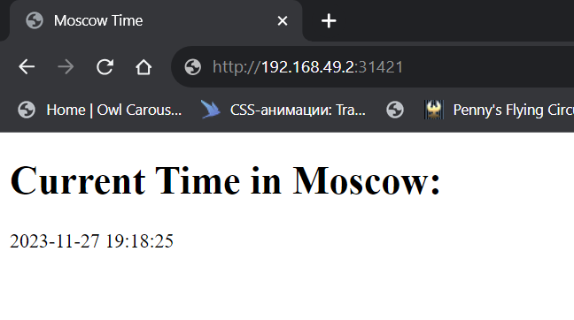
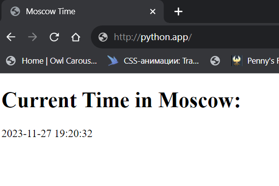

# StatefulSets

## Test Helm install

```sh
$ helm install --dry-run --debug app-python .\app-python\
install.go:214: [debug] Original chart version: ""
install.go:231: [debug] CHART PATH: C:\Users\Angel\OneDrive\Рабочий стол\repositories\dev-ops-inno\k8s\app-python

NAME: app-python
LAST DEPLOYED: Mon Nov 27 19:06:59 2023
NAMESPACE: default
STATUS: pending-install
REVISION: 1
USER-SUPPLIED VALUES:
{}

COMPUTED VALUES:
affinity: {}
autoscaling:
  enabled: false
  maxReplicas: 100
  minReplicas: 1
  targetCPUUtilizationPercentage: 80
fullnameOverride: ""
image:
  pullPolicy: IfNotPresent
  repository: bellissimo/devops-inno-daniil-okrug
  tag: latest
imagePullSecrets: []
ingress:
  annotations: {}
  className: ""
  enabled: true
  hosts:
  - host: python.app
    paths:
    - path: /
      pathType: ImplementationSpecific
  tls: []
nameOverride: ""
nodeSelector: {}
podAnnotations: {}
podLabels: {}
podSecurityContext: {}
replicaCount: 1
resources: {}
securityContext: {}
service:
  port: 5000
  type: LoadBalancer
serviceAccount:
  annotations: {}
  automount: true
  create: false
  name: internal-app
tolerations: []
volumeMounts: []
volumes: []

HOOKS:
---
# Source: app-python/templates/post-install-hook.yaml
apiVersion: v1
kind: Pod
metadata:
   name: postinstall-hook
   annotations:
       "helm.sh/hook": "post-install"
spec:
  containers:
  - name: post-install-container
    image: busybox
    imagePullPolicy: Always
    command: ['sh', '-c', 'echo The post-install hook is running && sleep 15' ]
  restartPolicy: Never
  terminationGracePeriodSeconds: 0
---
# Source: app-python/templates/pre-install-hook.yaml
apiVersion: v1
kind: Pod
metadata:
   name: preinstall-hook
   annotations:
       "helm.sh/hook": "pre-install"
spec:
  containers:
  - name: pre-install-container
    image: busybox
    imagePullPolicy: IfNotPresent
    command: ['sh', '-c', 'echo The pre-install hook is running && sleep 20' ]
  restartPolicy: Never
  terminationGracePeriodSeconds: 0
---
# Source: app-python/templates/tests/test-connection.yaml
apiVersion: v1
kind: Pod
metadata:
  name: "app-python-test-connection"
  labels:
    helm.sh/chart: app-python-0.1.0
    app.kubernetes.io/name: app-python
    app.kubernetes.io/instance: app-python
    app.kubernetes.io/version: "1.16.0"
    app.kubernetes.io/managed-by: Helm
  annotations:
    "helm.sh/hook": test
spec:
  containers:
    - name: wget
      image: busybox
      command: ['wget']
      args: ['app-python:5000']
  restartPolicy: Never
MANIFEST:
---
# Source: app-python/templates/config.yaml
apiVersion: v1
kind: ConfigMap
metadata:
  name: config-map
  namespace: default
data:
  test: test
  config.json: |-
    {
        "key_one": "val_one",
        "key_two": "val_two"
    }
---
# Source: app-python/templates/service.yaml
apiVersion: v1
kind: Service
metadata:
  name: app-python
  labels:
    helm.sh/chart: app-python-0.1.0
    app.kubernetes.io/name: app-python
    app.kubernetes.io/instance: app-python
    app.kubernetes.io/version: "1.16.0"
    app.kubernetes.io/managed-by: Helm
spec:
  type: LoadBalancer
  ports:
    - port: 5000
      targetPort: http
      protocol: TCP
      name: http
  selector:
    app.kubernetes.io/name: app-python
    app.kubernetes.io/instance: app-python
---
# Source: app-python/templates/statefulset.yaml
apiVersion: apps/v1
kind: StatefulSet
metadata:
  name: app-python
  labels:
    helm.sh/chart: app-python-0.1.0
    app.kubernetes.io/name: app-python
    app.kubernetes.io/instance: app-python
    app.kubernetes.io/version: "1.16.0"
    app.kubernetes.io/managed-by: Helm
spec:
  replicas: 3
  selector:
    matchLabels:
      app.kubernetes.io/name: app-python
      app.kubernetes.io/instance: app-python
  template:
    metadata:
      labels:
        helm.sh/chart: app-python-0.1.0
        app.kubernetes.io/name: app-python
        app.kubernetes.io/instance: app-python
        app.kubernetes.io/version: "1.16.0"
        app.kubernetes.io/managed-by: Helm
    spec:
      serviceAccountName: internal-app
      securityContext:
        {}
      containers:
        - name: app-python
          securityContext:
            {}
          image: "bellissimo/devops-inno-daniil-okrug:latest"
          imagePullPolicy: IfNotPresent
          env:
            - name: "MY_PASS"
              valueFrom:
                secretKeyRef:
                  name: mypass
                  key: password
            - name: SPECIAL_TYPE_KEY
              valueFrom:
                configMapKeyRef:
                  name: config-map-entity-py
                  key: test
          volumeMounts:
            - name: config-volume-py
              mountPath: "/config.json"
              subPath: config.json
            - name: counter-data-py
              mountPath: /data
          ports:
            - name: http
              containerPort: 5000
              protocol: TCP
          livenessProbe:
            httpGet:
              path: /
              port: http
          readinessProbe:
            httpGet:
              path: /
              port: http
            timeoutSeconds: 30
            initialDelaySeconds: 30
          resources:
            {}
---
# Source: app-python/templates/ingress.yaml
apiVersion: networking.k8s.io/v1
kind: Ingress
metadata:
  name: app-python
  labels:
    helm.sh/chart: app-python-0.1.0
    app.kubernetes.io/name: app-python
    app.kubernetes.io/instance: app-python
    app.kubernetes.io/version: "1.16.0"
    app.kubernetes.io/managed-by: Helm
spec:
  rules:
    - host: "python.app"
      http:
        paths:
          - path: /
            pathType: ImplementationSpecific
            backend:
              service:
                name: app-python
                port:
                  number: 5000

NOTES:
1. Get the application URL by running these commands:
  http://python.app/
```

## Helm install
```sh
$ helm install app-python .\app-python\
NAME: app-python
LAST DEPLOYED: Mon Nov 27 19:07:51 2023
NAMESPACE: default
STATUS: deployed
REVISION: 1
NOTES:
1. Get the application URL by running these commands:
  http://python.app/
```

## Outputs

```sh
$ kubectl get po,sts,svc,pvc
NAME                                        READY   STATUS      RESTARTS        AGE
pod/app-python-0                            1/1     Running     0               2m33s
pod/app-python-1                            1/1     Running     0               2m49s
pod/app-python-2                            1/1     Running     0               2m52s
pod/app-python-pass-849df9b76c-zvpl7        1/1     Running     4 (91m ago)     14d
pod/postinstall-hook                        0/1     Completed   0               2m22s
pod/preinstall-hook                         0/1     Completed   0               2m45s
pod/vault-0                                 1/1     Running     3 (91m ago)     13d
pod/vault-agent-injector-5cd8b87c6c-lmc4q   1/1     Running     3 (4d23h ago)   13d

NAME                          READY   AGE
statefulset.apps/app-python   0/1     2m22s
statefulset.apps/vault        1/1     13d

NAME                               TYPE           CLUSTER-IP      EXTERNAL-IP   PORT(S)             AGE
service/app-python                 LoadBalancer   10.96.226.226   <pending>     5000:30389/TCP      2m22s
service/app-python-pass            LoadBalancer   10.111.89.90    <pending>     5000:30654/TCP      14d
service/kubernetes                 ClusterIP      10.96.0.1       <none>        443/TCP             25d
service/vault                      ClusterIP      10.102.141.65   <none>        8200/TCP,8201/TCP   13d
service/vault-agent-injector-svc   ClusterIP      10.105.18.133   <none>        443/TCP             13d
service/vault-internal             ClusterIP      None            <none>        8200/TCP,8201/TCP   13d
```

```sh
$ minikube service app-python
|-----------|------------|-------------|---------------------------|
| NAMESPACE |    NAME    | TARGET PORT |            URL            |
|-----------|------------|-------------|---------------------------|
| default   | app-python | http/5000   | http://192.168.49.2:30389 |
|-----------|------------|-------------|---------------------------|
🏃  Starting tunnel for service app-python.
|-----------|------------|-------------|------------------------|
| NAMESPACE |    NAME    | TARGET PORT |          URL           |
|-----------|------------|-------------|------------------------|
| default   | app-python |             | http://127.0.0.1:50376 |
|-----------|------------|-------------|------------------------|
🎉  Opening service default/app-python in default browser...
❗  Because you are using a Docker driver on windows, the terminal needs to be open to run it.
```

## App in Browser





## Visits

```sh
$ kubectl exec pod/app-python-0  -- cat visits && echo
3
```

```sh
$ kubectl exec pod/app-python-1  -- cat visits && echo
2
```

```sh
$ kubectl exec pod/app-python-2  -- cat visits && echo
4
```

- Explain why ordering guarantees are unnecessary for your app.  

Answer: Each pod has own file with data

- Implement a way to instruct the StatefulSet controller to launch or terminate all Pods in parallel.

```sh
  podManagementPolicy: "Parallel"
  updateStrategy:
    type: RollingUpdate
    rollingUpdate:
      partition: 0
```

