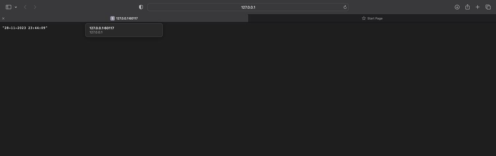
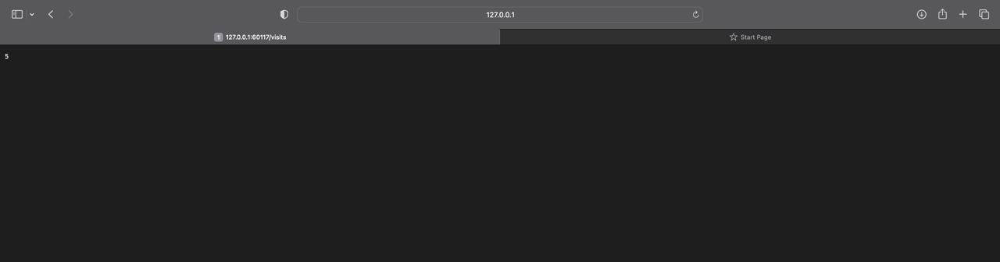

# StatefulSet

## Task 1

```
helm install --dry-run --debug pyapp . --values values.python.yaml
```

```
install.go:214: [debug] Original chart version: ""
install.go:231: [debug] CHART PATH: /Users/art22m/develop/iu/F23-DevOps/k8s/helm-app

NAME: pyapp
LAST DEPLOYED: Tue Nov 28 23:53:12 2023
NAMESPACE: default
STATUS: pending-install
REVISION: 1
USER-SUPPLIED VALUES:
affinity: {}
autoscaling:
  enabled: false
  maxReplicas: 100
  minReplicas: 1
  targetCPUUtilizationPercentage: 80
fullnameOverride: ""
image:
  pullPolicy: IfNotPresent
  repository: art22m/pyapp
  tag: latest
imagePullSecrets: []
ingress:
  annotations: {}
  className: ""
  enabled: false
  hosts:
  - host: chart-example.local
    paths:
    - path: /
      pathType: ImplementationSpecific
  tls: []
nameOverride: ""
nodeSelector: {}
podAnnotations:
  vault.hashicorp.com/agent-inject: "true"
  vault.hashicorp.com/agent-inject-secret-database-config.txt: internal/data/database/config
  vault.hashicorp.com/role: internal-app
podLabels: {}
podSecurityContext: {}
replicaCount: 2
resources:
  limits:
    cpu: 200m
    memory: 512Mi
  requests:
    cpu: 200m
    memory: 512Mi
securityContext: {}
service:
  name: python-app
  port: 8000
  type: LoadBalancer
serviceAccount:
  annotations: {}
  automount: true
  create: true
  name: internal-app
tolerations: []
volumeClaim:
  accessModes:
  - ReadWriteOnce
  name: visits
  storageSize: 1Mi
volumeMounts:
- mountPath: /config.json
  name: config
  readOnly: true
  subPath: config.json
- mountPath: /app/volume/
  name: visits
volumes:
- configMap:
    name: my-configmap
  name: config
```

---

```
helm install pyapp . --values values.python.yaml
```

```
NAME: pyapp
LAST DEPLOYED: Tue Nov 28 23:53:57 2023
NAMESPACE: default
STATUS: deployed
REVISION: 1
NOTES:
1. Get the application URL by running these commands:
     NOTE: It may take a few minutes for the LoadBalancer IP to be available.
           You can watch the status of by running 'kubectl get --namespace default svc -w pyapp-helm-app'
  export SERVICE_IP=$(kubectl get svc --namespace default pyapp-helm-app --template "{{ range (index .status.loadBalancer.ingress 0) }}{{.}}{{ end }}")
  echo http://$SERVICE_IP:8000
```

## Task 2


```
kubectl get po,sts,svc,pvc
```

```
NAME                              READY   STATUS    RESTARTS      AGE
pod/app-python-dbfc8f6b4-5gsbm    1/1     Running   5 (21m ago)   27d
pod/go-app-58b7c44d98-6dl5n       1/1     Running   5 (21m ago)   27d
pod/go-app-58b7c44d98-g5rl9       1/1     Running   5 (21m ago)   27d
pod/go-app-58b7c44d98-tvwhs       1/1     Running   5 (21m ago)   27d
pod/pyapp-helm-app-0              1/1     Running   0             65s
pod/pyapp-helm-app-1              1/1     Running   0             54s
pod/python-app-84c9748db8-btxx8   1/1     Running   5 (21m ago)   27d
pod/python-app-84c9748db8-f2k6v   1/1     Running   5 (21m ago)   27d
pod/python-app-84c9748db8-nptck   1/1     Running   5 (21m ago)   27d

NAME                              READY   AGE
statefulset.apps/pyapp-helm-app   2/2     65s

NAME                     TYPE           CLUSTER-IP       EXTERNAL-IP   PORT(S)          AGE
service/go-app           NodePort       10.108.176.231   <none>        9000:32732/TCP   27d
service/kubernetes       ClusterIP      10.96.0.1        <none>        443/TCP          27d
service/pyapp-helm-app   LoadBalancer   10.108.135.43    <pending>     8000:30067/TCP   65s
service/python-app       NodePort       10.96.121.224    <none>        8000:32713/TCP   27d

NAME                                             STATUS   VOLUME                                     CAPACITY   ACCESS MODES   STORAGECLASS   AGE
persistentvolumeclaim/visits-pyapp-helm-app-0    Bound    pvc-eaf42721-b735-4462-8248-69c5809dbb62   1Mi        RWO            standard       9h
persistentvolumeclaim/visits-pyapp-helm-app-1    Bound    pvc-59a53545-8943-4a86-84fa-e21b97b6d7ac   1Mi        RWO            standard       54s
persistentvolumeclaim/visits-python-helm-app-0   Bound    pvc-40a805e8-0063-42bf-a7f3-6bbc7501f285   1Mi        RWO            standard       9h
```

---

```
minikube service pyapp-helm-app
```

```
|-----------|----------------|-------------|---------------------------|
| NAMESPACE |      NAME      | TARGET PORT |            URL            |
|-----------|----------------|-------------|---------------------------|
| default   | pyapp-helm-app | http/8000   | http://192.168.49.2:32011 |
|-----------|----------------|-------------|---------------------------|
🏃  Starting tunnel for service pyapp-helm-app.
|-----------|----------------|-------------|------------------------|
| NAMESPACE |      NAME      | TARGET PORT |          URL           |
|-----------|----------------|-------------|------------------------|
| default   | pyapp-helm-app |             | http://127.0.0.1:60117 |
|-----------|----------------|-------------|------------------------|
🎉  Opening service default/pyapp-helm-app in default browser...
❗  Because you are using a Docker driver on darwin, the terminal needs to be open to run it.
```

---
Example of usage: 




```
❯ curl 127.0.0.1:60117
"28-11-2023 23:46:14"

❯ curl 127.0.0.1:60117/visits
6
```

--- 
Content of each file in each pods:

```
❯ kubectl exec pyapp-helm-app-0 -- cat /app/volume/visits
6
❯ kubectl exec pyapp-helm-app-1 -- cat /app/volume/visits
2
```

---
Results:

Since each node has its own persistent volume, visits file would not be the same. This `/visits` gives different results.

---
Ordering:

StatefulSet apps do not need ordering because each pod is uniquely identified and has stable network identities. The pods can retrieve their previous state from storage and resume operations even when rescheduled on different nodes. This ensures appropriate order and uniqueness, making ordering guarantees unnecessary for the stateful application to function correctly.

---
Launch and terminate in parallel:

To do this I have added  `podManagementPolicy: Parallel` to `statefulset.yaml`

```
NAME                              READY   STATUS    RESTARTS      AGE
pod/pyapp-helm-app-0              1/1     Running   0             5s
pod/pyapp-helm-app-1              1/1     Running   0             5s
```

## Bonus

Update strategies:

1. Rolling Update: This strategy involves gradually replacing the old version of the application with the new version, one pod at a time. The new pods are gradually added while the old ones are gradually removed, ensuring that there is always a certain number of pods running at any given time. This strategy is best suited for applications that can handle multiple versions running simultaneously.

2. Blue-Green Deployment: In this strategy, two identical environments (blue and green) are set up, with only one environment active at any given time. The new version of the application is deployed in the inactive environment, and once it has been tested and verified, traffic is switched over to the new environment. This strategy ensures minimal downtime and rollback in case of issues.

3. Canary Deployment: This strategy involves deploying the new version of the application to a small subset of users or pods, while keeping the rest on the old version. This allows for testing and verification of the new version before it is rolled out to all users. If any issues are detected, the deployment can be rolled back easily.

Each deployment strategy has its own advantages and disadvantages, and the choice of strategy depends on the specific requirements of the application and the organization's goals.
