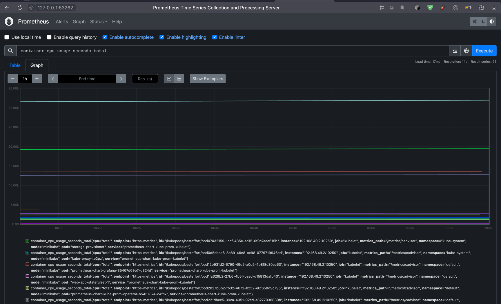
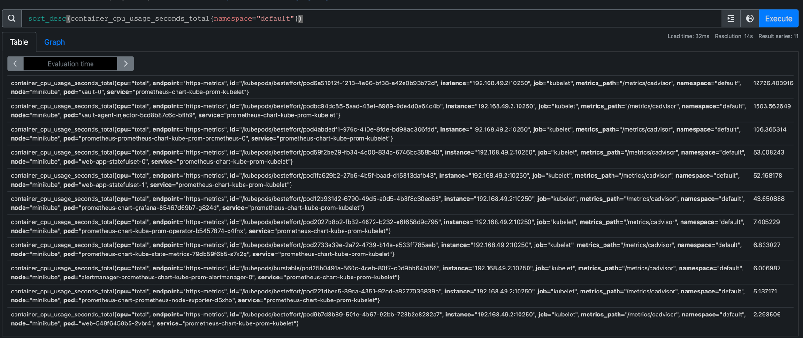
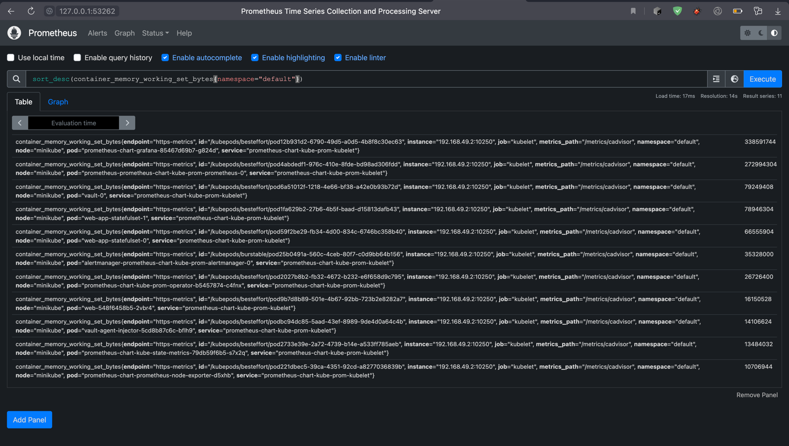
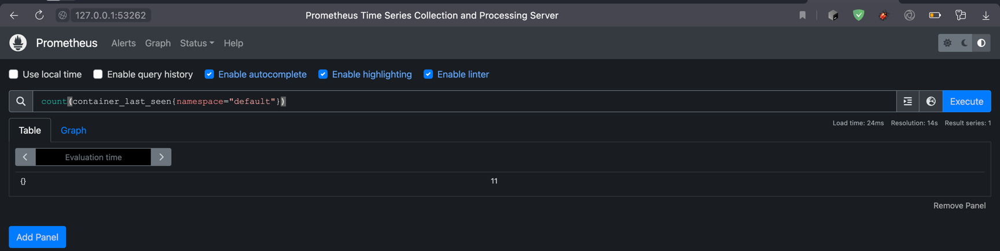
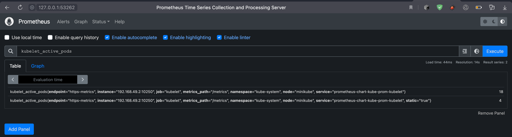
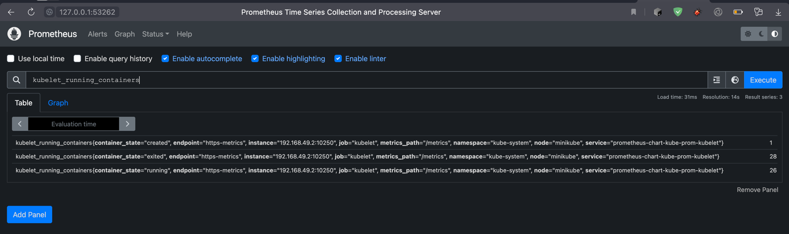
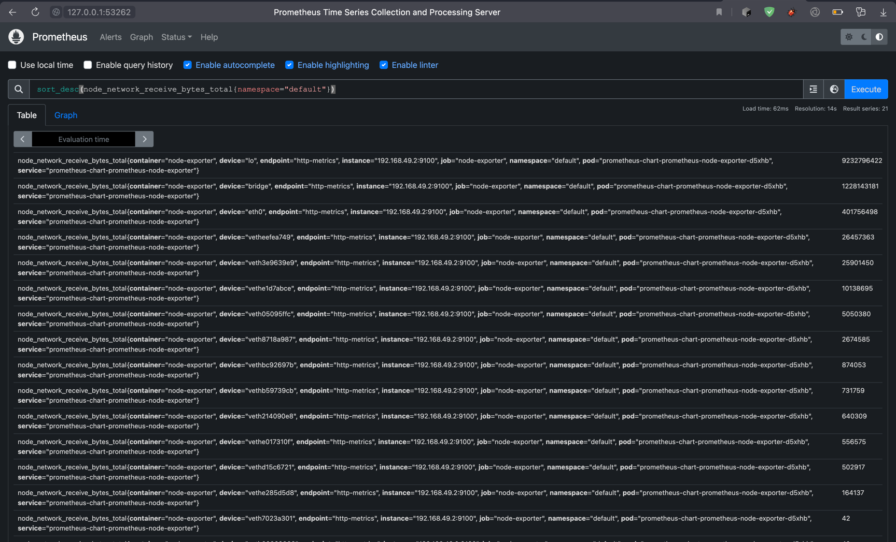
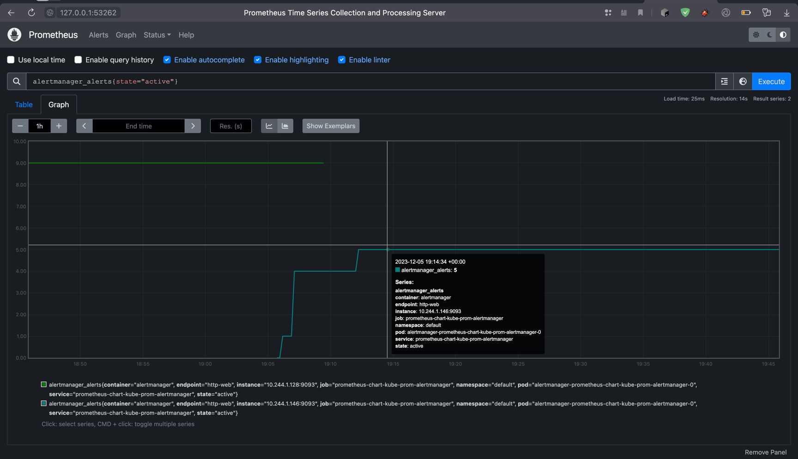
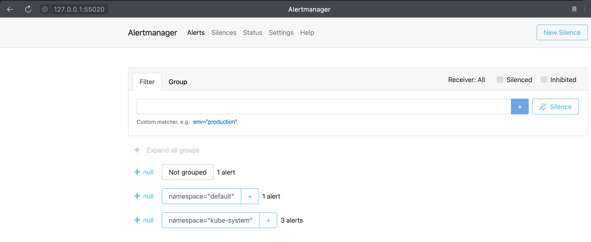
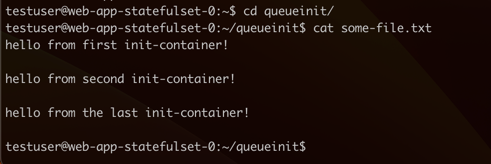

### Components:
1. The Prometheus Operator
   - A tool that simplifies prometheus deployment by providing common configurations 
2. Highly available Prometheus
   - Monitoring system that manages metrics and allows to aggregate them by any custom query 
4. Highly available Alertmanager
   - Alerting system that can observe data from prometheus and send alerts to different receivers 
5. Prometheus node-exporter
   - A service that exports host metrics (such as cpu/system time/os release info/...) to prometheus
6. Prometheus Adapter for Kubernetes Metrics APIs
   - Adapter for Prometheus that gathers metrics (by some configuration) and exposes them to Kubernetes API server 
7. kube-state-metrics
   - A service that takes generates state metrics by data from the Kubernetes API server 
8. Grafana
   - Visualisation tool that can show metrics from different sources, such as Loki, Prometheus and many others


### Getting data after installation: 
`kubectl get po,sts,svc,pvc,cm`

The helm installed 6 pods for each component:
```
NAME                                                         READY   STATUS    RESTARTS         AGE
pod/alertmanager-prometheus-chart-kube-prom-alertmanager-0   2/2     Running   0                2m32s
pod/prometheus-chart-grafana-85467d69b7-g824d                3/3     Running   0                3m12s
pod/prometheus-chart-kube-prom-operator-b5457874-c4fnx       1/1     Running   0                3m12s
pod/prometheus-chart-kube-state-metrics-79db59f6b5-s7x2q     1/1     Running   0                3m12s
pod/prometheus-chart-prometheus-node-exporter-d5xhb          1/1     Running   0                3m12s
pod/prometheus-prometheus-chart-kube-prom-prometheus-0       2/2     Running   0                2m32s
pod/vault-0                                                  1/1     Running   6 (7d ago)       21d
pod/vault-agent-injector-5cd8b87c6c-bflh9                    1/1     Running   6 (7d12h ago)    21d
pod/web-548f6458b5-2vbr4                                     1/1     Running   11 (7d12h ago)   35d
pod/web-app-statefulset-0                                    1/1     Running   0                51s
pod/web-app-statefulset-1                                    1/1     Running   0                51s
```
One statefulset for alertmanager and one for prometheus to ensure their data won't be lost: 
```
NAME                                                                    READY   AGE
statefulset.apps/alertmanager-prometheus-chart-kube-prom-alertmanager   1/1     2m32s
statefulset.apps/prometheus-prometheus-chart-kube-prom-prometheus       1/1     2m32s
statefulset.apps/vault                                                  1/1     21d
statefulset.apps/web-app-statefulset                                    2/2     51s
```
A service for each component (8):
```
NAME                                                TYPE        CLUSTER-IP      EXTERNAL-IP   PORT(S)                      AGE
service/alertmanager-operated                       ClusterIP   None            <none>        9093/TCP,9094/TCP,9094/UDP   2m32s
service/app-python-chart                            ClusterIP   10.103.12.112   <none>        8000/TCP                     51s
service/kubernetes                                  ClusterIP   10.96.0.1       <none>        443/TCP                      37d
service/prometheus-chart-grafana                    ClusterIP   10.105.100.9    <none>        80/TCP                       3m12s
service/prometheus-chart-kube-prom-alertmanager     ClusterIP   10.107.240.72   <none>        9093/TCP,8080/TCP            3m12s
service/prometheus-chart-kube-prom-operator         ClusterIP   10.108.14.204   <none>        443/TCP                      3m12s
service/prometheus-chart-kube-prom-prometheus       ClusterIP   10.101.49.171   <none>        9090/TCP,8080/TCP            3m12s
service/prometheus-chart-kube-state-metrics         ClusterIP   10.101.27.127   <none>        8080/TCP                     3m12s
service/prometheus-chart-prometheus-node-exporter   ClusterIP   10.105.53.9     <none>        9100/TCP                     3m12s
service/prometheus-operated                         ClusterIP   None            <none>        9090/TCP                     2m32s
service/vault                                       ClusterIP   10.104.121.35   <none>        8200/TCP,8201/TCP            21d
service/vault-agent-injector-svc                    ClusterIP   10.96.237.74    <none>        443/TCP                      21d
service/vault-internal                              ClusterIP   None            <none>        8200/TCP,8201/TCP            21d
```
No new persistent volumes (all of them are the old ones):
```
NAME                                                         STATUS   VOLUME                                     CAPACITY   ACCESS MODES   STORAGECLASS   AGE
persistentvolumeclaim/example-config-web-app-statefulset-0   Bound    pvc-26407bfa-52e1-486b-adf1-391fee4612a5   1Gi        RWO            standard       6d19h
persistentvolumeclaim/example-config-web-app-statefulset-1   Bound    pvc-e028a420-d569-4feb-8e68-1b3e68d75656   1Gi        RWO            standard       6d19h
persistentvolumeclaim/extra-volume-web-app-statefulset-0     Bound    pvc-e9f6eaf6-c1da-45c7-820d-832f1cf0c8ee   1Gi        RWO            standard       6d19h
persistentvolumeclaim/extra-volume-web-app-statefulset-1     Bound    pvc-7891dc82-f4c8-407a-aa47-b545520808c9   1Gi        RWO            standard       6d19h
persistentvolumeclaim/www-web-app-statefulset-0              Bound    pvc-36089fb2-0c8d-4a55-9841-ac6b09a907b5   1Gi        RWO            standard       6d19h
persistentvolumeclaim/www-web-app-statefulset-1              Bound    pvc-22baebaf-9fd9-44a2-8911-8e133aa98335   1Gi        RWO            standard       6d19h
```
And lots of config maps to configure each of the stack components:
```
NAME                                                                     DATA   AGE
configmap/kube-root-ca.crt                                               1      37d
configmap/my-application-config                                          1      51s
configmap/my-environment-config                                          2      51s
configmap/prometheus-chart-grafana                                       1      3m12s
configmap/prometheus-chart-grafana-config-dashboards                     1      3m12s
configmap/prometheus-chart-kube-prom-alertmanager-overview               1      3m12s
configmap/prometheus-chart-kube-prom-apiserver                           1      3m12s
configmap/prometheus-chart-kube-prom-cluster-total                       1      3m12s
configmap/prometheus-chart-kube-prom-controller-manager                  1      3m12s
configmap/prometheus-chart-kube-prom-etcd                                1      3m12s
configmap/prometheus-chart-kube-prom-grafana-datasource                  1      3m12s
configmap/prometheus-chart-kube-prom-grafana-overview                    1      3m12s
configmap/prometheus-chart-kube-prom-k8s-coredns                         1      3m12s
configmap/prometheus-chart-kube-prom-k8s-resources-cluster               1      3m12s
configmap/prometheus-chart-kube-prom-k8s-resources-multicluster          1      3m12s
configmap/prometheus-chart-kube-prom-k8s-resources-namespace             1      3m12s
configmap/prometheus-chart-kube-prom-k8s-resources-node                  1      3m12s
configmap/prometheus-chart-kube-prom-k8s-resources-pod                   1      3m12s
configmap/prometheus-chart-kube-prom-k8s-resources-workload              1      3m12s
configmap/prometheus-chart-kube-prom-k8s-resources-workloads-namespace   1      3m12s
configmap/prometheus-chart-kube-prom-kubelet                             1      3m12s
configmap/prometheus-chart-kube-prom-namespace-by-pod                    1      3m12s
configmap/prometheus-chart-kube-prom-namespace-by-workload               1      3m12s
configmap/prometheus-chart-kube-prom-node-cluster-rsrc-use               1      3m12s
configmap/prometheus-chart-kube-prom-node-rsrc-use                       1      3m12s
configmap/prometheus-chart-kube-prom-nodes                               1      3m12s
configmap/prometheus-chart-kube-prom-nodes-darwin                        1      3m12s
configmap/prometheus-chart-kube-prom-persistentvolumesusage              1      3m12s
configmap/prometheus-chart-kube-prom-pod-total                           1      3m12s
configmap/prometheus-chart-kube-prom-prometheus                          1      3m12s
configmap/prometheus-chart-kube-prom-proxy                               1      3m12s
configmap/prometheus-chart-kube-prom-scheduler                           1      3m12s
configmap/prometheus-chart-kube-prom-workload-total                      1      3m12s
configmap/prometheus-prometheus-chart-kube-prom-prometheus-rulefiles-0   34     2m32s
```


### Exploring dashboards:

After installation I have a big dashboard list:


#### CPU
I also found data for pods cpu at my prometheus page:


In my case lowest and highest cpu usages are on pods:


MAX CPU: `vault` (from one of the previous labs)
MIN CPI: `web-548f6458b5-2vbr4` (also created from previous labs)

After filtering current lab only I have:
MAX CPU: `prometheus-prometheus-chart-kube-prom-prometheus-0` pod 
MIN CPU: `prometheus-chart-prometheus-node-exporter-d5xhb` pod

#### For memory usages I have:


MAX MEMORY: `prometheus-chart-grafana-85467d69b7-g824d` pod (322 MB)
MIN MEMORY: `prometheus-chart-prometheus-node-exporter-d5xhb` pod (10.3 MB)


#### Containers count:


#### Active pods:


#### Running containers:


#### Network usage:


#### Active alerts:





## Testing init container
`kubectl exec -it web-app-statefulset-0 -- cat html/test.html`

`Defaulted container "app-python" out of: app-python, wget-something (init)`
```
<html><head></head><body><header>
<title>http://info.cern.ch</title>
</header>

<h1>http://info.cern.ch - home of the first website</h1>
<p>From here you can:</p>
<ul>
<li><a href="http://info.cern.ch/hypertext/WWW/TheProject.html">Browse the first website</a></li>
<li><a href="http://line-mode.cern.ch/www/hypertext/WWW/TheProject.html">Browse the first website using the line-mode browser simulator</a></li>
<li><a href="http://home.web.cern.ch/topics/birth-web">Learn about the birth of the web</a></li>
<li><a href="http://home.web.cern.ch/about">Learn about CERN, the physics laboratory where the web was born</a></li>
</ul>
</body></html>
```


## Bonus initContainers check
`kubectl exec -it web-app-statefulset-0 -- bash`


or via cat:
`kubectl exec -it web-app-statefulset-0 -- cat queueinit/some-file.txt`

`Defaulted container "app-python" out of: app-python, wget-something (init), echo-first-line-to-file (init), echo-another-line-to-file (init), echo-one-more-line-to-file (init)`
```
hello from first init-container!

hello from second init-container!

hello from the last init-container!
```