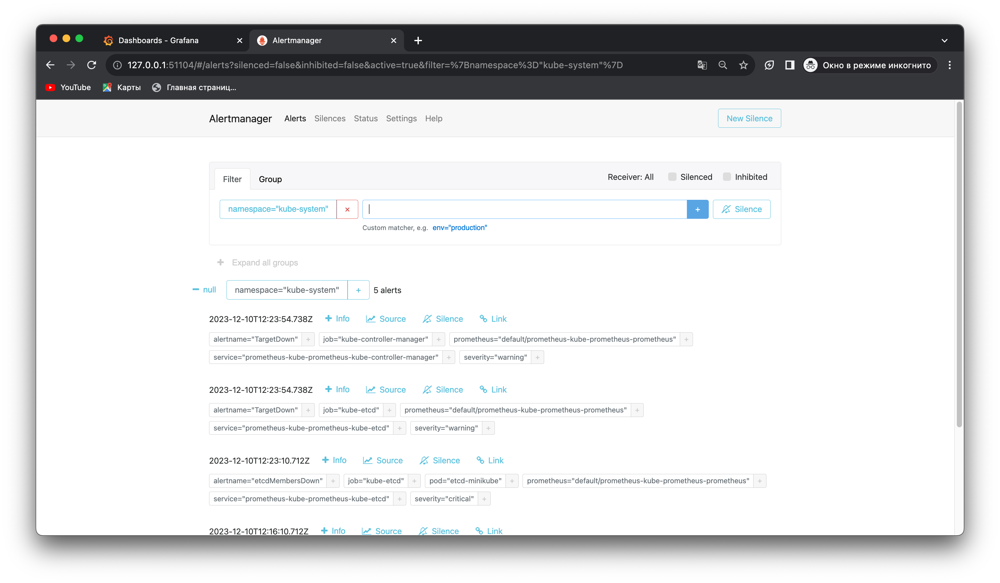
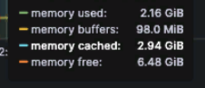
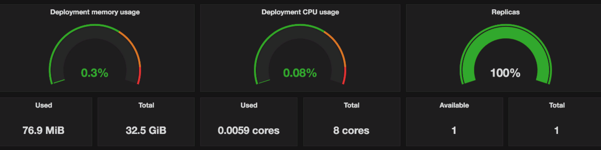
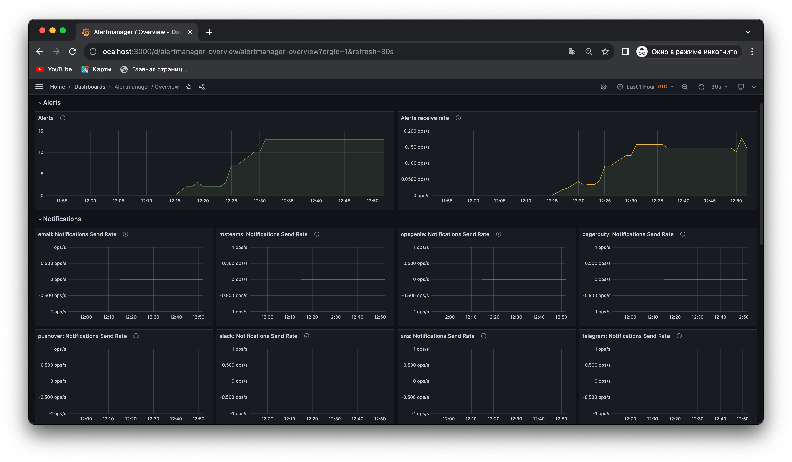
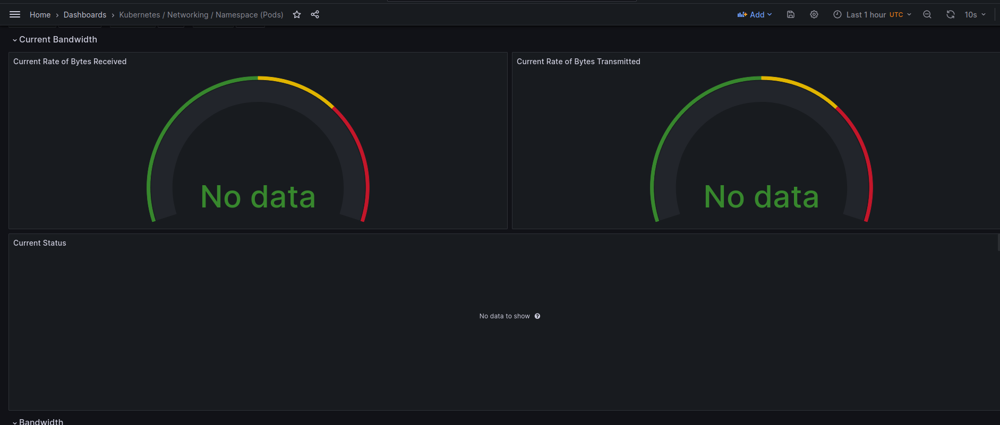
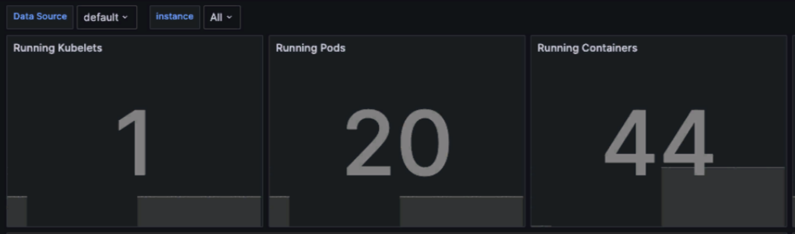

# Lab 14: Kubernetes Monitoring and Init Containers

- Pods (po):
    - app-python-pass, vault, vault-agent-injector: Application and related components.
    - monitoring-*: Components of the Kube Prometheus Stack. The ContainerCreating status indicates that these containers are still initializing.
    - postinstall-hook, preinstall-hook: Likely related to Helm chart installations, indicating completed initialization tasks.
    - monitoring-prometheus-node-exporter: Part of the Prometheus stack, collecting node metrics.

- StatefulSets (sts):
    - app-python, vault: Stateful applications, ensuring order and uniqueness.

- Services (svc):
    - Various services exposing your applications (app-python, vault) and Prometheus components (monitoring-*). The ClusterIP type makes them accessible within the cluster.

- ConfigMaps (cm):
    - Various configuration data for your applications and Prometheus components. These are crucial for configuring the behavior of applications and Prometheus components.

- Kube Pometheus Stack:
    - Prometheus Operator: Automates the deployment, configuration, and management of Prometheus and related monitoring components.
    
    - Prometheus: Core component for collecting and storing metrics data.

    - Alertmanager: Manages and processes alerts sent by Prometheus.

    - Grafana: Visualization and dashboarding tool.

    - Node Exporter: Exports hardware and OS metrics exposed by *NIX kernels.

    - Kube State Metrics: Provides Kubernetes cluster-level metrics.

    - Additional Components:
        -   Prometheus Adapter for Kubernetes Metrics APIs: An API server that provides Kubernetes-style metrics APIs for Prometheus metrics.
        -   Prometheus Pushgateway: Allows ephemeral and batch jobs to expose their metrics to Prometheus.
        -   Blackbox Exporter: Allows blackbox probing of endpoints over HTTP, HTTPS, DNS, TCP, and ICMP.

```sh
kubectl get po,sts,svc,pvc,cm
NAME                                                      READY   STATUS              RESTARTS     AGE
pod/app-python-pass-849df9b76c-zvpl7                      1/1     Running             5 (8d ago)   22d
pod/monitoring-grafana-6f8d546676-5cx6s                   0/3     ContainerCreating   0            26s
pod/monitoring-kube-prometheus-operator-5fbb66b4b-vlrbw   0/1     ContainerCreating   0            26s
pod/monitoring-kube-state-metrics-74f4d8858f-7l6vr        0/1     Running             0            26s
pod/monitoring-prometheus-node-exporter-s6kml             1/1     Running             0            26s
pod/postinstall-hook                                      0/1     Completed           0            8d
pod/preinstall-hook                                       0/1     Completed           0            8d
pod/vault-0                                               1/1     Running             4 (8d ago)   22d
pod/vault-agent-injector-5cd8b87c6c-lmc4q                 1/1     Running             4 (8d ago)   22d

NAME                          READY   AGE
statefulset.apps/app-python   0/1     8d
statefulset.apps/vault        1/1     22d

NAME                                              TYPE           CLUSTER-IP       EXTERNAL-IP   PORT(S)             AGE
service/app-python                                LoadBalancer   10.96.226.226    <pending>     5000:30389/TCP      8d
service/app-python-pass                           LoadBalancer   10.111.89.90     <pending>     5000:30654/TCP      22d
service/kubernetes                                ClusterIP      10.96.0.1        <none>        443/TCP             34d
service/monitoring-grafana                        ClusterIP      10.106.15.176    <none>        80/TCP              26s
service/monitoring-kube-prometheus-alertmanager   ClusterIP      10.110.138.119   <none>        9093/TCP,8080/TCP   26s
service/monitoring-kube-prometheus-operator       ClusterIP      10.104.143.233   <none>        443/TCP             26s
service/monitoring-kube-prometheus-prometheus     ClusterIP      10.101.121.147   <none>        9090/TCP,8080/TCP   26s
service/monitoring-kube-state-metrics             ClusterIP      10.106.213.85    <none>        8080/TCP            26s
service/monitoring-prometheus-node-exporter       ClusterIP      10.108.56.178    <none>        9100/TCP            26s
service/vault                                     ClusterIP      10.102.141.65    <none>        8200/TCP,8201/TCP   22d
service/vault-agent-injector-svc                  ClusterIP      10.105.18.133    <none>        443/TCP             22d
service/vault-internal                            ClusterIP      None             <none>        8200/TCP,8201/TCP   22d

NAME                                                                     DATA   AGE
configmap/config-map                                                     2      8d
configmap/kube-root-ca.crt                                               1      34d
configmap/monitoring-grafana                                             1      27s
configmap/monitoring-grafana-config-dashboards                           1      27s
configmap/monitoring-kube-prometheus-alertmanager-overview               1      27s
configmap/monitoring-kube-prometheus-apiserver                           1      27s
configmap/monitoring-kube-prometheus-cluster-total                       1      27s
configmap/monitoring-kube-prometheus-controller-manager                  1      27s
configmap/monitoring-kube-prometheus-etcd                                1      27s
configmap/monitoring-kube-prometheus-grafana-datasource                  1      27s
configmap/monitoring-kube-prometheus-grafana-overview                    1      27s
configmap/monitoring-kube-prometheus-k8s-coredns                         1      27s
configmap/monitoring-kube-prometheus-k8s-resources-cluster               1      27s
configmap/monitoring-kube-prometheus-k8s-resources-multicluster          1      27s
configmap/monitoring-kube-prometheus-k8s-resources-namespace             1      27s
configmap/monitoring-kube-prometheus-k8s-resources-node                  1      27s
configmap/monitoring-kube-prometheus-k8s-resources-pod                   1      27s
configmap/monitoring-kube-prometheus-k8s-resources-workload              1      27s
configmap/monitoring-kube-prometheus-k8s-resources-workloads-namespace   1      26s
configmap/monitoring-kube-prometheus-kubelet                             1      26s
configmap/monitoring-kube-prometheus-namespace-by-pod                    1      27s
configmap/monitoring-kube-prometheus-namespace-by-workload               1      27s
configmap/monitoring-kube-prometheus-node-cluster-rsrc-use               1      27s
configmap/monitoring-kube-prometheus-node-rsrc-use                       1      27s
configmap/monitoring-kube-prometheus-nodes                               1      27s
configmap/monitoring-kube-prometheus-nodes-darwin                        1      27s
configmap/monitoring-kube-prometheus-persistentvolumesusage              1      27s
configmap/monitoring-kube-prometheus-pod-total                           1      27s
configmap/monitoring-kube-prometheus-prometheus                          1      26s
configmap/monitoring-kube-prometheus-proxy                               1      26s
configmap/monitoring-kube-prometheus-scheduler                           1      26s
configmap/monitoring-kube-prometheus-workload-total                      1      27s
```

## Alertmanager


## Grafana Dashboard

### Node Memory Usage


### CPU and Memory consumption of StatefulSet


### Alerts


### Network usage of Pods


### Number of pods and containers managed by the Kubelet
