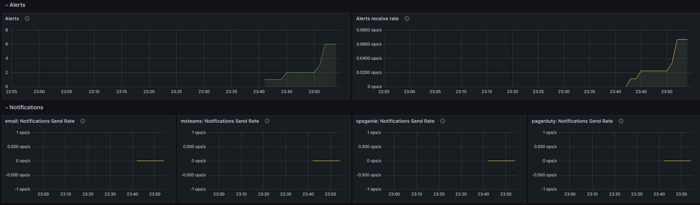
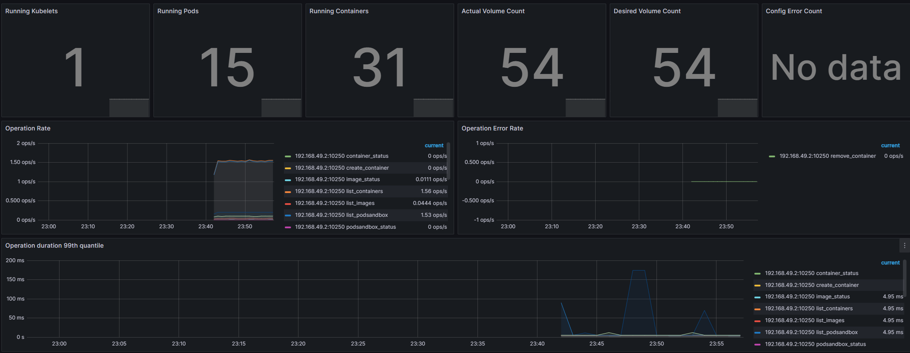

# Lab 14
## Kube Prometheus Stack
* **Prometheus** is a monitoring system that stores and analyzes metrics.
* **Alertmanager** handles alerts and forwards them to the appropriate recipients, such as email.
* **Node Exporter** collects system metrics provided by the operating system.
* **Prometheus operator** deploys and manages Prometheus in a Kubernetes cluster.
* **kube-state-metrics** collects metrics specific to the Kubernetes cluster's state.
* **Grafana** is a powerful tool for visualizing and analyzing data and metrics.

## Logs
```bash
▶kubectl get po,sts,svc,pvc,cm
NAME                                                                   READY   STATUS    RESTARTS        AGE
pod/alertmanager-kube-prometheus-stack-alertmanager-0                  2/2     Running   0               2m49s
pod/kube-prometheus-stack-grafana-41ct843d31-pdq3q                     3/3     Running   0               3m1s
pod/kube-prometheus-stack-kube-state-metrics-1q79aac41-jfd39           1/1     Running   0               3m1s
pod/kube-prometheus-stack-operator-9qz9d313nn-kckuy                    1/1     Running   0               3m1s
pod/kube-prometheus-stack-prometheus-node-exporter-7ghph               1/1     Running   0               3m1s
pod/prometheus-kube-prometheus-stack-prometheus-0                      2/2     Running   0               2m49s
pod/devops-python-app-0                                                1/1     Running   1 (4h ago)      7h
pod/devops-python-app-1                                                1/1     Running   1 (4h ago)      7h

NAME                                                                      READY   AGE
statefulset.apps/alertmanager-kube-prometheus-stack-alertmanager          1/1     2m49s
statefulset.apps/prometheus-kube-prometheus-stack-prometheus              1/1     2m49s
statefulset.apps/devops-python-app                                        2/2     7h

NAME                                                            TYPE        CLUSTER-IP       EXTERNAL-IP   PORT(S)                      AGE
service/alertmanager-operated                                   ClusterIP   None             <none>        9093/TCP,9094/TCP,9094/UDP   2m49s
service/kube-prometheus-stack-alertmanager                      ClusterIP   10.102.65.61     <none>        9093/TCP,8080/TCP            3m1s
service/kube-prometheus-stack-grafana                           ClusterIP   10.108.243.56    <none>        80/TCP                       3m1s
service/kube-prometheus-stack-kube-state-metrics                ClusterIP   10.97.167.227    <none>        8080/TCP                     3m1s
service/kube-prometheus-stack-operator                          ClusterIP   10.109.145.218   <none>        443/TCP                      3m1s
service/kube-prometheus-stack-prometheus                        ClusterIP   10.98.123.233    <none>        9090/TCP,8080/TCP            3m1s
service/kube-prometheus-stack-prometheus-node-exporter          ClusterIP   10.107.177.164   <none>        9100/TCP                     3m1s
service/kubernetes                                              ClusterIP   10.96.0.1        <none>        443/TCP                      35d
service/prometheus-operated                                     ClusterIP   None             <none>        9090/TCP                     2m49s
service/devops-python-app                                       ClusterIP   10.106.70.126    <none>        8080/TCP                     7h

NAME                                                        STATUS   VOLUME                                     CAPACITY   ACCESS MODES   STORAGECLASS   AGE
persistentvolumeclaim/counter-data-py-devops-python-app-0   Bound    pvc-7a7d78a5-7826-43be-bc71-0947fd159882   10Mi       RWO            standard       7h
persistentvolumeclaim/counter-data-py-devops-python-app-1   Bound    pvc-ceaa9a5b-ab17-4403-aa2c-d358d8425cf0   10Mi       RWO            standard       7h

NAME                                                                DATA   AGE
configmap/config-map-entity-py                                      1      7d7h
configmap/kube-prometheus-stack-alertmanager-overview               1      3m1s
configmap/kube-prometheus-stack-apiserver                           1      3m1s
configmap/kube-prometheus-stack-cluster-total                       1      3m1s
configmap/kube-prometheus-stack-controller-manager                  1      3m1s
configmap/kube-prometheus-stack-etcd                                1      3m1s
configmap/kube-prometheus-stack-grafana                             1      3m1s
configmap/kube-prometheus-stack-grafana-config-dashboards           1      3m1s
configmap/kube-prometheus-stack-grafana-datasource                  1      3m1s
configmap/kube-prometheus-stack-grafana-overview                    1      3m1s
configmap/kube-prometheus-stack-k8s-coredns                         1      3m1s
configmap/kube-prometheus-stack-k8s-resources-cluster               1      3m1s
configmap/kube-prometheus-stack-k8s-resources-multicluster          1      3m1s
configmap/kube-prometheus-stack-k8s-resources-namespace             1      3m1s
configmap/kube-prometheus-stack-k8s-resources-node                  1      3m1s
configmap/kube-prometheus-stack-k8s-resources-pod                   1      3m1s
configmap/kube-prometheus-stack-k8s-resources-workload              1      3m1s
configmap/kube-prometheus-stack-k8s-resources-workloads-namespace   1      3m1s
configmap/kube-prometheus-stack-kubelet                             1      3m1s
configmap/kube-prometheus-stack-namespace-by-pod                    1      3m1s
configmap/kube-prometheus-stack-namespace-by-workload               1      3m1s
configmap/kube-prometheus-stack-node-cluster-rsrc-use               1      3m1s
configmap/kube-prometheus-stack-node-rsrc-use                       1      3m1s
configmap/kube-prometheus-stack-nodes                               1      3m1s
configmap/kube-prometheus-stack-nodes-darwin                        1      3m1s
configmap/kube-prometheus-stack-persistentvolumesusage              1      3m1s
configmap/kube-prometheus-stack-pod-total                           1      3m1s
configmap/kube-prometheus-stack-prometheus                          1      3m1s
configmap/kube-prometheus-stack-proxy                               1      3m1s
configmap/kube-prometheus-stack-scheduler                           1      3m1s
configmap/kube-prometheus-stack-workload-total                      1      3m1s
configmap/kube-root-ca.crt                                          1      35d
configmap/prometheus-kube-prometheus-stack-prometheus-rulefiles-0   34     2m49s
```

- `pod/alertmanager-kube-prometheus-stack-alertmanager-0` - Alertmanager
- `pod/kube-prometheus-stack-grafana-41ct843d31-pdq3q` - Grafana
- `pod/kube-prometheus-stack-kube-state-metrics-1q79aac41-jfd39` - kube-state-metrics
- `pod/kube-prometheus-stack-operator-9qz9d313nn-kckuy` - Prometheus operator
- `pod/kube-prometheus-stack-prometheus-node-exporter-7ghph` - Node exporter
- `pod/prometheus-kube-prometheus-stack-prometheus-0` - Prometheus

- `statefulset.apps/alertmanager-kube-prometheus-stack-alertmanager` - Alertmanager
- `statefulset.apps/prometheus-kube-prometheus-stack-prometheus` - Prometheus
- `statefulset.apps/devops-python-app` - Python app

## Grafana screenshots


