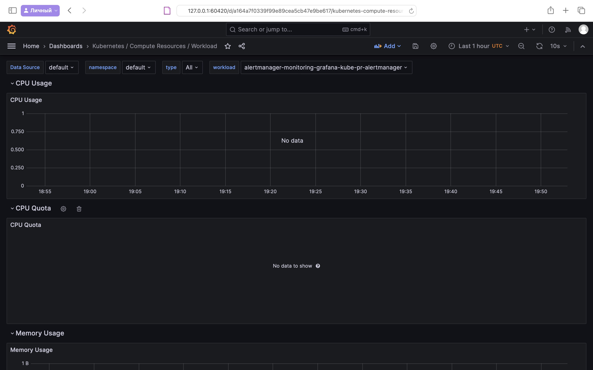
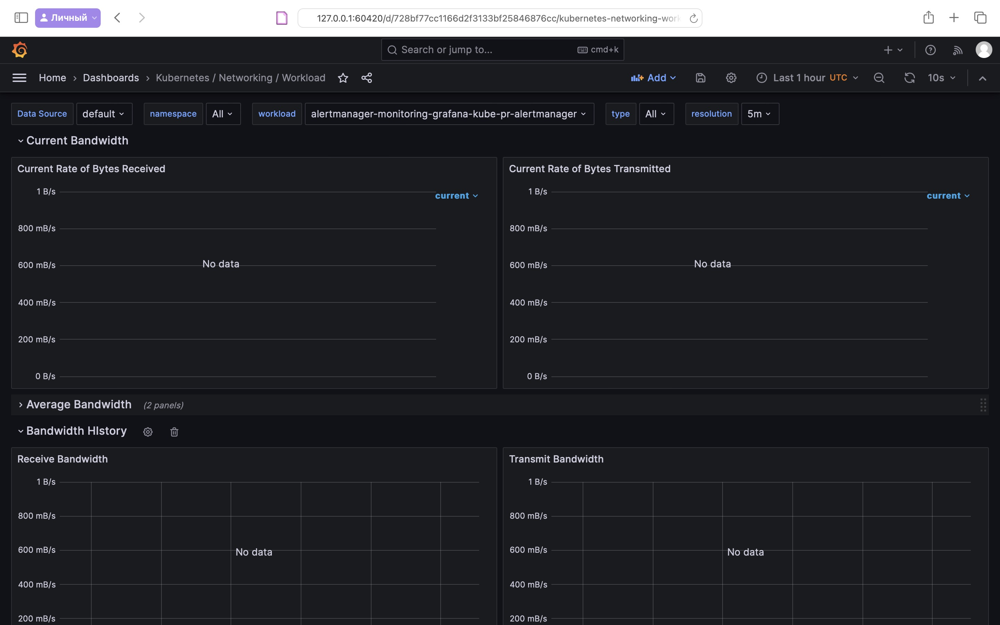
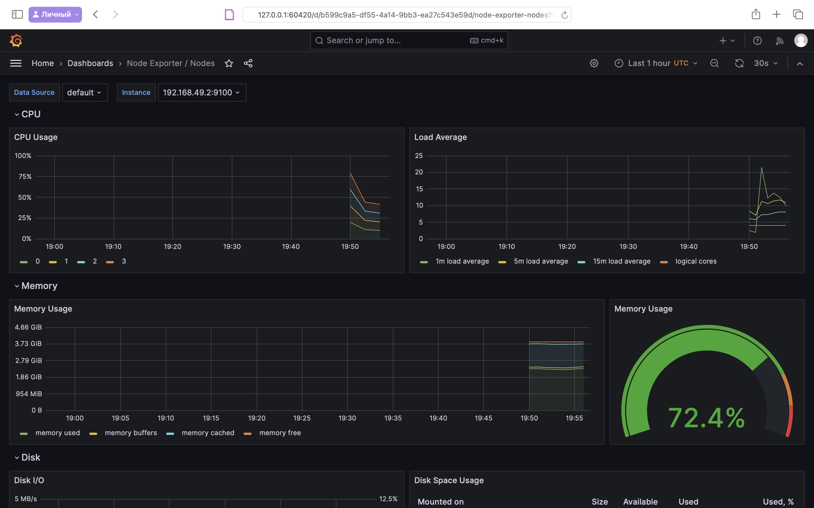
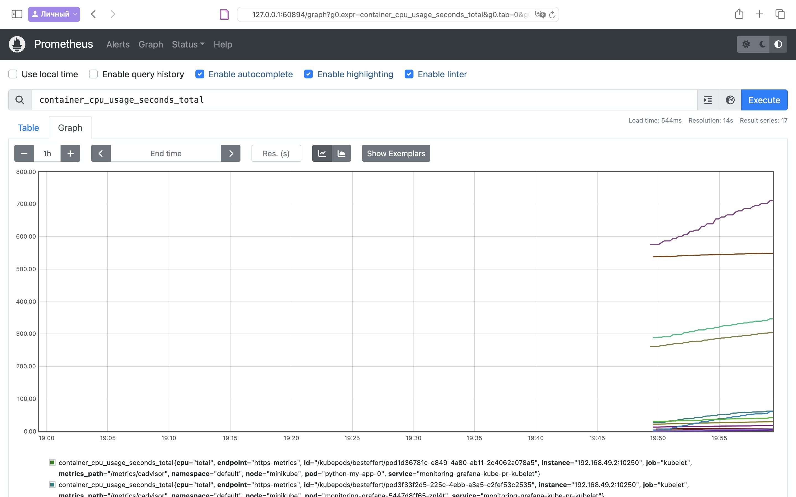
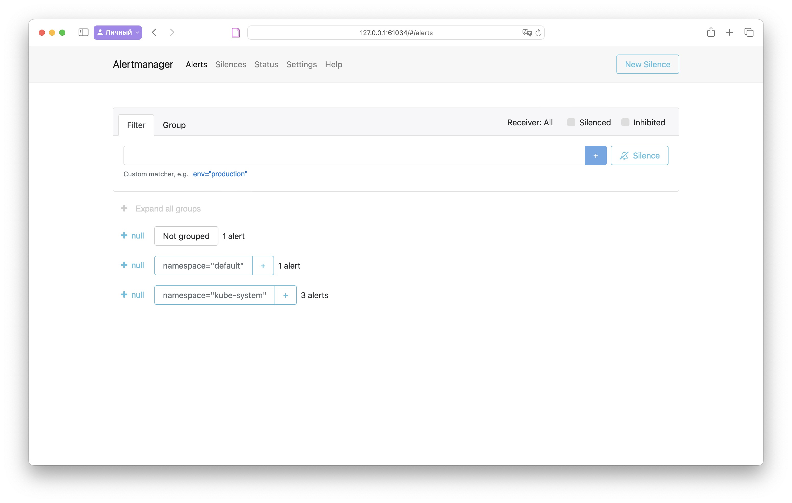

# Kubernetes Monitoring and Init Containers

## Task 1

### kube-prometheus-stack Components

- **Prometheus**: A fundamental component for metrics collection and storage, Prometheus operates as a time-series database. It specializes in monitoring, capable of scraping metrics from diverse endpoints and utilizes PromQL, a unique query language, for metric analysis and retrieval.

- **Prometheus Operator**: Designed for Kubernetes, this operator automates and manages the deployment and configuration of Prometheus and its related resources. It eases the management of configurations, alerting rules, and handles updates and scaling processes.

- **Alertmanager**: Integral for managing alerts from Prometheus, Alertmanager processes incoming alerts by deduplication, grouping, and routing to designated receivers (such as email, chat, or webhooks) based on specific rules. It streamlines notification management and organization.

- **Grafana**: As a visualization platform, Grafana is employed for crafting monitoring dashboards and graphs. It's versatile, supporting a range of data sources including Prometheus, and enables users to visually represent collected metrics, assisting in comprehending system behavior and performance.

- `kube-state-metrics`: This component acquires metrics about the status of various Kubernetes objects (like deployments, nodes, pods) from the Kubernetes API server. It presents these metrics in a Prometheus-compatible format, essential for gauging Kubernetes infrastructure status.

- `node-exporter`: Node Exporter gathers system-level metrics from Kubernetes nodes, offering insights into hardware resource usage such as CPU, memory, disk, and network statistics. These metrics are key to assessing the health and performance of individual cluster nodes.


### Installing Helm Charts

```shell
~ helm repo add prometheus-community https://prometheus-community.github.io/helm-charts

"prometheus-community" has been added to your repositories
```

```shell
~ helm repo update

Hang tight while we grab the latest from your chart repositories...
...Successfully got an update from the "hashicorp" chart repository
...Successfully got an update from the "prometheus-community" chart repository
Update Complete. ⎈Happy Helming!⎈
```

```shell
~ helm install monitoring-grafana prometheus-community/kube-prometheus-stack

NAME: monitoring-grafana
LAST DEPLOYED: Tue Dec  5 18:31:50 2023
NAMESPACE: default
STATUS: deployed
REVISION: 1
NOTES:
kube-prometheus-stack has been installed. Check its status by running:
  kubectl --namespace default get pods -l "release=monitoring-grafana"

Visit https://github.com/prometheus-operator/kube-prometheus for instructions on how to create & configure Alertmanager and Prometheus instances using the Operator.
```

```shell
~ helm install python . --values values_python.yaml

NAME: python
LAST DEPLOYED: Tue Dec  5 18:36:41 2023
NAMESPACE: default
STATUS: deployed
REVISION: 1
NOTES:
1. Get the application URL by running these commands:
     NOTE: It may take a few minutes for the LoadBalancer IP to be available.
           You can watch the status of by running 'kubectl get --namespace default svc -w python-my-app'
  export SERVICE_IP=$(kubectl get svc --namespace default python-my-app --template "{{ range (index .status.loadBalancer.ingress 0) }}{{.}}{{ end }}")
  echo http://$SERVICE_IP:8090
```

```shell
~ kubectl get po,sts,svc,pvc,cm

NAME                                                         READY   STATUS    RESTARTS   AGE
pod/alertmanager-monitoring-grafana-kube-pr-alertmanager-0   2/2     Running   0          4m58s
pod/monitoring-grafana-5447d8ff65-4fdcv                      3/3     Running   0          5m53s
pod/monitoring-grafana-kube-pr-operator-5d9d8f6bcd-5q2s6     1/1     Running   0          5m53s
pod/monitoring-grafana-kube-state-metrics-54d8975977-jfcbf   1/1     Running   0          5m54s
pod/monitoring-grafana-prometheus-node-exporter-vsrfv        1/1     Running   0          5m53s
pod/prometheus-monitoring-grafana-kube-pr-prometheus-0       2/2     Running   0          4m58s
pod/python-my-app-0                                          1/1     Running   0          56s
pod/python-my-app-1                                          1/1     Running   0          56s

NAME                                                                    READY   AGE
statefulset.apps/alertmanager-monitoring-grafana-kube-pr-alertmanager   1/1     4m59s
statefulset.apps/prometheus-monitoring-grafana-kube-pr-prometheus       1/1     4m58s
statefulset.apps/python-my-app                                          2/2     67s

NAME                                                  TYPE           CLUSTER-IP      EXTERNAL-IP   PORT(S)                      AGE
service/alertmanager-operated                         ClusterIP      None            <none>        9093/TCP,9094/TCP,9094/UDP   4m59s
service/kubernetes                                    ClusterIP      10.96.0.1       <none>        443/TCP                      20d
service/monitoring-grafana                            ClusterIP      10.97.213.49    <none>        80/TCP                       5m54s
service/monitoring-grafana-kube-pr-alertmanager       ClusterIP      10.103.24.134   <none>        9093/TCP,8080/TCP            5m54s
service/monitoring-grafana-kube-pr-operator           ClusterIP      10.98.92.73     <none>        443/TCP                      5m54s
service/monitoring-grafana-kube-pr-prometheus         ClusterIP      10.104.76.214   <none>        9090/TCP,8080/TCP            5m54s
service/monitoring-grafana-kube-state-metrics         ClusterIP      10.105.47.1     <none>        8080/TCP                     5m54s
service/monitoring-grafana-prometheus-node-exporter   ClusterIP      10.97.187.1     <none>        9100/TCP                     5m54s
service/prometheus-operated                           ClusterIP      None            <none>        9090/TCP                     4m58s
service/python-my-app                                 LoadBalancer   10.101.52.129   <pending>     8090:31581/TCP               67s

NAME                                                      STATUS   VOLUME                                     CAPACITY   ACCESS MODES   STORAGECLASS   AGE
persistentvolumeclaim/python-visits-pvc-python-my-app-0   Bound    pvc-c097de95-3836-4023-a97d-a5d8528220f8   1Mi        RWO            standard       7d23h
persistentvolumeclaim/python-visits-pvc-python-my-app-1   Bound    pvc-55652c51-b0f6-439b-be4d-0d97f2ae4554   1Mi        RWO            standard       7d23h

NAME                                                                     DATA   AGE
configmap/configmap                                                      1      67s
configmap/kube-root-ca.crt                                               1      34d
configmap/monitoring-grafana                                             1      5m54s
configmap/monitoring-grafana-config-dashboards                           1      5m54s
configmap/monitoring-grafana-kube-pr-alertmanager-overview               1      5m54s
configmap/monitoring-grafana-kube-pr-apiserver                           1      5m54s
configmap/monitoring-grafana-kube-pr-cluster-total                       1      5m54s
configmap/monitoring-grafana-kube-pr-controller-manager                  1      5m54s
configmap/monitoring-grafana-kube-pr-etcd                                1      5m54s
configmap/monitoring-grafana-kube-pr-grafana-datasource                  1      5m54s
configmap/monitoring-grafana-kube-pr-grafana-overview                    1      5m54s
configmap/monitoring-grafana-kube-pr-k8s-coredns                         1      5m54s
configmap/monitoring-grafana-kube-pr-k8s-resources-cluster               1      5m54s
configmap/monitoring-grafana-kube-pr-k8s-resources-multicluster          1      5m54s
configmap/monitoring-grafana-kube-pr-k8s-resources-namespace             1      5m54s
configmap/monitoring-grafana-kube-pr-k8s-resources-node                  1      5m54s
configmap/monitoring-grafana-kube-pr-k8s-resources-pod                   1      5m54s
configmap/monitoring-grafana-kube-pr-k8s-resources-workload              1      5m54s
configmap/monitoring-grafana-kube-pr-k8s-resources-workloads-namespace   1      5m54s
configmap/monitoring-grafana-kube-pr-kubelet                             1      5m54s
configmap/monitoring-grafana-kube-pr-namespace-by-pod                    1      5m54s
configmap/monitoring-grafana-kube-pr-namespace-by-workload               1      5m54s
configmap/monitoring-grafana-kube-pr-node-cluster-rsrc-use               1      5m54s
configmap/monitoring-grafana-kube-pr-node-rsrc-use                       1      5m54s
configmap/monitoring-grafana-kube-pr-nodes                               1      5m54s
configmap/monitoring-grafana-kube-pr-nodes-darwin                        1      5m54s
configmap/monitoring-grafana-kube-pr-persistentvolumesusage              1      5m54s
configmap/monitoring-grafana-kube-pr-pod-total                           1      5m54s
configmap/monitoring-grafana-kube-pr-prometheus                          1      5m54s
configmap/monitoring-grafana-kube-pr-proxy                               1      5m54s
configmap/monitoring-grafana-kube-pr-scheduler                           1      5m54s
configmap/monitoring-grafana-kube-pr-workload-total                      1      5m54s
configmap/prometheus-monitoring-grafana-kube-pr-prometheus-rulefiles-0   34     4m58s
```

- **Pods**: Lists individual containers running in the cluster. Shows pod name, container readiness, status, restart count, and age.

- **StatefulSets**: Manages stateful applications, displaying StatefulSet name, readiness (ready replicas/total), and age.

- **Services**: Provides network access to set of Pods. Shows service name, type, IP addresses, exposed ports, and age.

- **Persistent** Volume Claims: Represents storage requested by users, showing claim name, status, bound volume, capacity, access mode, storage class, and age.

- **ConfigMaps**: Manages configuration data for containers, listing ConfigMap name, number of data entries, and age.

### Dashboars






.jpeg)

.jpeg)







## Task 2

```shell
~ helm install python . --values values_python.yaml

NAME: python
LAST DEPLOYED: Tue Dec  5 23:15:12 2023
NAMESPACE: default
STATUS: deployed
REVISION: 1
NOTES:
1. Get the application URL by running these commands:
     NOTE: It may take a few minutes for the LoadBalancer IP to be available.
           You can watch the status of by running 'kubectl get --namespace default svc -w python-my-app'
  export SERVICE_IP=$(kubectl get svc --namespace default python-my-app --template "{{ range (index .status.loadBalancer.ingress 0) }}{{.}}{{ end }}")
  echo http://$SERVICE_IP:8090
```

```shell
~ kubectl logs python-my-app-0 -c install -f

Connecting to info.cern.ch (188.184.100.182:80)
index.html           100% |*******************************|   646   0:00:00 ETA
```

```shell
~ kubectl exec -it python-my-app-0 -- cat /init/index.html

Defaulted container "my-app" out of: my-app, install (init)
<html><head></head><body><header>
<title>http://info.cern.ch</title>
</header>

<h1>http://info.cern.ch - home of the first website</h1>
<p>From here you can:</p>
<ul>
<li><a href="http://info.cern.ch/hypertext/WWW/TheProject.html">Browse the first website</a></li>
<li><a href="http://line-mode.cern.ch/www/hypertext/WWW/TheProject.html">Browse the first website using the line-mode browser simulator</a></li>
<li><a href="http://home.web.cern.ch/topics/birth-web">Learn about the birth of the web</a></li>
<li><a href="http://home.web.cern.ch/about">Learn about CERN, the physics laboratory where the web was born</a></li>
</ul>
</body></html>
```