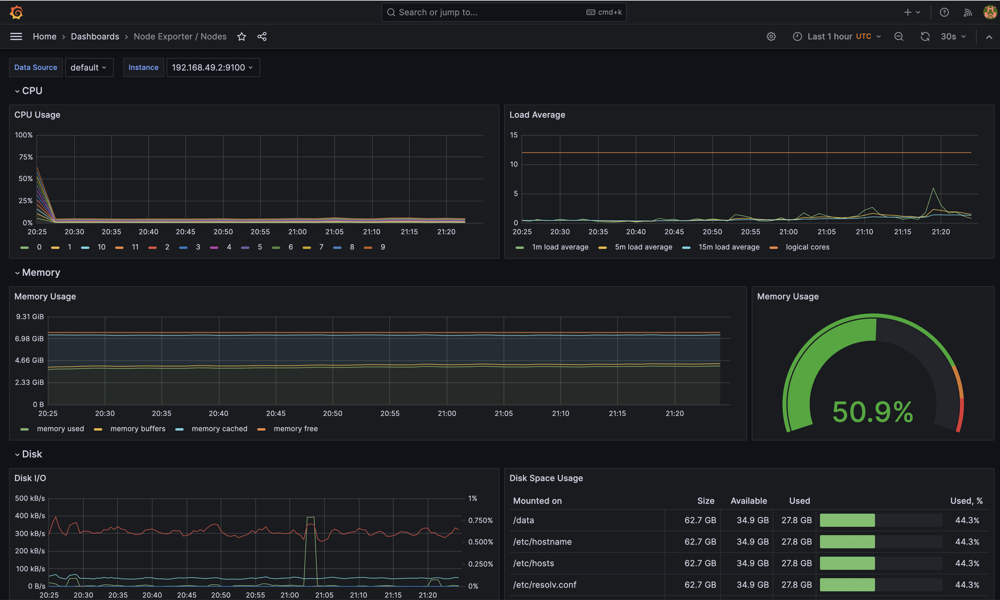

Sure, here's a concise rephrasing:

1. **Grafana:**

   - Purpose: Grafana visualizes data for effective monitoring.

2. **Prometheus Operator:**

   - Purpose: Manages Prometheus components efficiently.

3. **Highly Available Prometheus:**

   - Purpose: Gathers metrics for system monitoring.

4. **Highly Available Alertmanager:**

   - Purpose: Manages alerts from client apps.

5. **Prometheus Node Exporter:**

   - Purpose: Obtains OS/hardware metrics.

6. **Prometheus Adapter for Kubernetes Metrics APIs:**

   - Purpose: Enables collaboration between Kubernetes and Prometheus.

7. **kube-state-metrics:**

   - Purpose: Assists in gathering Kubernetes component metrics.

#### kubectl get po,sts,svc,pvc,cm

```sh
❯ kubectl get po,sts,svc,pvc,cm
NAME                                                         READY   STATUS              RESTARTS       AGE
pod/alertmanager-my-prometheus-kube-prometh-alertmanager-0   0/2     Init:0/1            0              18s
pod/app-node-random-9896c4944-24b4f                          1/1     Running             13 (99m ago)   38d
pod/app-node-random-9896c4944-bclb2                          1/1     Running             13 (99m ago)   38d
pod/app-node-random-9896c4944-pqwmm                          1/1     Running             13 (99m ago)   38d
pod/app-node-random-9896c4944-x7svp                          1/1     Running             14 (99m ago)   38d
pod/app-python-time-7c5695b94-hkt4b                          1/1     Running             16 (99m ago)   38d
pod/app-python-time-7c5695b94-jwdrv                          1/1     Running             16 (99m ago)   38d
pod/app-python-time-7c5695b94-lhs5n                          1/1     Running             15 (99m ago)   38d
pod/app-python-time-7c5695b94-zk79k                          1/1     Running             15 (99m ago)   38d
pod/helm-node-app-5f48457d-dv6ns                             0/1     ImagePullBackOff    0              31d
pod/helm-python-app-67577fd5f4-cdkqg                         1/1     Running             8 (99m ago)    31d
pod/helm-python-app-secret-68b5cb9947-cc6nw                  1/1     Running             2 (99m ago)    11h
pod/my-prometheus-grafana-549dfc59bf-fpssg                   0/3     ContainerCreating   0              37s
pod/my-prometheus-kube-prometh-operator-595dc45d6-n8x6b      1/1     Running             0              37s
pod/my-prometheus-kube-state-metrics-b69d868b5-2xz7h         0/1     ContainerCreating   0              37s
pod/my-prometheus-prometheus-node-exporter-7pb9x             1/1     Running             0              37s
pod/postinstall-hook                                         0/1     Completed           0              11h
pod/preinstall-hook                                          0/1     Completed           0              11h
pod/prometheus-my-prometheus-kube-prometh-prometheus-0       0/2     Init:0/1            0              18s

NAME                                                                    READY   AGE
statefulset.apps/alertmanager-my-prometheus-kube-prometh-alertmanager   0/1     18s
statefulset.apps/prometheus-my-prometheus-kube-prometh-prometheus       0/1     18s

NAME                                              TYPE           CLUSTER-IP       EXTERNAL-IP   PORT(S)                      AGE
service/alertmanager-operated                     ClusterIP      None             <none>        9093/TCP,9094/TCP,9094/UDP   18s
service/app-node-random-service                   NodePort       10.97.7.65       <none>        3000:30001/TCP               38d
service/app-python-time-service                   NodePort       10.111.250.122   <none>        8080:30000/TCP               38d
service/helm-node-app                             LoadBalancer   10.110.128.158   <pending>     3000:32106/TCP               31d
service/helm-python-app                           NodePort       10.109.35.89     <none>        8080:31465/TCP               31d
service/helm-python-app-secret                    NodePort       10.99.31.180     <none>        8080:30637/TCP               11h
service/kubernetes                                ClusterIP      10.96.0.1        <none>        443/TCP                      38d
service/my-prometheus-grafana                     ClusterIP      10.111.33.125    <none>        80/TCP                       37s
service/my-prometheus-kube-prometh-alertmanager   ClusterIP      10.102.136.73    <none>        9093/TCP,8080/TCP            37s
service/my-prometheus-kube-prometh-operator       ClusterIP      10.106.239.242   <none>        443/TCP                      37s
service/my-prometheus-kube-prometh-prometheus     ClusterIP      10.108.246.169   <none>        9090/TCP,8080/TCP            37s
service/my-prometheus-kube-state-metrics          ClusterIP      10.109.35.162    <none>        8080/TCP                     37s
service/my-prometheus-prometheus-node-exporter    ClusterIP      10.105.73.121    <none>        9100/TCP                     37s
service/prometheus-operated                       ClusterIP      None             <none>        9090/TCP                     18s

NAME                                                                     DATA   AGE
configmap/kube-root-ca.crt                                               1      38d
configmap/my-prometheus-grafana                                          1      37s
configmap/my-prometheus-grafana-config-dashboards                        1      37s
configmap/my-prometheus-kube-prometh-alertmanager-overview               1      37s
configmap/my-prometheus-kube-prometh-apiserver                           1      37s
configmap/my-prometheus-kube-prometh-cluster-total                       1      37s
configmap/my-prometheus-kube-prometh-controller-manager                  1      37s
configmap/my-prometheus-kube-prometh-etcd                                1      37s
configmap/my-prometheus-kube-prometh-grafana-datasource                  1      37s
configmap/my-prometheus-kube-prometh-grafana-overview                    1      37s
configmap/my-prometheus-kube-prometh-k8s-coredns                         1      37s
configmap/my-prometheus-kube-prometh-k8s-resources-cluster               1      37s
configmap/my-prometheus-kube-prometh-k8s-resources-multicluster          1      37s
configmap/my-prometheus-kube-prometh-k8s-resources-namespace             1      37s
configmap/my-prometheus-kube-prometh-k8s-resources-node                  1      37s
configmap/my-prometheus-kube-prometh-k8s-resources-pod                   1      37s
configmap/my-prometheus-kube-prometh-k8s-resources-workload              1      37s
configmap/my-prometheus-kube-prometh-k8s-resources-workloads-namespace   1      37s
configmap/my-prometheus-kube-prometh-kubelet                             1      37s
configmap/my-prometheus-kube-prometh-namespace-by-pod                    1      37s
configmap/my-prometheus-kube-prometh-namespace-by-workload               1      37s
configmap/my-prometheus-kube-prometh-node-cluster-rsrc-use               1      37s
configmap/my-prometheus-kube-prometh-node-rsrc-use                       1      37s
configmap/my-prometheus-kube-prometh-nodes                               1      37s
configmap/my-prometheus-kube-prometh-nodes-darwin                        1      37s
configmap/my-prometheus-kube-prometh-persistentvolumesusage              1      37s
configmap/my-prometheus-kube-prometh-pod-total                           1      37s
configmap/my-prometheus-kube-prometh-prometheus                          1      37s
configmap/my-prometheus-kube-prometh-proxy                               1      37s
configmap/my-prometheus-kube-prometh-scheduler                           1      37s
configmap/my-prometheus-kube-prometh-workload-total                      1      37s
configmap/prometheus-my-prometheus-kube-prometh-prometheus-rulefiles-0   34     18s
```

## Explanation of results

### Pods:

- `alertmanager-prom-kube-prometheus-stack-alertmanager-0`: ContainerCreating (not ready) - Alertmanager pod for the Prometheus stack, creating containers.
- `app-python-app-chard-0` and `app-python-app-chard-1`: Running - Pods for your Python application with two containers each.
- `init-python-containerz`: Running - Pod with an initialization container.
- `prom-grafana-587b55c5c8-jj5qw`: ContainerCreating (not ready) - Grafana pod for the Prometheus stack, creating containers.
- `prom-kube-prometheus-stack-operator-669c9d64f7-s7m2j`: Running - Operator pod for the Prometheus stack.
- `prom-kube-state-metrics-54c4ff848b-7ckct`: ContainerCreating (not ready) - Pod for kube-state-metrics, creating containers.
- `prom-prometheus-node-exporter-wx6nz`: Running - Node Exporter pod for Prometheus.
- `prometheus-prom-kube-prometheus-stack-prometheus-0`: Init:0/1 (not ready) - Prometheus pod for the Prometheus stack, initializing containers.

### StatefulSets:

- `alertmanager-prom-kube-prometheus-stack-alertmanager`: 0/1 (not ready) - StatefulSet for the Alertmanager pod.
- `app-python-app-chard`: 2/2 - StatefulSet for your Python application pods.
- `prometheus-prom-kube-prometheus-stack-prometheus`: 0/1 (not ready) - StatefulSet for the Prometheus pod.

### Services:

- `alertmanager-operated`: ClusterIP - Service for the operated Alertmanager.
- `app-python-app-chard`: LoadBalancer - LoadBalancer service for your Python application.
- `prom-grafana`, `prom-kube-prometheus-stack-alertmanager`, `prom-kube-prometheus-stack-operator`, `prom-kube-prometheus-stack-prometheus`, `prom-kube-state-metrics`, `prom-prometheus-node-exporter`: ClusterIP - Various services for components in the Prometheus stack.
- `prometheus-operated`: ClusterIP - Service for the operated Prometheus.

### PersistentVolumeClaims:

- `app-python-pers-volume-app-python-app-chard-0` and `app-python-pers-volume-app-python-app-chard-1`: Bound - PersistentVolumeClaims for your Python application pods.

### ConfigMaps:

- Various ConfigMaps for configuration data for Prometheus stack components.

### Observations:

1. Alertmanager, Prometheus, and Grafana pods are still being created (`ContainerCreating` or `Init:0/1`).
2. The Python application pods, kube-state-metrics, and Node Exporter are running.
3. LoadBalancer service (`app-python-app-chard`) is pending an external IP.
4. Various ConfigMaps are created for configuration.

### Action Items:

- Check the logs of the pods that are not ready (`alertmanager-prom-kube-prometheus-stack-alertmanager-0`, `prometheus-prom-kube-prometheus-stack-prometheus-0`, `prom-grafana-587b55c5c8-jj5qw`, `prom-kube-state-metrics-54c4ff848b-7ckct`) to identify any issues during startup.
- Monitor the external IP status for the `app-python-app-chard` service.
- Verify the configuration in the ConfigMaps for correctness.

## Answers

### 1. Check CPU and Memory consumption of your StatefulSet.

[]

### 2. Identify Pods with higher and lower CPU usage in the default namespace.

[]

### 3. Monitor node memory usage in percentage and megabytes.

[]

### 4. Count the number of pods and containers managed by the Kubelet service.

[]

### 5. Evaluate network usage of Pods in the default namespace.

[]

### 6. Determine the number of active alerts; also check the Web UI with `minikube service monitoring-kube-prometheus-alertmanager`.

[]
