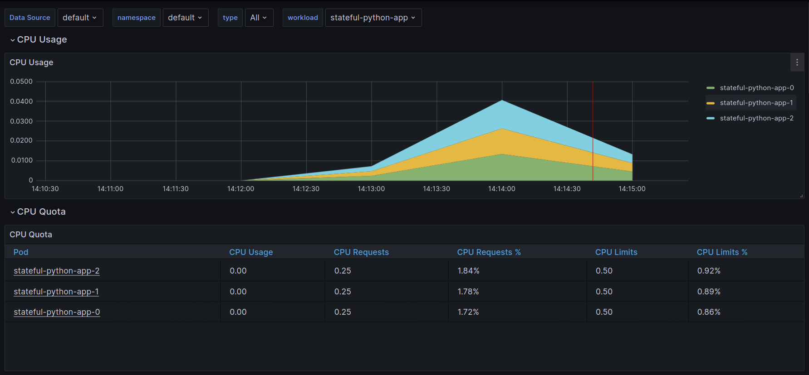
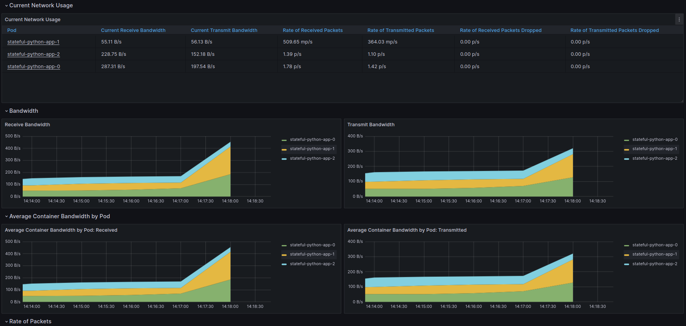
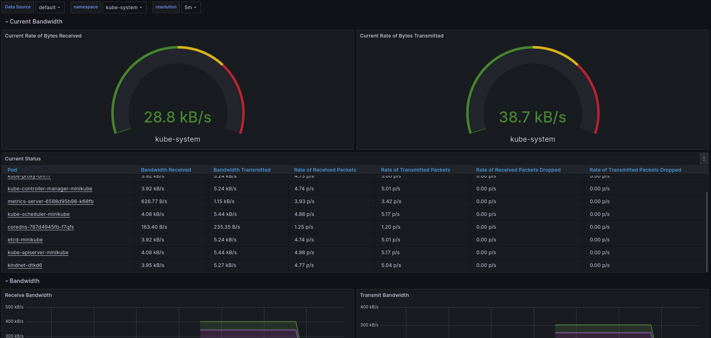
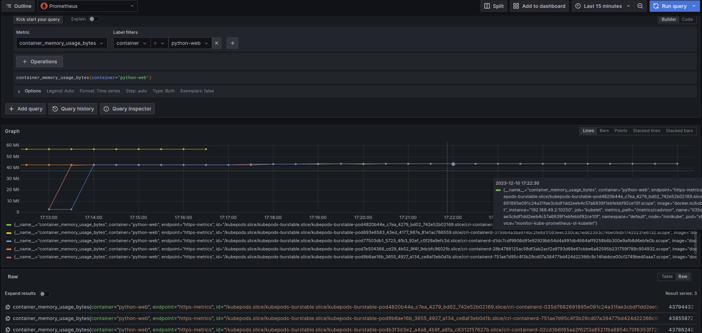
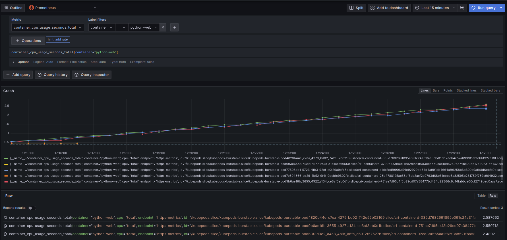

# 14

```
aibek@ideapad:~/iu/devops/k8s$ kubectl get po,sts,svc,pvc,cm
NAME                                                         READY   STATUS    RESTARTS   AGE
pod/alertmanager-monitor-kube-prometheus-st-alertmanager-0   2/2     Running   0          3m59s
pod/monitor-grafana-6b864c98f6-ssx5l                         3/3     Running   0          4m
pod/monitor-kube-prometheus-st-operator-5d7545c844-6kkds     1/1     Running   0          4m
pod/monitor-kube-state-metrics-7769b8f477-ndk8l              1/1     Running   0          4m
pod/monitor-prometheus-node-exporter-cqlnd                   1/1     Running   0          4m
pod/prometheus-monitor-kube-prometheus-st-prometheus-0       2/2     Running   0          3m58s
pod/stateful-python-app-0                                    1/1     Running   0          16s
pod/stateful-python-app-1                                    1/1     Running   0          16s
pod/stateful-python-app-2                                    1/1     Running   0          16s

NAME                                                                    READY   AGE
statefulset.apps/alertmanager-monitor-kube-prometheus-st-alertmanager   1/1     3m59s
statefulset.apps/prometheus-monitor-kube-prometheus-st-prometheus       1/1     3m58s
statefulset.apps/stateful-python-app                                    3/3     16s

NAME                                              TYPE           CLUSTER-IP       EXTERNAL-IP   PORT(S)                      AGE
service/alertmanager-operated                     ClusterIP      None             <none>        9093/TCP,9094/TCP,9094/UDP   3m59s
service/kubernetes                                ClusterIP      10.96.0.1        <none>        443/TCP                      25d
service/monitor-grafana                           ClusterIP      10.96.108.113    <none>        80/TCP                       4m
service/monitor-kube-prometheus-st-alertmanager   ClusterIP      10.108.113.180   <none>        9093/TCP,8080/TCP            4m
service/monitor-kube-prometheus-st-operator       ClusterIP      10.104.44.155    <none>        443/TCP                      4m
service/monitor-kube-prometheus-st-prometheus     ClusterIP      10.107.193.18    <none>        9090/TCP,8080/TCP            4m
service/monitor-kube-state-metrics                ClusterIP      10.106.28.162    <none>        8080/TCP                     4m
service/monitor-prometheus-node-exporter          ClusterIP      10.108.73.18     <none>        9100/TCP                     4m
service/prometheus-operated                       ClusterIP      None             <none>        9090/TCP                     3m58s
service/python-web-app-svc                        LoadBalancer   10.107.161.54    <pending>     5000:32168/TCP               16s

NAME                                               STATUS   VOLUME                                     CAPACITY   ACCESS MODES   STORAGECLASS   AGE
persistentvolumeclaim/data-my-vault-0              Bound    pvc-01f02844-0de6-4d77-bcec-916751248e0e   10Gi       RWO            standard       25d
persistentvolumeclaim/data-stateful-python-app-0   Bound    pvc-b6c2c7d4-7615-4f3a-8587-2de2ad192b83   1Mi        RWO            standard       15h
persistentvolumeclaim/data-stateful-python-app-1   Bound    pvc-b709b9ee-56ac-4708-9895-dadd40e859bd   1Mi        RWO            standard       15h
persistentvolumeclaim/data-stateful-python-app-2   Bound    pvc-1e8097a8-e42f-44ca-b802-6a77d1ce1d68   1Mi        RWO            standard       15h

NAME                                                                     DATA   AGE
configmap/kube-root-ca.crt                                               1      25d
configmap/monitor-grafana                                                1      4m
configmap/monitor-grafana-config-dashboards                              1      4m
configmap/monitor-kube-prometheus-st-alertmanager-overview               1      4m
configmap/monitor-kube-prometheus-st-apiserver                           1      4m
configmap/monitor-kube-prometheus-st-cluster-total                       1      4m
configmap/monitor-kube-prometheus-st-controller-manager                  1      4m
configmap/monitor-kube-prometheus-st-etcd                                1      4m
configmap/monitor-kube-prometheus-st-grafana-datasource                  1      4m
configmap/monitor-kube-prometheus-st-grafana-overview                    1      4m
configmap/monitor-kube-prometheus-st-k8s-coredns                         1      4m
configmap/monitor-kube-prometheus-st-k8s-resources-cluster               1      4m
configmap/monitor-kube-prometheus-st-k8s-resources-multicluster          1      4m
configmap/monitor-kube-prometheus-st-k8s-resources-namespace             1      4m
configmap/monitor-kube-prometheus-st-k8s-resources-node                  1      4m
configmap/monitor-kube-prometheus-st-k8s-resources-pod                   1      4m
configmap/monitor-kube-prometheus-st-k8s-resources-workload              1      4m
configmap/monitor-kube-prometheus-st-k8s-resources-workloads-namespace   1      4m
configmap/monitor-kube-prometheus-st-kubelet                             1      4m
configmap/monitor-kube-prometheus-st-namespace-by-pod                    1      4m
configmap/monitor-kube-prometheus-st-namespace-by-workload               1      4m
configmap/monitor-kube-prometheus-st-node-cluster-rsrc-use               1      4m
configmap/monitor-kube-prometheus-st-node-rsrc-use                       1      4m
configmap/monitor-kube-prometheus-st-nodes                               1      4m
configmap/monitor-kube-prometheus-st-nodes-darwin                        1      4m
configmap/monitor-kube-prometheus-st-persistentvolumesusage              1      4m
configmap/monitor-kube-prometheus-st-pod-total                           1      4m
configmap/monitor-kube-prometheus-st-prometheus                          1      4m
configmap/monitor-kube-prometheus-st-proxy                               1      4m
configmap/monitor-kube-prometheus-st-scheduler                           1      4m
configmap/monitor-kube-prometheus-st-workload-total                      1      4m
configmap/prometheus-monitor-kube-prometheus-st-prometheus-rulefiles-0   34     3m58s
configmap/python-configmap                                               1      16s
configmap/python-configmap-env                                           3      16s

```

### Screenshots:












