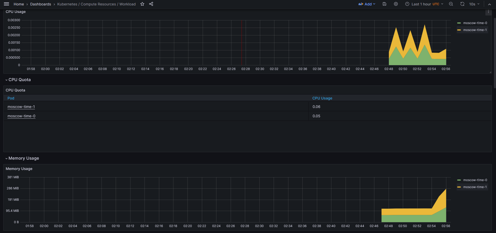
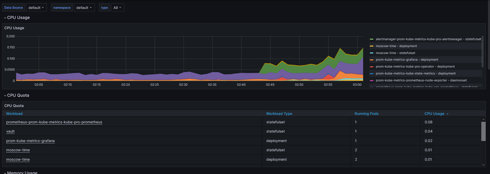
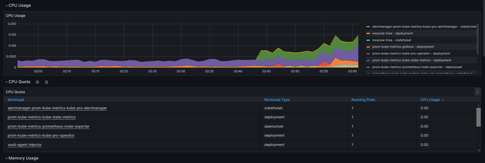
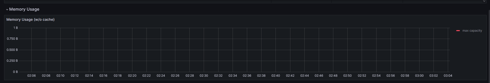
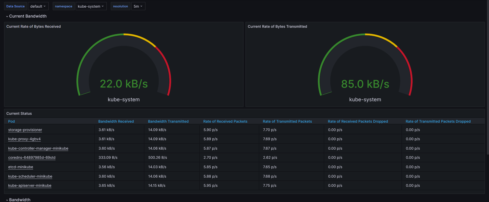
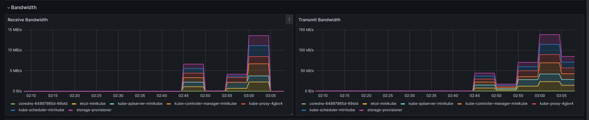

# Task 1: Kubernetes Cluster Monitoring with Prometheus

## Describe Components:
1. Graphana - visualization tool for your data
2. kube-state-metrics - simple service collecting information about other kuber entities
3. Prometheus Adapter for Kubernetes Metrics APIs - implements metrics API of kuber and thus allows it to work with custom metrics.
4. Prometheus node-exporter - allows collects hardware metrics 
5. Alertmanager - collects alerts from prometheus and reroute them into email, telegram and etc.
6. Prometheus - collects metrics from various sources using above-mentioned plugins
7. Prometheus Operator - adaptor for kuber


## Provide the output of the kubectl get po,sts,svc,pvc,cm command in the report and explain each part.
```bash
╭─bizuki@DESKTOP-A1F8O7S ~/proj/devops-course/k8s  ‹lab14*› 
╰─➤  kubectl get po,sts,svc,pvc,cm
NAME                                                         READY   STATUS    RESTARTS   AGE
pod/alertmanager-prom-kube-metrics-kube-pro-alertmanager-0   2/2     Running   0          11h
pod/moscow-time-0                                            1/1     Running   0          17m
pod/moscow-time-1                                            1/1     Running   0          17m
pod/moscow-time-66594fd9c7-l9fvq                             1/1     Running   0          17m
pod/moscow-time-66594fd9c7-lkcgd                             1/1     Running   0          17m
pod/prom-kube-metrics-grafana-56ccff6bc8-cpxfz               3/3     Running   0          11h
pod/prom-kube-metrics-kube-pro-operator-65cb49d4f9-pzq6v     1/1     Running   0          11h
pod/prom-kube-metrics-kube-state-metrics-f88485c98-pdzfj     1/1     Running   0          11h
pod/prom-kube-metrics-prometheus-node-exporter-mpcmb         1/1     Running   0          11h
pod/prometheus-prom-kube-metrics-kube-pro-prometheus-0       2/2     Running   0          11h
pod/vault-0                                                  1/1     Running   0          30m
pod/vault-agent-injector-69ccb58c6b-5vsmg                    1/1     Running   0          30m

NAME                                                                    READY   AGE
statefulset.apps/alertmanager-prom-kube-metrics-kube-pro-alertmanager   1/1     11h
statefulset.apps/moscow-time                                            2/2     17m
statefulset.apps/prometheus-prom-kube-metrics-kube-pro-prometheus       1/1     11h
statefulset.apps/vault                                                  1/1     30m

NAME                                                 TYPE        CLUSTER-IP       EXTERNAL-IP   PORT(S)                      AGE
service/alertmanager-operated                        ClusterIP   None             <none>        9093/TCP,9094/TCP,9094/UDP   11h
service/kubernetes                                   ClusterIP   10.96.0.1        <none>        443/TCP                      11h
service/moscow-time                                  ClusterIP   10.100.204.99    <none>        8080/TCP                     17m
service/prom-kube-metrics-grafana                    ClusterIP   10.105.49.20     <none>        80/TCP                       11h
service/prom-kube-metrics-kube-pro-alertmanager      ClusterIP   10.102.137.196   <none>        9093/TCP,8080/TCP            11h
service/prom-kube-metrics-kube-pro-operator          ClusterIP   10.96.122.118    <none>        443/TCP                      11h
service/prom-kube-metrics-kube-pro-prometheus        ClusterIP   10.101.136.45    <none>        9090/TCP,8080/TCP            11h
service/prom-kube-metrics-kube-state-metrics         ClusterIP   10.109.168.194   <none>        8080/TCP                     11h
service/prom-kube-metrics-prometheus-node-exporter   ClusterIP   10.110.247.151   <none>        9100/TCP                     11h
service/prometheus-operated                          ClusterIP   None             <none>        9090/TCP                     11h
service/vault                                        ClusterIP   10.100.112.77    <none>        8200/TCP,8201/TCP            30m
service/vault-agent-injector-svc                     ClusterIP   10.98.50.147     <none>        443/TCP                      30m
service/vault-internal                               ClusterIP   None             <none>        8200/TCP,8201/TCP            30m

NAME                                             STATUS   VOLUME                                     CAPACITY   ACCESS MODES   STORAGECLASS   AGE
persistentvolumeclaim/config-map-moscow-time-0   Bound    pvc-27b1ee30-87c7-4831-8c6e-5f33c4075dfa   10Mi       RWO            standard       26m
persistentvolumeclaim/config-map-moscow-time-1   Bound    pvc-b4853dbc-17e8-4e25-ac51-2783e14dd473   10Mi       RWO            standard       26m

NAME                                                                     DATA   AGE
configmap/config-map                                                     1      17m
configmap/kube-root-ca.crt                                               1      11h
configmap/prom-kube-metrics-grafana                                      1      11h
configmap/prom-kube-metrics-grafana-config-dashboards                    1      11h
configmap/prom-kube-metrics-kube-pro-alertmanager-overview               1      11h
configmap/prom-kube-metrics-kube-pro-apiserver                           1      11h
configmap/prom-kube-metrics-kube-pro-cluster-total                       1      11h
configmap/prom-kube-metrics-kube-pro-controller-manager                  1      11h
configmap/prom-kube-metrics-kube-pro-etcd                                1      11h
configmap/prom-kube-metrics-kube-pro-grafana-datasource                  1      11h
configmap/prom-kube-metrics-kube-pro-grafana-overview                    1      11h
configmap/prom-kube-metrics-kube-pro-k8s-coredns                         1      11h
configmap/prom-kube-metrics-kube-pro-k8s-resources-cluster               1      11h
configmap/prom-kube-metrics-kube-pro-k8s-resources-multicluster          1      11h
configmap/prom-kube-metrics-kube-pro-k8s-resources-namespace             1      11h
configmap/prom-kube-metrics-kube-pro-k8s-resources-node                  1      11h
configmap/prom-kube-metrics-kube-pro-k8s-resources-pod                   1      11h
configmap/prom-kube-metrics-kube-pro-k8s-resources-workload              1      11h
configmap/prom-kube-metrics-kube-pro-k8s-resources-workloads-namespace   1      11h
configmap/prom-kube-metrics-kube-pro-kubelet                             1      11h
configmap/prom-kube-metrics-kube-pro-namespace-by-pod                    1      11h
configmap/prom-kube-metrics-kube-pro-namespace-by-workload               1      11h
configmap/prom-kube-metrics-kube-pro-node-cluster-rsrc-use               1      11h
configmap/prom-kube-metrics-kube-pro-node-rsrc-use                       1      11h
configmap/prom-kube-metrics-kube-pro-nodes                               1      11h
configmap/prom-kube-metrics-kube-pro-nodes-darwin                        1      11h
configmap/prom-kube-metrics-kube-pro-persistentvolumesusage              1      11h
configmap/prom-kube-metrics-kube-pro-pod-total                           1      11h
configmap/prom-kube-metrics-kube-pro-prometheus                          1      11h
configmap/prom-kube-metrics-kube-pro-proxy                               1      11h
configmap/prom-kube-metrics-kube-pro-scheduler                           1      11h
configmap/prom-kube-metrics-kube-pro-workload-total                      1      11h
configmap/prometheus-prom-kube-metrics-kube-pro-prometheus-rulefiles-0   34     11h
```

We see several groups of output:
1. Pods -> Running instances of services. There is our application, vault and kube prometheus stack
2. StatefulSet -> Reliable instances of most important services. App, prometheus (metrics) and alertmanager (alerts)
3. Service -> Actual interfaces for pods. For example, moscow-time-0 and moscow-time-1 belong to service moscow-time. 
4. Persistent volumes -> volumes created for persitance between restarts. Only volumes created by our app is present
5. Configmap -> objects that helps to deliver information to pods. Used almost everywhere.

## Explore existing dashboards to find information about your cluster: 
1. 
2.   we can see that alertmanager has lowest cpu and highest prometheus
3.  no info for this one
4.  19 pods 26 containers
5.  
6.    4 alerts

# Init containers
All config fiels are in `templates/statefulset.yaml` and `values.yaml`
```bash
╭─bizuki@DESKTOP-A1F8O7S ~/proj/devops-course/k8s  ‹lab14*› 
╰─➤  kubectl exec moscow-time-1 -- cat /work-dir/index.html
Defaulted container "moscow-time" out of: moscow-time, install (init)
<html><head></head><body><header>
<title>http://info.cern.ch</title>
</header>

<h1>http://info.cern.ch - home of the first website</h1>
<p>From here you can:</p>
<ul>
<li><a href="http://info.cern.ch/hypertext/WWW/TheProject.html">Browse the first website</a></li>
<li><a href="http://line-mode.cern.ch/www/hypertext/WWW/TheProject.html">Browse the first website using the line-mode browser simulator</a></li>
<li><a href="http://home.web.cern.ch/topics/birth-web">Learn about the birth of the web</a></li>
<li><a href="http://home.web.cern.ch/about">Learn about CERN, the physics laboratory where the web was born</a></li>
</ul>
</body></html>
```
