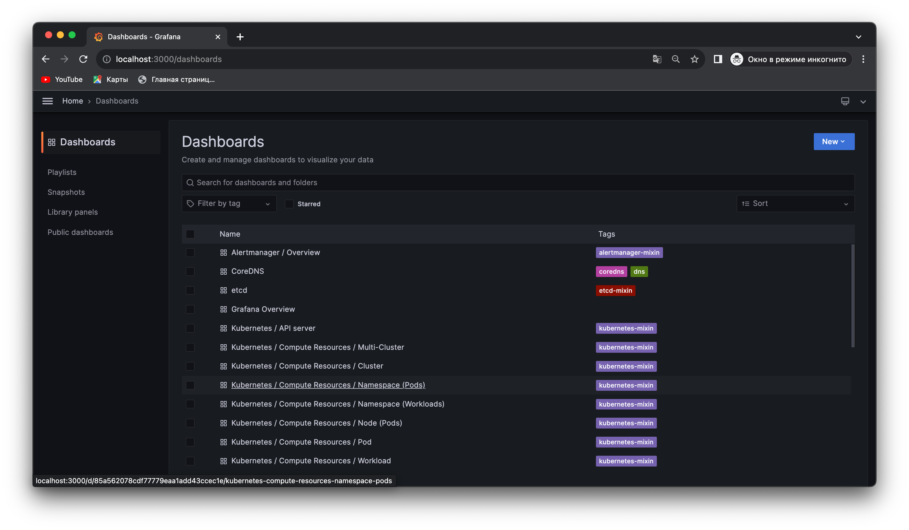
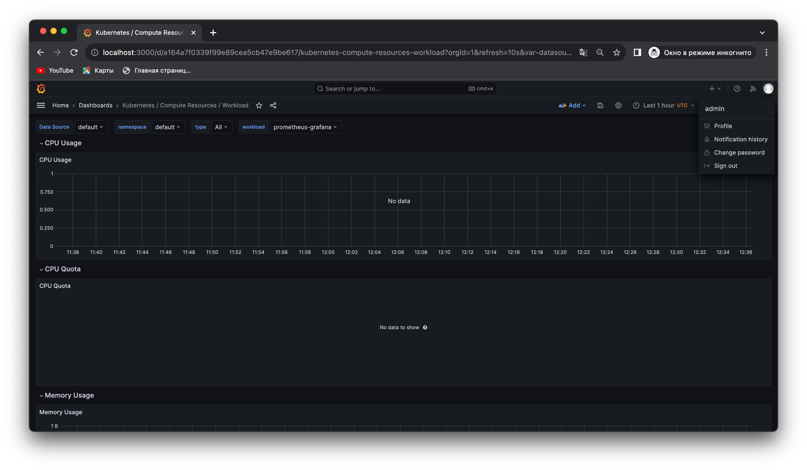
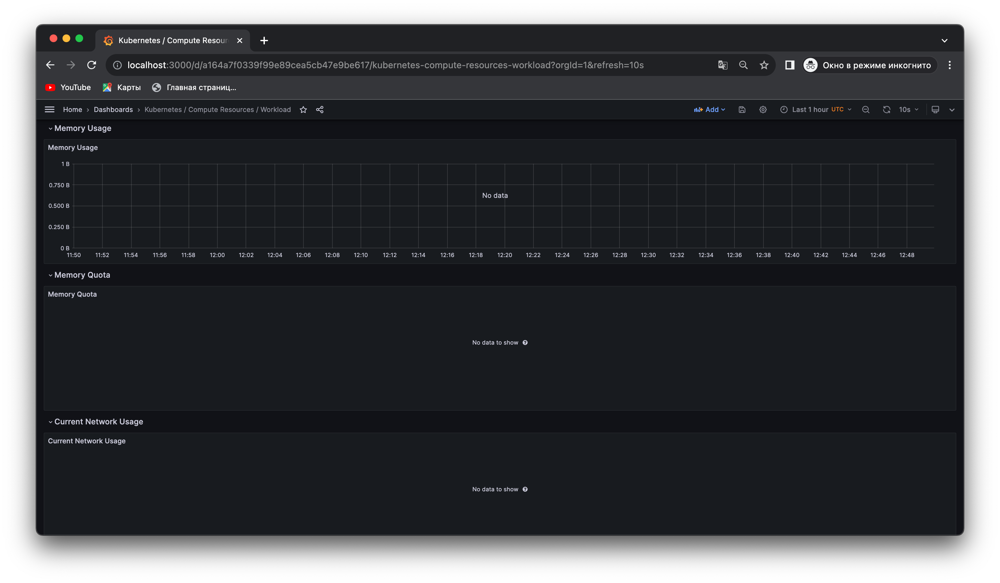

# Kubernetes Monitoring and Init Containers

### Components

* Prometheus Operator makes it easier to set up and configure Prometheus components.
* Prometheus is a toolkit used for monitoring and alerting.
* Alertmanage: alerts from applications like Prometheus Server and sends them through email, 
* node-exporter gathers and sends hardware and operating system metrics to Prometheus.
* Adapter for Kubernetes Metrics APIs enables the collection of metrics from Kubernetes.
* kube-state-metrics is a service that listens to the Kubernetes API server and generates metrics.
* Grafana provides data visualisation system with chart and graph.

```shell
$ kubectl get po,sts,svc,pvc,cm
NAME                                                         READY   STATUS      RESTARTS        AGE
pod/alertmanager-prometheus-kube-prometheus-alertmanager-0   2/2     Running     2 (9m9s ago)    92m
pod/prometheus-grafana-6cc7d6f67f-mqwr2                      3/3     Running     4 (8m57s ago)   93m
pod/prometheus-kube-prometheus-admission-patch-jvfcq         0/1     Completed   0               93m
pod/prometheus-kube-prometheus-operator-58c49d56f4-dngvk     1/1     Running     2 (8m2s ago)    93m
pod/prometheus-kube-state-metrics-6bbff75769-jlv9x           1/1     Running     3 (8m20s ago)   93m
pod/prometheus-prometheus-kube-prometheus-prometheus-0       2/2     Running     2 (9m6s ago)    92m
pod/prometheus-prometheus-node-exporter-4xxbw                1/1     Running     2 (9m9s ago)    93m

NAME                                                                    READY   AGE
statefulset.apps/alertmanager-prometheus-kube-prometheus-alertmanager   1/1     93m
statefulset.apps/prometheus-prometheus-kube-prometheus-prometheus       1/1     92m

NAME                                              TYPE        CLUSTER-IP       EXTERNAL-IP   PORT(S)                      AGE
service/alertmanager-operated                     ClusterIP   None             <none>        9093/TCP,9094/TCP,9094/UDP   93m
service/kubernetes                                ClusterIP   10.96.0.1        <none>        443/TCP                      97m
service/prometheus-grafana                        ClusterIP   10.105.221.225   <none>        80/TCP                       93m
service/prometheus-kube-prometheus-alertmanager   ClusterIP   10.97.238.103    <none>        9093/TCP,8080/TCP            93m
service/prometheus-kube-prometheus-operator       ClusterIP   10.111.152.124   <none>        443/TCP                      93m
service/prometheus-kube-prometheus-prometheus     ClusterIP   10.100.172.79    <none>        9090/TCP,8080/TCP            93m
service/prometheus-kube-state-metrics             ClusterIP   10.99.239.9      <none>        8080/TCP                     93m
service/prometheus-operated                       ClusterIP   None             <none>        9090/TCP                     92m
service/prometheus-prometheus-node-exporter       ClusterIP   10.107.98.9      <none>        9100/TCP                     93m

NAME                                                                     DATA   AGE
configmap/kube-root-ca.crt                                               1      97m
configmap/prometheus-grafana                                             1      93m
configmap/prometheus-grafana-config-dashboards                           1      93m
configmap/prometheus-kube-prometheus-alertmanager-overview               1      93m
configmap/prometheus-kube-prometheus-apiserver                           1      93m
configmap/prometheus-kube-prometheus-cluster-total                       1      93m
configmap/prometheus-kube-prometheus-controller-manager                  1      93m
configmap/prometheus-kube-prometheus-etcd                                1      93m
configmap/prometheus-kube-prometheus-grafana-datasource                  1      93m
configmap/prometheus-kube-prometheus-grafana-overview                    1      93m
configmap/prometheus-kube-prometheus-k8s-coredns                         1      93m
configmap/prometheus-kube-prometheus-k8s-resources-cluster               1      93m
configmap/prometheus-kube-prometheus-k8s-resources-multicluster          1      93m
configmap/prometheus-kube-prometheus-k8s-resources-namespace             1      93m
configmap/prometheus-kube-prometheus-k8s-resources-node                  1      93m
configmap/prometheus-kube-prometheus-k8s-resources-pod                   1      93m
configmap/prometheus-kube-prometheus-k8s-resources-workload              1      93m
configmap/prometheus-kube-prometheus-k8s-resources-workloads-namespace   1      93m
configmap/prometheus-kube-prometheus-kubelet                             1      93m
configmap/prometheus-kube-prometheus-namespace-by-pod                    1      93m
configmap/prometheus-kube-prometheus-namespace-by-workload               1      93m
configmap/prometheus-kube-prometheus-node-cluster-rsrc-use               1      93m
configmap/prometheus-kube-prometheus-node-rsrc-use                       1      93m
configmap/prometheus-kube-prometheus-nodes                               1      93m
configmap/prometheus-kube-prometheus-nodes-darwin                        1      93m
configmap/prometheus-kube-prometheus-persistentvolumesusage              1      93m
configmap/prometheus-kube-prometheus-pod-total                           1      93m
configmap/prometheus-kube-prometheus-prometheus                          1      93m
configmap/prometheus-kube-prometheus-proxy                               1      93m
configmap/prometheus-kube-prometheus-scheduler                           1      93m
configmap/prometheus-kube-prometheus-workload-total                      1      93m
configmap/prometheus-prometheus-kube-prometheus-prometheus-rulefiles-0   34     92m
```

### Installation 
```shell
$ helm repo add prometheus-community https://prometheus-community.github.io/helm-charts
"prometheus-community" has been added to your repositories
$  helm repo update
Hang tight while we grab the latest from your chart repositories...
...Successfully got an update from the "hashicorp" chart repository
...Successfully got an update from the "prometheus-community" chart repository
Update Complete. ⎈Happy Helming!⎈
```

### Grafana Dashboards

To access grafana I configured port-forwarding for the Grafana service

```shell
$  kubectl port-forward service/prometheus-grafana 3000:80
Forwarding from 127.0.0.1:3000 -> 3000
Forwarding from [::1]:3000 -> 3000
Handling connection for 3000
```

Now Grafana is available on `localhost:3000`

 

#### CPU and Memory consumption of the StatefulSet.



#### Monitor node memory usage in percentage and megabytes


#### Number of pods and containers managed by the Kubelet service


#### Network usage of Pods in the default namespace



#### Number of active alerts


Web UI

