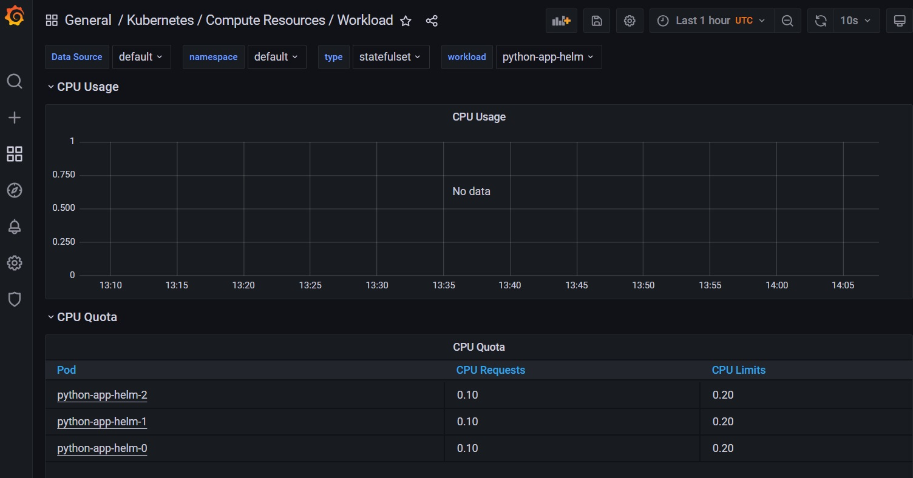
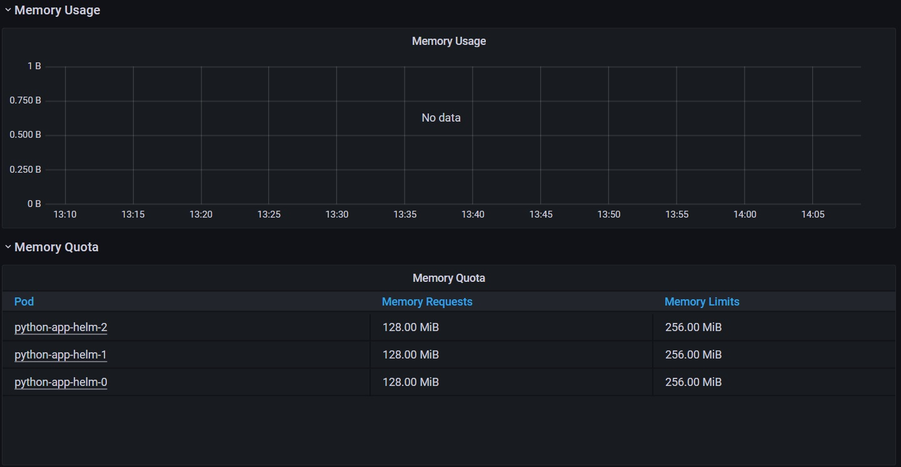
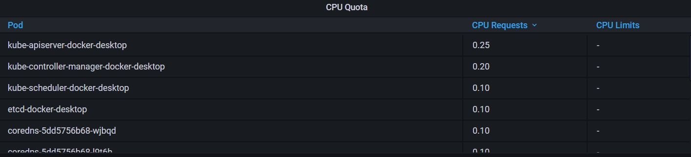
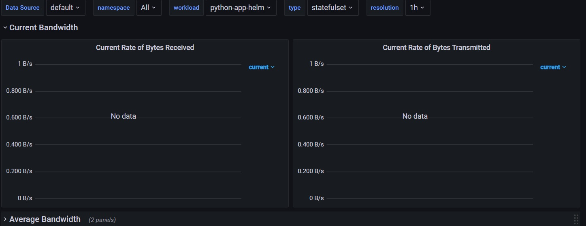
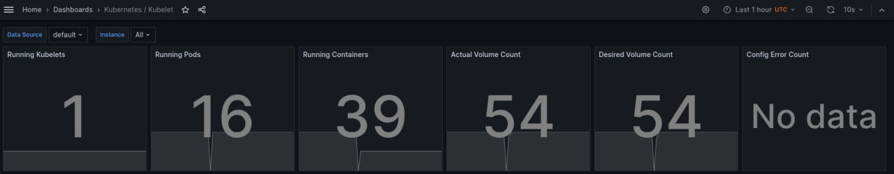
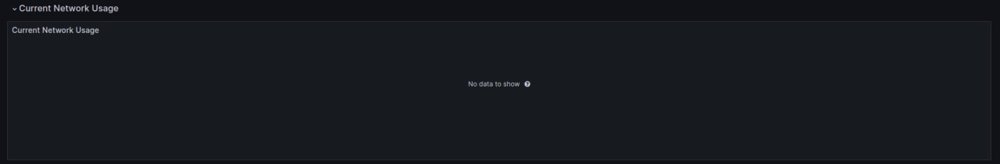

# Kubernetes Monitoring and Init Containers

## Task 1

### Overview of kube-prometheus-stack

The Kube Prometheus Stack, often used for monitoring Kubernetes clusters, consists of several key components. These components work together to provide a comprehensive monitoring solution. Here's a brief overview of each:

1. Prometheus: the core component, Prometheus is an open-source monitoring system with a dimensional data model, flexible query language, efficient time series database, and modern alerting approach.

2. Grafana: Grafana is a popular open-source analytics and interactive visualization web application. It provides charts, graphs, and alerts when connected to supported data sources, including Prometheus.

3. Alertmanager: this component of Prometheus handles alerts sent by client applications such as the Prometheus server. It takes care of deduplicating, grouping, and routing them to the correct receiver integrations such as email, PagerDuty, or OpsGenie.

4. Kube State Metrics: an essential service which provides cluster state metrics gleaned from the Kubernetes API server.

5. Prometheus Operator: simplifies the deployment and configuration of Prometheus, Alertmanager, and related monitoring components.

### Deploying

```bash
helm install mon prometheus-community/kube-prometheus-stack
NAME: mon
LAST DEPLOYED: Thu Nov 16 07:02:02 2023
NAMESPACE: default
STATUS: deployed
REVISION: 1
NOTES:
kube-prometheus-stack has been installed. Check its status by running:
  kubectl --namespace default get pods -l "release=mon"

Visit https://github.com/prometheus-operator/kube-prometheus for instructions on how to create & configure Alertmanager and Prometheus instances using the Operator.
```

```bash
kubectl get po,sts,svc,pvc,cm
NAME                                                         READY   STATUS    RESTARTS      AGE
pod/alertmanager-monitoring-kube-prometheus-alertmanager-0   2/2     Running   0             15m
pod/monitoring-grafana-66d5588bb6-gsxlb                      3/3     Running   0             16m
pod/monitoring-kube-prometheus-operator-f98f55848-xpq8z      1/1     Running   0             16m
pod/monitoring-kube-state-metrics-74f4d8858f-nqf4w           1/1     Running   0             16m
pod/monitoring-prometheus-node-exporter-4jsft                1/1     Running   0             16m
pod/prometheus-monitoring-kube-prometheus-prometheus-0       2/2     Running   0             15m
pod/python-app-helm-0                                        1/1     Running   0             18m
pod/python-app-helm-1                                        1/1     Running   0             18m
pod/python-app-helm-2                                        1/1     Running   0             18m
pod/rust-app-helm-0                                          1/1     Running   1 (13m ago)   19m
pod/rust-app-helm-1                                          1/1     Running   1 (13m ago)   19m
pod/rust-app-helm-2                                          1/1     Running   1 (13m ago)   19m

NAME                                                                    READY   AGE
statefulset.apps/alertmanager-monitoring-kube-prometheus-alertmanager   1/1     15m
statefulset.apps/prometheus-monitoring-kube-prometheus-prometheus       1/1     15m
statefulset.apps/python-app-helm                                        3/3     18m
statefulset.apps/rust-app-helm                                          3/3     19m

NAME                                              TYPE           CLUSTER-IP       EXTERNAL-IP   PORT(S)                      AGE
service/alertmanager-operated                     ClusterIP      None             <none>        9093/TCP,9094/TCP,9094/UDP   15m
service/kubernetes                                ClusterIP      10.96.0.1        <none>        443/TCP                      20m
service/monitoring-grafana                        ClusterIP      10.97.208.83     <none>        80/TCP                       16m
service/monitoring-kube-prometheus-alertmanager   ClusterIP      10.106.232.47    <none>        9093/TCP,8080/TCP            16m
service/monitoring-kube-prometheus-operator       ClusterIP      10.100.113.201   <none>        443/TCP                      16m
service/monitoring-kube-prometheus-prometheus     ClusterIP      10.98.60.229     <none>        9090/TCP,8080/TCP            16m
service/monitoring-kube-state-metrics             ClusterIP      10.103.46.145    <none>        8080/TCP                     16m
service/monitoring-prometheus-node-exporter       ClusterIP      10.97.107.105    <none>        9100/TCP                     16m
service/prometheus-operated                       ClusterIP      None             <none>        9090/TCP                     15m
service/python-app-helm                           LoadBalancer   10.103.132.246   <pending>     8080:31410/TCP               18m
service/rust-app-helm                             LoadBalancer   10.108.183.129   <pending>     8080:30073/TCP               19m

NAME                                                    STATUS   VOLUME                                     CAPACITY   ACCESS MODES   STORAGECLASS   AGE
persistentvolumeclaim/visits-python-python-app-helm-0   Bound    pvc-ab34d4d5-2f78-4930-b271-3ef9d0c0d5ed   1Mi        RWO            standard       18m
persistentvolumeclaim/visits-python-python-app-helm-1   Bound    pvc-2e3e0880-d2f7-47e5-89d6-818fb3b7b618   1Mi        RWO            standard       18m
persistentvolumeclaim/visits-python-python-app-helm-2   Bound    pvc-23e51f90-0749-46d2-ab78-8be6459ccbed   1Mi        RWO            standard       18m
persistentvolumeclaim/visits-rust-rust-app-helm-0       Bound    pvc-a419d488-bc8a-419a-8591-923881a85b96   1Mi        RWO            standard       19m
persistentvolumeclaim/visits-rust-rust-app-helm-1       Bound    pvc-f394d50b-b074-4a9c-82ec-999a096bebc0   1Mi        RWO            standard       19m
persistentvolumeclaim/visits-rust-rust-app-helm-2       Bound    pvc-cae31292-d7a0-4bc2-9145-d8df8ed8ad26   1Mi        RWO            standard       19m

NAME                                                                     DATA   AGE
configmap/kube-root-ca.crt                                               1      20m
configmap/monitoring-grafana                                             1      16m
configmap/monitoring-grafana-config-dashboards                           1      16m
configmap/monitoring-kube-prometheus-alertmanager-overview               1      16m
configmap/monitoring-kube-prometheus-apiserver                           1      16m
configmap/monitoring-kube-prometheus-cluster-total                       1      16m
configmap/monitoring-kube-prometheus-controller-manager                  1      16m
configmap/monitoring-kube-prometheus-etcd                                1      16m
configmap/monitoring-kube-prometheus-grafana-datasource                  1      16m
configmap/monitoring-kube-prometheus-grafana-overview                    1      16m
configmap/monitoring-kube-prometheus-k8s-coredns                         1      16m
configmap/monitoring-kube-prometheus-k8s-resources-cluster               1      16m
configmap/monitoring-kube-prometheus-k8s-resources-multicluster          1      16m
configmap/monitoring-kube-prometheus-k8s-resources-namespace             1      16m
configmap/monitoring-kube-prometheus-k8s-resources-node                  1      16m
configmap/monitoring-kube-prometheus-k8s-resources-pod                   1      16m
configmap/monitoring-kube-prometheus-k8s-resources-workload              1      16m
configmap/monitoring-kube-prometheus-k8s-resources-workloads-namespace   1      16m
configmap/monitoring-kube-prometheus-kubelet                             1      16m
configmap/monitoring-kube-prometheus-namespace-by-pod                    1      16m
configmap/monitoring-kube-prometheus-namespace-by-workload               1      16m
configmap/monitoring-kube-prometheus-node-cluster-rsrc-use               1      16m
configmap/monitoring-kube-prometheus-node-rsrc-use                       1      16m
configmap/monitoring-kube-prometheus-nodes                               1      16m
configmap/monitoring-kube-prometheus-nodes-darwin                        1      16m
configmap/monitoring-kube-prometheus-persistentvolumesusage              1      16m
configmap/monitoring-kube-prometheus-pod-total                           1      16m
configmap/monitoring-kube-prometheus-prometheus                          1      16m
configmap/monitoring-kube-prometheus-proxy                               1      16m
configmap/monitoring-kube-prometheus-scheduler                           1      16m
configmap/monitoring-kube-prometheus-workload-total                      1      16m
configmap/prometheus-monitoring-kube-prometheus-prometheus-rulefiles-0   29     15m
```

Time to get information from metrics:

1. Check CPU and Memory consumption of your StatefulSet.





Seems like that newer version of kube-prometheus-stack have a bug with labels, so we see do not see data about pods from kube-metrics, only known values.

1. Identify Pods with higher and lower CPU usage in the default namespace.



Here we can order by requests/limits, still, nothing additional.

3. Monitor node memory usage in percentage and megabytes.


Everything is work as expected.

4. Count the number of pods and containers managed by the Kubelet service.


Also working correctly.

5. Evaluate network usage of Pods in the default namespace.



Same as with CPU and memory pod data - we do not have it.

6. Determine the number of active alert.


Alerts works smoothly.

### Grafana

## Task 2

I have created new volume in web app (default nginx):

```bash
kubectl logs web-app-helm-0 -c install -f
Connecting to info.cern.ch (188.184.100.182:80)
index.html           100% |*******************************|   646   0:00:00 ETA

kubectl exec -it web-app-helm-0 -- cat /init/index.html
Defaulted container "app-helm" out of: app-helm, install (init)
<html><head></head><body><header>
<title>http://info.cern.ch</title>
</header>

<h1>http://info.cern.ch - home of the first website</h1>
<p>From here you can:</p>
<ul>
<li><a href="http://info.cern.ch/hypertext/WWW/TheProject.html">Browse the first website</a></li>
<li><a href="http://line-mode.cern.ch/www/hypertext/WWW/TheProject.html">Browse the first website using the line-mode browser simulator</a></li>
<li><a href="http://home.web.cern.ch/topics/birth-web">Learn about the birth of the web</a></li>
<li><a href="http://home.web.cern.ch/about">Learn about CERN, the physics laboratory where the web was born</a></li>
</ul>
</body></html>
```

## Bonus

### Metrics from apps

ServiceMonitor created via `values.yaml` in kube-prometheus-stack chart.






### Three init

```yaml
      initContainers:
        - name: install-1
          image: busybox:1.28
          command: ['sh', '-c', 'echo 1 >> /init/file']
          {{- with .Values.volumeMounts }}
          volumeMounts:
            {{- toYaml . | nindent 12 }}
          {{- end }}
        - name: install-2
          image: busybox:1.28
          command: ['sh', '-c', 'echo 2 >> /init/file']
          {{- with .Values.volumeMounts }}
          volumeMounts:
            {{- toYaml . | nindent 12 }}
          {{- end }}
        - name: install-3
          image: busybox:1.28
          command: ['sh', '-c', 'echo 3 >> /init/file']
          {{- with .Values.volumeMounts }}
          volumeMounts:
            {{- toYaml . | nindent 12 }}
          {{- end }}
```

```bash
kubectl exec -it web-app-helm-0  -- cat /init/file
Defaulted container "app-helm" out of: app-helm, install-1 (init), install-2 (init), install-3 (init)
1
2
3
```