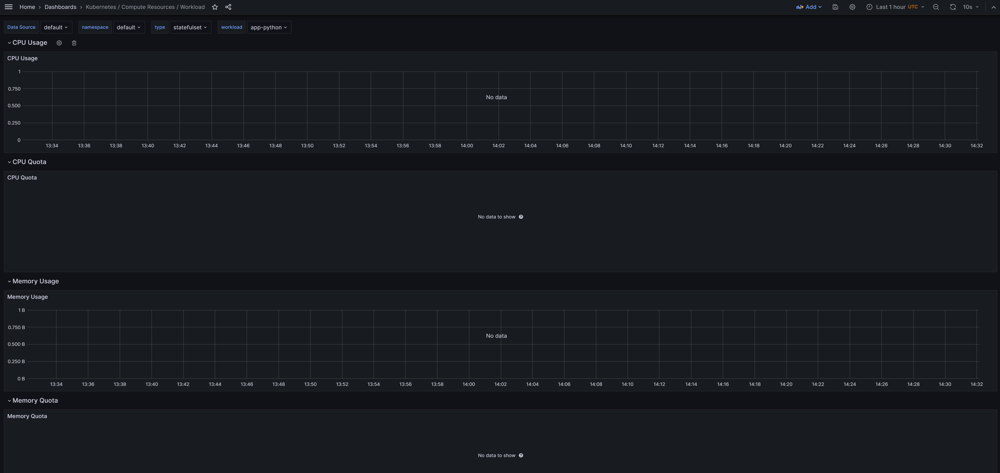
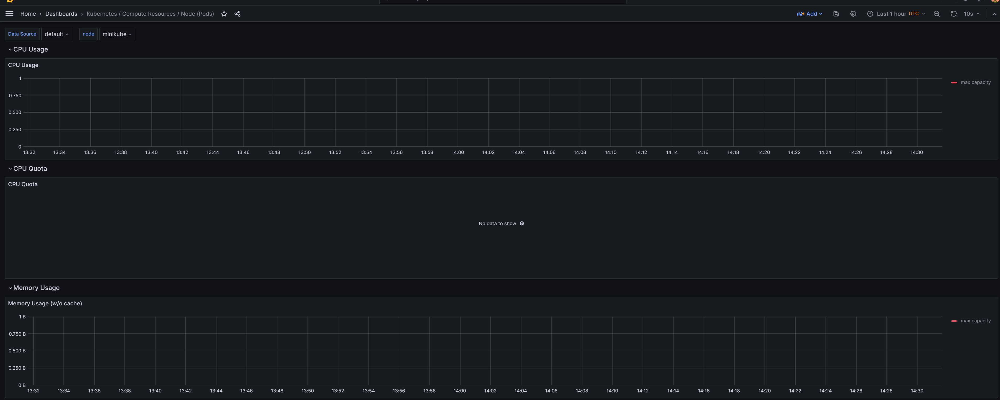
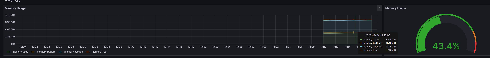
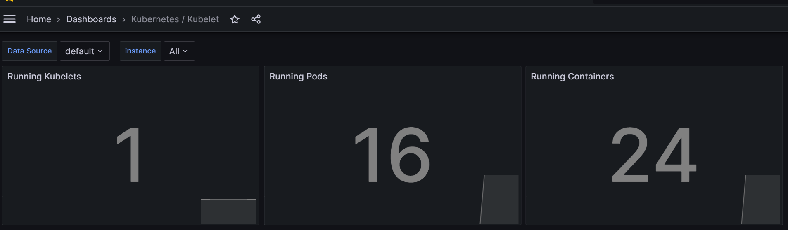
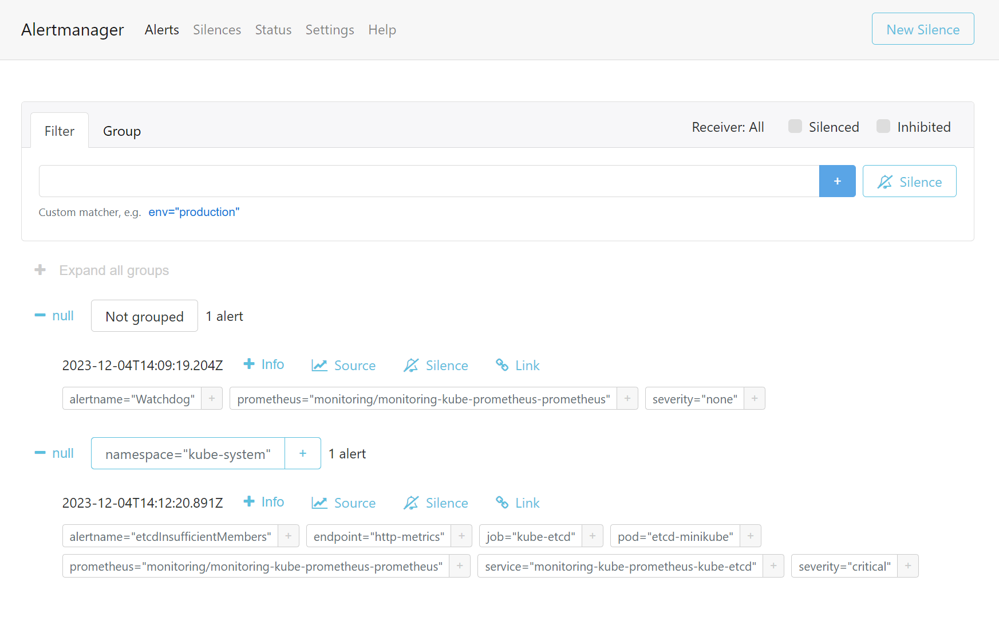
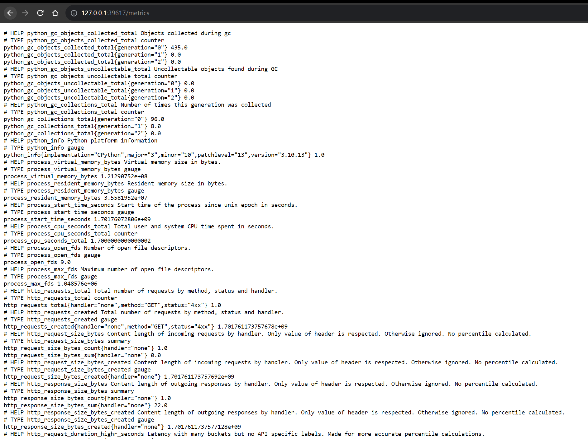

# Components of the Kube Prometheus Stack

- **Prometheus Operator**:
    - The Prometheus Operator for Kubernetes provides easy monitoring definitions for Kubernetes services and deployment
      and management of Prometheus instances.
    - The Prometheus Operator automatically generates monitoring target configurations based on Kubernetes label
      queries; it also provides default dashboards.
- **Prometheus**:
    - Prometheus is an open-source systems monitoring and alerting toolkit originally built at SoundCloud.
    - Prometheus scrapes metrics from instrumented jobs, either directly or via an intermediary push gateway for
      short-lived jobs.
- **Alertmanager**:
    - Alertmanager handles alerts sent by client applications such as the Prometheus server.
    - It takes care of deduplicating, grouping, and routing them to the correct receiver integrations such as email,
      PagerDuty, or OpsGenie.
- **Grafana**:
    - Grafana is an open-source platform for data visualization, monitoring, and analysis.
    - Grafana allows you to query, visualize, alert on, and explore your metrics no matter where they are stored.
- **kube-state-metrics**:
    - kube-state-metrics is a simple service that listens to the Kubernetes API server and generates metrics about the
      state of the objects.
    - It is not focused on the health of the individual Kubernetes components, but rather on the health of the various
      objects inside, such as deployments, nodes, and pods.
- **node-exporter**:
    - node-exporter is a Prometheus exporter for hardware and OS metrics exposed by *NIX kernels, written in Go with
      pluggable metric collectors.
    - It runs as a DaemonSet on your cluster and provides metrics from each node that are then aggregated by Prometheus.

# Installing kube-prometheus-stack

```shell
$ kubectl get po,sts,svc,pvc,cm --namespace monitoring
NAME                                                         READY   STATUS    RESTARTS   AGE
pod/alertmanager-monitoring-kube-prometheus-alertmanager-0   2/2     Running   0          3m12s
pod/monitoring-grafana-7c9476c99b-74pmg                      3/3     Running   0          3m39s
pod/monitoring-kube-prometheus-operator-f4c675984-xkcvk      1/1     Running   0          3m39s
pod/monitoring-kube-state-metrics-f7ff68767-ddx7r            1/1     Running   0          3m39s
pod/monitoring-prometheus-node-exporter-tvhkb                1/1     Running   0          3m39s
pod/prometheus-monitoring-kube-prometheus-prometheus-0       2/2     Running   0          3m12s

NAME                                                                    READY   AGE
statefulset.apps/alertmanager-monitoring-kube-prometheus-alertmanager   1/1     3m12s
statefulset.apps/prometheus-monitoring-kube-prometheus-prometheus       1/1     3m12s

NAME                                              TYPE        CLUSTER-IP       EXTERNAL-IP   PORT(S)                      AGE
service/alertmanager-operated                     ClusterIP   None             <none>        9093/TCP,9094/TCP,9094/UDP   3m12s
service/monitoring-grafana                        ClusterIP   10.110.209.50    <none>        80/TCP                       3m39s
service/monitoring-kube-prometheus-alertmanager   ClusterIP   10.109.161.241   <none>        9093/TCP,8080/TCP            3m39s
service/monitoring-kube-prometheus-operator       ClusterIP   10.106.142.87    <none>        443/TCP                      3m39s
service/monitoring-kube-prometheus-prometheus     ClusterIP   10.110.192.25    <none>        9090/TCP,8080/TCP            3m39s
service/monitoring-kube-state-metrics             ClusterIP   10.103.76.184    <none>        8080/TCP                     3m39s
service/monitoring-prometheus-node-exporter       ClusterIP   10.106.207.98    <none>        9100/TCP                     3m39s
service/prometheus-operated                       ClusterIP   None             <none>        9090/TCP                     3m12s

NAME                                                                     DATA   AGE
configmap/kube-root-ca.crt                                               1      3m52s
configmap/monitoring-grafana                                             1      3m39s
configmap/monitoring-grafana-config-dashboards                           1      3m39s
configmap/monitoring-kube-prometheus-alertmanager-overview               1      3m39s
configmap/monitoring-kube-prometheus-apiserver                           1      3m39s
configmap/monitoring-kube-prometheus-cluster-total                       1      3m39s
configmap/monitoring-kube-prometheus-controller-manager                  1      3m39s
configmap/monitoring-kube-prometheus-etcd                                1      3m39s
configmap/monitoring-kube-prometheus-grafana-datasource                  1      3m39s
configmap/monitoring-kube-prometheus-grafana-overview                    1      3m39s
configmap/monitoring-kube-prometheus-k8s-coredns                         1      3m39s
configmap/monitoring-kube-prometheus-k8s-resources-cluster               1      3m39s
configmap/monitoring-kube-prometheus-k8s-resources-multicluster          1      3m39s
configmap/monitoring-kube-prometheus-k8s-resources-namespace             1      3m39s
configmap/monitoring-kube-prometheus-k8s-resources-node                  1      3m39s
configmap/monitoring-kube-prometheus-k8s-resources-pod                   1      3m39s
configmap/monitoring-kube-prometheus-k8s-resources-workload              1      3m39s
configmap/monitoring-kube-prometheus-k8s-resources-workloads-namespace   1      3m39s
configmap/monitoring-kube-prometheus-kubelet                             1      3m39s
configmap/monitoring-kube-prometheus-namespace-by-pod                    1      3m39s
configmap/monitoring-kube-prometheus-namespace-by-workload               1      3m39s
configmap/monitoring-kube-prometheus-node-cluster-rsrc-use               1      3m39s
configmap/monitoring-kube-prometheus-node-rsrc-use                       1      3m39s
configmap/monitoring-kube-prometheus-nodes                               1      3m39s
configmap/monitoring-kube-prometheus-nodes-darwin                        1      3m39s
configmap/monitoring-kube-prometheus-persistentvolumesusage              1      3m39s
configmap/monitoring-kube-prometheus-pod-total                           1      3m39s
configmap/monitoring-kube-prometheus-prometheus                          1      3m39s
configmap/monitoring-kube-prometheus-proxy                               1      3m39s
configmap/monitoring-kube-prometheus-scheduler                           1      3m39s
configmap/monitoring-kube-prometheus-workload-total                      1      3m39s
configmap/prometheus-monitoring-kube-prometheus-prometheus-rulefiles-0   34     3m12s
```

# Exploring Grafana Dashboards

- Check CPU and Memory consumption of your StatefulSet.  
  **For some reason, no data is shown**  
  
- Identify Pods with higher and lower CPU usage in the default namespace.  
  **For some reason, no data is shown**  
  
- Monitor node memory usage in percentage and megabytes.  
  
- Count the number of pods and containers managed by the Kubelet service.  
  
- Evaluate network usage of Pods in the default namespace.  
  **For some reason, no data is shown**  
  
- Determine the number of active alerts; also check the Web UI with minikube service
  monitoring-kube-prometheus-alertmanager.  
  
  

# Init Containers

```shell
$ kubectl exec app-python-0 -- cat /downloaded-data/file.html
Defaulted container "app-python" out of: app-python, init-wget (init)
<!doctype html>
<html>
<head>
    <title>Example Domain</title>

    <meta charset="utf-8" />
    <meta http-equiv="Content-type" content="text/html; charset=utf-8" />
    <meta name="viewport" content="width=device-width, initial-scale=1" />
    <style type="text/css">
    body {
        background-color: #f0f0f2;
        margin: 0;
        padding: 0;
        font-family: -apple-system, system-ui, BlinkMacSystemFont, "Segoe UI", "Open Sans", "Helvetica Neue", Helvetica, Arial, sans-serif;

    }
    div {
        width: 600px;
        margin: 5em auto;
        padding: 2em;
        background-color: #fdfdff;
        border-radius: 0.5em;
        box-shadow: 2px 3px 7px 2px rgba(0,0,0,0.02);
    }
    a:link, a:visited {
        color: #38488f;
        text-decoration: none;
    }
    @media (max-width: 700px) {
        div {
            margin: 0 auto;
            width: auto;
        }
    }
    </style>
</head>

<body>
<div>
    <h1>Example Domain</h1>
    <p>This domain is for use in illustrative examples in documents. You may use this
    domain in literature without prior coordination or asking for permission.</p>
    <p><a href="https://www.iana.org/domains/example">More information...</a></p>
</div>
</body>
</html>
```

# Bonus tasks

## App Metrics


## Init Container Queue
After adding 2 additional init containers:
```shell
$ kubectl exec app-python-0 -- cat /downloaded-data/file.html
Defaulted container "app-python" out of: app-python, init-wget (init), init-2-append (init), init-3-append (init)
<!doctype html>
<html>
<head>
    <title>Example Domain</title>

    <meta charset="utf-8" />
    <meta http-equiv="Content-type" content="text/html; charset=utf-8" />
    <meta name="viewport" content="width=device-width, initial-scale=1" />
    <style type="text/css">
    body {
        background-color: #f0f0f2;
        margin: 0;
        padding: 0;
        font-family: -apple-system, system-ui, BlinkMacSystemFont, "Segoe UI", "Open Sans", "Helvetica Neue", Helvetica, Arial, sans-serif;

    }
    div {
        width: 600px;
        margin: 5em auto;
        padding: 2em;
        background-color: #fdfdff;
        border-radius: 0.5em;
        box-shadow: 2px 3px 7px 2px rgba(0,0,0,0.02);
    }
    a:link, a:visited {
        color: #38488f;
        text-decoration: none;
    }
    @media (max-width: 700px) {
        div {
            margin: 0 auto;
            width: auto;
        }
    }
    </style>
</head>

<body>
<div>
    <h1>Example Domain</h1>
    <p>This domain is for use in illustrative examples in documents. You may use this
    domain in literature without prior coordination or asking for permission.</p>
    <p><a href="https://www.iana.org/domains/example">More information...</a></p>
</div>
</body>
</html>
Hello World from init 2
Hello World from init 3
```