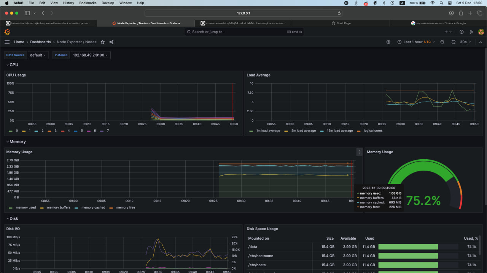

Kube Prometheus Stack includes the following components:
* Graphana - front-end service for displaying metrics and creating visualizations
* Prometheus - A back-end service that collects and calculates metrics
* Alertmanager - Handles alerts from prometheus and forwards them to email or to other clients
* Prometheus node-exported - a service that collects metrics from hardware and OS
* Prometheus kube-state-metrics - a service that collects metrics about k8s object states

In general, this stack is used for cluster monitoring

* Outputs of kubectl get po,sts,svc,pvc,cm:
```
$ kubectl get po
NAME                                                     READY   STATUS    RESTARTS   AGE
alertmanager-prometheus-kube-prometheus-alertmanager-0   2/2     Running   0          2m17s
devops-lab-0                                             1/1     Running   0          15m
prometheus-grafana-57b6ff6465-t9pfj                      3/3     Running   0          3m6s
prometheus-kube-prometheus-operator-64fd4b66b-7cn4z      1/1     Running   0          3m6s
prometheus-kube-state-metrics-6cd846d5cf-lhbrk           1/1     Running   0          3m6s
prometheus-prometheus-kube-prometheus-prometheus-0       2/2     Running   0          2m16s
prometheus-prometheus-node-exporter-p7b8q                1/1     Running   0          3m6s


$ kubectl get sts
NAME                                                   READY   AGE
alertmanager-prometheus-kube-prometheus-alertmanager   1/1     2m19s
devops-lab                                             1/1     15m
prometheus-prometheus-kube-prometheus-prometheus       1/1     2m18s


$ kubectl get svc
NAME                                      TYPE        CLUSTER-IP      EXTERNAL-IP   PORT(S)                      AGE
alertmanager-operated                     ClusterIP   None            <none>        9093/TCP,9094/TCP,9094/UDP   2m22s
devops-lab                                NodePort    10.111.195.4    <none>        8000:31354/TCP               15m
kubernetes                                ClusterIP   10.96.0.1       <none>        443/TCP                      161m
prometheus-grafana                        ClusterIP   10.110.12.252   <none>        80/TCP                       3m11s
prometheus-kube-prometheus-alertmanager   ClusterIP   10.111.7.94     <none>        9093/TCP,8080/TCP            3m11s
prometheus-kube-prometheus-operator       ClusterIP   10.97.245.192   <none>        443/TCP                      3m11s
prometheus-kube-prometheus-prometheus     ClusterIP   10.108.25.224   <none>        9090/TCP,8080/TCP            3m11s
prometheus-kube-state-metrics             ClusterIP   10.96.173.29    <none>        8080/TCP                     3m11s
prometheus-operated                       ClusterIP   None            <none>        9090/TCP                     2m21s
prometheus-prometheus-node-exporter       ClusterIP   10.100.41.15    <none>        9100/TCP                     3m11s


$ kubectl get pvc
NAME                      STATUS   VOLUME                                     CAPACITY   ACCESS MODES   STORAGECLASS   AGE
devops-lab-devops-lab-0   Bound    pvc-1fcd790f-a4cf-456c-9e2d-7802a2ff3964   10Mi       RWO            standard       20m


$ kubectl get cm
NAME                                                           DATA   AGE
kube-root-ca.crt                                               1      161m
prometheus-grafana                                             1      3m19s
prometheus-grafana-config-dashboards                           1      3m19s
prometheus-kube-prometheus-alertmanager-overview               1      3m19s
prometheus-kube-prometheus-apiserver                           1      3m19s
prometheus-kube-prometheus-cluster-total                       1      3m19s
prometheus-kube-prometheus-controller-manager                  1      3m19s
prometheus-kube-prometheus-etcd                                1      3m19s
prometheus-kube-prometheus-grafana-datasource                  1      3m19s
prometheus-kube-prometheus-grafana-overview                    1      3m19s
prometheus-kube-prometheus-k8s-coredns                         1      3m19s
prometheus-kube-prometheus-k8s-resources-cluster               1      3m19s
prometheus-kube-prometheus-k8s-resources-multicluster          1      3m19s
prometheus-kube-prometheus-k8s-resources-namespace             1      3m19s
prometheus-kube-prometheus-k8s-resources-node                  1      3m19s
prometheus-kube-prometheus-k8s-resources-pod                   1      3m19s
prometheus-kube-prometheus-k8s-resources-workload              1      3m19s
prometheus-kube-prometheus-k8s-resources-workloads-namespace   1      3m19s
prometheus-kube-prometheus-kubelet                             1      3m19s
prometheus-kube-prometheus-namespace-by-pod                    1      3m19s
prometheus-kube-prometheus-namespace-by-workload               1      3m19s
prometheus-kube-prometheus-node-cluster-rsrc-use               1      3m19s
prometheus-kube-prometheus-node-rsrc-use                       1      3m19s
prometheus-kube-prometheus-nodes                               1      3m19s
prometheus-kube-prometheus-nodes-darwin                        1      3m19s
prometheus-kube-prometheus-persistentvolumesusage              1      3m19s
prometheus-kube-prometheus-pod-total                           1      3m19s
prometheus-kube-prometheus-prometheus                          1      3m19s
prometheus-kube-prometheus-proxy                               1      3m19s
prometheus-kube-prometheus-scheduler                           1      3m19s
prometheus-kube-prometheus-workload-total                      1      3m19s
prometheus-prometheus-kube-prometheus-prometheus-rulefiles-0   34     2m29s
```

1. Check CPU and Memory consumption of your StatefulSet
CPU - 3.26%, memory - 73.7%

2. Identify Pods with higher and lower CPU usage in the default namespace.
Pod with highest CPU usage - app-go-0
Pod with lowest CPU usage - app-go-1

3. Monitor node memory usage in percentage and megabytes.


4. Count the number of pods and containers managed by the Kubelet service.
16 running pods, 35 running containers.

    5. Evaluate network usage of Pods in the default namespace.
Rate of bytes received - 334 B/s, Rate of bytes transmitted - 320 B/s

6. Determine the number of active alerts; also check the Web UI with `minikube service monitoring-kube-prometheus-alertmanager`.
8 Active alerts: 3 not grouped and 5 belonging to kube-system
