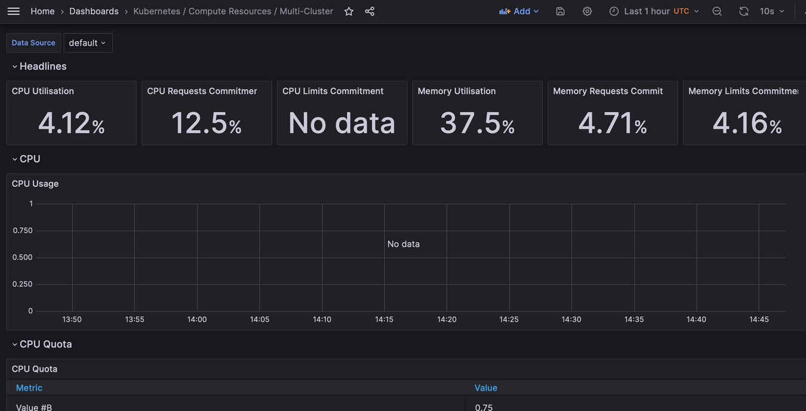
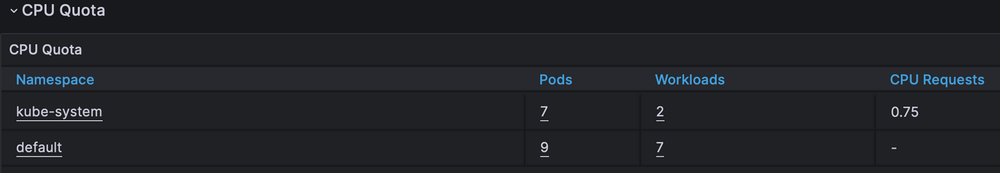
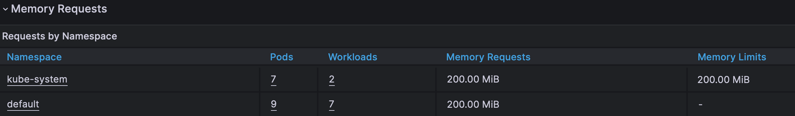
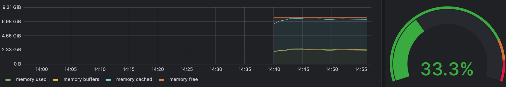
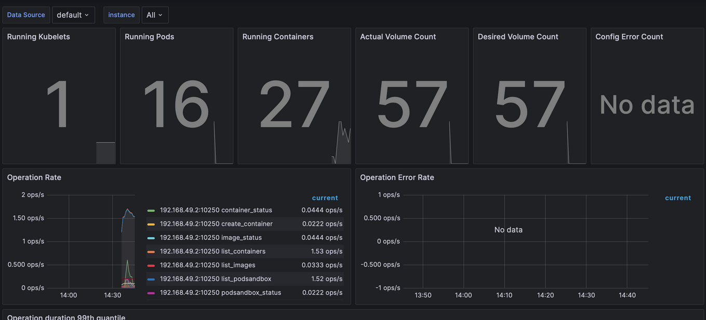
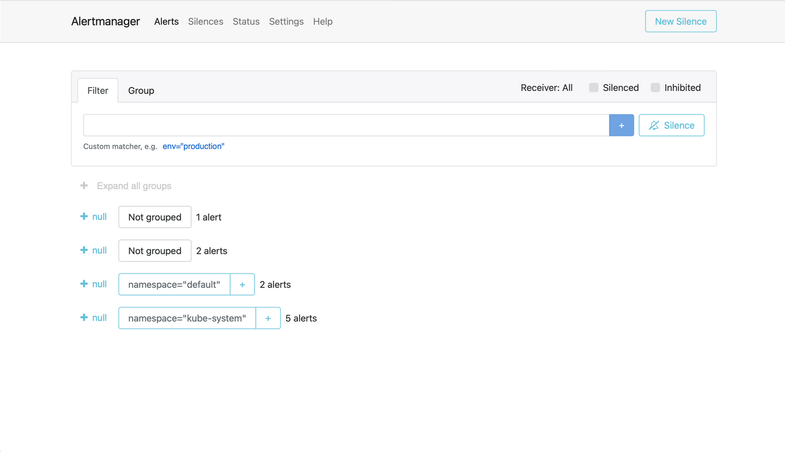

# Kubernetes Monitoring and Init Containers

## Components Descriptions
**Prometheus** is the main component responsible for collecting and storing metrics. It's a time-series database used for monitoring. It is capable of scraping metrics from varying endpoints. Prometheus uses PromQL to analyze and retrieve metrics.

**Prometheus Operator** is an operator for Kubernetes. It manages and automates deployment and configuration of Prometheus and other resources. Simplifies managing configurations, setting up alert rules, handling updating and scaling.

**Alertmanager** handles and manages alerts triggered by Prometheus. It deduplicates, groups, and routes alerts to correct receivers. Alertmanager helps to manage and organize notifications effectively.

**Grafana** is a visualization tool. It's used to create dashboards and graphs for monitoring and analyzing data. Supports many tools, including Prometheus.

**`kube-state-metrics`** fetches metrics from the Kubernetes API server about the state of various objects. It exposes for Prometheus to scrape. These metrics are crucial to understanding the state of the Kubernetes infrastructure.

**`node-exporter`** is responsible for collecting system-level metrics from the Kubernetes nodes themselves. It provides detailed information about the node's hardware resources. These metrics reflect health and performance of individual nodes of the cluster.

## `kubectl get po,sts,svc,pvc,cm`
```bash
NAME                                                         READY   STATUS             RESTARTS        AGE
pod/alertmanager-prometheus-kube-prometheus-alertmanager-0   2/2     Running            0               11m
pod/app-app_python-0                                         0/1     Running            5 (3m19s ago)   12m
pod/app-app_python-1                                         0/1     CrashLoopBackOff   7 (2m9s ago)    12m
pod/app-app_python-2                                         0/1     Running            5 (3m19s ago)   12m
pod/prometheus-grafana-1c78dfc6f6-gr9d9                      3/3     Running            1 (16m ago)     11m
pod/prometheus-kube-prometheus-operator-56c4959f4d-b82p2     1/1     Running            0               11m
pod/prometheus-kube-state-metrics-67bafd7561-6h3c2           1/1     Running            0               11m
pod/prometheus-prometheus-kube-prometheus-prometheus-0       2/2     Running            0               11m
pod/prometheus-prometheus-node-exporter-d8xsl                1/1     Running            0               11m

NAME                                                                    READY   AGE
statefulset.apps/alertmanager-prometheus-kube-prometheus-alertmanager   1/1     12m
statefulset.apps/app-app_python                                         0/3     11m
statefulset.apps/prometheus-prometheus-kube-prometheus-prometheus       1/1     12m

NAME                                              TYPE        CLUSTER-IP       EXTERNAL-IP   PORT(S)                      AGE
service/alertmanager-operated                     ClusterIP   None             <none>        9093/TCP,9094/TCP,9094/UDP   12m
service/app-app_python                            NodePort    10.106.169.185   <none>        8085:32005/TCP               11m
service/kubernetes                                ClusterIP   10.95.0.1        <none>        443/TCP                      28m
service/prometheus-grafana                        ClusterIP   10.95.42.134     <none>        80/TCP                       12m
service/prometheus-kube-prometheus-alertmanager   ClusterIP   10.108.181.152   <none>        9093/TCP,8080/TCP            12m
service/prometheus-kube-prometheus-operator       ClusterIP   10.106.9.116     <none>        443/TCP                      12m
service/prometheus-kube-prometheus-prometheus     ClusterIP   10.97.161.144    <none>        9090/TCP,8080/TCP            12m
service/prometheus-kube-state-metrics             ClusterIP   10.97.185.113    <none>        8080/TCP                     12m
service/prometheus-operated                       ClusterIP   None             <none>        9090/TCP                     12m
service/prometheus-prometheus-node-exporter       ClusterIP   10.102.78.209    <none>        9100/TCP                     12m

NAME                                                                 STATUS   VOLUME                                     CAPACITY   ACCESS MODES   STORAGECLASS   AGE
persistentvolumeclaim/persistent-data-volume-app-app_python-0        Bound    pvc-1c752186-43c1-43bf-bc43-718625f26355   200Mi      RWO            standard       11m
persistentvolumeclaim/persistent-data-volume-app-app_python-1        Bound    pvc-26e1465b-2dcf-4e31-8e9c-a6bd17107f90   200Mi      RWO            standard       11m
persistentvolumeclaim/persistent-data-volume-app-app_python-2        Bound    pvc-8ec6405a-1bde-65fd-d1ce-8f1c7aa4847b   200Mi      RWO            standard       11m

NAME                                                                     DATA   AGE
configmap/app-configmap                                                  1      11m
configmap/kube-root-ca.crt                                               1      28m
configmap/prometheus-grafana                                             1      12m
configmap/prometheus-grafana-config-dashboards                           1      12m
configmap/prometheus-kube-prometheus-alertmanager-overview               1      12m
configmap/prometheus-kube-prometheus-apiserver                           1      12m
configmap/prometheus-kube-prometheus-cluster-total                       1      12m
configmap/prometheus-kube-prometheus-controller-manager                  1      12m
configmap/prometheus-kube-prometheus-etcd                                1      12m
configmap/prometheus-kube-prometheus-grafana-datasource                  1      12m
configmap/prometheus-kube-prometheus-grafana-overview                    1      12m
configmap/prometheus-kube-prometheus-k8s-coredns                         1      12m
configmap/prometheus-kube-prometheus-k8s-resources-cluster               1      12m
configmap/prometheus-kube-prometheus-k8s-resources-multicluster          1      12m
configmap/prometheus-kube-prometheus-k8s-resources-namespace             1      12m
configmap/prometheus-kube-prometheus-k8s-resources-node                  1      12m
configmap/prometheus-kube-prometheus-k8s-resources-pod                   1      12m
configmap/prometheus-kube-prometheus-k8s-resources-workload              1      12m
configmap/prometheus-kube-prometheus-k8s-resources-workloads-namespace   1      12m
configmap/prometheus-kube-prometheus-kubelet                             1      12m
configmap/prometheus-kube-prometheus-namespace-by-pod                    1      12m
configmap/prometheus-kube-prometheus-namespace-by-workload               1      12m
configmap/prometheus-kube-prometheus-node-cluster-rsrc-use               1      12m
configmap/prometheus-kube-prometheus-node-rsrc-use                       1      12m
configmap/prometheus-kube-prometheus-nodes                               1      12m
configmap/prometheus-kube-prometheus-nodes-darwin                        1      12m
configmap/prometheus-kube-prometheus-persistentvolumesusage              1      12m
configmap/prometheus-kube-prometheus-pod-total                           1      12m
configmap/prometheus-kube-prometheus-prometheus                          1      12m
configmap/prometheus-kube-prometheus-proxy                               1      12m
configmap/prometheus-kube-prometheus-scheduler                           1      12m
configmap/prometheus-kube-prometheus-workload-total                      1      12m
configmap/prometheus-prometheus-kube-prometheus-prometheus-rulefiles-0   34     12m
```

## Exploring Grafana
1. Check CPU and Memory consumption of your StatefulSet.



2. Identify Pods with higher and lower CPU usage in the default namespace. 
    `No data`
3. Monitor node memory usage in percentage and megabytes.

4. Count the number of pods and containers managed by the Kubelet service.

5. Evaluate network usage of Pods in the default namespace.
    `No data`
6. Determine the number of active alerts.


## Init Container

```shell
kubectl apply -f https://k8s.io/examples/pods/init-containers.yaml

pod/init-demo created
```

```shell
kubectl get pod init-demo

NAME        READY   STATUS    RESTARTS   AGE
init-demo   1/1     Running   0          73s
```

```shell
kubectl exec pod/init-demo -- cat /usr/share/nginx/html/index.html

Defaulted container "nginx" out of: nginx, install (init)
<html><head></head><body><header>
<title>http://info.cern.ch</title>
</header>

<h1>http://info.cern.ch - home of the first website</h1>
<p>From here you can:</p>
<ul>
<li><a href="http://info.cern.ch/hypertext/WWW/TheProject.html">Browse the first website</a></li>
<li><a href="http://line-mode.cern.ch/www/hypertext/WWW/TheProject.html">Browse the first website using the line-mode browser simulator</a></li>
<li><a href="http://home.web.cern.ch/topics/birth-web">Learn about the birth of the web</a></li>
<li><a href="http://home.web.cern.ch/about">Learn about CERN, the physics laboratory where the web was born</a></li>
</ul>
</body></html>
```