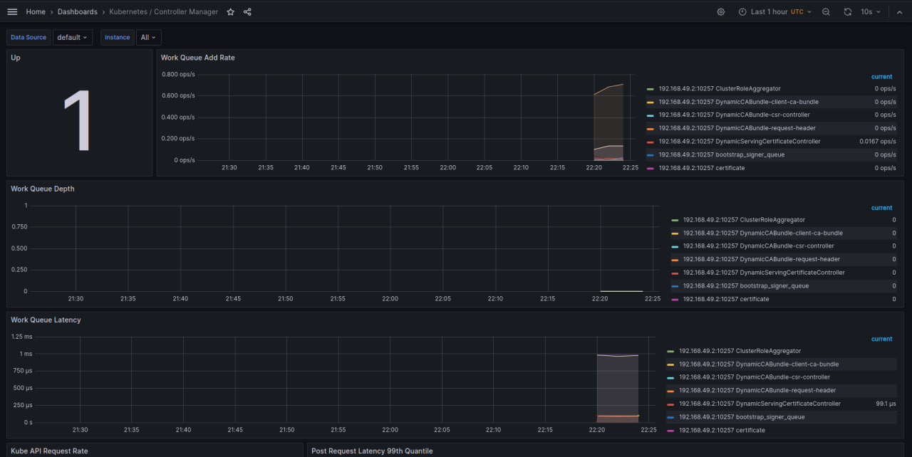
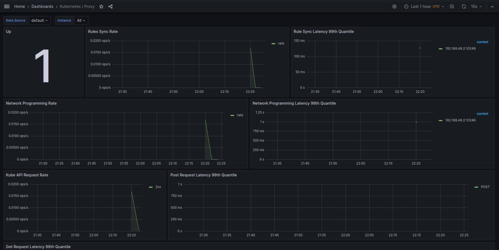
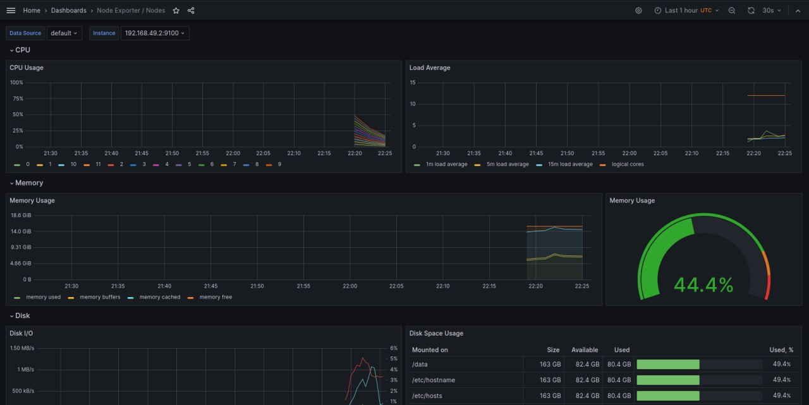
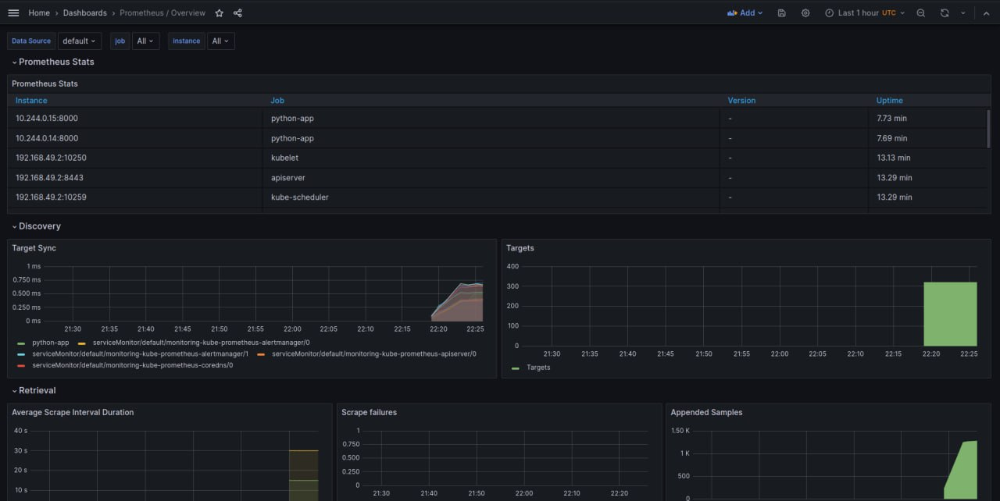

# Kubernetes Monitoring and Init Containers

This document outlines the steps and outputs for setting up monitoring in a Kubernetes environment using Prometheus, Grafana, and init containers.

## Monitoring Setup Outputs

The following outputs detail the state of the Kubernetes resources after deploying the monitoring stack.

### Get Kubernetes Resources

The command `kubectl get po,sts,svc,pvc,cm` was used to list the Pods (`po`), StatefulSets (`sts`), Services (`svc`), PersistentVolumeClaims (`pvc`), and ConfigMaps (`cm`) in the cluster:

```bash
 el3os@el3os:~/Desktop/core-course-labs/k8s/python-app-helm$ kubectl get po,sts,svc,pvc,cm
```

#### Output of listing


```bash
NAME                                                         READY   STATUS      RESTARTS      AGE
pod/alertmanager-prometheus-python-kube-pro-alertmanager-0   2/2     Running     0             20m
pod/post-install-sleep-job-tdckt                             0/1     Completed   0             14m
pod/pre-install-sleep-job-dck9s                              0/1     Completed   0             14m
pod/prometheus-prometheus-python-kube-pro-prometheus-0       2/2     Running     0             20m
pod/prometheus-python-grafana-89c44fbf6-6vlnx                3/3     Running     0             21m
pod/prometheus-python-kube-pro-operator-f65fccdfb-2vz84      1/1     Running     0             21m
pod/prometheus-python-kube-state-metrics-7695bd974f-sj4vm    1/1     Running     0             21m
pod/prometheus-python-prometheus-node-exporter-5p4dp         1/1     Running     0             21m
pod/python-app-helm-0                                        1/1     Running     1 (13m ago)   14m
pod/python-app-helm-1                                        1/1     Running     0             14m

NAME                                                                    READY   AGE
statefulset.apps/alertmanager-prometheus-python-kube-pro-alertmanager   1/1     20m
statefulset.apps/prometheus-prometheus-python-kube-pro-prometheus       1/1     20m
statefulset.apps/python-app-helm                                        2/2     14m

NAME                                                 TYPE        CLUSTER-IP       EXTERNAL-IP   PORT(S)                      AGE
service/alertmanager-operated                        ClusterIP   None             <none>        9093/TCP,9094/TCP,9094/UDP   20m
service/kubernetes                                   ClusterIP   10.96.0.1        <none>        443/TCP                      25d
service/prometheus-operated                          ClusterIP   None             <none>        9090/TCP                     20m
service/prometheus-python-grafana                    ClusterIP   10.100.142.125   <none>        80/TCP                       21m
service/prometheus-python-kube-pro-alertmanager      ClusterIP   10.98.184.216    <none>        9093/TCP,8080/TCP            21m
service/prometheus-python-kube-pro-operator          ClusterIP   10.96.233.142    <none>        443/TCP                      21m
service/prometheus-python-kube-pro-prometheus        ClusterIP   10.99.109.121    <none>        9090/TCP,8080/TCP            21m
service/prometheus-python-kube-state-metrics         ClusterIP   10.105.101.251   <none>        8080/TCP                     21m
service/prometheus-python-prometheus-node-exporter   ClusterIP   10.103.151.194   <none>        9100/TCP                     21m
service/python-app-helm                              ClusterIP   10.97.236.28     <none>        5000/TCP                     14m

NAME                                                      STATUS   VOLUME                                     CAPACITY   ACCESS MODES   STORAGECLASS   AGE
persistentvolumeclaim/counter-data-py-python-app-helm-0   Bound    pvc-7769b894-efa9-41de-8505-3223311fbc5a   10Mi       RWO            standard       5h58m
persistentvolumeclaim/counter-data-py-python-app-helm-1   Bound    pvc-9723e6cd-dab0-4317-9f96-03b0703718bf   10Mi       RWO            standard       5h58m
persistentvolumeclaim/data-mysql-1699386186-0             Bound    pvc-34cbe7f8-421c-486f-b310-28bfb4ae35a3   8Gi        RWO            standard       26d

NAME                                                                     DATA   AGE
configmap/config-map-entity-py                                           2      14m
configmap/kube-root-ca.crt                                               1      35d
configmap/prometheus-prometheus-python-kube-pro-prometheus-rulefiles-0   34     20m
configmap/prometheus-python-grafana                                      1      21m
configmap/prometheus-python-grafana-config-dashboards                    1      21m
configmap/prometheus-python-kube-pro-alertmanager-overview               1      21m
configmap/prometheus-python-kube-pro-apiserver                           1      21m
configmap/prometheus-python-kube-pro-cluster-total                       1      21m
configmap/prometheus-python-kube-pro-controller-manager                  1      21m
configmap/prometheus-python-kube-pro-etcd                                1      21m
configmap/prometheus-python-kube-pro-grafana-datasource                  1      21m
configmap/prometheus-python-kube-pro-grafana-overview                    1      21m
configmap/prometheus-python-kube-pro-k8s-coredns                         1      21m
configmap/prometheus-python-kube-pro-k8s-resources-cluster               1      21m
configmap/prometheus-python-kube-pro-k8s-resources-multicluster          1      21m
configmap/prometheus-python-kube-pro-k8s-resources-namespace             1      21m
configmap/prometheus-python-kube-pro-k8s-resources-node                  1      21m
configmap/prometheus-python-kube-pro-k8s-resources-pod                   1      21m
configmap/prometheus-python-kube-pro-k8s-resources-workload              1      21m
configmap/prometheus-python-kube-pro-k8s-resources-workloads-namespace   1      21m
configmap/prometheus-python-kube-pro-kubelet                             1      21m
configmap/prometheus-python-kube-pro-namespace-by-pod                    1      21m
configmap/prometheus-python-kube-pro-namespace-by-workload               1      21m
configmap/prometheus-python-kube-pro-node-cluster-rsrc-use               1      21m
configmap/prometheus-python-kube-pro-node-rsrc-use                       1      21m
configmap/prometheus-python-kube-pro-nodes                               1      21m
configmap/prometheus-python-kube-pro-nodes-darwin                        1      21m
configmap/prometheus-python-kube-pro-persistentvolumesusage              1      21m
configmap/prometheus-python-kube-pro-pod-total                           1      21m
configmap/prometheus-python-kube-pro-prometheus                          1      21m
configmap/prometheus-python-kube-pro-proxy                               1      21m
configmap/prometheus-python-kube-pro-scheduler                           1      21m
configmap/prometheus-python-kube-pro-workload-total                      1      21m
```

### Port Forward Grafana Service
To access the Grafana dashboard, we set up a port forward to the service prometheus-python-grafana:


```bash
el3os@el3os:~/Desktop/core-course-labs/k8s/python-app-helm$ kubectl port-forward svc/prometheus-python-grafana 3000:80
```

### Retrieve Grafana Credentials
Retrieved the admin credentials for Grafana using kubectl get secret:

```bash
el3os@el3os:~/Desktop/core-course-labs/k8s/python-app-helm$ kubectl get secret prometheus-python-grafana -o jsonpath="{.data.admin-user}" | base64 --decode; echo
kubectl get secret prometheus-python-grafana -o jsonpath="{.data.admin-password}" | base64 --decode; echo
```

#### Output for secrets
```bash
admin
prom-operator
```


## Monitoring Dashboard Screenshots

# Kubernetes Dashboard Metrics

## Cluster Overview


*This dashboard provides a high-level overview of the cluster's resource utilization, including CPU, memory, and storage.*

## CPU Utilization and Quota


*Here we see detailed metrics on CPU usage and quotas across different namespaces, indicating the efficiency and load distribution.*

## Memory Usage by Workloads

*Memory consumption is critical for performance. This visualization breaks down memory usage for each workload.*


## Controller Manager Metrics


*Controller manager metrics give insights into the internal operations of the Kubernetes control plane.*


## Kubelet Performance


*The kubelet is an essential component. Here we monitor its performance, including the running pods and containers.*


## CPU and Memory Requests


*This chart shows the CPU and memory requests compared to the actual usage, important for resource planning.*

## Network Programming Rate


*Network performance is key in microservices architectures. These stats reflect the network programming rate.*

## Scheduler Metrics


*Scheduler metrics help us understand the scheduling decisions and latencies involved.*


## Node Resource Usage

*Node-level resource usage provides a deeper look into how each node's resources are being utilized.*
## Prometheus Stats


*Prometheus collects detailed metrics; these statistics summarize the scrape intervals, failures, and samples.*

## Init container output


