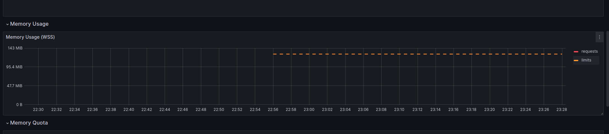
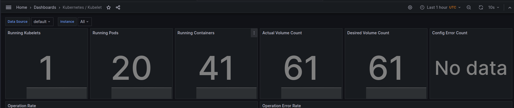
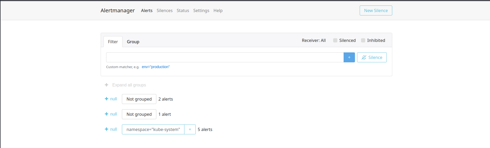

## Components description

The Kube Prometheus Stack is a collection of Helm charts designed for monitoring and alerting on 
metrics from a Kubernetes cluster. It is based on the Prometheus Operator and includes several key components for deploying,
managing, and visualizing Prometheus-based monitoring tools. 

The main components of the Kube Prometheus Stack are:

1. Prometheus Operator:
   - responsible for automating the deployment and management of Prometheus instances within the cluster
   - uses Custom Resource Definitions to define Prometheus deployments, service monitors, and other Prometheus-related resources
   - monitors custom resources and adjusts the running Prometheus instances

2. Prometheus:
   - monitoring and alerting system
   - collects, stores, and analyzes metrics from various sources, application endpoints, and container orchestration systems

3. Grafana:
   - data visualization and dashboard tool 
   - integrates with Prometheus to visualize the metrics collected by Prometheus 
   - provides various visualization options, such as graphs, tables, and alert panels

4. Alertmanager:
   - responsible for handling and managing alerts generated by Prometheus 
   - groups, deduplicates, and routes alerts based on configurations 
   - sends alerts via multiple channels, such as email, Slack, or some other notification systems

5. kube-state-metrics:
   - cluster-level metrics about various Kubernetes resources, such as deployments, pods, nodes, and services
   - informs about the health and status of Kubernetes components
   - exposes Kubernetes-specific metrics in a format that can be scraped

6. Node exporter:
   - collects hardware utilization and limits metrics

## Helm charts

`> kubectl get po,sts,svc,pvc,cm`
```
NAME                                                         READY   STATUS      RESTARTS        AGE
pod/alertmanager-main-kube-prometheus-stack-alertmanager-0   2/2     Running     0               2m
pod/main-grafana-7779684f7c-vgh4r                            3/3     Running     0               2m18s
pod/main-kube-prometheus-stack-operator-7d4fdd4cbd-lnrcr     1/1     Running     0               2m18s
pod/main-kube-state-metrics-649c85486f-9ggwx                 1/1     Running     0               2m18s
pod/main-prometheus-node-exporter-qbqsh                      1/1     Running     0               2m18s
pod/postinstall-hook                                         0/1     Completed   0               94s
pod/preinstall-hook                                          0/1     Completed   0               102s
pod/prometheus-main-kube-prometheus-stack-prometheus-0       1/2     Running     0               2m
pod/python-app-0                                             1/1     Running     0               95s
pod/python-app-1                                             1/1     Running     0               95s
pod/python-app-2                                             1/1     Running     0               95s

NAME                                                                    READY   AGE
statefulset.apps/alertmanager-main-kube-prometheus-stack-alertmanager   1/1     2m
statefulset.apps/prometheus-main-kube-prometheus-stack-prometheus       0/1     2m
statefulset.apps/python-app                                             3/3     95s

NAME                                              TYPE           CLUSTER-IP       EXTERNAL-IP   PORT(S)                      AGE
service/alertmanager-operated                     ClusterIP      None             <none>        9093/TCP,9094/TCP,9094/UDP   2m
service/kubernetes                                ClusterIP      10.96.0.1        <none>        443/TCP                      35d
service/main-grafana                              ClusterIP      10.103.220.225   <none>        80/TCP                       2m18s
service/main-kube-prometheus-stack-alertmanager   ClusterIP      10.104.97.231    <none>        9093/TCP,8080/TCP            2m18s
service/main-kube-prometheus-stack-operator       ClusterIP      10.106.223.189   <none>        443/TCP                      2m18s
service/main-kube-prometheus-stack-prometheus     ClusterIP      10.97.103.211    <none>        9090/TCP,8080/TCP            2m18s
service/main-kube-state-metrics                   ClusterIP      10.99.216.168    <none>        8080/TCP                     2m18s
service/main-prometheus-node-exporter             ClusterIP      10.103.45.200    <none>        9100/TCP                     2m18s
service/prometheus-operated                       ClusterIP      None             <none>        9090/TCP                     2m
service/python-app                                LoadBalancer   10.99.198.131    <pending>     5000:30704/TCP               95s
service/python-app-service                        LoadBalancer   10.105.21.98     <pending>     80:31530/TCP                 35d

NAME                                              STATUS   VOLUME                                     CAPACITY   ACCESS MODES   STORAGECLASS   AGE
persistentvolumeclaim/web-app-data-python-app-0   Bound    pvc-b12b4cb2-c535-4d03-874a-a1bc49e2ac35   15Mi       RWO            standard       6d22h
persistentvolumeclaim/web-app-data-python-app-1   Bound    pvc-bc0cc3f6-f4f9-470c-8c8a-af93a63c3a03   15Mi       RWO            standard       6d22h
persistentvolumeclaim/web-app-data-python-app-2   Bound    pvc-3545151d-9c11-4056-a86d-bf9b6d532c18   15Mi       RWO            standard       6d22h

NAME                                                                     DATA   AGE
configmap/configmap-config                                               1      95s
configmap/kube-root-ca.crt                                               1      35d
configmap/main-grafana                                                   1      2m18s
configmap/main-grafana-config-dashboards                                 1      2m18s
configmap/main-kube-prometheus-stack-alertmanager-overview               1      2m18s
configmap/main-kube-prometheus-stack-apiserver                           1      2m18s
configmap/main-kube-prometheus-stack-cluster-total                       1      2m18s
configmap/main-kube-prometheus-stack-controller-manager                  1      2m18s
configmap/main-kube-prometheus-stack-etcd                                1      2m18s
configmap/main-kube-prometheus-stack-grafana-datasource                  1      2m18s
configmap/main-kube-prometheus-stack-grafana-overview                    1      2m18s
configmap/main-kube-prometheus-stack-k8s-coredns                         1      2m18s
configmap/main-kube-prometheus-stack-k8s-resources-cluster               1      2m18s
configmap/main-kube-prometheus-stack-k8s-resources-multicluster          1      2m18s
configmap/main-kube-prometheus-stack-k8s-resources-namespace             1      2m18s
configmap/main-kube-prometheus-stack-k8s-resources-node                  1      2m18s
configmap/main-kube-prometheus-stack-k8s-resources-pod                   1      2m18s
configmap/main-kube-prometheus-stack-k8s-resources-workload              1      2m18s
configmap/main-kube-prometheus-stack-k8s-resources-workloads-namespace   1      2m18s
configmap/main-kube-prometheus-stack-kubelet                             1      2m18s
configmap/main-kube-prometheus-stack-namespace-by-pod                    1      2m18s
configmap/main-kube-prometheus-stack-namespace-by-workload               1      2m18s
configmap/main-kube-prometheus-stack-node-cluster-rsrc-use               1      2m18s
configmap/main-kube-prometheus-stack-node-rsrc-use                       1      2m18s
configmap/main-kube-prometheus-stack-nodes                               1      2m18s
configmap/main-kube-prometheus-stack-nodes-darwin                        1      2m18s
configmap/main-kube-prometheus-stack-persistentvolumesusage              1      2m18s
configmap/main-kube-prometheus-stack-pod-total                           1      2m18s
configmap/main-kube-prometheus-stack-prometheus                          1      2m18s
configmap/main-kube-prometheus-stack-proxy                               1      2m18s
configmap/main-kube-prometheus-stack-scheduler                           1      2m18s
configmap/main-kube-prometheus-stack-workload-total                      1      2m18s
configmap/prometheus-main-kube-prometheus-stack-prometheus-rulefiles-0   34     2m
```

### Description

#### Pods
`> kubectl get po ...`
```
NAME                                                         READY   STATUS      RESTARTS        AGE
pod/alertmanager-main-kube-prometheus-stack-alertmanager-0   2/2     Running     0               2m
pod/main-grafana-7779684f7c-vgh4r                            3/3     Running     0               2m18s
pod/main-kube-prometheus-stack-operator-7d4fdd4cbd-lnrcr     1/1     Running     0               2m18s
pod/main-kube-state-metrics-649c85486f-9ggwx                 1/1     Running     0               2m18s
pod/main-prometheus-node-exporter-qbqsh                      1/1     Running     0               2m18s
pod/postinstall-hook                                         0/1     Completed   0               94s
pod/preinstall-hook                                          0/1     Completed   0               102s
pod/prometheus-main-kube-prometheus-stack-prometheus-0       1/2     Running     0               2m
pod/python-app-0                                             1/1     Running     0               95s
pod/python-app-1                                             1/1     Running     0               95s
pod/python-app-2                                             1/1     Running     0               95s
```

Includes and shows all the pods, available in Kubernetes system. It includes the data about the statuses, number of restarts and age of each running pod instance.
```
pod/alertmanager-main-kube-prometheus-stack-alertmanager-0 - Alertmanager pods
pod/main-grafana-7779684f7c-vgh4r - Grafana main pod   
pod/main-kube-prometheus-stack-operator-7d4fdd4cbd-lnrcr - Prometheus-stack-operator pod    
pod/main-kube-state-metrics-649c85486f-9ggwx - kube-state-metrics pod
pod/main-prometheus-node-exporter-qbqsh - Node Exporter pod
pod/postinstall-hook - postinstall-hook pod (from previous labs)
pod/preinstall-hook - preinstall-hook pod (from previous labs)                                     
pod/prometheus-main-kube-prometheus-stack-prometheus-0 - Prometheus-stack pod     
pod/python-app-0 - application pod replica               
pod/python-app-1 - application pod replica                                           
pod/python-app-2 - application pod replica                                            
```

#### Stateful sets
`> kubectl get sts ...`
```
NAME                                                                    READY   AGE
statefulset.apps/alertmanager-main-kube-prometheus-stack-alertmanager   1/1     2m
statefulset.apps/prometheus-main-kube-prometheus-stack-prometheus       0/1     2m
statefulset.apps/python-app                                             3/3     95s
```

Includes and shows all the stateful sets, enabled in the project. Provides minimal information, such as readiness status and age of each stateful set instance.

```
statefulset.apps/alertmanager-main-kube-prometheus-stack-alertmanager - Alertmanager stateful set
statefulset.apps/prometheus-main-kube-prometheus-stack-prometheus - prometheus-stack stateful set
statefulset.apps/python-app - my application stateful set
```

#### Services
`> kubectl get svc ...`
```
NAME                                              TYPE           CLUSTER-IP       EXTERNAL-IP   PORT(S)                      AGE
service/alertmanager-operated                     ClusterIP      None             <none>        9093/TCP,9094/TCP,9094/UDP   2m
service/kubernetes                                ClusterIP      10.96.0.1        <none>        443/TCP                      35d
service/main-grafana                              ClusterIP      10.103.220.225   <none>        80/TCP                       2m18s
service/main-kube-prometheus-stack-alertmanager   ClusterIP      10.104.97.231    <none>        9093/TCP,8080/TCP            2m18s
service/main-kube-prometheus-stack-operator       ClusterIP      10.106.223.189   <none>        443/TCP                      2m18s
service/main-kube-prometheus-stack-prometheus     ClusterIP      10.97.103.211    <none>        9090/TCP,8080/TCP            2m18s
service/main-kube-state-metrics                   ClusterIP      10.99.216.168    <none>        8080/TCP                     2m18s
service/main-prometheus-node-exporter             ClusterIP      10.103.45.200    <none>        9100/TCP                     2m18s
service/prometheus-operated                       ClusterIP      None             <none>        9090/TCP                     2m
service/python-app                                LoadBalancer   10.99.198.131    <pending>     5000:30704/TCP               95s
service/python-app-service                        LoadBalancer   10.105.21.98     <pending>     80:31530/TCP                 35d
```

Contains all the main information about each of the services, running in the Kubernetes: names, types, IP of cluster, external IPs, available ports and age.
```
service/alertmanager-operated - Alertmanager service
service/kubernetes - Kubernetes service itself
service/main-grafana - Grafana service
service/main-kube-prometheus-stack-alertmanager - Alertmanager from prometheus-stack service
service/main-kube-prometheus-stack-operator - prometheus-stack service
service/main-kube-prometheus-stack-prometheus - prometheus-stack service
service/main-kube-state-metrics - service to provide metrics of running kube
service/main-prometheus-node-exporter - Node exporter metrics
service/prometheus-operated - Inner Kubernetes service
service/python-app - Application service
service/python-app-service - Inner application service
```

#### Persistent volume claims
`> kubectl get pvc ...`

```
NAME                                              STATUS   VOLUME                                     CAPACITY   ACCESS MODES   STORAGECLASS   AGE
persistentvolumeclaim/web-app-data-python-app-0   Bound    pvc-b12b4cb2-c535-4d03-874a-a1bc49e2ac35   15Mi       RWO            standard       6d22h
persistentvolumeclaim/web-app-data-python-app-1   Bound    pvc-bc0cc3f6-f4f9-470c-8c8a-af93a63c3a03   15Mi       RWO            standard       6d22h
persistentvolumeclaim/web-app-data-python-app-2   Bound    pvc-3545151d-9c11-4056-a86d-bf9b6d532c18   15Mi       RWO            standard       6d22h
```

Contains the main information about deployed persistent volume claims, such as: their name, status, volume name, capacity, access mode, class of storage and age.
All the pvc above correspond to replicas of the application pods.

#### Config maps
`> kubectl get cm ...`

```
NAME                                                                     DATA   AGE
configmap/configmap-config                                               1      95s
configmap/kube-root-ca.crt                                               1      35d
configmap/main-grafana                                                   1      2m18s
configmap/main-grafana-config-dashboards                                 1      2m18s
configmap/main-kube-prometheus-stack-alertmanager-overview               1      2m18s
configmap/main-kube-prometheus-stack-apiserver                           1      2m18s
configmap/main-kube-prometheus-stack-cluster-total                       1      2m18s
configmap/main-kube-prometheus-stack-controller-manager                  1      2m18s
configmap/main-kube-prometheus-stack-etcd                                1      2m18s
configmap/main-kube-prometheus-stack-grafana-datasource                  1      2m18s
configmap/main-kube-prometheus-stack-grafana-overview                    1      2m18s
configmap/main-kube-prometheus-stack-k8s-coredns                         1      2m18s
configmap/main-kube-prometheus-stack-k8s-resources-cluster               1      2m18s
configmap/main-kube-prometheus-stack-k8s-resources-multicluster          1      2m18s
configmap/main-kube-prometheus-stack-k8s-resources-namespace             1      2m18s
configmap/main-kube-prometheus-stack-k8s-resources-node                  1      2m18s
configmap/main-kube-prometheus-stack-k8s-resources-pod                   1      2m18s
configmap/main-kube-prometheus-stack-k8s-resources-workload              1      2m18s
configmap/main-kube-prometheus-stack-k8s-resources-workloads-namespace   1      2m18s
configmap/main-kube-prometheus-stack-kubelet                             1      2m18s
configmap/main-kube-prometheus-stack-namespace-by-pod                    1      2m18s
configmap/main-kube-prometheus-stack-namespace-by-workload               1      2m18s
configmap/main-kube-prometheus-stack-node-cluster-rsrc-use               1      2m18s
configmap/main-kube-prometheus-stack-node-rsrc-use                       1      2m18s
configmap/main-kube-prometheus-stack-nodes                               1      2m18s
configmap/main-kube-prometheus-stack-nodes-darwin                        1      2m18s
configmap/main-kube-prometheus-stack-persistentvolumesusage              1      2m18s
configmap/main-kube-prometheus-stack-pod-total                           1      2m18s
configmap/main-kube-prometheus-stack-prometheus                          1      2m18s
configmap/main-kube-prometheus-stack-proxy                               1      2m18s
configmap/main-kube-prometheus-stack-scheduler                           1      2m18s
configmap/main-kube-prometheus-stack-workload-total                      1      2m18s
configmap/prometheus-main-kube-prometheus-stack-prometheus-rulefiles-0   34     2m
```

Contains the most basic information about each configuration map used.
Its purpose is to provide correct configuration setups for running pods and services.

## Dashboards

### CPU and Memory consumption of your StatefulSet
All the information from the CPU chart  and Memory chart  

### Pods with higher and lower CPU usage in the default namespace
From the dashboards it can be seen, that python-app pods require up to 0.1 of CPU resources, which is the maximum.
Speaking of pods with the lowest CPU usage, cannot determine within the current metrics.

### Node memory usage in percentage and megabytes
Node memory usage chart 

### The number of pods and containers managed by the Kubelet service
The number of pods and containers can be seen here 

### Network usage of Pods in the default namespace
Unfortunately, no data is obtained within the dashboards. It is possible, that the metrics are not configured enough to display the data (for now, there is only `No data`)

### The number of active alerts
From Grafana charts 

From WebUI 