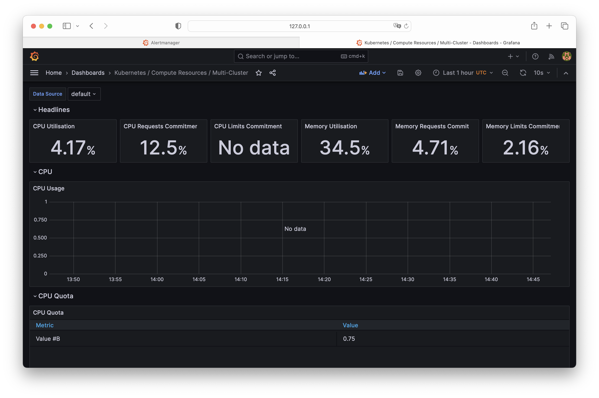
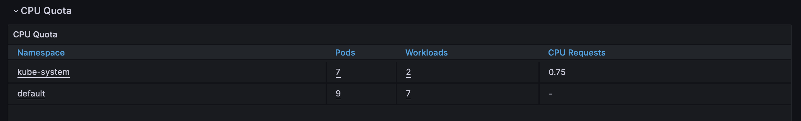
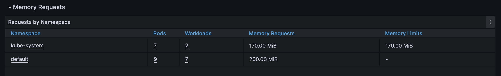
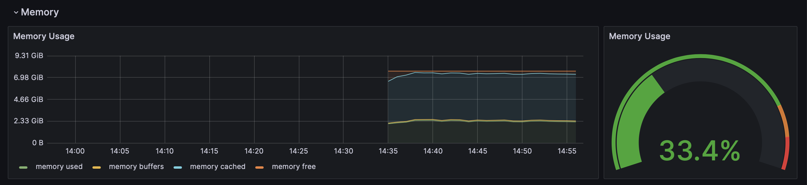
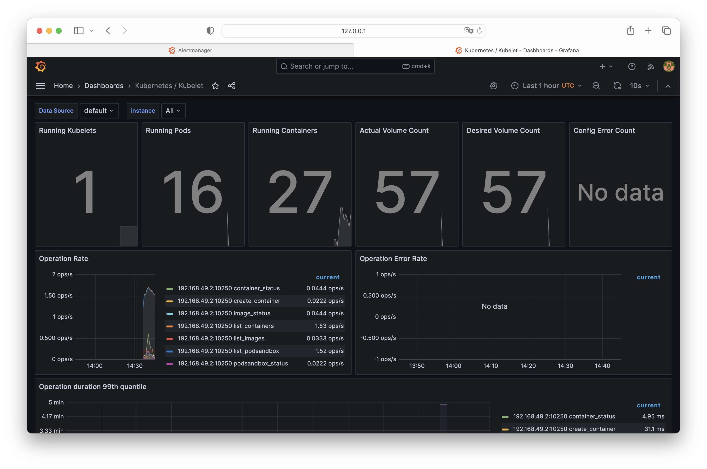

# Kube Prometheus Stack

### Describe Components
**Prometheus:** This is the core component responsible for collecting and storing metrics data. It's a time-series database primarily used for monitoring, capable of scraping metrics from various endpoints. Prometheus uses a query language, PromQL, to analyze and retrieve these metrics.

**Prometheus Operator:** It's an operator for Kubernetes that manages and automates the deployment and configuration of Prometheus and related resources. It simplifies tasks like managing configurations, setting up alerting rules, and handling updates or scaling.

**Alertmanager:** This component handles and manages alerts triggered by Prometheus. It receives alerts and deduplicates, groups, and routes them to the correct receiver (like email, chat, or a webhook) based on predefined rules. Alertmanager helps in managing and organizing notifications effectively.

**Grafana:** Grafana is a visualization tool used to create dashboards and graphs for monitoring and analyzing data. It's highly customizable and supports various data sources, including Prometheus. Grafana allows users to create visual representations of the collected metrics, aiding in understanding the system's behavior and performance.

**`kube-state-metrics`:** This component fetches metrics from the Kubernetes API server about the state of various objects such as deployments, nodes, pods, etc. It exposes these metrics in a format that Prometheus can scrape. These metrics are crucial for understanding the state of the Kubernetes infrastructure.

**`node-exporter`:** Node Exporter is responsible for collecting system-level metrics from the Kubernetes nodes themselves. It provides detailed information about the node's hardware resources, including CPU, memory, disk usage, network statistics, and more. These metrics help in understanding the health and performance of individual nodes in the cluster.

### `kubectl get po,sts,svc,pvc,cm`
```bash
NAME                                                         READY   STATUS             RESTARTS        AGE
pod/alertmanager-prometheus-kube-prometheus-alertmanager-0   2/2     Running            0               18m
pod/app-app-python-helm-0                                    0/1     Running            8 (5m19s ago)   17m
pod/app-app-python-helm-1                                    0/1     CrashLoopBackOff   7 (4m9s ago)    17m
pod/app-app-python-helm-2                                    0/1     Running            8 (5m19s ago)   17m
pod/prometheus-grafana-6cc7d6f67f-gr9h9                      3/3     Running            1 (16m ago)     18m
pod/prometheus-kube-prometheus-operator-58c49d56f4-p86p2     1/1     Running            0               18m
pod/prometheus-kube-state-metrics-6bbff75769-6h5v2           1/1     Running            0               18m
pod/prometheus-prometheus-kube-prometheus-prometheus-0       2/2     Running            0               18m
pod/prometheus-prometheus-node-exporter-t9xsl                1/1     Running            0               18m

NAME                                                                    READY   AGE
statefulset.apps/alertmanager-prometheus-kube-prometheus-alertmanager   1/1     18m
statefulset.apps/app-app-python-helm                                    0/3     17m
statefulset.apps/prometheus-prometheus-kube-prometheus-prometheus       1/1     18m

NAME                                              TYPE        CLUSTER-IP       EXTERNAL-IP   PORT(S)                      AGE
service/alertmanager-operated                     ClusterIP   None             <none>        9093/TCP,9094/TCP,9094/UDP   18m
service/app-app-python-helm                       NodePort    10.106.174.184   <none>        8085:32005/TCP               17m
service/kubernetes                                ClusterIP   10.96.0.1        <none>        443/TCP                      39m
service/prometheus-grafana                        ClusterIP   10.96.41.133     <none>        80/TCP                       18m
service/prometheus-kube-prometheus-alertmanager   ClusterIP   10.108.183.151   <none>        9093/TCP,8080/TCP            18m
service/prometheus-kube-prometheus-operator       ClusterIP   10.106.10.115    <none>        443/TCP                      18m
service/prometheus-kube-prometheus-prometheus     ClusterIP   10.97.160.143    <none>        9090/TCP,8080/TCP            18m
service/prometheus-kube-state-metrics             ClusterIP   10.97.177.117    <none>        8080/TCP                     18m
service/prometheus-operated                       ClusterIP   None             <none>        9090/TCP                     18m
service/prometheus-prometheus-node-exporter       ClusterIP   10.102.80.210    <none>        9100/TCP                     18m

NAME                                                                 STATUS   VOLUME                                     CAPACITY   ACCESS MODES   STORAGECLASS   AGE
persistentvolumeclaim/persistent-data-volume-app-app-python-helm-0   Bound    pvc-1a742986-44c1-41af-ba33-702555f26863   100Mi      RWO            standard       17m
persistentvolumeclaim/persistent-data-volume-app-app-python-helm-1   Bound    pvc-455b16e1-2fcc-4e21-8d9c-5710907f6bd1   100Mi      RWO            standard       17m
persistentvolumeclaim/persistent-data-volume-app-app-python-helm-2   Bound    pvc-8e5ac640-0bae-45dd-a9be-8faa1c747b48   100Mi      RWO            standard       17m

NAME                                                                     DATA   AGE
configmap/app-configmap                                                  1      17m
configmap/kube-root-ca.crt                                               1      39m
configmap/prometheus-grafana                                             1      18m
configmap/prometheus-grafana-config-dashboards                           1      18m
configmap/prometheus-kube-prometheus-alertmanager-overview               1      18m
configmap/prometheus-kube-prometheus-apiserver                           1      18m
configmap/prometheus-kube-prometheus-cluster-total                       1      18m
configmap/prometheus-kube-prometheus-controller-manager                  1      18m
configmap/prometheus-kube-prometheus-etcd                                1      18m
configmap/prometheus-kube-prometheus-grafana-datasource                  1      18m
configmap/prometheus-kube-prometheus-grafana-overview                    1      18m
configmap/prometheus-kube-prometheus-k8s-coredns                         1      18m
configmap/prometheus-kube-prometheus-k8s-resources-cluster               1      18m
configmap/prometheus-kube-prometheus-k8s-resources-multicluster          1      18m
configmap/prometheus-kube-prometheus-k8s-resources-namespace             1      18m
configmap/prometheus-kube-prometheus-k8s-resources-node                  1      18m
configmap/prometheus-kube-prometheus-k8s-resources-pod                   1      18m
configmap/prometheus-kube-prometheus-k8s-resources-workload              1      18m
configmap/prometheus-kube-prometheus-k8s-resources-workloads-namespace   1      18m
configmap/prometheus-kube-prometheus-kubelet                             1      18m
configmap/prometheus-kube-prometheus-namespace-by-pod                    1      18m
configmap/prometheus-kube-prometheus-namespace-by-workload               1      18m
configmap/prometheus-kube-prometheus-node-cluster-rsrc-use               1      18m
configmap/prometheus-kube-prometheus-node-rsrc-use                       1      18m
configmap/prometheus-kube-prometheus-nodes                               1      18m
configmap/prometheus-kube-prometheus-nodes-darwin                        1      18m
configmap/prometheus-kube-prometheus-persistentvolumesusage              1      18m
configmap/prometheus-kube-prometheus-pod-total                           1      18m
configmap/prometheus-kube-prometheus-prometheus                          1      18m
configmap/prometheus-kube-prometheus-proxy                               1      18m
configmap/prometheus-kube-prometheus-scheduler                           1      18m
configmap/prometheus-kube-prometheus-workload-total                      1      18m
configmap/prometheus-prometheus-kube-prometheus-prometheus-rulefiles-0   34     18m
```

### Explore Grafana
1. Check CPU and Memory consumption of your StatefulSet.



2. Identify Pods with higher and lower CPU usage in the default namespace. 
    
    `No data`
3. Monitor node memory usage in percentage and megabytes.

4. Count the number of pods and containers managed by the Kubelet service.

5. Evaluate network usage of Pods in the default namespace.

    `No data`
6. Determine the number of active alerts.


### InitContainer

```shell
kubectl apply -f https://k8s.io/examples/pods/init-containers.yaml

pod/init-demo created
```

```shell
kubectl get pod init-demo

NAME        READY   STATUS    RESTARTS   AGE
init-demo   1/1     Running   0          73s
```

```shell
kubectl exec pod/init-demo -- cat /usr/share/nginx/html/index.html

Defaulted container "nginx" out of: nginx, install (init)
<html><head></head><body><header>
<title>http://info.cern.ch</title>
</header>

<h1>http://info.cern.ch - home of the first website</h1>
<p>From here you can:</p>
<ul>
<li><a href="http://info.cern.ch/hypertext/WWW/TheProject.html">Browse the first website</a></li>
<li><a href="http://line-mode.cern.ch/www/hypertext/WWW/TheProject.html">Browse the first website using the line-mode browser simulator</a></li>
<li><a href="http://home.web.cern.ch/topics/birth-web">Learn about the birth of the web</a></li>
<li><a href="http://home.web.cern.ch/about">Learn about CERN, the physics laboratory where the web was born</a></li>
</ul>
</body></html>
```
