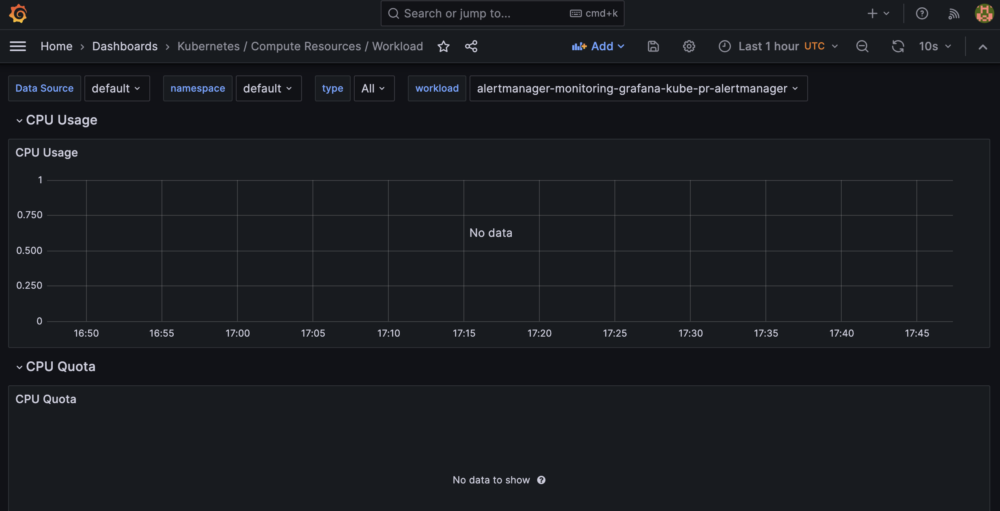
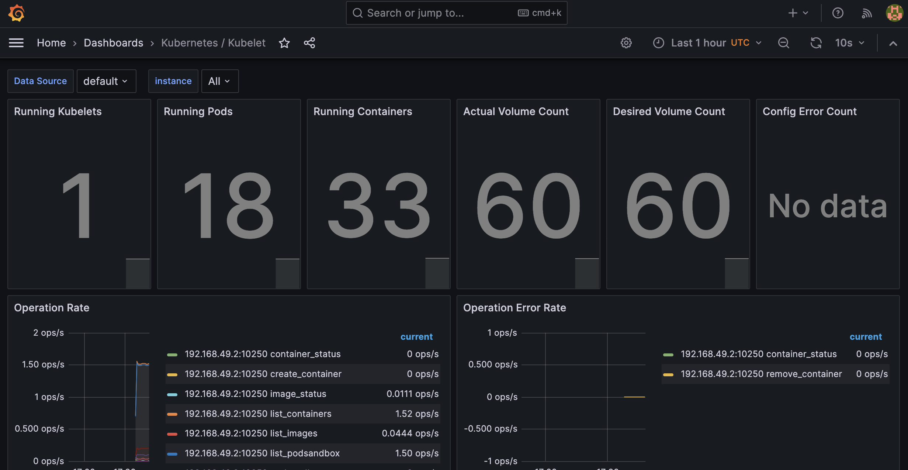
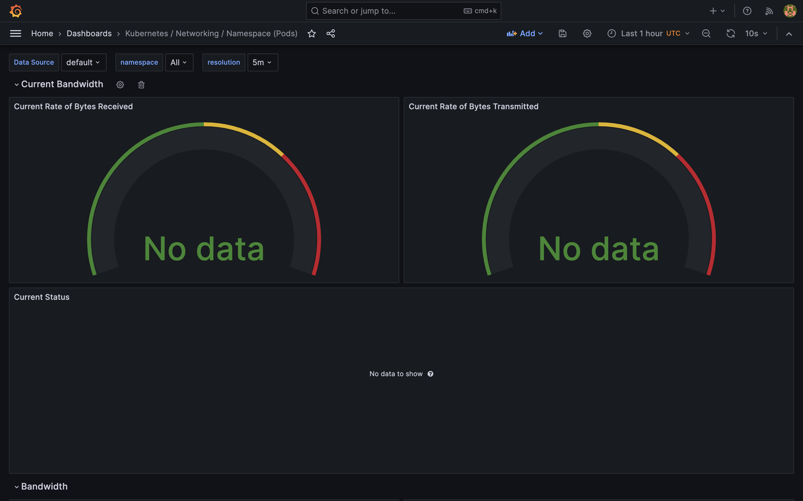
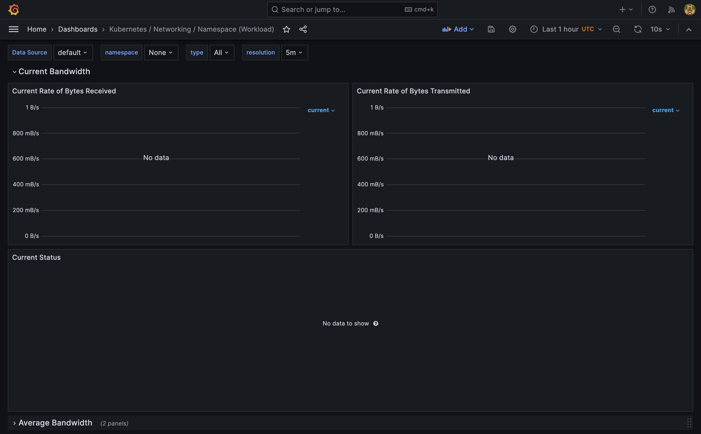
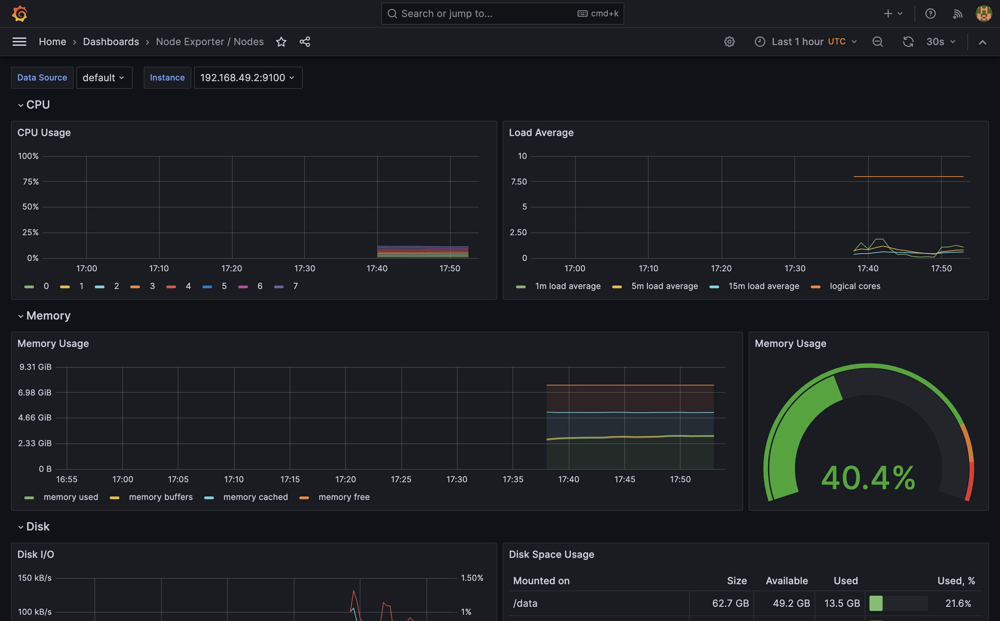
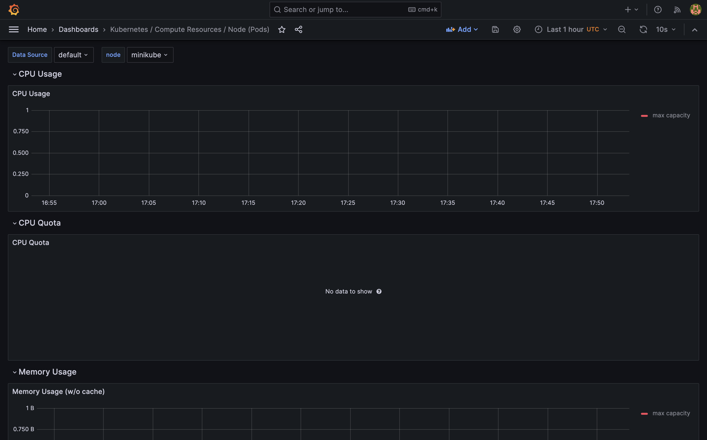
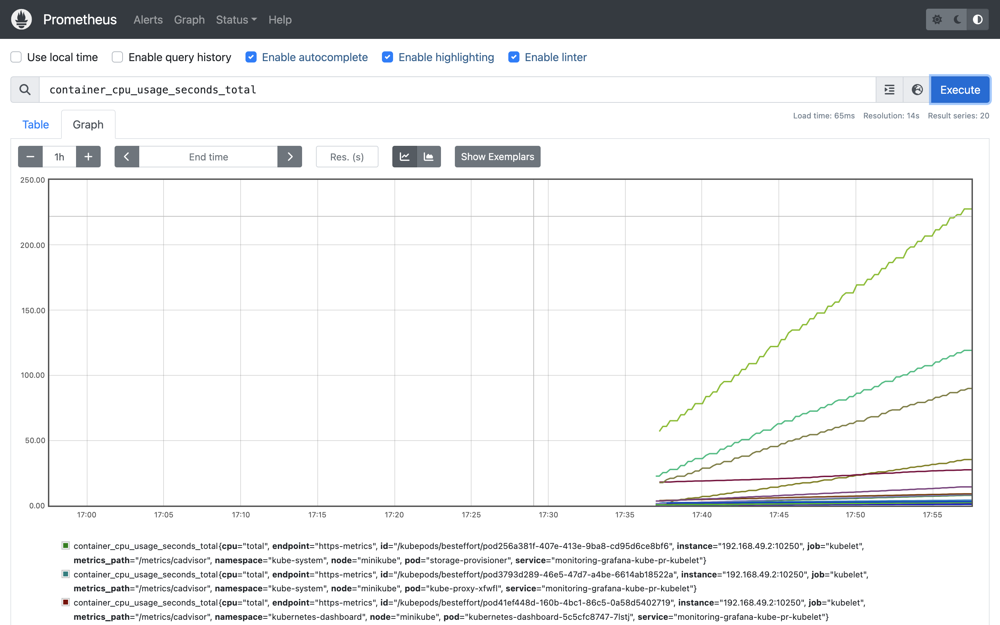
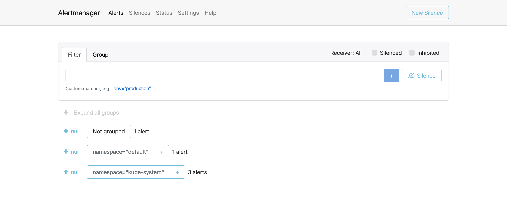
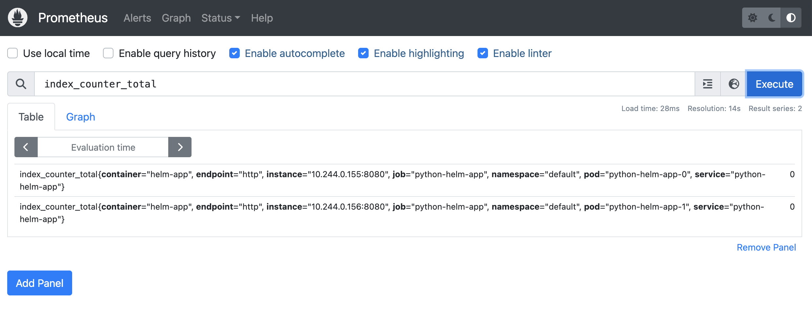
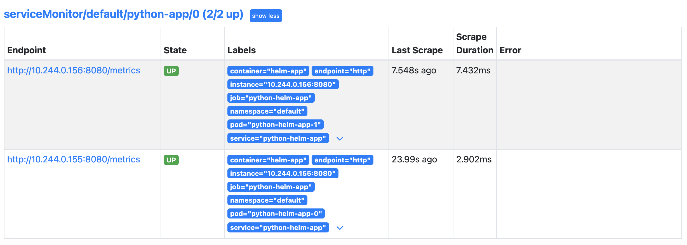

# Lab 14: Kubernetes Monitoring and Init Containers

## Kube Prometheus Stack

- Prometheus is the core monitoring engine.
- Prometheus operator is an open-source project that provides Kubernetes-native management and orchestration for Prometheus.
- Graphana is a popular open-source visualization tool used for creating and managing dashboards and graphs based on data from Prometheus or other data sources.
- Alertmanager is responsible for handling alerts sent by Prometheus.
- Node Exporter is an agent that runs on every Kubernetes node and collects system-level metrics such as CPU, memory, disk usage, and network statistics.
- kube-state-metrics is a service that listens to the Kubernetes API server and generates Prometheus metrics about the state of various Kubernetes objects such as pods, deployments, services, nodes.

## Task 1

`helm install monitoring-grafana prometheus-community/kube-prometheus-stack`

```
NAME: monitoring-grafana
LAST DEPLOYED: Tue Dec  5 20:35:12 2023
NAMESPACE: default
STATUS: deployed
REVISION: 1
NOTES:
kube-prometheus-stack has been installed. Check its status by running:
  kubectl --namespace default get pods -l "release=monitoring-grafana"

Visit https://github.com/prometheus-operator/kube-prometheus for instructions on how to create & configure Alertmanager and Prometheus instances using the Operator.
```

`helm install python . --values values.python.yaml`

```
NAME: python
LAST DEPLOYED: Tue Dec  5 20:36:47 2023
NAMESPACE: default
STATUS: deployed
REVISION: 1
NOTES:
1. Get the application URL by running these commands:
     NOTE: It may take a few minutes for the LoadBalancer IP to be available.
           You can watch the status of by running 'kubectl get --namespace default svc -w python-helm-app'
  export SERVICE_IP=$(kubectl get svc --namespace default python-helm-app --template "{{ range (index .status.loadBalancer.ingress 0) }}{{.}}{{ end }}")
  echo http://$SERVICE_IP:8080
```

`kubectl get po,sts,svc,pvc,cm`

```
NAME                                                         READY   STATUS    RESTARTS   AGE
pod/alertmanager-monitoring-grafana-kube-pr-alertmanager-0   2/2     Running   0          2m23s
pod/monitoring-grafana-5447d8ff65-h59vr                      3/3     Running   0          2m37s
pod/monitoring-grafana-kube-pr-operator-5d9d8f6bcd-jch6g     1/1     Running   0          2m37s
pod/monitoring-grafana-kube-state-metrics-54d8975977-d28fr   1/1     Running   0          2m37s
pod/monitoring-grafana-prometheus-node-exporter-h45c9        1/1     Running   0          2m37s
pod/prometheus-monitoring-grafana-kube-pr-prometheus-0       2/2     Running   0          2m21s
pod/python-helm-app-0                                        1/1     Running   0          55s
pod/python-helm-app-1                                        1/1     Running   0          55s

NAME                                                                    READY   AGE
statefulset.apps/alertmanager-monitoring-grafana-kube-pr-alertmanager   1/1     2m23s
statefulset.apps/prometheus-monitoring-grafana-kube-pr-prometheus       1/1     2m21s
statefulset.apps/python-helm-app                                        2/2     55s

NAME                                                  TYPE           CLUSTER-IP       EXTERNAL-IP   PORT(S)                      AGE
service/alertmanager-operated                         ClusterIP      None             <none>        9093/TCP,9094/TCP,9094/UDP   2m23s
service/kubernetes                                    ClusterIP      10.96.0.1        <none>        443/TCP                      35d
service/monitoring-grafana                            ClusterIP      10.105.173.208   <none>        80/TCP                       2m37s
service/monitoring-grafana-kube-pr-alertmanager       ClusterIP      10.104.108.36    <none>        9093/TCP,8080/TCP            2m37s
service/monitoring-grafana-kube-pr-operator           ClusterIP      10.98.207.201    <none>        443/TCP                      2m37s
service/monitoring-grafana-kube-pr-prometheus         ClusterIP      10.107.84.4      <none>        9090/TCP,8080/TCP            2m37s
service/monitoring-grafana-kube-state-metrics         ClusterIP      10.98.31.46      <none>        8080/TCP                     2m37s
service/monitoring-grafana-prometheus-node-exporter   ClusterIP      10.106.21.37     <none>        9100/TCP                     2m37s
service/prometheus-operated                           ClusterIP      None             <none>        9090/TCP                     2m21s
service/python-helm-app                               LoadBalancer   10.109.232.140   <pending>     8080:30609/TCP               55s

NAME                                                    STATUS   VOLUME                                     CAPACITY   ACCESS MODES   STORAGECLASS   AGE
persistentvolumeclaim/c-sharp-visits-sharp-helm-app-0   Bound    pvc-f3c04261-4d12-47e1-b471-cf8fc61c57c1   1Mi        RWO            standard       7d3h
persistentvolumeclaim/c-sharp-visits-sharp-helm-app-1   Bound    pvc-8a25141d-9ec8-41c9-99e8-e63a28985dca   1Mi        RWO            standard       7d3h
persistentvolumeclaim/data-vault-0                      Bound    pvc-65d22614-70c0-4729-8041-8976790918ab   10Gi       RWO            standard       21d
persistentvolumeclaim/python-visits-python-helm-app-0   Bound    pvc-9b0f74d4-e6af-4c8c-8b00-eb629cffe57e   1Mi        RWO            standard       7d3h
persistentvolumeclaim/python-visits-python-helm-app-1   Bound    pvc-b24f9554-4b2b-4470-899f-6727aafed7a4   1Mi        RWO            standard       7d3h

NAME                                                                     DATA   AGE
configmap/kube-root-ca.crt                                               1      35d
configmap/monitoring-grafana                                             1      2m37s
configmap/monitoring-grafana-config-dashboards                           1      2m37s
configmap/monitoring-grafana-kube-pr-alertmanager-overview               1      2m37s
configmap/monitoring-grafana-kube-pr-apiserver                           1      2m37s
configmap/monitoring-grafana-kube-pr-cluster-total                       1      2m37s
configmap/monitoring-grafana-kube-pr-controller-manager                  1      2m37s
configmap/monitoring-grafana-kube-pr-etcd                                1      2m37s
configmap/monitoring-grafana-kube-pr-grafana-datasource                  1      2m37s
configmap/monitoring-grafana-kube-pr-grafana-overview                    1      2m37s
configmap/monitoring-grafana-kube-pr-k8s-coredns                         1      2m37s
configmap/monitoring-grafana-kube-pr-k8s-resources-cluster               1      2m37s
configmap/monitoring-grafana-kube-pr-k8s-resources-multicluster          1      2m37s
configmap/monitoring-grafana-kube-pr-k8s-resources-namespace             1      2m37s
configmap/monitoring-grafana-kube-pr-k8s-resources-node                  1      2m37s
configmap/monitoring-grafana-kube-pr-k8s-resources-pod                   1      2m37s
configmap/monitoring-grafana-kube-pr-k8s-resources-workload              1      2m37s
configmap/monitoring-grafana-kube-pr-k8s-resources-workloads-namespace   1      2m37s
configmap/monitoring-grafana-kube-pr-kubelet                             1      2m37s
configmap/monitoring-grafana-kube-pr-namespace-by-pod                    1      2m37s
configmap/monitoring-grafana-kube-pr-namespace-by-workload               1      2m37s
configmap/monitoring-grafana-kube-pr-node-cluster-rsrc-use               1      2m37s
configmap/monitoring-grafana-kube-pr-node-rsrc-use                       1      2m37s
configmap/monitoring-grafana-kube-pr-nodes                               1      2m37s
configmap/monitoring-grafana-kube-pr-nodes-darwin                        1      2m37s
configmap/monitoring-grafana-kube-pr-persistentvolumesusage              1      2m37s
configmap/monitoring-grafana-kube-pr-pod-total                           1      2m37s
configmap/monitoring-grafana-kube-pr-prometheus                          1      2m37s
configmap/monitoring-grafana-kube-pr-proxy                               1      2m37s
configmap/monitoring-grafana-kube-pr-scheduler                           1      2m37s
configmap/monitoring-grafana-kube-pr-workload-total                      1      2m37s
configmap/prometheus-monitoring-grafana-kube-pr-prometheus-rulefiles-0   34     2m22s
configmap/simple-configmap                                               1      55s
configmap/simple-env-configmap                                           1      55s
```

Pods: 
- `pod/alertmanager-monitoring-grafana-kube-pr-alertmanager-0` - alert manager
- `pod/monitoring-grafana-5447d8ff65-h59vr` - pod with graphana
- `pod/monitoring-grafana-kube-pr-operator-5d9d8f6bcd-jch6g` - pod with prometheus operator
- `pod/monitoring-grafana-kube-state-metrics-54d8975977-d28fr` - pod with kube-state-metrics
- `pod/monitoring-grafana-prometheus-node-exporter-h45c9` - pod with node-exporter
- `pod/prometheus-monitoring-grafana-kube-pr-prometheus-0` - pod with prometheus itself, in two replicas
- `pod/python-helm-app-*` - pods with application

Stateful sets:
- `statefulset.apps/alertmanager-monitoring-grafana-kube-pr-alertmanager` - statefulset of AlertManager (for reliability)
- `statefulset.apps/prometheus-monitoring-grafana-kube-pr-prometheus` - statefulset of Prometheus (for reliability)
- `statefulset.apps/python-helm-app` - my python app

The list of services aligns with the components of the stack. In the previous lab, we generated persistent volumes. 

Configmaps handle the internal configurations of the kube-prometheus stack, which were also utilized in earlier labs.

### Screenshots










## Task 2

`helm install python . --values values.python.yaml`

```
NAME: python
LAST DEPLOYED: Tue Dec  5 21:16:26 2023
NAMESPACE: default
STATUS: deployed
REVISION: 1
NOTES:
1. Get the application URL by running these commands:
     NOTE: It may take a few minutes for the LoadBalancer IP to be available.
           You can watch the status of by running 'kubectl get --namespace default svc -w python-helm-app'
  export SERVICE_IP=$(kubectl get svc --namespace default python-helm-app --template "{{ range (index .status.loadBalancer.ingress 0) }}{{.}}{{ end }}")
  echo http://$SERVICE_IP:8080
```

`kubectl logs python-helm-app-0 -c install -f`

```
Connecting to info.cern.ch (188.184.100.182:80)
index.html           100% |*******************************|   646   0:00:00 ETA
```

`kubectl exec -it python-helm-app-0 -- cat /init/index.html `

```
Defaulted container "helm-app" out of: helm-app, install (init)
<html><head></head><body><header>
<title>http://info.cern.ch</title>
</header>

<h1>http://info.cern.ch - home of the first website</h1>
<p>From here you can:</p>
<ul>
<li><a href="http://info.cern.ch/hypertext/WWW/TheProject.html">Browse the first website</a></li>
<li><a href="http://line-mode.cern.ch/www/hypertext/WWW/TheProject.html">Browse the first website using the line-mode browser simulator</a></li>
<li><a href="http://home.web.cern.ch/topics/birth-web">Learn about the birth of the web</a></li>
<li><a href="http://home.web.cern.ch/about">Learn about CERN, the physics laboratory where the web was born</a></li>
</ul>
</body></html>
```

## Bonus task

`helm install monitoring-grafana prometheus-community/kube-prometheus-stack -f values.yaml`

```
NAME: monitoring-grafana
LAST DEPLOYED: Tue Dec  5 21:29:14 2023
NAMESPACE: default
STATUS: deployed
REVISION: 1
NOTES:
kube-prometheus-stack has been installed. Check its status by running:
  kubectl --namespace default get pods -l "release=monitoring-grafana"

Visit https://github.com/prometheus-operator/kube-prometheus for instructions on how to create & configure Alertmanager and Prometheus instances using the Operator.
```

`helm install python . --values values.python.yaml`

```
NAME: python
LAST DEPLOYED: Tue Dec  5 21:34:12 2023
NAMESPACE: default
STATUS: deployed
REVISION: 1
NOTES:
1. Get the application URL by running these commands:
     NOTE: It may take a few minutes for the LoadBalancer IP to be available.
           You can watch the status of by running 'kubectl get --namespace default svc -w python-helm-app'
  export SERVICE_IP=$(kubectl get svc --namespace default python-helm-app --template "{{ range (index .status.loadBalancer.ingress 0) }}{{.}}{{ end }}")
  echo http://$SERVICE_IP:8080
```

`kubectl expose service monitoring-grafana-kube-pr-prometheus --type=NodePort --target-port=9090 --name=prometheus-server-ext`

```
service/prometheus-server-ext exposed
```

### Screenshots




`kubectl exec -it python-helm-app-0 -- cat /init/file`

```
Defaulted container "helm-app" out of: helm-app, install (init), install-queue-1 (init), install-queue-2 (init), install-queue-3 (init)
1
2
3
```
